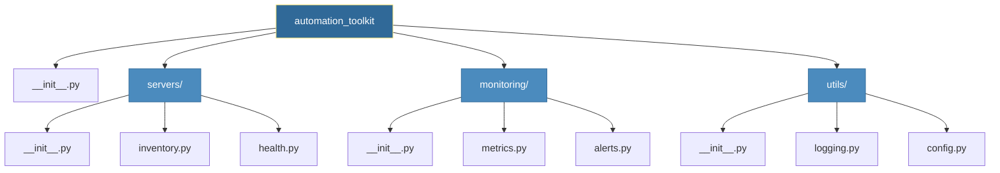
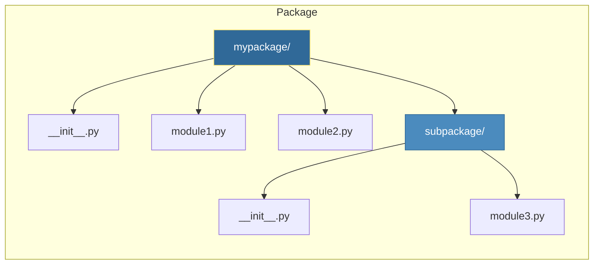

# Functions and Modules
*Building Reusable, Organized Automation Code*
Functions and modules transform scripts into maintainable automation tools. They enable code reuse, testing, and collaboration across teams.

---
## 🎯 Learning Objectives
- Define and call functions with various argument types
- Create and import custom modules
- Organize code into packages
- Apply best practices for reusable automation code
---
## 📊 Module Organization Architecture



---
## 📚 Core Concepts

### 1. Function Basics
```python
# Basic function definition
def check_server_health(hostname):
    """Check if a server is responding."""
    response = ping(hostname)
    return response.status == "OK"

# Function with multiple parameters
def deploy_application(app_name, environment, version="latest"):
    """Deploy an application to specified environment."""
    print(f"Deploying {app_name} v{version} to {environment}")
    # deployment logic here
    return True

# Calling functions
is_healthy = check_server_health("web-01")
deploy_application("api-service", "production", version="2.3.1")
deploy_application("api-service", "staging")  # Uses default version
```
### 2. Argument Types
```python
# Positional arguments
def create_user(username, role, team):
    return {"user": username, "role": role, "team": team}

# Keyword arguments
user = create_user(role="admin", team="platform", username="john")

# *args - Variable positional arguments
def run_commands(*commands):
    """Run multiple shell commands."""
    results = []
    for cmd in commands:
        results.append(execute(cmd))
    return results

run_commands("ls -la", "df -h", "whoami")

# **kwargs - Variable keyword arguments
def configure_server(**settings):
    """Apply configuration settings."""
    for key, value in settings.items():
        print(f"Setting {key} = {value}")

configure_server(timeout=30, retries=3, ssl=True)

# Combined
def deploy(app, *servers, **options):
    print(f"Deploying {app} to {servers} with {options}")

deploy("api", "web-01", "web-02", port=443, ssl=True)
```
### 3. Return Values
```python
# Single return
def get_cpu_usage(server):
    return 85.5

# Multiple returns (tuple unpacking)
def get_server_stats(server):
    cpu = 75.2
    memory = 68.4
    disk = 45.0
    return cpu, memory, disk

cpu, mem, disk = get_server_stats("web-01")

# Return dictionary for named results
def analyze_logs(log_file):
    return {
        "total_lines": 10000,
        "errors": 45,
        "warnings": 123,
        "error_rate": 0.45
    }

stats = analyze_logs("/var/log/app.log")
print(f"Error rate: {stats['error_rate']}%")
```
### 4. Lambda Functions
```python
# Quick, single-expression functions
servers = [
    {"name": "web-01", "cpu": 75},
    {"name": "api-01", "cpu": 90},
    {"name": "db-01", "cpu": 45}
]

# Sort by CPU usage
sorted_servers = sorted(servers, key=lambda s: s["cpu"])

# Filter high CPU servers
high_cpu = list(filter(lambda s: s["cpu"] > 80, servers))

# Transform data
names = list(map(lambda s: s["name"].upper(), servers))
```
---
## 📦 Modules and Imports
### Creating Modules
```python
# server_utils.py
"""Utilities for server management."""

DEFAULT_PORT = 22
DEFAULT_TIMEOUT = 30

def connect(hostname, port=DEFAULT_PORT):
    """Establish connection to server."""
    print(f"Connecting to {hostname}:{port}")
    return {"connected": True, "host": hostname}

def disconnect(connection):
    """Close server connection."""
    print(f"Disconnecting from {connection['host']}")

class ServerConnection:
    def __init__(self, hostname):
        self.hostname = hostname
        self.connected = False
    
    def connect(self):
        self.connected = True
```
### Importing Modules
```python
# Method 1: Import entire module
import server_utils
conn = server_utils.connect("web-01")

# Method 2: Import specific items
from server_utils import connect, DEFAULT_PORT
conn = connect("web-01", DEFAULT_PORT)

# Method 3: Import with alias
import server_utils as su
conn = su.connect("web-01")

# Method 4: Import all (avoid in production!)
from server_utils import *
```

---

## 📁 Package Structure



```python
# mypackage/__init__.py
"""Main package initialization."""
from .module1 import important_function
from .module2 import AnotherClass

__version__ = "1.0.0"
__all__ = ["important_function", "AnotherClass"]

# Usage
from mypackage import important_function
```
---
## 🛠️ Hands-On Exercises

### Exercise 1: Multi-Service Health Checker

**Scenario**: You are maintaining a fleet of Linux servers and need a unified way to report their status. Instead of running three different shell scripts, you need a single Python function that aggregates CPU, Memory, Disk, and Network health.

**The Challenge**:
- Create a function `check_health(hostname, checks)`
- `checks` is a list of services to inspect (e.g., `['cpu', 'disk']`)
- Return a dictionary where keys are the service names and values are standardized status objects.

#### 🏗️ How to Implement It
1.  **Define the Structure**: Initialize an empty `results` dictionary.
2.  **Iterate**: Loop through each item in the `checks` input list.
3.  **Simulate**: Use `random` to generate mock values (since we don't have real `psutil` access yet/this is a simulation).
4.  **Normalize**: Ensure every check returns a format like `{'status': 'ok', 'value': 85}`.
5.  **Return**: Pass the `results` dictionary back to the caller.

#### 🚀 How to Apply It
In production, you would replace the "mock" logic with `psutil` calls. You would run this script via **Cron** or a **Systemd Timer** every 5 minutes and ship the JSON logs to **Elasticsearch** or **Datadog**.

<details>
<summary>💡 Solution</summary>

```python
import random

def check_health(hostname, checks):
    """
    Perform specified health checks on a server.
    Args:
        hostname (str): Name of server
        checks (list): List of metrics to check ['cpu', 'memory', 'disk', 'network']
    """
    results = {}
    
    # Mock functions to simulate real system checks
    check_functions = {
        "cpu": lambda: random.randint(20, 95),
        "memory": lambda: random.randint(30, 90),
        "disk": lambda: random.randint(10, 85),
        "network": lambda: random.choice([True, False])
    }
    
    for check in checks:
        if check in check_functions:
            value = check_functions[check]()
            # Determine status based on thresholds
            if check == "network":
                status = "ok" if value else "error"
            else:
                status = "ok" if value < 80 else "warning" if value < 90 else "critical"
            
            results[check] = {"status": status, "value": value}
        else:
            results[check] = {"status": "unknown", "value": None}
    
    return results

# Test the function
server_status = check_health("prod-web-01", ["cpu", "memory", "network"])
print(f"Health Report for prod-web-01: {server_status}")
```
</details>

---

### Exercise 2: The "Chaos" Retry Decorator

**Scenario**: You are interacting with AWS APIs (Boto3) which are prone to random "ThrottlingException" or "ConnectionReset" errors. Hardcoding retry loops in every single function creates messy, unreadable code.

**The Challenge**:
- Create a `@retry` decorator that can wrapper *any* function.
- It must accept `max_attempts` and `delay` configuration.
- It must catch exceptions, log a warning, wait, and try again.
- It must raise the exception if all attempts fail (don't swallow errors silently!).

#### 🏗️ How to Implement It
1.  **Import Functools**: Use `@functools.wraps` to preserve your function's name and documentation.
2.  **Outer Layer**: Define `retry(max_attempts, delay)` to accept the simplified config.
3.  **Wrapper**: Inside the wrapper, use a `for attempt in range()` loop.
4.  **Try/Except**: Put the function call inside a try block. If it succeeds, return immediately.
5.  **Backoff**: If it catches an exception, `time.sleep(delay)` and continue the loop.

#### 🚀 How to Apply It
Wrap your **AWS Boto3** calls or **HTTP Requests** with this decorator. It keeps your business logic (e.g., "Create Instance") clean and separated from your error handling logic ("Retry 3 times").

<details>
<summary>💡 Solution</summary>

```python
import time
import functools
import random

def retry(max_attempts=3, delay=1):
    """
    Decorator that retries a function if it raises an exception.
    """
    def decorator(func):
        @functools.wraps(func)
        def wrapper(*args, **kwargs):
            last_exception = None
            for attempt in range(1, max_attempts + 1):
                try:
                    return func(*args, **kwargs)
                except Exception as e:
                    last_exception = e
                    print(f"⚠️ Attempt {attempt}/{max_attempts} failed: {e}")
                    if attempt < max_attempts:
                        time.sleep(delay)
            # If we get here, all retries exhausted
            print("❌ All retries exhausted.")
            raise last_exception
        return wrapper
    return decorator

# Usage Example
@retry(max_attempts=3, delay=2)
def connect_to_database():
    # Simulate a flaky connection that fails 70% of the time
    if random.random() < 0.7:
        raise ConnectionError("Database Connection Timeout")
    return "Connected!"

# Run it
try:
    print(connect_to_database())
except ConnectionError:
    print("Failed to connect after retries.")
```
</details>

---

### Exercise 3: The 12-Factor Config Module

**Scenario**: Your team is hardcoding API keys and database passwords in Python scripts, which is a security nightmare. You need a centralized way to load configuration from **Environment Variables** (The 12-Factor App methodology).

**The Challenge**:
- Create a professional package structure `config/`.
- `settings.py`: A class defining defaults and required keys.
- `loader.py`: A tool to read `os.environ`.
- `__init__.py`: The public API.

#### 🏗️ How to Implement It
1.  **Directory**: Create `config/` folder.
2.  **Settings Class**: Define `REQUIRED_KEYS` (e.g., `["DB_PASS", "API_KEY"]`).
3.  **Loader**: Write a function that scans `os.environ` for variables starting with `APP_` (namespacing).
4.  **Validation**: In `__init__`, check if all required keys are present. If not, raise an error immediately (Fail Fast).

#### � How to Apply It
Import this at the very top of your application: `from config import settings`. This ensures that your app **cannot** even start if it lacks the necessary credentials, preventing runtime crashes later on.

<details>
<summary>💡 Solution</summary>

```python
# ---------------------------
# File: config/settings.py
# ---------------------------
class Settings:
    REQUIRED_KEYS = ["API_KEY", "DB_HOST"]
    
    DEFAULTS = {
        "TIMEOUT": 30,
        "DEBUG": False,
        "REGION": "us-east-1"
    }
    
    def __init__(self, env_data):
        # 1. Load Defaults
        for key, value in self.DEFAULTS.items():
            setattr(self, key, value)
            
        # 2. Override with Env Data
        for key, value in env_data.items():
            # Convert keys to match internal names if needed
            setattr(self, key, value)

    def validate(self):
        # 3. Check Required Keys
        missing = [k for k in self.REQUIRED_KEYS if not hasattr(self, k)]
        if missing:
            raise ValueError(f"Missing required config vars: {missing}")

# ---------------------------
# File: config/loader.py
# ---------------------------
import os

def load_from_env(prefix="MYAPP"):
    """Reads all env vars starting with prefix"""
    data = {}
    for key, val in os.environ.items():
        if key.startswith(f"{prefix}_"):
            clean_key = key.replace(f"{prefix}_", "")
            data[clean_key] = val
    return data

# ---------------------------
# File: config/__init__.py
# ---------------------------
# from .loader import load_from_env
# from .settings import Settings

# env_data = load_from_env()
# config = Settings(env_data)
# config.validate()  # Fail fast if invalid
```
</details>

---

## 📖 Real-World Story: The Utility Library

**Scenario**: Five teams were each writing their own server connection code, leading to inconsistent error handling and duplicated bugs.

**Solution**: Created a shared `infra-utils` Python package with:
- Standardized connection functions
- Built-in retry logic
- Consistent logging

**Outcome**: Bug fixes in one place benefited all teams. New team members onboarded faster with clean, documented functions.

---

## ❓ Interview Questions

1. **What's the difference between `*args` and `**kwargs`?**
   > `*args` captures extra positional arguments as tuple. `**kwargs` captures extra keyword arguments as dict.

2. **Explain the purpose of `__init__.py`.**
   > Marks a directory as a Python package. Can initialize package-level imports and define `__all__`.

3. **When would you use a lambda vs a regular function?**
   > Lambda for simple, one-line expressions (often with map/filter). Regular functions for complex logic requiring multiple statements.

4. **What is a decorator and how does it work?**
   > A function that wraps another function to extend behavior. Uses `@decorator` syntax and `functools.wraps`.

5. **How do you handle circular imports?**
   > Move import inside function, restructure modules, or use TYPE_CHECKING for type hints.

---

## 🧠 Quiz

1. What does `*args` create inside a function?
   - a) List
   - b) Tuple ✅
   - c) Dictionary

2. Which import style is considered best practice?
   - a) `from module import *`
   - b) `import module` ✅
   - c) `from module import func` (also acceptable)

3. What's the purpose of `@functools.wraps`?
   - a) Speed up function calls
   - b) Preserve function metadata ✅
   - c) Enable recursion

4. Default arguments are evaluated:
   - a) At function call time
   - b) At function definition time ✅
   - c) At module import time

5. What happens if you modify a mutable default argument?
   - a) Creates new object each call
   - b) Persists changes across calls ✅
   - c) Raises error

---

**Next Step**: [File Operations →](../04-File-Operations/README.md)
