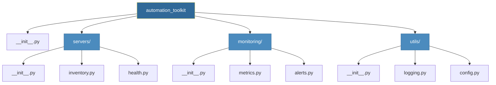

# Functions and Modules
*Building Reusable, Organized Automation Code*
Functions and modules transform scripts into maintainable automation tools. They enable code reuse, testing, and collaboration across teams.

---
## 🎯 Learning Objectives
- Define and call functions with various argument types
- Create and import custom modules
- Organize code into packages
- Apply best practices for reusable automation code
---
## 📊 Module Organization Architecture



---
## 📚 Core Concepts
Functions are the building blocks of clean, maintainable automation code. They encapsulate logic, promote reuse, and define clear interfaces for data processing.
### Visual Guide

*Fig 1: Anatomy of a Python Function: clearly defined inputs, isolated scope, and explicit outputs.*

---
### 1. Function Architecture
**Definition & Syntax**:
A function in Python is defined using the `def` keyword, followed by a function name, parameters in parentheses, and a colon. The body is indented.
```python
def function_name(parameter1, parameter2):
    """Docstring explaining what the function does."""
    # Function Body (Logic)
    result = parameter1 + parameter2
    return result
```

**Key Characteristics**:
- **First-Class Objects**: Functions can be passed as arguments, returned from other functions, and assigned to variables.
- **Scope**: Variables defined inside are **local**; variables defined outside are **global**.
- **Return**: Returns `None` by default if no `return` statement is present.

**Common Patterns**:
| Pattern        | Syntax                     | Description                                            |
| :------------- | :------------------------- | :----------------------------------------------------- |
| **Positional** | `func(a, b)`               | Arguments map to parameters by order                   |
| **Keyword**    | `func(a=1, b=2)`           | Arguments map by name (clearer for config)             |
| **Default**    | `def func(a=1):`           | Optional arguments with fallback values                |
| **Type Hints** | `def func(a: int) -> int:` | Modern Python practice for clarity (ignored by runtime) |

**DevOps Use Case**:
*Wrapping a complex API call (like creating an EC2 instance) into a single, reusable function call.*
```python
def create_instance(ami_id: str, instance_type: str = "t2.micro") -> str:
    """Launches an EC2 instance and returns the Instance ID."""
    print(f"Launching {ami_id} on {instance_type}...")
    # ... boto3 logic ...
    return "i-0123456789abcdef0"
```
---
### 2. Advanced Parameter Handling (`*args` & `**kwargs`)
**Definition**:
These special internal mechanisms allow functions to accept an arbitrary number of arguments.

- `*args` (Non-Keyword Arguments): Collects extra positional arguments into a **tuple**.
- `**kwargs` (Keyword Arguments): Collects extra keyword arguments into a **dictionary**.

**Technical Detail**:
| Type       | Internal Structure | Mutability | Used For                                  |
| :--------- | :----------------- | :--------- | :---------------------------------------- |
| `*args`    | `tuple`            | Immutable  | Lists of items (files, servers, commands) |
| `**kwargs` | `dict`             | Mutable    | Configuration options, flags, settings    |

**DevOps Use Case**:
*Creating a wrapper for a CLI tool that accepts variable flags.*
```python
def run_command(command, *args, **flags):
    """
    Constructs and prints a shell command.
    Usage: run_command("ls", "-la", "/var/log", human_readable=True)
    """
    cmd_parts = [command] + list(args)
    for key, val in flags.items():
        if val is True:
            cmd_parts.append(f"--{key.replace('_', '-')}")
            
    full_cmd = " ".join(cmd_parts)
    print(f"Executing: {full_cmd}")

# Output: Executing: ls -la /var/log --human-readable
run_command("ls", "-la", "/var/log", human_readable=True)
```

---
### 3. Lambda Functions (Anonymous Functions)
**Definition**:
Small, unnamed functions defined with the `lambda` keyword. They are restricted to a **single expression**.
**Syntax**: `lambda arguments: expression`
**DevOps Use Case**:
*Inline transformations, sorting complex lists of dictionaries, or defining quick callbacks.*
```python
servers = [
    {"hostname": "web-01", "cpu": 15},
    {"hostname": "db-01", "cpu": 85},
    {"hostname": "api-01", "cpu": 45}
]

# Sort servers by CPU usage (High to Low) without defining a named function
servers.sort(key=lambda s: s['cpu'], reverse=True)
# Result: db-01, api-01, web-01
```

---

## 📦 Modules and Architecture

As your automation library grows, keeping everything in one file becomes unmanageable. Modules allow you to organize code into logical units.

### Modular vs Monolithic


*Fig 2: Breaking a chaotic monolith script into organized, reusable modules.*

### 1. Importing Mechanics
When you run `import my_module`, Python:
1.  Searches for `my_module.py` in the **PYTHONPATH**.
2.  Executes the **entire file** to define functions and classes.
3.  Creates a module object in `sys.modules`.

**Best Practices**:
| Import Style      | Example                 | Pros/Cons                                          |
| :---------------- | :---------------------- | :------------------------------------------------- |
| **Module Import** | `import os`             | ✅ Cleanest namespace. usage: `os.path.join`       |
| **Object Import** | `from os import path`   | ✅ Direct access. usage: `path.join`               |
| **Alias**         | `import pandas as pd`   | ✅ Standard convention for libraries               |
| **Wildcard**      | `from os import *`      | ❌ **AVOID**. Pollutes namespace, hides dependencies |

---

### 2. The `__init__.py` File
**Definition**:
A file (often empty) that marks a directory as a **Python Package**. It allows you to import from that directory.

**Advanced Usage**:
You can use `__init__.py` to expose key functions and hide internal details, creating a clean public API for your package.
```python
# mypackage/__init__.py
from .database import connect_db
from .server import restart_server

# This allows users to simply run:
# from mypackage import connect_db
# Instead of:
# from mypackage.database import connect_db
```
---
### 3. Creating a Reusable Utility Module
**DevOps Use Case**:
*Centralizing common operations like logging, config loading, and error handling.*

**Project Structure**:
```text
automation_tool/
├── main.py
└── utils/
    ├── __init__.py
    ├── logger.py   # Setup standard logging format
    └── network.py  # DNS checks, Ping functions
```
**Code Example (`utils/network.py`)**:
```python
import socket

def check_port(host: str, port: int, timeout: int = 2) -> bool:
    """Checks if a TCP port is open."""
    try:
        with socket.create_connection((host, port), timeout=timeout):
            return True
    except (socket.timeout, ConnectionRefusedError):
        return False
```
**Usage in `main.py`**:
```python
from utils.network import check_port

if check_port("db-prod-01", 5432):
    print("Database is reachable!")
else:
    print("ALERT: Database down!")
```
---
## 🛠️ Hands-On Challenges
Master functions and modules by solving these professional DevOps challenges.

| Challenge               | Description                                              | Starter Code                                         | Solution                                                       |
| :---------------------- | :------------------------------------------------------- | :--------------------------------------------------- | :------------------------------------------------------------- |
| **01. Health Checker**  | Build a multi-service status aggregator with thresholds. | [Link](./challenges/challenge_01_health_checker.py)  | [Link](./challenges/solutions/solution_01_health_checker.py)   |
| **02. Retry Decorator** | Create a robust @retry decorator for flaky API calls.    | [Link](./challenges/challenge_02_retry_decorator.py) | [Link](./challenges/solutions/solution_02_retry_decorator.py)  |
| **03. Config Module**   | Implement a 12-Factor compliant configuration package.   | [Link](./challenges/challenge_03_config_module.py)   | [Link](./challenges/solutions/solution_03_config_pkg/)         |

> **Pro Tip**: Using decorators and a centralized config module are signs of a mature DevOps automation codebase.

---
## 📖 Real-World Story: The Utility Library
**Scenario**: Five teams were each writing their own server connection code, leading to inconsistent error handling and duplicated bugs.

**Solution**: Created a shared `infra-utils` Python package with:
- Standardized connection functions
- Built-in retry logic
- Consistent logging

**Outcome**: Bug fixes in one place benefited all teams. New team members onboarded faster with clean, documented functions.

---
## ❓ Interview Questions

1. **What's the difference between `*args` and `**kwargs`?**
    <details>
    <summary>Show Answer</summary>
    `*args` captures extra positional arguments as tuple. `**kwargs` captures extra keyword arguments as dict.
    </details>

2. **Explain the purpose of `__init__.py`.**
    <details>
    <summary>Show Answer</summary>
    Marks a directory as a Python package. Can initialize package-level imports and define `__all__`.
    </details>

3. **When would you use a lambda vs a regular function?**
    <details>
    <summary>Show Answer</summary>
    Lambda for simple, one-line expressions (often with map/filter). Regular functions for complex logic requiring multiple statements.
    </details>

4. **What is a decorator and how does it work?**
    <details>
    <summary>Show Answer</summary>
    A function that wraps another function to extend behavior. Uses `@decorator` syntax and `functools.wraps`.
    </details>

5. **How do you handle circular imports?**
    <details>
    <summary>Show Answer</summary>
    Move import inside function, restructure modules, or use TYPE_CHECKING for type hints.
    </details>

---

## 🧠 Quiz

1. What does `*args` create inside a function?
   - a) List
   - b) Tuple 
   - c) Dictionary
   - d) None of the above 
   <details>
   <summary>Show Answer</summary>
   B: Tuple
   </details>

2. Which import style is considered best practice?
    - a) `from module import *`
    - b) `import module` 
    - c) `from module import func` (also acceptable)

    <details>
    <summary>Show Answer</summary>
    B: import module
    </details>

3. What's the purpose of `@functools.wraps`?
   - a) Speed up function calls
   - b) Preserve function metadata 
   - c) Enable recursion
   <details>
   <summary>Show Answer</summary>
   B: Preserve function metadata 
   </details>

4. Default arguments are evaluated:
   - a) At function call time
   - b) At function definition time 
   - c) At module import time
   <details>
   <summary>Show Answer</summary>
   B: At function definition time 
   </details>

5. What happens if you modify a mutable default argument?
   - a) Creates new object each call
   - b) Persists changes across calls 
   - c) Raises error
   <details>
   <summary>Show Answer</summary>
   B: Persists changes across calls 
   </details>

---

**Next Step**: [File Operations →](../04-File-Operations/README.md)
