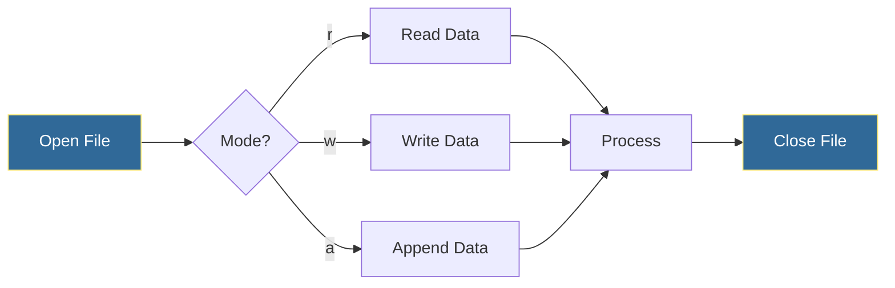
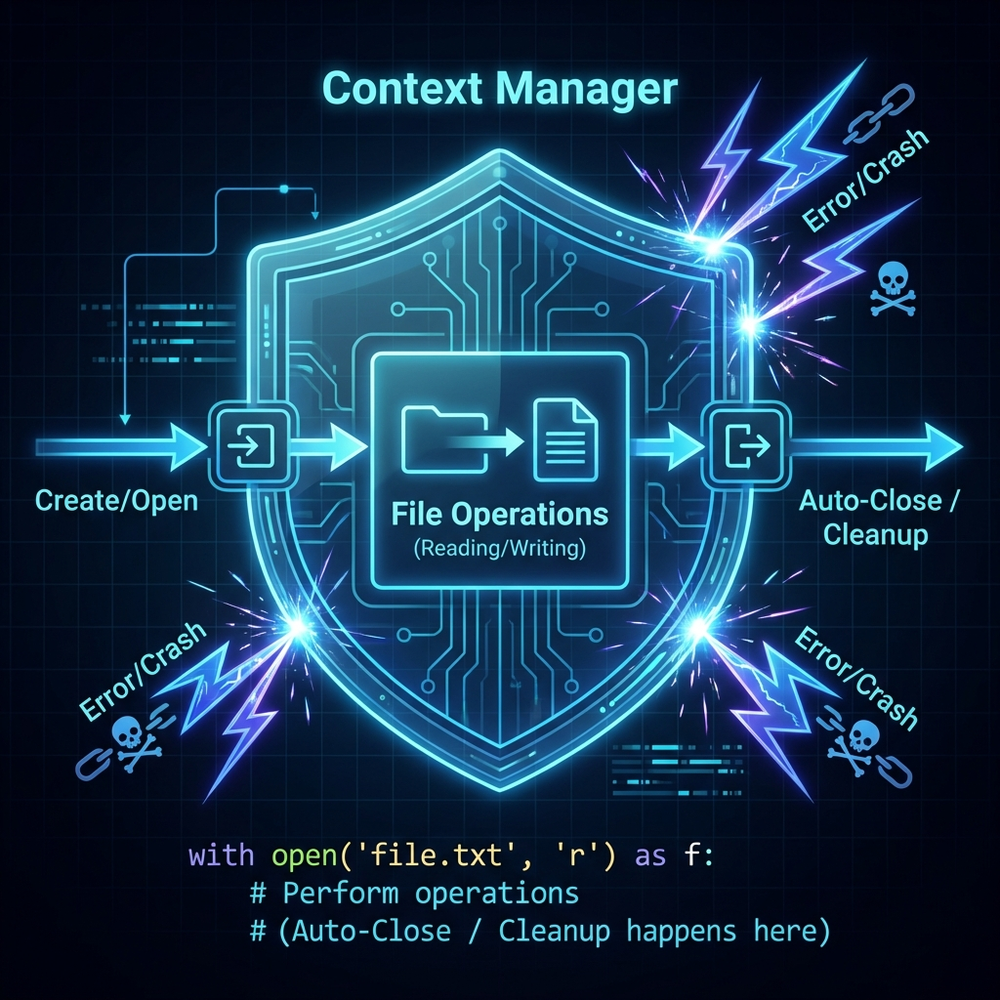

# File Operations
*Reading, Writing, and Managing Files for Automation*

File operations are fundamental to DevOps automation—from reading configs to writing logs to managing deployment artifacts. Python provides powerful, safe abstractions for file handling.

---

## 🎯 Learning Objectives

- Read and write files safely using context managers
- Handle different file formats (text, binary)
- Navigate file systems programmatically
- Process large files efficiently

---

## 📊 File I/O Workflow



---

## 📚 Core Concepts

File operations are the bridge between your code and the permanent storage of your system. In DevOps, robust file handling prevents data corruption during deployments and ensures efficient log processing.

### Visual Guide


*Fig 1: The Context Manager acts as a shield, ensuring resources are safely closed even if errors occur.*


*Fig 2: Understanding access modes—Read, Write (Truncate), Append, and Update—is critical for safety.*

---

### 1. Robust File Handling (Context Managers)
**Definition**:
The `with` statement is a **Context Manager**. It handles the setup (opening) and teardown (closing) phases automatically.

**The "Old" Way (Risky)**:
If an error occurs before `.close()`, the file handle hangs open, leaking resources.
```python
f = open("/tmp/data.txt", "w")
f.write("data")
# if error here -> file stays open!
f.close()
```

**The "DevOps" Way (Safe)**:
Even if the code crashes inside the block, Python guarantees the file is closed.
```python
with open("/tmp/data.txt", "w") as f:
    f.write("Important Config")
    # if error here -> file still auto-closes safely
```

**Under the Hood**:
The context manager calls `__enter__()` when starting and `__exit__()` (which closes the file) when leaving the block, catching exceptions if needed.

---

### 2. File Modes & Permissions
Choosing the wrong mode can wipe out critical data.

| Mode | Name | Description | Pointer Position | Truncates? | Create? |
| :--- | :--- | :--- | :--- | :--- | :--- |
| `r` | **Read** | Default. Read-only. Error if missing. | Start | ❌ No | ❌ No |
| `w` | **Write** | Writing only. **Wipes file content!** | Start | ✅ **YES** | ✅ Yes |
| `a` | **Append** | Writing only. Adds to end. | End | ❌ No | ✅ Yes |
| `r+` | **Read+Write** | Reading & Writing. | Start | ❌ No | ❌ No |
| `w+` | **Write+Read** | Reading & Writing. **Wipes content!** | Start | ✅ **YES** | ✅ Yes |
| `a+` | **Append+Read**| Reading & Writing. | End | ❌ No | ✅ Yes |

**Binary Mode (`b`)**:
Append `b` (e.g., `wb`, `rb`) for non-text files like images, executables, or compressed archives.
```python
# Copying a binary executable safely
with open("/bin/stress", "rb") as src:
    with open("/tmp/stress_copy", "wb") as dst:
        dst.write(src.read())
```

---

### 3. Reading Strategies (Performance)
**DevOps Scenario**: Analyzing a 50GB HTTP access log.

**❌ Bad: Load everything (RAM Explosion)**
```python
# Reads 50GB into RAM -> Crash
with open("access.log", "r") as f:
    content = f.read()
```

**✅ Good: Line-by-Line (Stream Processing)**
File objects are *iterators*. They yield one line at a time.
```python
# Uses negligible RAM
with open("access.log", "r") as f:
    for line in f:
        if "500 Internal Server Error" in line:
            notify_admin(line)
```

**✅ Good: Chunked Reading (Binary)**
For large binary files, read in fixed blocks (e.g., 4KB or 8KB).
```python
CHUNK_SIZE = 8192
with open("large_backup.tar.gz", "rb") as f:
    while (chunk := f.read(CHUNK_SIZE)):
        process_chunk(chunk)
```

---

## 🔧 Advanced Patterns

### 1. Atomic Writes (Safety Critical)
**Problem**: If your script crashes while writing `config.json`, the file might be half-written (corrupt) and invalid.
**Solution**: Write to a temporary file, then **rename** it. Renaming is an atomic operation on POSIX systems.

```python
import os
import json
import tempfile

def save_config_atomically(path, data):
    dir_name = os.path.dirname(path)
    # Create temp file in same directory (ensures same filesystem)
    with tempfile.NamedTemporaryFile("w", dir=dir_name, delete=False) as tmp:
        json.dump(data, tmp, indent=2)
        tmp.flush()
        os.fsync(tmp.fileno()) # Force write to disk
        tmp_name = tmp.name
        
    # Instant swap
    os.replace(tmp_name, path)

# Usage
config = {"db_host": "10.0.0.1", "retries": 5}
save_config_atomically("/etc/monitor/config.json", config)
```

### 2. Efficient Log Parsing Pipeline
Processing logs often involves multiple steps: filter -> extract -> count. Generators allow this pipeline to run efficiently without intermediate lists.

```python
def log_pipeline(file_path):
    with open(file_path) as f:
        # Step 1: Generator yielding lines
        lines = (line.strip() for line in f)
        
        # Step 2: Filter errors
        errors = (l for l in lines if "ERROR" in l)
        
        # Step 3: Extract timestamp (first 19 chars)
        timestamps = (e[:19] for e in errors)
        
        # Consume the generator
        for ts in timestamps:
            print(f"Incident occurred at: {ts}")

# This runs with O(1) memory regardless of log size
log_pipeline("/var/log/syslog")
```

---

## 🛠️ Hands-On Challenges

Master file operations by solving these professional DevOps challenges.

| Challenge | Description | Starter Code | Solution |
| :--- | :--- | :--- | :--- |
| **01. Config Reader** | Build a robust key=value configuration parser. | [Link](./challenges/challenge_01_config_reader.py) | [Link](./challenges/solutions/solution_01_config_reader.py) |
| **02. Log Rotator** | Implement a script to rotate and manage log files. | [Link](./challenges/challenge_02_log_rotation.py) | [Link](./challenges/solutions/solution_02_log_rotation.py) |
| **03. Safe Updater** | Create an atomic JSON configuration update tool. | [Link](./challenges/challenge_03_safe_updater.py) | [Link](./challenges/solutions/solution_03_safe_updater.py) |

> **Pro Tip**: Always use context managers (`with`) and consider atomic writes for critical configuration files.

---

## 📖 Real-World Story: The Corrupted Config

**Scenario**: A deployment script was interrupted mid-write, leaving a config file half-written. The service crashed on restart.

**Problem**: Direct file writes using `open('config.json', 'w')` are not atomic.

**Solution**: Implemented atomic writes using temp file + rename pattern.

**Outcome**: Even when deployments fail, config files are never left in corrupted state.

---

## ❓ Interview Questions

1. **Why should you use context managers (`with`) for file operations?**
   > Ensures files are properly closed even if exceptions occur. Prevents resource leaks.

2. **How do you handle very large files that don't fit in memory?**
   > Read line by line using iteration, or use chunked reading for binary files.

3. **What's the difference between `r+` and `w+` modes?**
   > `r+` requires file to exist and preserves content. `w+` creates/truncates file.

4. **How do you ensure file writes are atomic?**
   > Write to temp file, then rename. Rename is atomic on most filesystems.

5. **What's the difference between `read()`, `readline()`, and `readlines()`?**
   > `read()` returns entire content, `readline()` one line, `readlines()` list of all lines.

---

## 🧠 Quiz

1. Which mode creates a file if it doesn't exist but doesn't truncate?
   - a) `w`
   - b) `a` ✅
   - c) `r+`

2. What does `with open(...) as f:` guarantee?
   - a) Fast reads
   - b) Automatic file closing ✅
   - c) Read-only access

3. For a 10GB log file, which approach is memory efficient?
   - a) `f.read()`
   - b) `f.readlines()`
   - c) `for line in f:` ✅

4. How do you write binary data?
   - a) `open(f, "w")`
   - b) `open(f, "wb")` ✅
   - c) `open(f, "binary")`

5. What happens with `open("new.txt", "w")` if file exists?
   - a) Appends
   - b) Error
   - c) Truncates (overwrites) ✅

---

**Next Step**: [Error Handling →](../05-Error-Handling/README.md)
