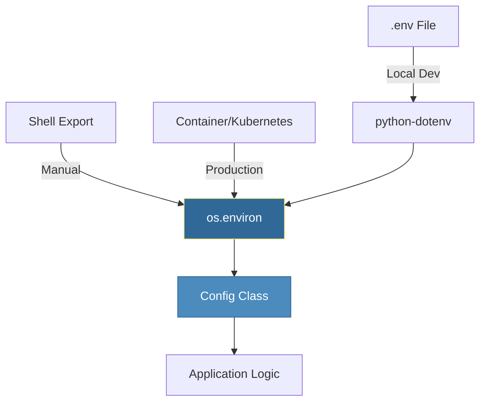

# Environment Variables
*Configuring Applications the 12-Factor Way*

Environment variables are the gold standard for configuring modern applications. They allow you to change a script's behavior (switching from Dev to Prod) without changing a single line of code, fulfilling one of the core principles of the [12-Factor App](https://12factor.net/config).

---

## 🎯 Learning Objectives

- Read and manipulate environment variables using `os.environ`
- Manage local development secrets with `python-dotenv`
- Implement robust configuration classes with type conversion
- Apply security best practices to protect sensitive credentials
- Dynamic environment switching for CI/CD pipelines

---

## 📊 Environment Configuration Flow



---

## 📚 Core Concepts

### 1. Reading and Setting Variables

Python uses the `os` module to interact with the environment.

```python
import os

# 1. Reading safely (Recommended)
db_host = os.environ.get("DB_HOST", "localhost")  # Provides default

# 2. Reading strictly
# Raises KeyError if missing - good for MANDATORY production vars
api_key = os.environ["API_KEY"] 

# 3. Setting variables (current process and children only)
os.environ["DEPLOY_STATUS"] = "IN_PROGRESS"

# 4. Deleting variables
if "TEMP_TOKEN" in os.environ:
    del os.environ["TEMP_TOKEN"]
```

### 2. Managing Local Secrets with `python-dotenv`

In production, variables are set by the orchestrator (Docker/Kubernetes). Locally, we use a `.env` file.

```python
# .env file (DO NOT COMMIT TO GIT)
DB_HOST=dev.internal.db
DB_USER=admin
DB_PASS=super-secret-password
```

```python
from dotenv import load_dotenv
import os

# Load .env into os.environ
load_dotenv() 

# Now access as usual
user = os.environ.get("DB_USER")
```

### 3. Professional Configuration Pattern

Using a class provides type safety and a single source of truth for all config.

```python
import os
from dataclasses import dataclass

@dataclass
class AppConfig:
    db_url: str
    port: int
    debug: bool

def load_config() -> AppConfig:
    return AppConfig(
        db_url=os.environ.get("DATABASE_URL", "sqlite:///app.db"),
        port=int(os.environ.get("PORT", "8080")),  # Manual cast
        debug=os.environ.get("DEBUG", "false").lower() == "true"
    )

config = load_config()
if config.debug:
    print(f"Server starting on port {config.port}")
```

---

## 🛡️ Security Best Practices

| Practice | Rationale |
|----------|-----------|
| **Mask Secrets** | Never print the raw value of `API_KEY` in logs. |
| **GitIgnore .env** | Prevent leaking credentials to public repositories. |
| **Least Privilege** | Only expose necessary variables to the script. |
| **No Hardcoding** | Hardcoded secrets are permanent security vulnerabilities. |

---

## 🛠️ Hands-On Challenges

### Challenge 1: Mandatory Variable Validator
Create a utility that checks for all required variables and raises a clear error list if they are missing.

<details>
<summary>💡 Solution</summary>

```python
import os

REQUIRED_VARS = ["DB_URL", "API_KEY", "REGION"]

def validate_environment():
    missing = [var for var in REQUIRED_VARS if var not in os.environ]
    if missing:
        raise EnvironmentError(f"Missing mandatory variables: {', '.join(missing)}")
    print("✅ Environment is valid")

# validate_environment()
```
</details>

### Challenge 2: Secret Masking Logger
Implement a function that logs environment variables but masks the values of sensitive keys.

<details>
<summary>💡 Solution</summary>

```python
import os

SENSITIVE_KEYS = {"PASSWORD", "SECRET", "KEY", "TOKEN"}

def log_env_safely():
    for key, value in os.environ.items():
        if any(s in key.upper() for s in SENSITIVE_KEYS):
            masked = value[:2] + "*" * (len(value) - 4) + value[-2:] if len(value) > 4 else "****"
            print(f"{key}: {masked}")
        else:
            print(f"{key}: {value}")
```
</details>

### Challenge 3: Type-Safe Parser
Create a helper function `get_env_bool(name, default)` that correctly handles various string representations of booleans ("1", "true", "yes").

<details>
<summary>💡 Solution</summary>

```python
import os

def get_env_bool(name, default=False):
    val = os.environ.get(name, str(default)).lower()
    return val in ("true", "1", "t", "y", "yes")

# debug = get_env_bool("DEBUG", default=True)
```
</details>

### Challenge 4: Dynamic Environment Loader
Write a script that loads `.env.prod` if `ENV=production` is set, otherwise loads `.env.dev`.

<details>
<summary>💡 Solution</summary>

```python
from dotenv import load_dotenv
import os

def setup_env():
    environment = os.environ.get("ENV", "development")
    env_file = f".env.{environment}"
    load_dotenv(env_file)
    print(f"Loaded config from {env_file}")

# setup_env()
```
</details>

### Challenge 5: Prefix-Based Config Loader
Read all variables starting with `APP_` (e.g., `APP_PORT`, `APP_TIMEOUT`) and return them as a dictionary with the prefix removed.

<details>
<summary>💡 Solution</summary>

```python
import os

def get_app_config():
    return {
        key[4:].lower(): value 
        for key, value in os.environ.items() 
        if key.startswith("APP_")
    }

# config = get_app_config()
```
</details>

---

## 📖 Real-World Story: The Repo Leak

**Scenario**: A developer was debugging a production issue locally. They created a `.env` file containing the production RDS password.

**Problem**: They forgot to add `.env` to their `.gitignore`. When they pushed their code, the production password was committed to the company's private GitHub repository.

**Solution**: 
1. The company's security scanner (TruffleHog) detected the secret instantly.
2. The RDS password was immediately rotated.
3. The team implemented a global `.gitignore` and switched to using AWS Secrets Manager for local development via a CLI bridge.

**Outcome**: A potential disaster was averted, and the team learned that `.env` files must be handled with extreme care.

---

## ❓ Interview Questions

1. **Why is it better to use `os.environ.get()` than `os.environ[]`?**
   > `get()` prevents the script from crashing with a `KeyError` if the variable is missing, allowing you to provide a safe default value.

2. **What is the "12-Factor App" guidance on configuration?**
   > It states that configuration should be strictly separated from code and stored in environment variables, allowing identical builds to run in different environments.

3. **How do you handle multi-line environment variables (like a Private Key)?**
   > In a `.env` file, you can wrap them in quotes and use `\n`, or base64-encode the entire string and decode it in your Python script.

4. **Can one running Python script change the environment variables of its parent shell?**
   > No. Environment changes in a process only move "down" to child processes, never "up" to the parent shell.

5. **When should a variable be "mandatory" (raising an error) vs "optional" (using a default)?**
   > Use mandatory for unique identifiers (API Keys, DB Passwords) where no safe default exists. Use optional for behavioral tweaks (Log Level, Timeouts, Ports).

---

## 🧠 Quiz

1. Which command loads a `.env` file into memory?
   - a) `os.load_dotenv()`
   - b) `load_dotenv()` ✅
   - c) `pip install env`

2. What type is `os.environ`?
   - a) A List
   - b) A Dictionary-like object ✅
   - c) A Tuple

3. How do you get a numeric port number from an environment variable?
   - a) `port = os.environ.get("PORT")`
   - b) `port = int(os.environ.get("PORT", 8080))` ✅
   - c) `port = float(os.environ["PORT"])`

4. Where should sensitive secrets be stored in a production Kubernetes cluster?
   - a) In the Dockerfile
   - b) In a `.env` file in the image
   - c) In a Kubernetes Secret mapped to environment variables ✅

5. What does `os.environ.get("USER", "guest")` return if `USER` is present?
   - a) "guest"
   - b) The actual value of `USER` ✅
   - c) An error

6. Which file must always be in `.gitignore`?
   - a) `main.py`
   - b) `.env` ✅
   - c) `requirements.txt`

7. How do you check if a variable exists without reading its value?
   - a) `if "KEY" in os.environ:` ✅
   - b) `if os.has_key("KEY"):`
   - c) `if os.environ.exists("KEY"):`

---

## 🔗 Related Topics

| Module | Relationship |
|--------|-------------|
| [Working with YAML](../07-Working-with-YAML/README.md) | YAML can reference environment variables (like in Ansible/K8s) |
| [Command Line Arguments](../09-Command-Line-Arguments/README.md) | CLI args usually take precedence over env vars |
| [Logging Basics](../14-Logging-Basics/README.md) | Use env vars to set log levels (DEBUG vs INFO) |

---

**Next Step**: [Command Line Arguments →](../09-Command-Line-Arguments/README.md)
