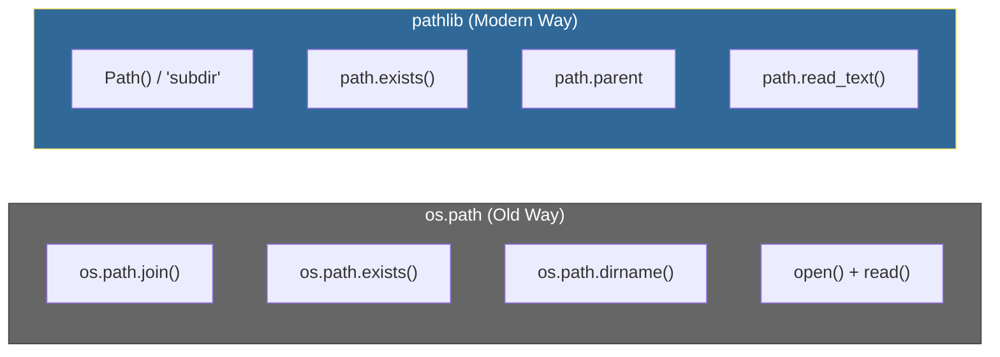
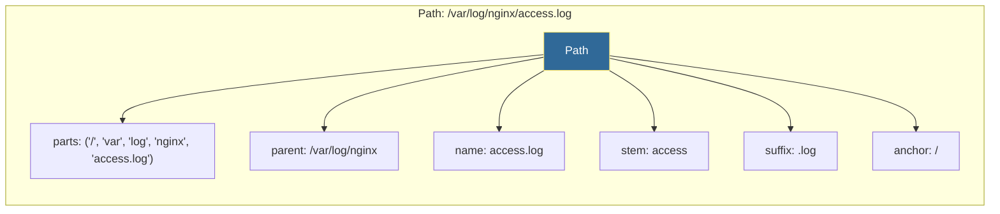

# Pathlib Basics
*Modern Cross-Platform Path Handling*

Pathlib provides an object-oriented approach to file system paths, making code more readable and cross-platform compatible than the traditional `os.path` module. For DevOps automation, pathlib ensures your scripts work seamlessly across Windows, Linux, and macOS.

---

## 🎯 Learning Objectives

- Use Path objects for all file and directory operations
- Navigate directories programmatically with intuitive syntax
- Write cross-platform automation scripts that work everywhere
- Perform file operations (read, write, copy, delete) with pathlib
- Use glob patterns to find files matching specific criteria

---

## 📊 Pathlib vs os.path Comparison



| Operation | os.path (Old) | pathlib (Modern) |
|-----------|---------------|------------------|
| Join paths | `os.path.join(a, b, c)` | `Path(a) / b / c` |
| Check exists | `os.path.exists(p)` | `path.exists()` |
| Get filename | `os.path.basename(p)` | `path.name` |
| Get extension | `os.path.splitext(p)[1]` | `path.suffix` |
| Get parent | `os.path.dirname(p)` | `path.parent` |
| Read file | `open(p).read()` | `path.read_text()` |
| List directory | `os.listdir(p)` | `path.iterdir()` |

---

## 📊 Path Object Anatomy



---

## 📚 Core Concepts

### 1. Creating Path Objects

```python
from pathlib import Path

# Current and home directories
current = Path.cwd()         # /home/user/project
home = Path.home()           # /home/user

# From string
log_path = Path("/var/log/syslog")
config = Path("./config/app.yaml")

# Build paths with / operator (MUCH cleaner than os.path.join!)
config_file = Path("/etc") / "nginx" / "nginx.conf"
log_file = home / "logs" / "app.log"
backup = Path.home() / "backups" / "2026" / "01" / "data.tar.gz"

# Windows paths work too (automatically handled)
win_path = Path("C:/Users/admin/Documents")
```

### 2. Path Properties and Components

```python
from pathlib import Path

path = Path("/var/log/nginx/access.log")

# Components
path.name          # "access.log" - filename with extension
path.stem          # "access" - filename without extension
path.suffix        # ".log" - file extension
path.suffixes      # [".log"] - all extensions (useful for .tar.gz)
path.parent        # Path("/var/log/nginx")
path.parents       # [Path("/var/log/nginx"), Path("/var/log"), ...]
path.parts         # ("/", "var", "log", "nginx", "access.log")
path.anchor        # "/" on Unix, "C:\\" on Windows

# Type checks
path.exists()      # True/False
path.is_file()     # True if file exists
path.is_dir()      # True if directory exists
path.is_absolute() # True if absolute path
path.is_symlink()  # True if symbolic link

# Path manipulation
path.with_suffix(".bak")    # Path("/var/log/nginx/access.bak")
path.with_name("error.log") # Path("/var/log/nginx/error.log")
path.with_stem("errors")    # Path("/var/log/nginx/errors.log")
```

### 3. File Operations

```python
from pathlib import Path

# Reading files
content = Path("config.txt").read_text()          # String
binary = Path("image.png").read_bytes()           # Bytes

# Writing files
Path("output.txt").write_text("Hello World")
Path("data.bin").write_bytes(b"\x00\x01\x02")

# File statistics
stats = Path("app.log").stat()
print(f"Size: {stats.st_size} bytes")
print(f"Modified: {stats.st_mtime}")  # Unix timestamp

# Create directories
Path("logs/app/debug").mkdir(parents=True, exist_ok=True)
# parents=True: Create parent directories if needed
# exist_ok=True: Don't error if already exists

# Delete files/directories
Path("temp.txt").unlink()                # Delete file
Path("temp.txt").unlink(missing_ok=True) # No error if missing
Path("empty_dir").rmdir()                # Delete empty directory

# Rename/Move
Path("old.txt").rename("new.txt")
Path("file.txt").replace("target.txt")   # Overwrites if exists
```

### 4. Directory Navigation and Iteration

```python
from pathlib import Path

project = Path("/home/user/project")

# List immediate children
for item in project.iterdir():
    if item.is_file():
        print(f"File: {item.name}")
    elif item.is_dir():
        print(f"Dir: {item.name}")

# Glob patterns - find matching files
# Single directory
for py_file in project.glob("*.py"):
    print(py_file)

# Recursive (all subdirectories)
for config in project.glob("**/*.yaml"):
    print(f"Found config: {config}")

# Multiple extensions
for doc in project.glob("**/*.md"):
    print(doc)
```

### 5. Common Glob Patterns

| Pattern | Matches |
|---------|---------|
| `*.py` | Python files in current directory |
| `**/*.py` | Python files in all subdirectories |
| `*.{yaml,yml}` | YAML files (both extensions) |
| `test_*.py` | Test files |
| `**/config*` | Any file starting with "config" anywhere |
| `data[0-9].json` | data0.json through data9.json |

### 6. Cross-Platform Safety

```python
from pathlib import Path

# BAD - hardcoded separator won't work on Windows
path = "/var/log" + "/" + "app.log"  # ❌

# GOOD - pathlib handles separators automatically
path = Path("/var/log") / "app.log"  # ✅

# Resolve to absolute path
relative = Path("./config/app.yaml")
absolute = relative.resolve()  # Full absolute path

# Convert to string when needed (for APIs that require strings)
path = Path("/var/log/app.log")
path_str = str(path)  # "/var/log/app.log"

# For Windows compatibility
path.as_posix()       # Forward slashes: "C:/Users/admin"
path.as_uri()         # file:///C:/Users/admin
```

---

## 🛠️ Hands-On Challenges

Master `pathlib` by building these cross-platform file management tools.

| Challenge | Description | Starter Code | Solution |
| :--- | :--- | :--- | :--- |
| **01. Log File Cleanup** | Delete log files older than a specific date based on modification timestamps. | [Link](./challenges/challenge_01_log_cleanup.py) | [Link](./challenges/solutions/solution_01_log_cleanup.py) |
| **02. Project Analyzer** | Generate a detailed report of a project's directory structure and file sizes. | [Link](./challenges/challenge_02_project_analyzer.py) | [Link](./challenges/solutions/solution_02_project_analyzer.py) |
| **03. Safe File Backup** | Create timestamped backups of config files with automated rotation logic. | [Link](./challenges/challenge_03_safe_backup.py) | [Link](./challenges/solutions/solution_03_safe_backup.py) |
| **04. Directory Sync** | Build a smart synchronizer that only copies new or modified files. | [Link](./challenges/challenge_04_sync_dirs.py) | [Link](./challenges/solutions/solution_04_sync_dirs.py) |

> **Pro Tip**: Use `Path(".").rglob("*")` for recursive directory processing—it's much cleaner than nested loops with `os.walk()`.

---

## 📖 Real-World Story: The Path Separator Bug

**Scenario**: A deployment script worked perfectly on the team's Mac laptops but crashed in production (Linux) and on the Windows CI server.

**Problem**: The script used hardcoded path separators:

```python
# ❌ Bug-prone code
config_path = project_dir + "\\" + "config" + "\\" + "app.yaml"
```

**Solution**: Refactored to use pathlib:

```python
from pathlib import Path

# ✅ Cross-platform code
config_path = Path(project_dir) / "config" / "app.yaml"
```

**Outcome**: The script now works on all platforms without modification's. The team adopted pathlib as their standard for all file operations.

---

## ❓ Interview Questions

1. **Why is pathlib preferred over os.path for new code?**
   > Pathlib provides an object-oriented interface that's more readable (using `/` operator for joining), has methods for common operations (read_text, write_text), and handles cross-platform path separators automatically.

2. **How do you find all Python files in a project recursively?**
   > Use `Path(".").rglob("*.py")` or `Path(".").glob("**/*.py")`. The `rglob` method is shorthand for recursive globbing, equivalent to prefixing the pattern with `**/`.

3. **What's the difference between `path.name`, `path.stem`, and `path.suffix`?**
   > For `/var/log/access.log`: `name` returns "access.log" (full filename), `stem` returns "access" (without extension), and `suffix` returns ".log" (the extension with dot).

4. **How do you safely create nested directories?**
   > Use `Path("a/b/c").mkdir(parents=True, exist_ok=True)`. `parents=True` creates parent directories if they don't exist, and `exist_ok=True` prevents errors if the directory already exists.

5. **How do you make pathlib code work with libraries expecting string paths?**
   > Use `str(path)` to convert a Path object to a string. Many modern libraries (like open()) accept Path objects directly due to the os.fspath() protocol.

6. **What's the difference between resolve() and absolute()?**
   > `resolve()` returns the absolute path AND resolves symlinks and normalizes the path (removes `..`). `absolute()` only makes the path absolute without resolving symlinks or normalizing. `resolve()` is generally preferred.

---

## 🧠 Quiz

1. How do you join paths with Pathlib?
   - a) `path.join("sub")`
   - b) `path / "sub"` ✅
   - c) `path + "sub"`
   - d) `path.append("sub")`

2. What does `Path("file.txt").stem` return?
   - a) "file.txt"
   - b) "file" ✅
   - c) ".txt"
   - d) Path("file")

3. How do you find all `.yaml` files recursively?
   - a) `path.glob("*.yaml")`
   - b) `path.glob("**/*.yaml")` ✅
   - c) `path.find("*.yaml")`
   - d) `path.search("*.yaml")`

4. What does `mkdir(parents=True)` do?
   - a) Creates only the final directory
   - b) Creates all parent directories if needed ✅
   - c) Requires parent to exist
   - d) Creates a copy of parent

5. How do you read a text file with pathlib?
   - a) `path.read()`
   - b) `path.read_text()` ✅
   - c) `path.load()`
   - d) `path.get_content()`

6. What does `path.resolve()` return?
   - a) Relative path
   - b) Normalized absolute path ✅
   - c) Parent directory
   - d) File contents

7. Which attribute gives the file extension?
   - a) `path.ext`
   - b) `path.extension`
   - c) `path.suffix` ✅
   - d) `path.type`

8. How do you check if a path is a directory?
   - a) `path.isdir()`
   - b) `path.is_dir()` ✅
   - c) `path.directory`
   - d) `path.type == 'dir'`

---

## 🔗 Related Topics

| Module | Relationship |
|--------|-------------|
| [File Operations](../04-File-Operations/README.md) | Pathlib is the modern approach to file handling |
| [Subprocess Module](../10-Subprocess-Module/README.md) | Pass pathlib paths as command arguments |
| [Working with JSON](../06-Working-with-JSON/README.md) | Read/write JSON files with pathlib |

---

**Next Step**: [Datetime Operations →](../12-Datetime-Operations/README.md)
