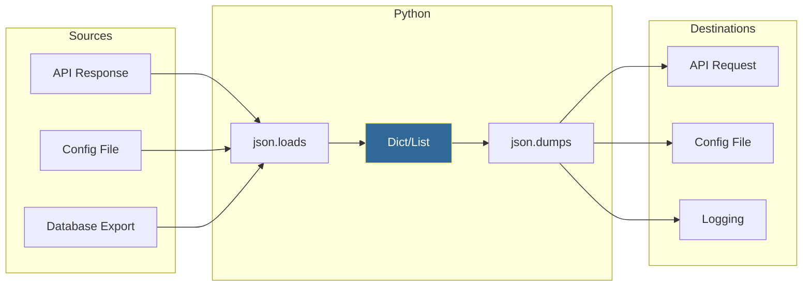

# Working with JSON
*The Universal Data Exchange Format for DevOps*

JSON (JavaScript Object Notation) is the lingua franca of APIs, configuration, and data exchange. Every DevOps engineer must master JSON manipulation for API responses, config files, and infrastructure definitions.

---

## 🎯 Learning Objectives

- Parse JSON from files and API responses
- Serialize Python objects to JSON
- Handle nested structures and edge cases
- Transform JSON for different use cases

---

## 📊 JSON Data Flow



---

## 📚 Core Concepts

### 1. JSON Basics

```python
import json

# JSON string to Python (deserialization)
json_string = '{"server": "web-01", "port": 8080, "active": true}'
data = json.loads(json_string)
print(data["server"])  # "web-01"
print(type(data))       # <class 'dict'>

# Python to JSON string (serialization)
config = {
    "hostname": "api-prod-01",
    "port": 443,
    "ssl": True,
    "tags": ["production", "api"]
}
json_output = json.dumps(config)
print(json_output)

# Pretty printing
json_pretty = json.dumps(config, indent=2)
print(json_pretty)
```

### 2. File Operations

```python
# Read JSON from file
with open("config.json", "r") as f:
    config = json.load(f)  # Note: load (not loads)

# Write JSON to file
config = {"version": "2.0", "debug": True}
with open("config.json", "w") as f:
    json.dump(config, f, indent=2)  # Note: dump (not dumps)

# Safe read with defaults
def load_config(filepath, defaults=None):
    try:
        with open(filepath, "r") as f:
            return json.load(f)
    except FileNotFoundError:
        return defaults or {}
    except json.JSONDecodeError as e:
        raise ValueError(f"Invalid JSON in {filepath}: {e}")
```

### 3. Type Mapping

| JSON Type | Python Type |
|-----------|-------------|
| object | dict |
| array | list |
| string | str |
| number (int) | int |
| number (float) | float |
| true/false | True/False |
| null | None |

### 4. Handling Complex Data

```python
from datetime import datetime
import json

# Custom encoder for non-serializable types
class DevOpsEncoder(json.JSONEncoder):
    def default(self, obj):
        if isinstance(obj, datetime):
            return obj.isoformat()
        if isinstance(obj, set):
            return list(obj)
        if hasattr(obj, '__dict__'):
            return obj.__dict__
        return super().default(obj)

# Usage
event = {
    "timestamp": datetime.now(),
    "servers": {"web-01", "web-02"},  # set
    "status": "healthy"
}
json_str = json.dumps(event, cls=DevOpsEncoder, indent=2)
print(json_str)

# Parsing with hooks
def datetime_hook(dct):
    for key, value in dct.items():
        if isinstance(value, str) and 'T' in value:
            try:
                dct[key] = datetime.fromisoformat(value)
            except ValueError:
                pass
    return dct

data = json.loads(json_str, object_hook=datetime_hook)
```

---

## 🔧 Advanced Patterns

### Nested Data Navigation

```python
# Safely navigate nested structures
def deep_get(data, path, default=None):
    """Safely get nested values using dot notation."""
    keys = path.split('.')
    result = data
    for key in keys:
        try:
            if isinstance(result, list):
                result = result[int(key)]
            else:
                result = result[key]
        except (KeyError, IndexError, TypeError):
            return default
    return result

# Usage
api_response = {
    "data": {
        "servers": [
            {"name": "web-01", "metrics": {"cpu": 75}},
            {"name": "web-02", "metrics": {"cpu": 82}}
        ]
    }
}

cpu = deep_get(api_response, "data.servers.0.metrics.cpu")
print(cpu)  # 75
```

### JSON Merge/Patch

```python
def deep_merge(base, overlay):
    """Deep merge two dictionaries."""
    result = base.copy()
    for key, value in overlay.items():
        if key in result and isinstance(result[key], dict) and isinstance(value, dict):
            result[key] = deep_merge(result[key], value)
        else:
            result[key] = value
    return result

# Usage
base_config = {
    "database": {"host": "localhost", "port": 5432},
    "debug": False
}
production_overlay = {
    "database": {"host": "db.prod.internal"},
    "ssl": True
}

final_config = deep_merge(base_config, production_overlay)
# {"database": {"host": "db.prod.internal", "port": 5432}, "debug": False, "ssl": True}
```

---

## 🛠️ Hands-On Challenges

Master JSON manipulation by solving these professional DevOps challenges.

| Challenge | Description | Starter Code | Solution |
| :--- | :--- | :--- | :--- |
| **01. API Response Parser** | Extract running instances and their names from a cloud API response. | [Link](./challenges/challenge_01_api_parser.py) | [Link](./challenges/solutions/solution_01_api_parser.py) |
| **02. Config Validator** | Build a tool to validate JSON configuration files against a schema. | [Link](./challenges/challenge_02_config_validator.py) | [Link](./challenges/solutions/solution_02_config_validator.py) |
| **03. JSON Diff Tool** | Create a script to detect differences between two JSON configurations. | [Link](./challenges/challenge_03_json_diff.py) | [Link](./challenges/solutions/solution_03_json_diff.py) |

> **Pro Tip**: Use `json.dumps(data, indent=2)` to make complex JSON responses readable in your logs and terminal.

---

## 📖 Real-World Story: The API Schema Change

**Scenario**: An upstream API changed its response format from `{"servers": [...]}` to `{"data": {"servers": [...]}}`. Scripts broke silently, using empty lists.

**Solution**: Implemented JSON schema validation that:
- Validates expected structure before processing
- Raises clear errors on mismatches
- Alerts team of schema drift

**Outcome**: Next API change was caught immediately in staging, not production.

---

## ❓ Interview Questions

1. **What's the difference between `json.load()` and `json.loads()`?**
   > `load()` reads from file object, `loads()` parses a string.

2. **How do you handle datetime in JSON?**
   > Use custom encoder to convert to ISO format, custom decoder hook to parse back.

3. **What happens when JSON contains keys with the same name?**
   > Last value wins. Python dict constructor keeps the last duplicate.

4. **How do you pretty-print JSON in Python?**
   > `json.dumps(data, indent=2)` or `json.dumps(data, indent=4, sort_keys=True)`

5. **What's the safest way to access nested JSON values?**
   > Use `.get()` with defaults, or create a helper function for deep access.

---

## 🧠 Quiz

1. Which method reads JSON from a file?
   - a) `json.loads()`
   - b) `json.load()` ✅
   - c) `json.read()`

2. What Python type does JSON `null` become?
   - a) `"null"`
   - b) `0`
   - c) `None` ✅

3. What does `json.dumps()` return?
   - a) Dictionary
   - b) String ✅
   - c) File object

4. How do you serialize a datetime object?
   - a) Use directly (auto-converts)
   - b) Custom JSONEncoder ✅
   - c) Not possible

5. What's the default encoding for JSON in Python 3?
   - a) ASCII
   - b) UTF-8 ✅
   - c) Latin-1

---

**Next Step**: [Working with YAML →](../07-Working-with-YAML/README.md)
