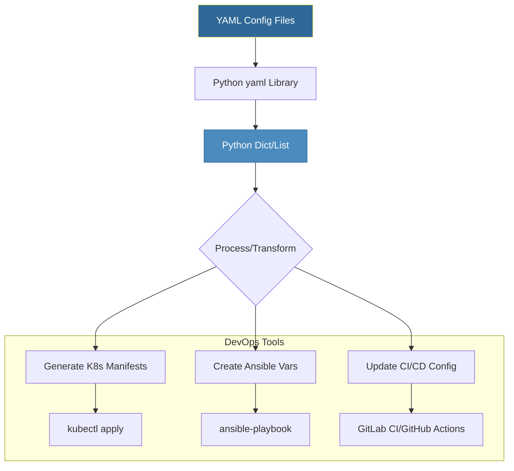

# Working with YAML
*The Human-Friendly Configuration Language*

YAML (YAML Ain't Markup Language) is the preferred format for DevOps configuration—Kubernetes manifests, Ansible playbooks, Docker Compose, and CI/CD pipelines all use YAML. Mastering YAML manipulation is essential.

---

## 🎯 Learning Objectives

- Parse and generate YAML files
- Handle multi-document YAML streams
- Convert between YAML and other formats
- Validate YAML structure programmatically

---

## 📊 YAML in DevOps Pipeline



---

## 📚 Core Concepts

### 1. YAML Basics

```python
import yaml

# Parse YAML string
yaml_content = """
apiVersion: v1
kind: Service
metadata:
  name: web-service
  labels:
    app: web
spec:
  ports:
    - port: 80
      targetPort: 8080
  selector:
    app: web
"""

data = yaml.safe_load(yaml_content)
print(data["metadata"]["name"])  # "web-service"

# Generate YAML from Python
config = {
    "server": {
        "host": "0.0.0.0",
        "port": 8080,
        "debug": False
    },
    "database": {
        "url": "postgresql://localhost:5432/db",
        "pool_size": 10
    }
}

yaml_output = yaml.dump(config, default_flow_style=False)
print(yaml_output)
```

### 2. File Operations

```python
# Read YAML file
with open("config.yaml", "r") as f:
    config = yaml.safe_load(f)

# Write YAML file
with open("output.yaml", "w") as f:
    yaml.dump(config, f, default_flow_style=False, sort_keys=False)

# Safe loading (prevents code execution)
yaml.safe_load(content)    # ✅ Always use this
yaml.load(content, Loader=yaml.SafeLoader)  # ✅ Equivalent

# Unsafe (NEVER use with untrusted input!)
yaml.load(content, Loader=yaml.FullLoader)  # ⚠️ Risky
```

### 3. Multi-Document YAML

```python
# Many DevOps tools use multi-doc YAML (separated by ---)
multi_doc = """
---
apiVersion: v1
kind: ConfigMap
metadata:
  name: app-config
data:
  LOG_LEVEL: INFO
---
apiVersion: v1
kind: Secret
metadata:
  name: app-secrets
type: Opaque
data:
  API_KEY: c2VjcmV0LWtleQ==
"""

# Load all documents
documents = list(yaml.safe_load_all(multi_doc))
print(f"Found {len(documents)} documents")

for doc in documents:
    print(f"  - {doc['kind']}: {doc['metadata']['name']}")

# Write multiple documents
output_docs = [
    {"kind": "ConfigMap", "metadata": {"name": "config1"}},
    {"kind": "Secret", "metadata": {"name": "secret1"}}
]

with open("multi.yaml", "w") as f:
    yaml.dump_all(output_docs, f, default_flow_style=False)
```

### 4. YAML Features

```python
# Anchors and Aliases (DRY in YAML)
yaml_with_anchors = """
defaults: &defaults
  timeout: 30
  retries: 3
  ssl: true

production:
  <<: *defaults
  host: prod.example.com
  
staging:
  <<: *defaults
  host: stage.example.com
  timeout: 60  # Override default
"""

data = yaml.safe_load(yaml_with_anchors)
print(data["production"]["timeout"])  # 30 (from defaults)
print(data["staging"]["timeout"])     # 60 (overridden)
```

---

## 🔧 Advanced Patterns

### Custom YAML Tags

```python
import yaml
import os

# Custom tag for environment variables
def env_constructor(loader, node):
    """Handle !env tag to read from environment."""
    value = loader.construct_scalar(node)
    return os.environ.get(value, f"${value}")

yaml.SafeLoader.add_constructor('!env', env_constructor)

# Usage
config_yaml = """
database:
  host: !env DB_HOST
  password: !env DB_PASSWORD
  port: 5432
"""

os.environ["DB_HOST"] = "prod-db.internal"
config = yaml.safe_load(config_yaml)
print(config["database"]["host"])  # "prod-db.internal"
```

### YAML Templating

```python
from jinja2 import Template
import yaml

# Template with Jinja2, then parse as YAML
template = Template("""
apiVersion: apps/v1
kind: Deployment
metadata:
  name: {{ app_name }}
  namespace: {{ namespace }}
spec:
  replicas: {{ replicas }}
  template:
    spec:
      containers:
        - name: {{ app_name }}
          image: {{ image }}:{{ tag }}
          ports:
            - containerPort: {{ port }}
""")

deployment = template.render(
    app_name="api-server",
    namespace="production",
    replicas=3,
    image="myregistry/api",
    tag="v2.1.0",
    port=8080
)

manifest = yaml.safe_load(deployment)
print(f"Deploying {manifest['spec']['replicas']} replicas")
```

---

## 🛠️ Hands-On Challenges

Master YAML manipulation by solving these professional DevOps challenges.

| Challenge | Description | Starter Code | Solution |
| :--- | :--- | :--- | :--- |
| **01. K8s Manifest Generator** | Automate the creation of Kubernetes Deployment manifests. | [Link](./challenges/challenge_01_manifest_gen.py) | [Link](./challenges/solutions/solution_01_manifest_gen.py) |
| **02. Ansible Inventory Parser** | Extract host and group details from a YAML inventory file. | [Link](./challenges/challenge_02_inventory_parser.py) | [Link](./challenges/solutions/solution_02_inventory_parser.py) |
| **03. Deep Config Merger** | Implement a recursive merger for environment-specific configurations. | [Link](./challenges/challenge_03_config_merger.py) | [Link](./challenges/solutions/solution_03_config_merger.py) |

> **Pro Tip**: Always use `yaml.safe_load()` instead of `yaml.load()` to prevent arbitrary code execution vulnerabilities.

---

## 📖 Real-World Story: The Indentation Bug

**Scenario**: A Kubernetes deployment kept failing with cryptic errors. The YAML looked correct visually.

**Problem**: Mixed tabs and spaces in the YAML file caused structure misalignment.

**Solution**: 
1. Added YAML validation to CI pipeline
2. Configured editors to show whitespace
3. Used `yamllint` for pre-commit checks

**Outcome**: No more whitespace-related deployment failures.

---

## ❓ Interview Questions

1. **Why use `yaml.safe_load()` instead of `yaml.load()`?**
   > `safe_load` prevents arbitrary code execution from malicious YAML files. Essential for security.

2. **How do YAML anchors work?**
   > Anchors (`&name`) define reusable blocks, aliases (`*name`) reference them. `<<:` merges the anchor.

3. **How do you handle multi-document YAML files?**
   > Use `yaml.safe_load_all()` which returns a generator of parsed documents.

4. **What's the difference between YAML and JSON?**
   > YAML is a superset of JSON, supports comments, anchors, multi-line strings, and is more human-readable.

5. **How do you preserve key order in YAML output?**
   > Python 3.7+ dicts are ordered. Use `sort_keys=False` in `yaml.dump()`.

---

## 🧠 Quiz

1. What's the safe way to load YAML?
   - a) `yaml.load()`
   - b) `yaml.safe_load()` ✅
   - c) `yaml.read()`

2. How do you load multiple YAML documents from one file?
   - a) `yaml.safe_load()` multiple times
   - b) `yaml.safe_load_all()` ✅
   - c) `yaml.load_many()`

3. What does `---` mean in YAML?
   - a) Comment
   - b) Document separator ✅
   - c) End of file

4. Which is valid YAML for a list?
   - a) `items: [a, b, c]` ✅
   - b) `items: (a, b, c)`
   - c) `items: {a, b, c}`

5. How do you write multi-line strings in YAML?
   - a) Triple quotes `"""`
   - b) Pipe `|` or `>` ✅
   - c) Backslash continuation

---

**Next Step**: [Environment Variables →](../08-Environment-Variables/README.md)
