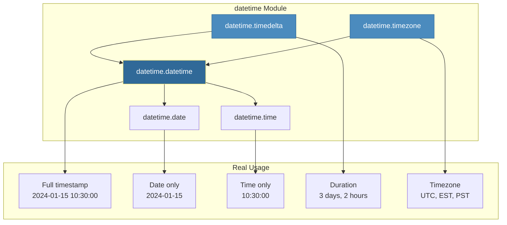
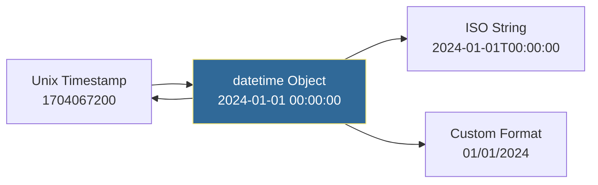

# Datetime Operations
*Handling Time in Automation Scripts*

Time handling is critical for DevOps—scheduling tasks, parsing logs, calculating durations, managing backups, and working across global time zones. Mastering datetime operations is essential for any production automation.

---

## 🎯 Learning Objectives

- Work with dates, times, and timestamps accurately
- Parse and format datetime strings for logs and APIs
- Calculate time differences and durations
- Handle time zones correctly (the #1 cause of production bugs)
- Convert between timestamps, datetime objects, and strings

---

## 📊 Datetime Module Components



---

## 📊 Timestamp Conversion Flow



---

## 📚 Core Concepts

### 1. Creating Datetime Objects

```python
from datetime import datetime, date, time, timedelta, timezone

# Current date and time
now = datetime.now()              # Local time
utc_now = datetime.utcnow()       # UTC (deprecated, use below)
utc_now = datetime.now(timezone.utc)  # Better: timezone-aware

# Current date only
today = date.today()

# Specific datetime
meeting = datetime(2026, 1, 15, 10, 30, 0)
print(meeting)  # 2026-01-15 10:30:00

# Date and time separately
birthday = date(1990, 5, 15)
alarm = time(7, 30, 0)       # 07:30:00

# Combine date and time
start_time = datetime.combine(birthday, alarm)
```

### 2. From Timestamps (Unix Epoch)

```python
from datetime import datetime, timezone

# Unix timestamp (seconds since Jan 1, 1970 UTC)
timestamp = 1704067200

# Convert to datetime
dt = datetime.fromtimestamp(timestamp)          # Local timezone
dt_utc = datetime.fromtimestamp(timestamp, tz=timezone.utc)  # UTC

# Get timestamp from datetime
now = datetime.now()
ts = now.timestamp()
print(f"Current timestamp: {ts}")  # 1704067200.123456

# Millisecond timestamps (common in APIs)
ms_timestamp = 1704067200000
dt = datetime.fromtimestamp(ms_timestamp / 1000)
```

### 3. Formatting Dates (to String)

```python
from datetime import datetime

now = datetime.now()

# strftime - "string format time"
formatted = now.strftime("%Y-%m-%d %H:%M:%S")
print(formatted)  # "2026-01-12 17:30:00"

# ISO format (standard for APIs and logs)
iso = now.isoformat()
print(iso)  # "2026-01-12T17:30:00.123456"

# Common formats for DevOps
log_format = now.strftime("%Y-%m-%d %H:%M:%S.%f")[:-3]  # 2026-01-12 17:30:00.123
file_safe = now.strftime("%Y%m%d_%H%M%S")               # 20260112_173000
human = now.strftime("%B %d, %Y at %I:%M %p")           # January 12, 2026 at 05:30 PM
aws_format = now.strftime("%Y-%m-%dT%H:%M:%SZ")         # 2026-01-12T17:30:00Z
```

### 4. Format Codes Reference

| Code | Meaning | Example |
|------|---------|---------|
| `%Y` | 4-digit year | 2026 |
| `%m` | Month (01-12) | 01 |
| `%d` | Day (01-31) | 12 |
| `%H` | Hour 24h (00-23) | 17 |
| `%I` | Hour 12h (01-12) | 05 |
| `%M` | Minute (00-59) | 30 |
| `%S` | Second (00-59) | 00 |
| `%f` | Microsecond | 123456 |
| `%p` | AM/PM | PM |
| `%j` | Day of year | 012 |
| `%W` | Week number | 02 |
| `%A` | Weekday name | Sunday |
| `%B` | Month name | January |
| `%Z` | Timezone name | UTC |
| `%z` | Timezone offset | +0000 |

### 5. Parsing Dates (from String)

```python
from datetime import datetime

# strptime - "string parse time"
date_str = "2026-01-12 17:30:00"
dt = datetime.strptime(date_str, "%Y-%m-%d %H:%M:%S")

# Parse ISO format
iso_str = "2026-01-12T17:30:00"
dt = datetime.fromisoformat(iso_str)

# Parse common log formats
apache_log = "12/Jan/2026:17:30:00 -0500"
dt = datetime.strptime(apache_log, "%d/%b/%Y:%H:%M:%S %z")

# Handle timestamps from APIs
api_response = "2026-01-12T17:30:00.123Z"  # ISO with Z suffix
dt = datetime.fromisoformat(api_response.replace("Z", "+00:00"))
```

### 6. Time Calculations with timedelta

```python
from datetime import datetime, timedelta

now = datetime.now()

# Add/subtract time
tomorrow = now + timedelta(days=1)
next_week = now + timedelta(weeks=1)
an_hour_ago = now - timedelta(hours=1)
in_90_mins = now + timedelta(minutes=90)
next_month = now + timedelta(days=30)

# Complex timedeltas
backup_retention = timedelta(days=7, hours=12)
meeting_duration = timedelta(hours=1, minutes=30)

# Calculate duration between datetimes
start = datetime(2026, 1, 1)
end = datetime(2026, 1, 15)
duration = end - start  # timedelta object

print(f"Days: {duration.days}")              # 14
print(f"Total seconds: {duration.total_seconds()}")  # 1209600.0
print(f"Total hours: {duration.total_seconds() / 3600}")  # 336.0
```

### 7. Timezone Handling (Critical for Production!)

```python
from datetime import datetime, timezone, timedelta

# Create timezone-aware datetime
utc_now = datetime.now(timezone.utc)
print(utc_now)  # 2026-01-12 22:30:00+00:00

# Define custom timezones
est = timezone(timedelta(hours=-5))
pst = timezone(timedelta(hours=-8))

# Convert between timezones
utc_time = datetime.now(timezone.utc)
est_time = utc_time.astimezone(est)
pst_time = utc_time.astimezone(pst)

print(f"UTC: {utc_time}")   # 2026-01-12 22:30:00+00:00
print(f"EST: {est_time}")   # 2026-01-12 17:30:00-05:00
print(f"PST: {pst_time}")   # 2026-01-12 14:30:00-08:00

# For real-world timezone handling, use pytz or zoneinfo (Python 3.9+)
from zoneinfo import ZoneInfo  # Python 3.9+

ny_tz = ZoneInfo("America/New_York")
tokyo_tz = ZoneInfo("Asia/Tokyo")

ny_time = datetime.now(ny_tz)
tokyo_time = ny_time.astimezone(tokyo_tz)
```

### 8. Comparing Datetimes

```python
from datetime import datetime, timezone, timedelta

# Compare datetimes
start = datetime(2026, 1, 1)
end = datetime(2026, 1, 15)
now = datetime.now()

if now > start:
    print("We're past the start date")

if start < now < end:
    print("We're in the date range")

# Check if datetime is within threshold
last_backup = datetime(2026, 1, 10)
threshold = timedelta(days=7)

if datetime.now() - last_backup > threshold:
    print("⚠️ Backup is too old!")
else:
    print("✅ Backup is recent")
```

---

## 🛠️ Hands-On Challenges

Master time-based automation by solving these professional DevOps challenges.

| Challenge | Description | Starter Code | Solution |
| :--- | :--- | :--- | :--- |
| **01. Backup Age Checker** | Parse backup date strings and flag items that exceed your retention policy. | [Link](./challenges/challenge_01_backup_check.py) | [Link](./challenges/solutions/solution_01_backup_check.py) |
| **02. Log Timestamp Parser** | Build a unified parser for different log formats (Apache, ISO, etc.). | [Link](./challenges/challenge_02_log_parser.py) | [Link](./challenges/solutions/solution_02_log_parser.py) |
| **03. SLA Metrics** | Calculate incident resolution durations and verify SLA compliance. | [Link](./challenges/challenge_03_sla_calculator.py) | [Link](./challenges/solutions/solution_03_sla_calculator.py) |
| **04. Maintenance Scheduler** | Implement logic to skip weekends when scheduling maintenance windows. | [Link](./challenges/challenge_04_scheduler.py) | [Link](./challenges/solutions/solution_04_scheduler.py) |

> **Pro Tip**: Always use `datetime.now(timezone.utc)` for comparisons to avoid "Naive Datetime" errors and timezone-related production bugs.

---

## 📖 Real-World Story: The Timezone Bug

**Scenario**: A global team's deployment automation would randomly fail. Sometimes deployments worked, sometimes they didn't—with no pattern.

**Problem**: The script used `datetime.now()` to compare against a maintenance window stored in UTC:

```python
# ❌ Bug: Comparing local time to UTC time
maintenance_start = datetime(2026, 1, 12, 2, 0, 0)  # Stored as UTC
if datetime.now() < maintenance_start:  # now() is local time!
    deploy()
```

For the UK team (UTC+0), it worked. For the US team (UTC-5), it failed because `now()` was 5 hours behind UTC.

**Solution**: Always use timezone-aware datetimes:

```python
from datetime import datetime, timezone

# ✅ Fixed: Both are UTC
maintenance_start = datetime(2026, 1, 12, 2, 0, 0, tzinfo=timezone.utc)
if datetime.now(timezone.utc) < maintenance_start:
    deploy()
```

**Outcome**: Zero timezone-related deployment failures since the fix.

---

## ❓ Interview Questions

1. **What's the difference between `datetime.now()` and `datetime.utcnow()`?**
   > `now()` returns local system time, `utcnow()` returns UTC time. However, both return "naive" (non-timezone-aware) objects. Best practice is `datetime.now(timezone.utc)` for timezone-aware UTC time.

2. **How do you parse a date string like "2026-01-12T17:30:00Z"?**
   > Replace the 'Z' with '+00:00' and use `fromisoformat()`: `datetime.fromisoformat("2026-01-12T17:30:00Z".replace("Z", "+00:00"))`. The 'Z' means UTC (Zulu time).

3. **What is a "naive" vs "aware" datetime object?**
   > "Naive" datetimes have no timezone info (`tzinfo=None`) and should be avoided in production. "Aware" datetimes include timezone information and can be safely compared and converted across timezones.

4. **How do you calculate the difference between two datetimes?**
   > Subtract them: `diff = end_time - start_time` returns a `timedelta` object. Use `diff.days`, `diff.seconds`, or `diff.total_seconds()` to get numeric values.

5. **What's the purpose of timedelta?**
   > `timedelta` represents a duration/difference between two dates. Use it for adding/subtracting time (`now + timedelta(days=7)`) and representing durations like "30 days" for comparisons.

6. **How do you handle timestamps in milliseconds (common in JavaScript/APIs)?**
   > Divide by 1000: `datetime.fromtimestamp(ms_timestamp / 1000)`. JavaScript's `Date.now()` returns milliseconds, while Python's `timestamp()` uses seconds.

---

## 🧠 Quiz

1. What method formats datetime to string?
   - a) `format()`
   - b) `strftime()` ✅
   - c) `to_string()`
   - d) `stringify()`

2. What represents duration between datetimes?
   - a) `duration`
   - b) `timedelta` ✅
   - c) `span`
   - d) `interval`

3. What does `%Y-%m-%d` format look like?
   - a) 26-01-12
   - b) 2026-01-12 ✅
   - c) 01/12/2026
   - d) Jan-12-2026

4. How do you get current UTC time (timezone-aware)?
   - a) `datetime.utcnow()`
   - b) `datetime.now(timezone.utc)` ✅
   - c) `datetime.now().utc()`
   - d) `datetime.utc()`

5. What does `datetime.fromisoformat()` parse?
   - a) Unix timestamp
   - b) ISO 8601 format string ✅
   - c) Any date string
   - d) JSON date

6. How do you add 7 days to a datetime?
   - a) `dt.add_days(7)`
   - b) `dt + timedelta(days=7)` ✅
   - c) `dt + 7`
   - d) `dt.plus(days=7)`

7. What's the format code for 12-hour time with AM/PM?
   - a) `%H:%M %p`
   - b) `%I:%M %p` ✅
   - c) `%T %p`
   - d) `%h:%m %a`

8. What does `strptime` stand for?
   - a) String print time
   - b) String parse time ✅
   - c) Standard parse time
   - d) System parse time

---

## 🔗 Related Topics

| Module | Relationship |
|--------|-------------|
| [Logging Basics](../14-Logging-Basics/README.md) | Timestamps in log messages |
| [Working with JSON](../06-Working-with-JSON/README.md) | Serialize/deserialize dates |
| [Regular Expressions](../13-Regular-Expressions/README.md) | Parse timestamps from logs |

---

**Next Step**: [Regular Expressions →](../13-Regular-Expressions/README.md)
