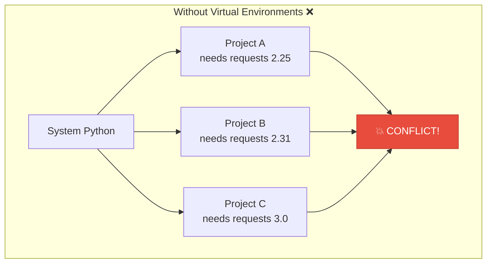
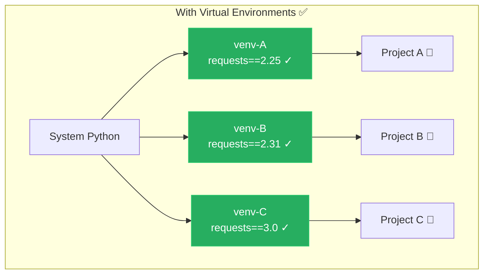
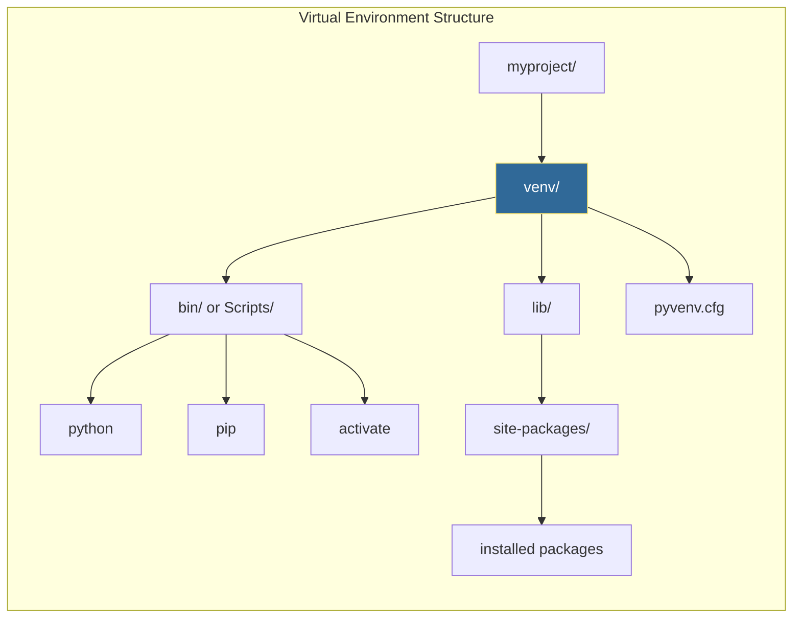

# Virtual Environments
*Isolating Python Dependencies*

Virtual environments prevent dependency conflicts between projects and ensure reproducible automation scripts. They're essential for any professional Python development and critical in DevOps where scripts run across different environments.

---

## 🎯 Learning Objectives

- Understand why dependency isolation is critical
- Create and manage virtual environments with `venv`
- Activate and deactivate environments across platforms
- Convert virtual environments for different deployment targets
- Apply best practices for Python project structure

---

## 📊 The Problem Virtual Environments Solve





---

## 📊 Virtual Environment Architecture



---

## 📚 Core Concepts

### 1. Creating Virtual Environments

```bash
# Create a virtual environment named "venv"
python -m venv venv

# Or with a descriptive name
python -m venv .venv          # Hidden directory (common convention)
python -m venv automation-env  # Descriptive name

# Create with specific Python version (if multiple installed)
python3.11 -m venv venv
py -3.11 -m venv venv  # Windows

# Create with pip already updated
python -m venv venv --upgrade-deps
```

### 2. Activating and Deactivating

```bash
# ========== Linux / macOS ==========
source venv/bin/activate

# Your prompt changes to show active environment:
# (venv) user@host:~/project$

# Deactivate when done
deactivate

# ========== Windows (cmd.exe) ==========
venv\Scripts\activate.bat

# ========== Windows (PowerShell) ==========
venv\Scripts\Activate.ps1

# If PowerShell blocks scripts, run first:
Set-ExecutionPolicy -ExecutionPolicy RemoteSigned -Scope CurrentUser

# ========== Windows (Git Bash) ==========
source venv/Scripts/activate
```

### 3. Installing Packages

```bash
# Activate first!
source venv/bin/activate

# Install packages
pip install requests
pip install pyyaml boto3 paramiko

# Install specific versions
pip install requests==2.31.0
pip install "boto3>=1.26,<1.28"

# Install from requirements file
pip install -r requirements.txt

# Upgrade a package
pip install --upgrade requests

# See what's installed
pip list
pip freeze
```

### 4. Requirements Files

```bash
# Generate requirements from current environment
pip freeze > requirements.txt

# requirements.txt example:
# boto3==1.26.137
# requests==2.31.0
# PyYAML==6.0.1

# Install from requirements
pip install -r requirements.txt
```

#### Production-Grade requirements.txt

```ini
# requirements.txt - Production dependencies

# Core automation libraries
requests==2.31.0
boto3==1.26.137
paramiko==3.4.0

# Configuration handling
PyYAML==6.0.1
python-dotenv==1.0.0

# CLI tools
click==8.1.7

# Pinned for security - last audited 2026-01-12
cryptography==42.0.0
```

#### Development requirements

```ini
# requirements-dev.txt

-r requirements.txt

# Testing
pytest==8.0.0
pytest-cov==4.1.0
responses==0.24.0

# Code quality
black==24.1.0
flake8==7.0.0
mypy==1.8.0

# Documentation
mkdocs==1.5.3
```

### 5. Creating Environments Programmatically

```python
import venv
import subprocess
import sys
from pathlib import Path

def create_project_environment(project_path, requirements_file=None):
    """Create and configure a virtual environment for a project."""
    
    project = Path(project_path)
    venv_path = project / "venv"
    
    # Create the virtual environment
    print(f"Creating virtual environment at {venv_path}")
    venv.create(venv_path, with_pip=True)
    
    # Determine pip path based on OS
    if sys.platform == "win32":
        pip_path = venv_path / "Scripts" / "pip.exe"
    else:
        pip_path = venv_path / "bin" / "pip"
    
    # Upgrade pip
    print("Upgrading pip...")
    subprocess.run([str(pip_path), "install", "--upgrade", "pip"], check=True)
    
    # Install requirements if provided
    if requirements_file and Path(requirements_file).exists():
        print(f"Installing requirements from {requirements_file}")
        subprocess.run(
            [str(pip_path), "install", "-r", str(requirements_file)],
            check=True
        )
    
    print(f"✅ Environment ready at {venv_path}")
    return venv_path

# Usage
create_project_environment("./my-automation", "requirements.txt")
```

### 6. Virtual Environment Best Practices

```python
# Project structure
"""
my-automation/
├── .venv/                # Virtual environment (gitignored)
├── requirements.txt       # Production dependencies
├── requirements-dev.txt   # Development dependencies
├── src/
│   └── automation/
│       ├── __init__.py
│       └── main.py
├── tests/
│   └── test_main.py
├── .gitignore
└── README.md
"""
```

#### Essential .gitignore entries

```ini
# .gitignore

# Virtual environments - NEVER commit these!
venv/
.venv/
env/
.env/
ENV/

# Python cache
__pycache__/
*.py[cod]
*$py.class
.pytest_cache/

# Distribution
dist/
build/
*.egg-info/

# IDE
.vscode/
.idea/
*.swp
```

---

## 🔄 Common Workflows

### Setting Up a New Project

```bash
# 1. Create project directory
mkdir my-automation && cd my-automation

# 2. Create virtual environment
python -m venv .venv

# 3. Activate
source .venv/bin/activate  # Linux/Mac
# or: .venv\Scripts\activate  # Windows

# 4. Upgrade pip
pip install --upgrade pip

# 5. Install dependencies
pip install requests pyyaml boto3

# 6. Save requirements
pip freeze > requirements.txt

# 7. Initialize git (ignore venv!)
git init
echo ".venv/" >> .gitignore
git add .
git commit -m "Initial project setup"
```

### Cloning an Existing Project

```bash
# 1. Clone repository
git clone https://github.com/org/automation-project.git
cd automation-project

# 2. Create virtual environment
python -m venv .venv

# 3. Activate
source .venv/bin/activate

# 4. Install dependencies
pip install -r requirements.txt

# 5. (If developing) Install dev dependencies
pip install -r requirements-dev.txt

# 6. Ready to work!
python src/main.py
```

---

## 🛠️ Hands-On Challenges

### Challenge 1: Project Setup Script

```python
"""Create a complete project setup automation script.

TODO: Implement a script that:
1. Creates project directory structure
2. Creates virtual environment
3. Installs default packages
4. Generates requirements.txt
5. Creates .gitignore
6. Prints activation instructions
"""

def setup_project(project_name, default_packages=None):
    pass
```

<details>
<summary>💡 Solution</summary>

```python
import subprocess
import sys
import venv
from pathlib import Path

def setup_project(project_name, default_packages=None):
    """Set up a complete Python project with virtual environment."""
    
    if default_packages is None:
        default_packages = ["requests", "pyyaml", "python-dotenv"]
    
    project = Path(project_name)
    
    # Create directory structure
    print(f"📁 Creating project: {project_name}")
    (project / "src" / project_name.replace("-", "_")).mkdir(parents=True, exist_ok=True)
    (project / "tests").mkdir(exist_ok=True)
    (project / "docs").mkdir(exist_ok=True)
    
    # Create __init__.py
    (project / "src" / project_name.replace("-", "_") / "__init__.py").touch()
    
    # Create virtual environment
    venv_path = project / ".venv"
    print(f"🐍 Creating virtual environment...")
    venv.create(venv_path, with_pip=True)
    
    # Determine paths
    if sys.platform == "win32":
        pip = venv_path / "Scripts" / "pip.exe"
        activate_cmd = f".venv\\Scripts\\activate"
    else:
        pip = venv_path / "bin" / "pip"
        activate_cmd = "source .venv/bin/activate"
    
    # Upgrade pip
    subprocess.run([str(pip), "install", "--upgrade", "pip"], 
                   capture_output=True, check=True)
    
    # Install packages
    if default_packages:
        print(f"📦 Installing: {', '.join(default_packages)}")
        subprocess.run([str(pip), "install"] + default_packages, check=True)
    
    # Generate requirements.txt
    result = subprocess.run([str(pip), "freeze"], capture_output=True, text=True)
    (project / "requirements.txt").write_text(result.stdout)
    
    # Create .gitignore
    gitignore_content = """.venv/
__pycache__/
*.py[cod]
.pytest_cache/
.env
*.log
"""
    (project / ".gitignore").write_text(gitignore_content)
    
    # Create README
    readme_content = f"""# {project_name}

## Setup

```bash
cd {project_name}
python -m venv .venv
{activate_cmd}
pip install -r requirements.txt
```
"""
    (project / "README.md").write_text(readme_content)
    
    print(f"""
✅ Project created successfully!

📂 {project_name}/
├── .venv/           (virtual environment)
├── src/             (source code)
├── tests/           (test files)
├── docs/            (documentation)
├── requirements.txt
├── .gitignore
└── README.md

🚀 To get started:
   cd {project_name}
   {activate_cmd}
""")

# Usage
setup_project("my-automation", ["requests", "boto3", "click"])
```
</details>

### Challenge 2: Environment Validator

```python
"""Validate that an environment matches requirements.

TODO: Create a function that:
1. Checks if virtual environment is active
2. Verifies all required packages are installed
3. Checks for version mismatches
4. Reports any issues found
"""

def validate_environment(requirements_file):
    pass
```

<details>
<summary>💡 Solution</summary>

```python
import subprocess
import sys
from pathlib import Path

def validate_environment(requirements_file):
    """Validate current environment against requirements file."""
    
    report = {
        "is_venv": False,
        "missing": [],
        "wrong_version": [],
        "extra": [],
        "valid": True
    }
    
    # Check if we're in a virtual environment
    if sys.prefix != sys.base_prefix:
        report["is_venv"] = True
        print("✅ Running in virtual environment")
    else:
        print("⚠️ WARNING: Not in a virtual environment!")
        report["valid"] = False
    
    # Get installed packages
    result = subprocess.run(
        [sys.executable, "-m", "pip", "freeze"],
        capture_output=True, text=True
    )
    installed = {}
    for line in result.stdout.strip().split('\n'):
        if '==' in line:
            name, version = line.split('==')
            installed[name.lower()] = version
    
    # Read requirements
    requirements = {}
    req_path = Path(requirements_file)
    if not req_path.exists():
        print(f"❌ Requirements file not found: {requirements_file}")
        return report
    
    for line in req_path.read_text().splitlines():
        line = line.strip()
        if line and not line.startswith('#') and not line.startswith('-'):
            if '==' in line:
                name, version = line.split('==')
                requirements[name.lower()] = version
            elif '>=' in line or '<=' in line:
                name = line.split('>=')[0].split('<=')[0].strip()
                requirements[name.lower()] = None  # Any version
            else:
                requirements[line.lower()] = None
    
    # Check for missing packages
    for pkg, required_version in requirements.items():
        if pkg not in installed:
            report["missing"].append(pkg)
            report["valid"] = False
            print(f"❌ Missing: {pkg}")
        elif required_version and installed[pkg] != required_version:
            report["wrong_version"].append({
                "package": pkg,
                "required": required_version,
                "installed": installed[pkg]
            })
            report["valid"] = False
            print(f"⚠️ Version mismatch: {pkg} "
                  f"(need {required_version}, have {installed[pkg]})")
        else:
            print(f"✅ {pkg} == {installed[pkg]}")
    
    # Summary
    if report["valid"]:
        print("\n🎉 Environment is valid!")
    else:
        print("\n❌ Environment has issues. Run: pip install -r requirements.txt")
    
    return report

# Usage
validate_environment("requirements.txt")
```
</details>

### Challenge 3: Multi-Environment Manager

```python
"""Manage multiple virtual environments for different purposes.

TODO: Create a class that:
1. Creates envs for dev, test, production
2. Each with appropriate dependencies
3. Can switch between them
4. Generates appropriate requirements files
"""

class EnvironmentManager:
    pass
```

<details>
<summary>💡 Solution</summary>

```python
import subprocess
import sys
import venv
from pathlib import Path

class EnvironmentManager:
    """Manage multiple virtual environments for a project."""
    
    ENV_CONFIGS = {
        "dev": {
            "description": "Development environment with all tools",
            "packages": ["pytest", "black", "flake8", "mypy", "ipython"],
            "includes": ["base"]
        },
        "test": {
            "description": "Testing environment",
            "packages": ["pytest", "pytest-cov", "responses"],
            "includes": ["base"]
        },
        "prod": {
            "description": "Production - minimal dependencies",
            "packages": [],
            "includes": ["base"]
        },
        "base": {
            "description": "Core dependencies",
            "packages": ["requests", "pyyaml", "boto3"],
            "includes": []
        }
    }
    
    def __init__(self, project_path="."):
        self.project = Path(project_path)
        self.envs_dir = self.project / ".envs"
        self.envs_dir.mkdir(exist_ok=True)
    
    def _get_pip(self, env_name):
        venv_path = self.envs_dir / env_name
        if sys.platform == "win32":
            return venv_path / "Scripts" / "pip.exe"
        return venv_path / "bin" / "pip"
    
    def _collect_packages(self, env_name):
        """Collect all packages including from 'includes'."""
        config = self.ENV_CONFIGS[env_name]
        packages = list(config["packages"])
        
        for include in config.get("includes", []):
            packages.extend(self._collect_packages(include))
        
        return list(set(packages))
    
    def create(self, env_name):
        """Create a specific environment."""
        if env_name not in self.ENV_CONFIGS:
            raise ValueError(f"Unknown environment: {env_name}")
        
        venv_path = self.envs_dir / env_name
        config = self.ENV_CONFIGS[env_name]
        
        print(f"\n🔧 Creating '{env_name}' environment")
        print(f"   {config['description']}")
        
        # Create venv
        venv.create(venv_path, with_pip=True, clear=True)
        
        # Collect and install packages
        packages = self._collect_packages(env_name)
        pip = self._get_pip(env_name)
        
        subprocess.run([str(pip), "install", "--upgrade", "pip"], 
                       capture_output=True)
        
        if packages:
            print(f"   Installing: {', '.join(packages)}")
            subprocess.run([str(pip), "install"] + packages, check=True)
        
        # Generate requirements file
        result = subprocess.run([str(pip), "freeze"], 
                               capture_output=True, text=True)
        req_file = self.project / f"requirements-{env_name}.txt"
        req_file.write_text(result.stdout)
        
        print(f"✅ Created {env_name} environment")
        print(f"   Requirements: {req_file}")
        
        return venv_path
    
    def create_all(self):
        """Create all environments."""
        for env_name in ["base", "dev", "test", "prod"]:
            if env_name in self.ENV_CONFIGS:
                self.create(env_name)
    
    def get_activate_command(self, env_name):
        """Get activation command for an environment."""
        venv_path = self.envs_dir / env_name
        if sys.platform == "win32":
            return f"{venv_path}\\Scripts\\activate"
        return f"source {venv_path}/bin/activate"
    
    def list_envs(self):
        """List all available environments."""
        print("\n📦 Available Environments:\n")
        for name, config in self.ENV_CONFIGS.items():
            venv_path = self.envs_dir / name
            status = "✅" if venv_path.exists() else "❌"
            print(f"  {status} {name}: {config['description']}")
            if venv_path.exists():
                print(f"      Activate: {self.get_activate_command(name)}")
        print()

# Usage
manager = EnvironmentManager()
manager.create_all()
manager.list_envs()
```
</details>

---

## 📖 Real-World Story: The Dependency Nightmare

**Scenario**: A team's automation scripts worked on developers' laptops but failed in production. Every deployment was a game of "fix the import error."

**Problem**: No virtual environments. Developers had different package versions, and production had packages from unrelated projects.

```python
# Developer A's laptop
requests==2.28.0  # Works

# Developer B's laptop  
requests==2.31.0  # Different behavior

# Production server
requests==2.25.1  # Oldest, missing features
# Plus 50 other packages from other projects
```

**Solution**: 
1. Created virtual environment for each project
2. Pinned all dependencies in `requirements.txt`
3. CI/CD creates fresh venv for every build
4. Production runs in Docker with exact same packages

```bash
# Now in every project:
python -m venv .venv
source .venv/bin/activate
pip install -r requirements.txt
# Guaranteed consistent!
```

**Outcome**: Zero dependency-related production failures, deployments are reproducible.

---

## ❓ Interview Questions

1. **Why use virtual environments instead of installing packages globally?**
   > Global installations cause version conflicts between projects. Project A might need `requests==2.25` while Project B needs `requests==2.31`. Virtual environments isolate each project's dependencies.

2. **What files should be in .gitignore for Python projects?**
   > Virtual environment folders (`venv/`, `.venv/`), `__pycache__/`, `*.pyc`, `.pytest_cache/`, `dist/`, `build/`, `*.egg-info/`. Never commit venv—recreate from requirements.txt.

3. **What's the difference between `pip freeze` and `pip list`?**
   > `pip list` shows installed packages in a readable table. `pip freeze` outputs in requirements.txt format (`package==version`) suitable for saving to a file.

4. **How do you ensure reproducible environments across machines?**
   > Use `pip freeze > requirements.txt` to pin exact versions. In CI/CD, always create a fresh venv and install from requirements. Consider `pip-tools` for dependency locking.

5. **What are requirements-dev.txt files for?**
   > Development-only dependencies (pytest, black, mypy) separate from production. Production only needs runtime dependencies, reducing attack surface and image size.

6. **How do you activate a virtual environment in a shell script or CI?**
   > Source the activate script: `source venv/bin/activate`. In CI, you can also just use the full path to python: `./venv/bin/python script.py`.

---

## 🧠 Quiz

1. Why use virtual environments?
   - a) Faster Python
   - b) Dependency isolation ✅
   - c) Security
   - d) Code organization

2. Which folder should be gitignored?
   - a) `src/`
   - b) `venv/` ✅
   - c) `lib/`
   - d) `tests/`

3. What command activates a venv on Linux/Mac?
   - a) `venv/activate`
   - b) `source venv/bin/activate` ✅
   - c) `./venv activate`
   - d) `python -m activate venv`

4. How do you save installed packages?
   - a) `pip save > packages.txt`
   - b) `pip freeze > requirements.txt` ✅
   - c) `pip export packages.txt`
   - d) `pip list > requirements.txt`

5. What creates a virtual environment?
   - a) `python create-venv`
   - b) `python -m venv venv` ✅
   - c) `pip create venv`
   - d) `virtualenv create`

6. What deactivates the current virtual environment?
   - a) `exit`
   - b) `deactivate` ✅
   - c) `source deactivate`
   - d) `python -m venv --deactivate`

7. What flag installs packages from a file?
   - a) `pip install --file`
   - b) `pip install -r` ✅
   - c) `pip install --requirements`
   - d) `pip install -f`

8. Where are packages installed in a venv?
   - a) System Python's site-packages
   - b) venv/lib/python3.x/site-packages ✅
   - c) Project root
   - d) ~/.pip/packages

---

## 🔗 Related Topics

| Module | Relationship |
|--------|-------------|
| [Package Management](../16-Package-Management/README.md) | Managing pip and packages |
| [First Automation Script](../17-First-Automation-Script/README.md) | Using venv in real projects |
| [Subprocess Module](../10-Subprocess-Module/README.md) | Running pip commands programmatically |

---

**Next Step**: [Package Management →](../16-Package-Management/README.md)
