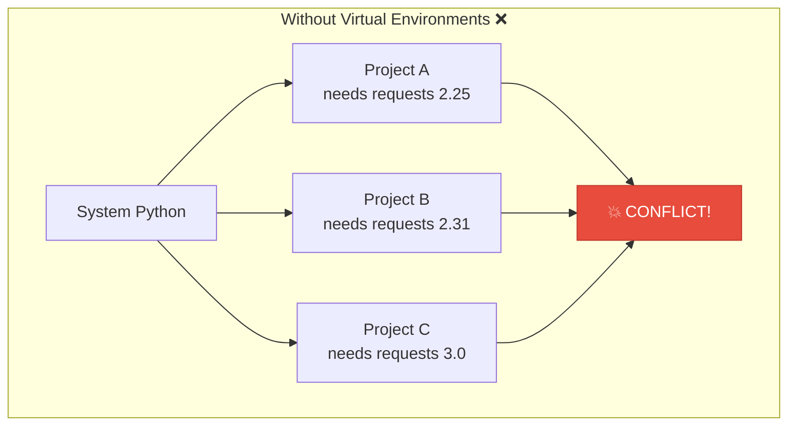
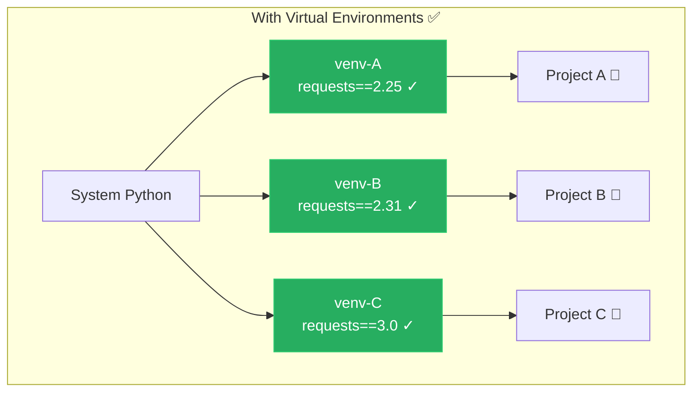
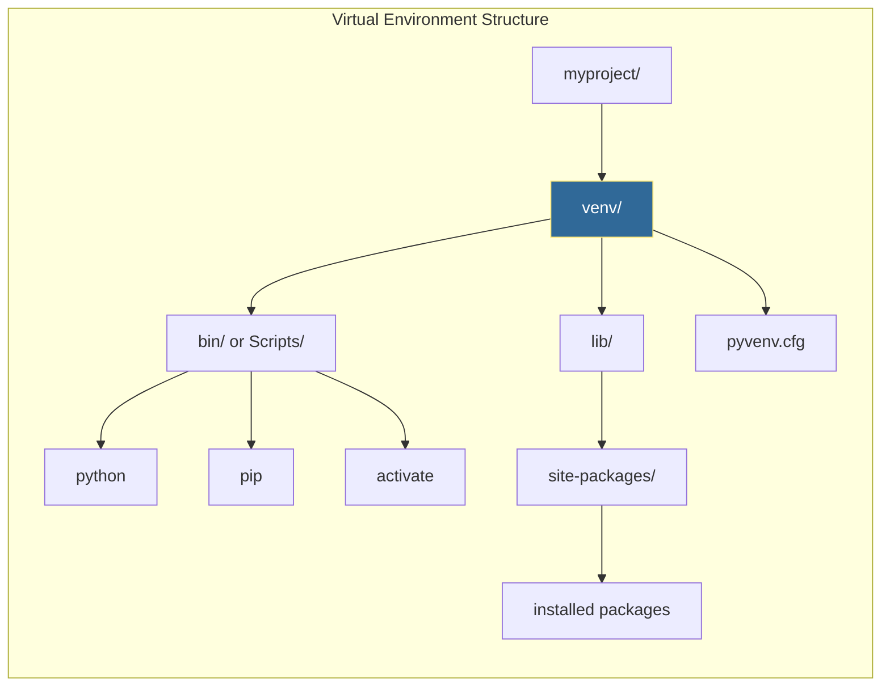

# Virtual Environments
*Isolating Python Dependencies*

Virtual environments prevent dependency conflicts between projects and ensure reproducible automation scripts. They're essential for any professional Python development and critical in DevOps where scripts run across different environments.

---

## 🎯 Learning Objectives

- Understand why dependency isolation is critical
- Create and manage virtual environments with `venv`
- Activate and deactivate environments across platforms
- Convert virtual environments for different deployment targets
- Apply best practices for Python project structure

---

## 📊 The Problem Virtual Environments Solve





---

## 📊 Virtual Environment Architecture



---

## 📚 Core Concepts

### 1. Creating Virtual Environments

```bash
# Create a virtual environment named "venv"
python -m venv venv

# Or with a descriptive name
python -m venv .venv          # Hidden directory (common convention)
python -m venv automation-env  # Descriptive name

# Create with specific Python version (if multiple installed)
python3.11 -m venv venv
py -3.11 -m venv venv  # Windows

# Create with pip already updated
python -m venv venv --upgrade-deps
```

### 2. Activating and Deactivating

```bash
# ========== Linux / macOS ==========
source venv/bin/activate

# Your prompt changes to show active environment:
# (venv) user@host:~/project$

# Deactivate when done
deactivate

# ========== Windows (cmd.exe) ==========
venv\Scripts\activate.bat

# ========== Windows (PowerShell) ==========
venv\Scripts\Activate.ps1

# If PowerShell blocks scripts, run first:
Set-ExecutionPolicy -ExecutionPolicy RemoteSigned -Scope CurrentUser

# ========== Windows (Git Bash) ==========
source venv/Scripts/activate
```

### 3. Installing Packages

```bash
# Activate first!
source venv/bin/activate

# Install packages
pip install requests
pip install pyyaml boto3 paramiko

# Install specific versions
pip install requests==2.31.0
pip install "boto3>=1.26,<1.28"

# Install from requirements file
pip install -r requirements.txt

# Upgrade a package
pip install --upgrade requests

# See what's installed
pip list
pip freeze
```

### 4. Requirements Files

```bash
# Generate requirements from current environment
pip freeze > requirements.txt

# requirements.txt example:
# boto3==1.26.137
# requests==2.31.0
# PyYAML==6.0.1

# Install from requirements
pip install -r requirements.txt
```

#### Production-Grade requirements.txt

```ini
# requirements.txt - Production dependencies

# Core automation libraries
requests==2.31.0
boto3==1.26.137
paramiko==3.4.0

# Configuration handling
PyYAML==6.0.1
python-dotenv==1.0.0

# CLI tools
click==8.1.7

# Pinned for security - last audited 2026-01-12
cryptography==42.0.0
```

#### Development requirements

```ini
# requirements-dev.txt

-r requirements.txt

# Testing
pytest==8.0.0
pytest-cov==4.1.0
responses==0.24.0

# Code quality
black==24.1.0
flake8==7.0.0
mypy==1.8.0

# Documentation
mkdocs==1.5.3
```

### 5. Creating Environments Programmatically

```python
import venv
import subprocess
import sys
from pathlib import Path

def create_project_environment(project_path, requirements_file=None):
    """Create and configure a virtual environment for a project."""
    
    project = Path(project_path)
    venv_path = project / "venv"
    
    # Create the virtual environment
    print(f"Creating virtual environment at {venv_path}")
    venv.create(venv_path, with_pip=True)
    
    # Determine pip path based on OS
    if sys.platform == "win32":
        pip_path = venv_path / "Scripts" / "pip.exe"
    else:
        pip_path = venv_path / "bin" / "pip"
    
    # Upgrade pip
    print("Upgrading pip...")
    subprocess.run([str(pip_path), "install", "--upgrade", "pip"], check=True)
    
    # Install requirements if provided
    if requirements_file and Path(requirements_file).exists():
        print(f"Installing requirements from {requirements_file}")
        subprocess.run(
            [str(pip_path), "install", "-r", str(requirements_file)],
            check=True
        )
    
    print(f"✅ Environment ready at {venv_path}")
    return venv_path

# Usage
create_project_environment("./my-automation", "requirements.txt")
```

### 6. Virtual Environment Best Practices

```python
# Project structure
"""
my-automation/
├── .venv/                # Virtual environment (gitignored)
├── requirements.txt       # Production dependencies
├── requirements-dev.txt   # Development dependencies
├── src/
│   └── automation/
│       ├── __init__.py
│       └── main.py
├── tests/
│   └── test_main.py
├── .gitignore
└── README.md
"""
```

#### Essential .gitignore entries

```ini
# .gitignore

# Virtual environments - NEVER commit these!
venv/
.venv/
env/
.env/
ENV/

# Python cache
__pycache__/
*.py[cod]
*$py.class
.pytest_cache/

# Distribution
dist/
build/
*.egg-info/

# IDE
.vscode/
.idea/
*.swp
```

---

## 🔄 Common Workflows

### Setting Up a New Project

```bash
# 1. Create project directory
mkdir my-automation && cd my-automation

# 2. Create virtual environment
python -m venv .venv

# 3. Activate
source .venv/bin/activate  # Linux/Mac
# or: .venv\Scripts\activate  # Windows

# 4. Upgrade pip
pip install --upgrade pip

# 5. Install dependencies
pip install requests pyyaml boto3

# 6. Save requirements
pip freeze > requirements.txt

# 7. Initialize git (ignore venv!)
git init
echo ".venv/" >> .gitignore
git add .
git commit -m "Initial project setup"
```

### Cloning an Existing Project

```bash
# 1. Clone repository
git clone https://github.com/org/automation-project.git
cd automation-project

# 2. Create virtual environment
python -m venv .venv

# 3. Activate
source .venv/bin/activate

# 4. Install dependencies
pip install -r requirements.txt

# 5. (If developing) Install dev dependencies
pip install -r requirements-dev.txt

# 6. Ready to work!
python src/main.py
```

---

## 🛠️ Hands-On Challenges

Master dependency management by building these essential isolation tools.

| Challenge | Description | Starter Code | Solution |
| :--- | :--- | :--- | :--- |
| **01. Project Setup Script** | Create an automation tool that initializes a project, venv, and basic file structure. | [Link](./challenges/challenge_01_venv_creator.py) | [Link](./challenges/solutions/solution_01_venv_creator.py) |
| **02. Requirements Checker** | Build a validator that compares installed environment packages against a `requirements.txt`. | [Link](./challenges/challenge_02_req_checker.py) | [Link](./challenges/solutions/solution_02_req_checker.py) |
| **03. Portable Setup Gen** | Generate cross-platform (`.sh` and `.bat`) scripts for one-click environment setup. | [Link](./challenges/challenge_03_portable_setup.py) | [Link](./challenges/solutions/solution_03_portable_setup.py) |
| **04. Isolated Runner** | Execute Python scripts inside a specific virtual environment dynamically without activation. | [Link](./challenges/challenge_04_isolated_task.py) | [Link](./challenges/solutions/solution_04_isolated_task.py) |

> **Pro Tip**: Use `python -m venv .venv --upgrade-deps` when creating new environments to automatically get the latest versions of `pip` and `setuptools`.

---

## 📖 Real-World Story: The Dependency Nightmare

**Scenario**: A team's automation scripts worked on developers' laptops but failed in production. Every deployment was a game of "fix the import error."

**Problem**: No virtual environments. Developers had different package versions, and production had packages from unrelated projects.

```python
# Developer A's laptop
requests==2.28.0  # Works

# Developer B's laptop  
requests==2.31.0  # Different behavior

# Production server
requests==2.25.1  # Oldest, missing features
# Plus 50 other packages from other projects
```

**Solution**: 
1. Created virtual environment for each project
2. Pinned all dependencies in `requirements.txt`
3. CI/CD creates fresh venv for every build
4. Production runs in Docker with exact same packages

```bash
# Now in every project:
python -m venv .venv
source .venv/bin/activate
pip install -r requirements.txt
# Guaranteed consistent!
```

**Outcome**: Zero dependency-related production failures, deployments are reproducible.

---

## ❓ Interview Questions

1. **Why use virtual environments instead of installing packages globally?**
   > Global installations cause version conflicts between projects. Project A might need `requests==2.25` while Project B needs `requests==2.31`. Virtual environments isolate each project's dependencies.

2. **What files should be in .gitignore for Python projects?**
   > Virtual environment folders (`venv/`, `.venv/`), `__pycache__/`, `*.pyc`, `.pytest_cache/`, `dist/`, `build/`, `*.egg-info/`. Never commit venv—recreate from requirements.txt.

3. **What's the difference between `pip freeze` and `pip list`?**
   > `pip list` shows installed packages in a readable table. `pip freeze` outputs in requirements.txt format (`package==version`) suitable for saving to a file.

4. **How do you ensure reproducible environments across machines?**
   > Use `pip freeze > requirements.txt` to pin exact versions. In CI/CD, always create a fresh venv and install from requirements. Consider `pip-tools` for dependency locking.

5. **What are requirements-dev.txt files for?**
   > Development-only dependencies (pytest, black, mypy) separate from production. Production only needs runtime dependencies, reducing attack surface and image size.

6. **How do you activate a virtual environment in a shell script or CI?**
   > Source the activate script: `source venv/bin/activate`. In CI, you can also just use the full path to python: `./venv/bin/python script.py`.

---

## 🧠 Quiz

1. Why use virtual environments?
   - a) Faster Python
   - b) Dependency isolation ✅
   - c) Security
   - d) Code organization

2. Which folder should be gitignored?
   - a) `src/`
   - b) `venv/` ✅
   - c) `lib/`
   - d) `tests/`

3. What command activates a venv on Linux/Mac?
   - a) `venv/activate`
   - b) `source venv/bin/activate` ✅
   - c) `./venv activate`
   - d) `python -m activate venv`

4. How do you save installed packages?
   - a) `pip save > packages.txt`
   - b) `pip freeze > requirements.txt` ✅
   - c) `pip export packages.txt`
   - d) `pip list > requirements.txt`

5. What creates a virtual environment?
   - a) `python create-venv`
   - b) `python -m venv venv` ✅
   - c) `pip create venv`
   - d) `virtualenv create`

6. What deactivates the current virtual environment?
   - a) `exit`
   - b) `deactivate` ✅
   - c) `source deactivate`
   - d) `python -m venv --deactivate`

7. What flag installs packages from a file?
   - a) `pip install --file`
   - b) `pip install -r` ✅
   - c) `pip install --requirements`
   - d) `pip install -f`

8. Where are packages installed in a venv?
   - a) System Python's site-packages
   - b) venv/lib/python3.x/site-packages ✅
   - c) Project root
   - d) ~/.pip/packages

---

## 🔗 Related Topics

| Module | Relationship |
|--------|-------------|
| [Package Management](../16-Package-Management/README.md) | Managing pip and packages |
| [First Automation Script](../17-First-Automation-Script/README.md) | Using venv in real projects |
| [Subprocess Module](../../../../../../README.md) | Running pip commands programmatically |

---

**Next Step**: [Package Management →](../16-Package-Management/README.md)
