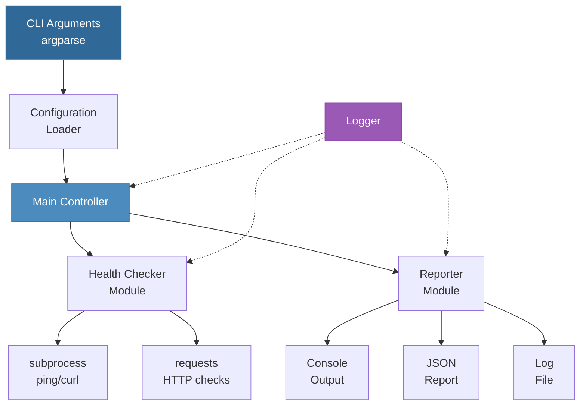
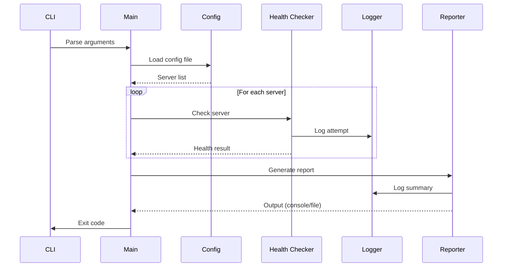

# First Automation Script
*Building a Complete DevOps Automation Tool*

This capstone module brings together everything you've learned to build a real-world automation script. You'll create a production-ready Server Health Monitor that demonstrates professional Python practices.

---

## 🎯 Learning Objectives

- Apply all Python basics in one comprehensive project
- Build a production-ready automation tool with proper structure
- Implement CLI argument parsing, logging, and error handling
- Work with configuration files, JSON output, and reporting
- Follow DevOps best practices for script development

---

## 📊 Script Architecture



---

## 📊 Execution Flow



---

## 📚 Complete Example: Server Health Monitor

### Project Structure

```
server-health-monitor/
├── .venv/                    # Virtual environment
├── config/
│   ├── servers.json          # Server configuration
│   └── servers.example.json  # Example config
├── logs/                     # Log output directory
├── reports/                  # Generated reports
├── src/
│   ├── __init__.py
│   ├── main.py              # Entry point
│   ├── config.py            # Configuration loader
│   ├── checker.py           # Health check logic
│   ├── reporter.py          # Report generation
│   └── utils.py             # Utility functions
├── tests/
│   └── test_checker.py
├── requirements.txt
├── .gitignore
└── README.md
```

### 1. Main Entry Point (`src/main.py`)

```python
#!/usr/bin/env python3
"""
Server Health Monitor - A production-ready automation example.

This script checks the health of multiple servers and generates reports.
Demonstrates: argparse, logging, config handling, subprocess, JSON, pathlib
"""

import argparse
import sys
import logging
from pathlib import Path
from datetime import datetime

from config import load_config
from checker import HealthChecker
from reporter import generate_report, save_report


def setup_logging(verbose: bool = False, log_file: Path = None):
    """Configure logging with console and optional file output."""
    level = logging.DEBUG if verbose else logging.INFO
    
    # Create formatter
    formatter = logging.Formatter(
        "%(asctime)s | %(levelname)-8s | %(message)s",
        datefmt="%Y-%m-%d %H:%M:%S"
    )
    
    # Root logger
    logger = logging.getLogger()
    logger.setLevel(logging.DEBUG)
    
    # Console handler
    console = logging.StreamHandler()
    console.setLevel(level)
    console.setFormatter(formatter)
    logger.addHandler(console)
    
    # File handler
    if log_file:
        log_file.parent.mkdir(parents=True, exist_ok=True)
        file_handler = logging.FileHandler(log_file)
        file_handler.setLevel(logging.DEBUG)
        file_handler.setFormatter(formatter)
        logger.addHandler(file_handler)
    
    return logger


def parse_args():
    """Parse command-line arguments."""
    parser = argparse.ArgumentParser(
        description="Server Health Monitor - Check health of multiple servers",
        formatter_class=argparse.RawDescriptionHelpFormatter,
        epilog="""
Examples:
  %(prog)s                              # Use default config
  %(prog)s -c custom-servers.json       # Custom config file
  %(prog)s -o report.json -v            # Save report, verbose mode
  %(prog)s --timeout 10 --parallel      # 10s timeout, parallel checks
        """
    )
    
    parser.add_argument(
        "-c", "--config",
        type=Path,
        default=Path("config/servers.json"),
        help="Path to server configuration file (default: config/servers.json)"
    )
    
    parser.add_argument(
        "-o", "--output",
        type=Path,
        help="Save JSON report to file"
    )
    
    parser.add_argument(
        "-l", "--log-file",
        type=Path,
        default=Path("logs/health-check.log"),
        help="Log file path (default: logs/health-check.log)"
    )
    
    parser.add_argument(
        "-t", "--timeout",
        type=int,
        default=5,
        help="Timeout in seconds for each check (default: 5)"
    )
    
    parser.add_argument(
        "-v", "--verbose",
        action="store_true",
        help="Enable verbose/debug output"
    )
    
    parser.add_argument(
        "--no-color",
        action="store_true",
        help="Disable colored output"
    )
    
    parser.add_argument(
        "--json",
        action="store_true",
        help="Output results as JSON to console"
    )
    
    return parser.parse_args()


def main():
    """Main entry point."""
    args = parse_args()
    
    # Setup logging
    logger = setup_logging(
        verbose=args.verbose,
        log_file=args.log_file
    )
    
    logger.info("=" * 60)
    logger.info("Server Health Monitor starting")
    logger.info("=" * 60)
    
    # Load configuration
    logger.info(f"Loading config from: {args.config}")
    config = load_config(args.config)
    
    if not config:
        logger.error("Failed to load configuration")
        return 1
    
    servers = config.get("servers", [])
    if not servers:
        logger.error("No servers defined in configuration")
        return 1
    
    logger.info(f"Found {len(servers)} servers to check")
    
    # Initialize checker
    checker = HealthChecker(timeout=args.timeout)
    
    # Check all servers
    results = []
    for i, server in enumerate(servers, 1):
        logger.info(f"[{i}/{len(servers)}] Checking: {server['name']}")
        result = checker.check(server)
        results.append(result)
        
        status_icon = "✅" if result["healthy"] else "❌"
        logger.info(f"  {status_icon} Status: {result['status']}")
        
        if result.get("latency_ms"):
            logger.debug(f"  Latency: {result['latency_ms']:.1f}ms")
    
    # Generate report
    report = generate_report(results, config)
    
    # Output
    if args.json:
        import json
        print(json.dumps(report, indent=2))
    else:
        print_summary(report, use_color=not args.no_color)
    
    # Save report if requested
    if args.output:
        save_report(report, args.output)
        logger.info(f"Report saved to: {args.output}")
    
    # Log summary
    logger.info("-" * 60)
    logger.info(f"Check complete: {report['summary']['healthy']}/{report['summary']['total']} healthy")
    
    # Return exit code based on health status
    if report["summary"]["healthy"] == report["summary"]["total"]:
        return 0  # All healthy
    elif report["summary"]["healthy"] > 0:
        return 1  # Some unhealthy
    else:
        return 2  # All unhealthy


def print_summary(report, use_color=True):
    """Print a formatted summary to console."""
    
    # Color codes
    if use_color:
        GREEN = "\033[92m"
        RED = "\033[91m"
        YELLOW = "\033[93m"
        RESET = "\033[0m"
        BOLD = "\033[1m"
    else:
        GREEN = RED = YELLOW = RESET = BOLD = ""
    
    print(f"\n{BOLD}========== Health Check Summary =========={RESET}\n")
    
    for result in report["results"]:
        if result["healthy"]:
            status = f"{GREEN}HEALTHY{RESET}"
        else:
            status = f"{RED}UNHEALTHY{RESET}"
        
        latency = f"{result.get('latency_ms', 'N/A')}ms" if result.get("latency_ms") else "N/A"
        
        print(f"  {result['name']:<20} {status:<20} {latency}")
    
    print(f"\n{BOLD}Stats:{RESET}")
    print(f"  Total:    {report['summary']['total']}")
    print(f"  Healthy:  {GREEN}{report['summary']['healthy']}{RESET}")
    print(f"  Unhealthy:{RED}{report['summary']['unhealthy']}{RESET}")
    print(f"  Rate:     {report['summary']['health_rate']:.1f}%")
    print()


if __name__ == "__main__":
    try:
        exit_code = main()
        sys.exit(exit_code)
    except KeyboardInterrupt:
        print("\n\nInterrupted by user")
        sys.exit(130)
    except Exception as e:
        logging.exception(f"Unexpected error: {e}")
        sys.exit(99)
```

### 2. Configuration Loader (`src/config.py`)

```python
"""Configuration loading and validation."""

import json
import logging
from pathlib import Path
from typing import Dict, List, Optional

logger = logging.getLogger(__name__)


def load_config(config_path: Path) -> Optional[Dict]:
    """Load and validate configuration from JSON file."""
    
    path = Path(config_path)
    
    if not path.exists():
        logger.error(f"Config file not found: {config_path}")
        return None
    
    try:
        content = path.read_text()
        config = json.loads(content)
        
        # Validate structure
        if not validate_config(config):
            return None
        
        # Normalize server entries
        config["servers"] = normalize_servers(config.get("servers", []))
        
        logger.info(f"Loaded {len(config['servers'])} servers from config")
        return config
        
    except json.JSONDecodeError as e:
        logger.error(f"Invalid JSON in config: {e}")
        return None


def validate_config(config: Dict) -> bool:
    """Validate configuration structure."""
    
    if not isinstance(config, dict):
        logger.error("Config must be a JSON object")
        return False
    
    if "servers" not in config:
        logger.error("Config missing 'servers' key")
        return False
    
    if not isinstance(config["servers"], list):
        logger.error("'servers' must be an array")
        return False
    
    return True


def normalize_servers(servers: List) -> List[Dict]:
    """Normalize server entries to consistent format."""
    
    normalized = []
    
    for entry in servers:
        if isinstance(entry, str):
            # Simple hostname string
            server = {
                "name": entry,
                "host": entry,
                "type": "ping"
            }
        elif isinstance(entry, dict):
            server = {
                "name": entry.get("name", entry.get("host", "unknown")),
                "host": entry.get("host", entry.get("name")),
                "type": entry.get("type", "ping"),
                "port": entry.get("port"),
                "path": entry.get("path", "/"),
                "expected_status": entry.get("expected_status", 200)
            }
        else:
            logger.warning(f"Skipping invalid server entry: {entry}")
            continue
        
        normalized.append(server)
    
    return normalized
```

### 3. Health Checker (`src/checker.py`)

```python
"""Server health checking functionality."""

import subprocess
import logging
import re
from datetime import datetime
from typing import Dict, Optional

logger = logging.getLogger(__name__)

try:
    import requests
    HAS_REQUESTS = True
except ImportError:
    HAS_REQUESTS = False
    logger.warning("requests library not available, HTTP checks disabled")


class HealthChecker:
    """Performs health checks on servers."""
    
    def __init__(self, timeout: int = 5):
        self.timeout = timeout
    
    def check(self, server: Dict) -> Dict:
        """Check health of a single server."""
        
        check_type = server.get("type", "ping")
        
        result = {
            "name": server["name"],
            "host": server["host"],
            "type": check_type,
            "timestamp": datetime.now().isoformat(),
            "healthy": False,
            "status": "unknown",
            "latency_ms": None,
            "details": {}
        }
        
        try:
            if check_type == "ping":
                result.update(self._check_ping(server))
            elif check_type == "http":
                result.update(self._check_http(server))
            elif check_type == "tcp":
                result.update(self._check_tcp(server))
            else:
                result["status"] = f"Unknown check type: {check_type}"
                
        except Exception as e:
            result["status"] = "error"
            result["details"]["error"] = str(e)
            logger.error(f"Check failed for {server['name']}: {e}")
        
        return result
    
    def _check_ping(self, server: Dict) -> Dict:
        """Perform ping check."""
        
        host = server["host"]
        
        try:
            # Cross-platform ping command
            # Windows uses -n, Linux/Mac uses -c
            import platform
            if platform.system().lower() == "windows":
                cmd = ["ping", "-n", "3", "-w", str(self.timeout * 1000), host]
            else:
                cmd = ["ping", "-c", "3", "-W", str(self.timeout), host]
            
            result = subprocess.run(
                cmd,
                capture_output=True,
                text=True,
                timeout=self.timeout + 5
            )
            
            # Parse latency from output
            latency = self._parse_ping_latency(result.stdout)
            
            if result.returncode == 0:
                return {
                    "healthy": True,
                    "status": "reachable",
                    "latency_ms": latency,
                    "details": {"packets_received": True}
                }
            else:
                return {
                    "healthy": False,
                    "status": "unreachable",
                    "details": {"stderr": result.stderr}
                }
                
        except subprocess.TimeoutExpired:
            return {
                "healthy": False,
                "status": "timeout",
                "details": {"timeout_seconds": self.timeout}
            }
    
    def _parse_ping_latency(self, output: str) -> Optional[float]:
        """Parse average latency from ping output."""
        
        # Try common patterns
        patterns = [
            r'avg[^=]*=\s*[\d.]+/([\d.]+)',     # Linux/Mac
            r'Average = (\d+)ms',                # Windows
            r'time=(\d+\.?\d*)ms'                # Fallback: single ping
        ]
        
        for pattern in patterns:
            match = re.search(pattern, output)
            if match:
                return float(match.group(1))
        
        return None
    
    def _check_http(self, server: Dict) -> Dict:
        """Perform HTTP health check."""
        
        if not HAS_REQUESTS:
            return {
                "healthy": False,
                "status": "http_unavailable",
                "details": {"error": "requests library not installed"}
            }
        
        host = server["host"]
        port = server.get("port", 80)
        path = server.get("path", "/")
        expected_status = server.get("expected_status", 200)
        
        # Build URL
        scheme = "https" if port == 443 else "http"
        url = f"{scheme}://{host}:{port}{path}"
        
        try:
            response = requests.get(
                url,
                timeout=self.timeout,
                allow_redirects=True
            )
            
            healthy = response.status_code == expected_status
            
            return {
                "healthy": healthy,
                "status": f"HTTP {response.status_code}",
                "latency_ms": response.elapsed.total_seconds() * 1000,
                "details": {
                    "url": url,
                    "status_code": response.status_code,
                    "expected": expected_status,
                    "content_length": len(response.content)
                }
            }
            
        except requests.Timeout:
            return {
                "healthy": False,
                "status": "timeout",
                "details": {"url": url}
            }
        except requests.ConnectionError as e:
            return {
                "healthy": False,
                "status": "connection_error",
                "details": {"url": url, "error": str(e)}
            }
    
    def _check_tcp(self, server: Dict) -> Dict:
        """Perform TCP port check."""
        
        import socket
        
        host = server["host"]
        port = server.get("port", 22)
        
        try:
            sock = socket.socket(socket.AF_INET, socket.SOCK_STREAM)
            sock.settimeout(self.timeout)
            
            start = datetime.now()
            result = sock.connect_ex((host, port))
            latency = (datetime.now() - start).total_seconds() * 1000
            
            sock.close()
            
            if result == 0:
                return {
                    "healthy": True,
                    "status": f"port {port} open",
                    "latency_ms": latency,
                    "details": {"port": port}
                }
            else:
                return {
                    "healthy": False,
                    "status": f"port {port} closed",
                    "details": {"port": port, "errno": result}
                }
                
        except socket.timeout:
            return {
                "healthy": False,
                "status": "timeout",
                "details": {"port": port}
            }
```

### 4. Reporter (`src/reporter.py`)

```python
"""Report generation and output."""

import json
import logging
from datetime import datetime
from pathlib import Path
from typing import Dict, List

logger = logging.getLogger(__name__)


def generate_report(results: List[Dict], config: Dict) -> Dict:
    """Generate a complete health check report."""
    
    healthy_count = sum(1 for r in results if r["healthy"])
    total_count = len(results)
    
    report = {
        "generated_at": datetime.now().isoformat(),
        "config_file": str(config.get("_source_file", "unknown")),
        "summary": {
            "total": total_count,
            "healthy": healthy_count,
            "unhealthy": total_count - healthy_count,
            "health_rate": (healthy_count / total_count * 100) if total_count > 0 else 0
        },
        "results": results,
        "metadata": {
            "check_types": list(set(r["type"] for r in results)),
            "average_latency_ms": calculate_average_latency(results)
        }
    }
    
    return report


def calculate_average_latency(results: List[Dict]) -> float:
    """Calculate average latency from results."""
    
    latencies = [r["latency_ms"] for r in results if r.get("latency_ms")]
    
    if not latencies:
        return 0
    
    return sum(latencies) / len(latencies)


def save_report(report: Dict, output_path: Path) -> bool:
    """Save report to JSON file."""
    
    try:
        path = Path(output_path)
        path.parent.mkdir(parents=True, exist_ok=True)
        
        with open(path, "w") as f:
            json.dump(report, f, indent=2)
        
        logger.info(f"Report saved: {path}")
        return True
        
    except Exception as e:
        logger.error(f"Failed to save report: {e}")
        return False
```

### 5. Configuration File (`config/servers.json`)

```json
{
    "name": "Production Server Health Checks",
    "description": "Monitor critical production infrastructure",
    "servers": [
        {
            "name": "google-dns",
            "host": "8.8.8.8",
            "type": "ping"
        },
        {
            "name": "github-api",
            "host": "api.github.com",
            "type": "http",
            "port": 443,
            "path": "/",
            "expected_status": 200
        },
        {
            "name": "local-ssh",
            "host": "localhost",
            "type": "tcp",
            "port": 22
        },
        "cloudflare-dns"
    ]
}
```

### 6. Requirements (`requirements.txt`)

```ini
# Core dependencies
requests>=2.28.0

# Optional but recommended
python-dotenv>=1.0.0
```

---

## 🛠️ Hands-On Challenges

Apply your knowledge to extend the health monitor with these feature requests.

| Challenge | Description | Starter Code | Solution |
| :--- | :--- | :--- | :--- |
| **01. Slack Alerter** | Implement a notification module that sends alerts to Slack webhooks for unhealthy servers. | [Link](./challenges/challenge_01_slack_alerter.py) | [Link](./challenges/solutions/solution_01_slack_alerter.py) |
| **02. CLI Improver** | Add a `--retries` argument and implementation logic to handle transient network failures. | [Link](./challenges/challenge_02_cli_improver.py) | [Link](./challenges/solutions/solution_02_cli_improver.py) |
| **03. CSV Exporter** | Build a reporting extension that saves health check results to a management-friendly CSV format. | [Link](./challenges/challenge_03_report_exporter.py) | [Link](./challenges/solutions/solution_03_report_exporter.py) |
| **04. Port Scanner** | Create a multi-port scanning module to verify complex services (web, ssh, db) on a single host. | [Link](./challenges/challenge_04_port_scanner.py) | [Link](./challenges/solutions/solution_04_port_scanner.py) |

> **Pro Tip**: When building complex automation tools, always use `if __name__ == "__main__":` so your logic modules can be imported and tested individually without triggering the full script.
or = "warning"
        title = f"⚠️ {summary['unhealthy']} Server(s) Unhealthy"
    
    # Format unhealthy servers
    server_list = "\n".join([
        f"• {s['name']}: {s['status']}"
        for s in unhealthy
    ])
    
    payload = {
        "attachments": [
            {
                "color": color,
                "title": title,
                "text": f"Health check completed at {report['generated_at']}",
                "fields": [
                    {
                        "title": "Summary",
                        "value": f"✅ Healthy: {summary['healthy']}\n❌ Unhealthy: {summary['unhealthy']}",
                        "short": True
                    },
                    {
                        "title": "Health Rate",
                        "value": f"{summary['health_rate']:.1f}%",
                        "short": True
                    },
                    {
                        "title": "Unhealthy Servers",
                        "value": server_list,
                        "short": False
                    }
                ],
                "footer": "Server Health Monitor"
            }
        ]
    }
    
    try:
        response = requests.post(webhook_url, json=payload, timeout=10)
        response.raise_for_status()
        logger.info("Slack notification sent successfully")
        return True
        
    except Exception as e:
        logger.error(f"Failed to send Slack notification: {e}")
        return False


# Integration in main.py:
# if args.slack_webhook and report["summary"]["unhealthy"] > 0:
#     send_slack_notification(report, args.slack_webhook)
```
</details>

### Challenge 2: Add Historical Tracking

```python
"""Add historical data storage for trend analysis.

TODO: Implement storage that:
1. Saves each check result to a SQLite database
2. Provides uptime percentage over time
3. Shows health trends per server
"""

class HistoryTracker:
    pass
```

<details>
<summary>💡 Solution</summary>

```python
"""Historical tracking for health check results."""

import sqlite3
import logging
from datetime import datetime, timedelta
from pathlib import Path
from typing import Dict, List

logger = logging.getLogger(__name__)


class HistoryTracker:
    """Track health check history in SQLite."""
    
    def __init__(self, db_path: str = "health_history.db"):
        self.db_path = Path(db_path)
        self._init_db()
    
    def _init_db(self):
        """Initialize database schema."""
        conn = sqlite3.connect(self.db_path)
        cursor = conn.cursor()
        
        cursor.execute("""
            CREATE TABLE IF NOT EXISTS health_checks (
                id INTEGER PRIMARY KEY AUTOINCREMENT,
                timestamp DATETIME DEFAULT CURRENT_TIMESTAMP,
                server_name TEXT NOT NULL,
                host TEXT NOT NULL,
                check_type TEXT,
                healthy BOOLEAN,
                status TEXT,
                latency_ms REAL,
                details TEXT
            )
        """)
        
        cursor.execute("""
            CREATE INDEX IF NOT EXISTS idx_server_timestamp 
            ON health_checks(server_name, timestamp)
        """)
        
        conn.commit()
        conn.close()
        logger.debug(f"Database initialized: {self.db_path}")
    
    def record(self, results: List[Dict]):
        """Record health check results."""
        conn = sqlite3.connect(self.db_path)
        cursor = conn.cursor()
        
        for result in results:
            cursor.execute("""
                INSERT INTO health_checks 
                (server_name, host, check_type, healthy, status, latency_ms, details)
                VALUES (?, ?, ?, ?, ?, ?, ?)
            """, (
                result["name"],
                result["host"],
                result["type"],
                result["healthy"],
                result["status"],
                result.get("latency_ms"),
                str(result.get("details", {}))
            ))
        
        conn.commit()
        conn.close()
        logger.info(f"Recorded {len(results)} health check results")
    
    def get_uptime(self, server_name: str, days: int = 7) -> float:
        """Calculate uptime percentage for a server."""
        conn = sqlite3.connect(self.db_path)
        cursor = conn.cursor()
        
        since = datetime.now() - timedelta(days=days)
        
        cursor.execute("""
            SELECT 
                COUNT(*) as total,
                SUM(CASE WHEN healthy = 1 THEN 1 ELSE 0 END) as healthy
            FROM health_checks
            WHERE server_name = ? AND timestamp > ?
        """, (server_name, since))
        
        row = cursor.fetchone()
        conn.close()
        
        if row[0] == 0:
            return 0.0
        
        return (row[1] / row[0]) * 100
    
    def get_trends(self, server_name: str, days: int = 7) -> List[Dict]:
        """Get daily health trends for a server."""
        conn = sqlite3.connect(self.db_path)
        cursor = conn.cursor()
        
        since = datetime.now() - timedelta(days=days)
        
        cursor.execute("""
            SELECT 
                DATE(timestamp) as day,
                COUNT(*) as checks,
                SUM(CASE WHEN healthy = 1 THEN 1 ELSE 0 END) as healthy,
                AVG(latency_ms) as avg_latency
            FROM health_checks
            WHERE server_name = ? AND timestamp > ?
            GROUP BY DATE(timestamp)
            ORDER BY day
        """, (server_name, since))
        
        rows = cursor.fetchall()
        conn.close()
        
        return [
            {
                "date": row[0],
                "total_checks": row[1],
                "healthy_checks": row[2],
                "uptime_pct": (row[2] / row[1]) * 100,
                "avg_latency_ms": row[3]
            }
            for row in rows
        ]
    
    def summary_report(self, days: int = 7) -> Dict:
        """Generate summary report for all servers."""
        conn = sqlite3.connect(self.db_path)
        cursor = conn.cursor()
        
        since = datetime.now() - timedelta(days=days)
        
        cursor.execute("""
            SELECT DISTINCT server_name FROM health_checks
            WHERE timestamp > ?
        """, (since,))
        
        servers = [row[0] for row in cursor.fetchall()]
        conn.close()
        
        report = {
            "period_days": days,
            "servers": {}
        }
        
        for server in servers:
            report["servers"][server] = {
                "uptime_pct": self.get_uptime(server, days),
                "trends": self.get_trends(server, days)
            }
        
        return report


# Integration in main.py:
# tracker = HistoryTracker("./data/history.db")
# tracker.record(results)
# print(f"7-day uptime: {tracker.get_uptime('web-01', 7):.2f}%")
```
</details>

### Challenge 3: Add Email Reports

```python
"""Add email report generation and sending.

TODO: Implement email reporting that:
1. Generates an HTML report
2. Sends via SMTP
3. Attaches JSON detailed report
"""

class EmailReporter:
    pass
```

<details>
<summary>💡 Solution</summary>

```python
"""Email reporting module."""

import smtplib
import logging
from email.mime.text import MIMEText
from email.mime.multipart import MIMEMultipart
from email.mime.application import MIMEApplication
from typing import Dict, List
import json

logger = logging.getLogger(__name__)


class EmailReporter:
    """Send health reports via email."""
    
    def __init__(self, smtp_host: str, smtp_port: int = 587,
                 username: str = None, password: str = None):
        self.smtp_host = smtp_host
        self.smtp_port = smtp_port
        self.username = username
        self.password = password
    
    def generate_html(self, report: Dict) -> str:
        """Generate HTML report."""
        
        summary = report["summary"]
        
        # Status color
        if summary["health_rate"] >= 100:
            status_color = "#27ae60"
            status_text = "All Systems Operational"
        elif summary["health_rate"] >= 75:
            status_color = "#f39c12"
            status_text = "Partial Degradation"
        else:
            status_color = "#e74c3c"
            status_text = "Major Issues Detected"
        
        # Server rows
        server_rows = ""
        for result in report["results"]:
            color = "#27ae60" if result["healthy"] else "#e74c3c"
            status_icon = "✅" if result["healthy"] else "❌"
            latency = f"{result['latency_ms']:.1f}ms" if result.get("latency_ms") else "N/A"
            
            server_rows += f"""
            <tr>
                <td style="padding: 10px;">{result['name']}</td>
                <td style="padding: 10px;">{result['host']}</td>
                <td style="padding: 10px; color: {color};">{status_icon} {result['status']}</td>
                <td style="padding: 10px;">{latency}</td>
            </tr>
            """
        
        html = f"""
        <!DOCTYPE html>
        <html>
        <head>
            <style>
                body {{ font-family: Arial, sans-serif; margin: 20px; }}
                .header {{ background: {status_color}; color: white; padding: 20px; }}
                .summary {{ display: flex; gap: 20px; margin: 20px 0; }}
                .stat {{ background: #f5f5f5; padding: 15px; border-radius: 5px; }}
                table {{ border-collapse: collapse; width: 100%; }}
                th, td {{ border: 1px solid #ddd; text-align: left; }}
                th {{ background: #f5f5f5; }}
            </style>
        </head>
        <body>
            <div class="header">
                <h1>🔍 Server Health Report</h1>
                <p>{status_text}</p>
            </div>
            
            <div class="summary">
                <div class="stat">
                    <h3>{summary['total']}</h3>
                    <p>Total Servers</p>
                </div>
                <div class="stat">
                    <h3>{summary['healthy']}</h3>
                    <p>Healthy</p>
                </div>
                <div class="stat">
                    <h3>{summary['unhealthy']}</h3>
                    <p>Unhealthy</p>
                </div>
                <div class="stat">
                    <h3>{summary['health_rate']:.1f}%</h3>
                    <p>Health Rate</p>
                </div>
            </div>
            
            <h2>Detailed Results</h2>
            <table>
                <tr>
                    <th>Server</th>
                    <th>Host</th>
                    <th>Status</th>
                    <th>Latency</th>
                </tr>
                {server_rows}
            </table>
            
            <p style="color: #666; margin-top: 20px;">
                Generated at: {report['generated_at']}
            </p>
        </body>
        </html>
        """
        
        return html
    
    def send(self, report: Dict, to_addresses: List[str], 
             from_address: str, subject: str = None) -> bool:
        """Send email report."""
        
        if subject is None:
            summary = report["summary"]
            if summary["unhealthy"] == 0:
                subject = "✅ Health Check: All Systems Operational"
            else:
                subject = f"⚠️ Health Check: {summary['unhealthy']} Issues Found"
        
        # Create message
        msg = MIMEMultipart("alternative")
        msg["Subject"] = subject
        msg["From"] = from_address
        msg["To"] = ", ".join(to_addresses)
        
        # Add HTML body
        html_content = self.generate_html(report)
        msg.attach(MIMEText(html_content, "html"))
        
        # Attach JSON report
        json_data = json.dumps(report, indent=2)
        attachment = MIMEApplication(json_data.encode(), Name="health-report.json")
        attachment["Content-Disposition"] = 'attachment; filename="health-report.json"'
        msg.attach(attachment)
        
        # Send
        try:
            with smtplib.SMTP(self.smtp_host, self.smtp_port) as server:
                server.starttls()
                if self.username and self.password:
                    server.login(self.username, self.password)
                server.sendmail(from_address, to_addresses, msg.as_string())
            
            logger.info(f"Email sent to {to_addresses}")
            return True
            
        except Exception as e:
            logger.error(f"Failed to send email: {e}")
            return False


# Usage:
# reporter = EmailReporter("smtp.gmail.com", 587, "user", "pass")
# reporter.send(report, ["ops@company.com"], "alerts@company.com")
```
</details>

---

## 🎓 Skills Applied

| Module | Application in This Project |
|--------|---------------------------|
| **CLI Arguments** | argparse for options and flags |
| **JSON** | Config files and report output |
| **Logging** | Professional multi-handler logging |
| **Subprocess** | Ping command execution |
| **Pathlib** | Cross-platform file handling |
| **Error Handling** | Graceful failure recovery |
| **Datetime** | Timestamps and timing |
| **Functions/Modules** | Clean separation of concerns |
| **Virtual Envs** | Isolated dependencies |

---

## 📖 Real-World Story: The 3 AM Page

**Scenario**: A team had no automated health monitoring. They relied on customers reporting when services were down—often hours after the problem started.

**Problem**: Manual checking was sporadic, and there was no historical data to identify patterns.

**Solution**: Built this exact health monitor script and:
1. Added it to cron (runs every 5 minutes)
2. Enabled Slack notifications for failures
3. Added history tracking for SLA reporting
4. Integrated with PagerDuty for critical alerts

**Outcome**: 
- MTTR (Mean Time To Recovery) dropped from 2 hours to 15 minutes
- 99.5% uptime achieved (previously 97%)
- SLA reports generated automatically for clients

---

## ❓ Interview Questions

1. **How do you structure a production Python script?**
   > Separate concerns into modules (config, main logic, output). Use `if __name__ == "__main__":` for the entry point. Include logging, error handling, and CLI argument parsing from the start.

2. **Why use exit codes in automation scripts?**
   > Exit codes communicate success/failure to other tools (CI/CD, shell scripts, monitoring). 0 = success, non-zero = various error types. Allows chaining commands with `&&` and `||`.

3. **How do you make scripts configurable without code changes?**
   > Use configuration files (JSON/YAML), environment variables, and CLI arguments. Priority: CLI args > env vars > config file > defaults.

4. **What's the purpose of the `if __name__ == "__main__":` idiom?**
   > Allows the file to be both imported as a module (without running main code) and executed directly. Essential for testability and reusability.

5. **How do you handle timeouts in network operations?**
   > Always set explicit timeouts (subprocess.timeout, requests.timeout). Catch timeout exceptions specifically. Have fallback behavior (retry, skip, alert).

---

## 🧠 Quiz

1. Why use `if __name__ == "__main__":`?
   - a) Required syntax
   - b) Allows module import without running ✅
   - c) Speed optimization
   - d) Error handling

2. What does `exit(main())` do?
   - a) Just exits
   - b) Returns exit code from main() ✅
   - c) Logs exit message
   - d) Cleans up resources

3. What exit code indicates success?
   - a) 1
   - b) -1
   - c) 0 ✅
   - d) Any number

4. Where should you catch KeyboardInterrupt?
   - a) In every function
   - b) Never
   - c) At the entry point ✅
   - d) In config loading

5. What makes a script "production-ready"?
   - a) Works on developer's machine
   - b) Logging, error handling, configuration ✅
   - c) Runs without errors
   - d) Is well-commented

---

## 🎉 Congratulations!

You've completed the **Python Basics for DevOps** module!

### What You've Learned:
- ✅ Python fundamentals and data structures
- ✅ File operations and path handling
- ✅ Error handling and logging
- ✅ Configuration with JSON/YAML
- ✅ CLI tool development
- ✅ External command execution
- ✅ Professional project structure

### Next Steps:

| Path | Topics |
|------|--------|
| **Cloud Automation** | AWS Boto3, Azure SDK, GCP Client |
| **Container Automation** | Docker SDK, Kubernetes Python Client |
| **Infrastructure as Code** | Pulumi, CDK |
| **Testing & CI** | pytest, GitHub Actions integration |

---

**Continue Your Journey**: Explore the [Intermediate Python Topics](../../README.md) for AWS Boto3, Docker SDK, and more!
