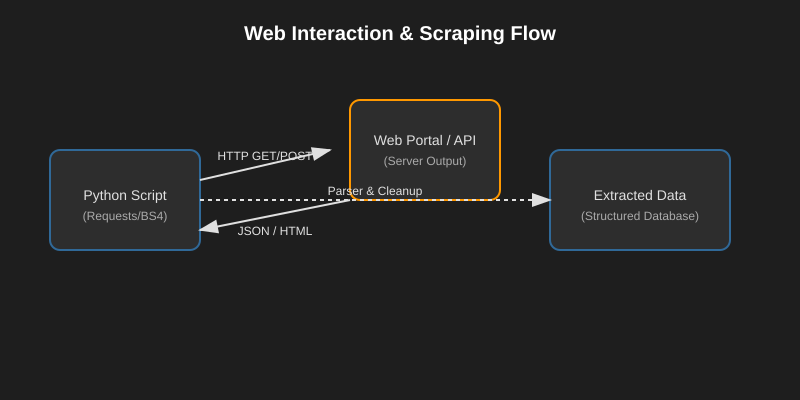

# Working with the Web
*Automating Data Extraction and API Interaction with Python*

In the DevOps ecosystem, your automation frequently needs to talk to external services, scrape status pages, or push data to centralized APIs. Python simplifies these tasks through intuitive libraries like `requests` and `BeautifulSoup`.

---
## 🌐 1. Making HTTP Requests
The `requests` library is the industry standard for HTTP interaction. It replaces complex legacy tools with simple, human-readable syntax.
### **Basic GET/POST Patterns**
```python
import requests

# Making a GET request
response = requests.get('https://api.github.com/zen')
print(f"Status: {response.status_code}")
print(f"Message: {response.text}")

# Making a POST request with payload
payload = {'key': 'value'}
r = requests.post("http://httpbin.org/post", data=payload)
print(r.json())
```
### **Error Handling in Requests**
Never assume a request succeeds. Always wrap network calls in `try/except`.
```python
try:
    r = requests.get("https://google.com/", timeout=5)
    r.raise_for_status() # Raises exception for 4xx/5xx errors
except requests.exceptions.RequestException as e:
    print(f"Network error occurred: {e}")
```

---

## 🥣 2. Parsing HTML Content
When an API isn't available, we use **Web Scraping** to extract configuration or status data from HTML pages.

### **The BeautifulSoup & lxml Combo**
```python
from bs4 import BeautifulSoup
import requests

# 1. Fetch content
page = requests.get('https://github.com/pricing/')

# 2. Setup parser (using lxml for speed)
soup = BeautifulSoup(page.content, 'lxml')

# 3. Target elements by class or tag
# Find pricing card names
plans = soup.find_all('h3', class_='pricing-card-name')
for plan in plans:
    print(f"Plan: {plan.text.strip()}")

# Using XPath for precision (requires lxml)
from lxml import html
tree = html.fromstring(page.content)
pricing = tree.xpath('//span[@class="default-currency"]/text()')
print(f"Current Prices: {pricing}")
```

---

## 🛠️ 3. REST API Mastery (GitHub Case Study)
APIs allow you to automate platform-specific tasks. Let’s look at managing GitHub Gists programmatically.

### **CRUD Operations with Gists**
- **Create**: Send a `POST` request with JSON data.
- **Read**: Use `GET` on a specific gist ID.
- **Update**: Use `PATCH` to modify existing files.
- **Delete**: Use `DELETE` to remove the resource.

```python
# Create a Gist
headers = {'Authorization': f'token {YOUR_TOKEN}'}
data = {
    "description": "DevOps Automation Gist",
    "public": True,
    "files": {"demo.txt": {"content": "Hello Universe"}}
}
r = requests.post("https://api.github.com/gists", headers=headers, json=data)
print(f"New Gist URL: {r.json()['url']}")
```

---

## 🌊 Web Stream Data Flow


---

## 📖 Stories from the Field: The Scraper's Rescue
**Scenario**: A legacy tool provided environment health status only through an old web portal with no API access. Integration with CI/CD was needed.
**Solution**: A Python script was scheduled every 10 minutes to scrape the portal using `BeautifulSoup`, detect "Down" status markers, and trigger an AWS SNS alert.
**Outcome**: High visibility for system health without waiting for a platform upgrade.

---

## ❓ Interview Questions
1. **Explain the difference between `params` and `data` arguments in `requests.post()`.**
2. **What is the `raise_for_status()` method used for?**
3. **When would you prefer XPath over CSS selectors for scraping?**

---
**Next Step**: Learn about **[Web Automation & Selenium](./02-Web-Automation.md)**.
