# 🐍 Python for DevOps Automation
*Mastering System Orchestration and Web Interaction with Python*

Python is the "glue" of the DevOps world. Its readability, vast ecosystem of libraries, and cross-platform compatibility make it the primary choice for complex automation that exceeds the capabilities of Shell scripting.

---

## 🗺️ Curriculum Map

```mermaid
graph LR
    subgraph Phase 1: Foundations
        P1[Part-01: Fundamentals] --> P2[Part-02: Data Structures]
        P2 --> P3[Part-03: Functions]
        P3 --> P4[Part-04: File Ops]
        P4 --> P5[Part-05: Error Handling]
    end

    subgraph Phase 2: System Ops
        P5 --> P6[Part-06: JSON]
        P6 --> P7[Part-07: YAML]
        P7 --> P8[Part-08: Env Vars]
        P8 --> P9[Part-09: CLI Args]
        P9 --> P10[Part-10: Subprocess]
        P10 --> P11[Part-11: Pathlib]
    end

    subgraph Phase 3: Advanced Logic
        P11 --> P12[Part-12: Datetime]
        P12 --> P13[Part-13: Regex]
        P13 --> P14[Part-14: Logging]
        P14 --> P15[Part-15: Venv]
        P15 --> P16[Part-16: Packages]
        P16 --> P17[Part-17: Capstone]
    end

    subgraph Phase 4: Web & API
        P17 --> P18[Part-18: Web]
        P18 --> P19[Part-19: Selenium]
        P19 --> P20[Part-20: Micro-Services]
    end

    style Phase 1 fill:#e1f5fe,stroke:#01579b
    style Phase 2 fill:#fff3e0,stroke:#e65100
    style Phase 3 fill:#e8f5e9,stroke:#1b5e20
    style Phase 4 fill:#f3e5f5,stroke:#4a148c
```

---

## 🎯 Learning Objectives
- ✅ Master Python environments and package management (`pip`, `venv`).
- ✅ Automate web interactions: HTTP Requests, Scraping, and REST API integration.
- ✅ Build micro-web services for automation status and internal tools.
- ✅ Implement browser-based automation with Selenium and Headless patterns.
- ✅ Leverage asynchronous patterns for high-performance automation.

---

## 📂 Curriculum Structure

### 🛡️ Phase 1: Foundations (The Operator)
1. **[Part-00: Prerequisites](./Part-00-Prerequisites/README.md)** - Setup, Pip, and Intro to Venv.
2. **[Part-01: Python Fundamentals](./Part-01-Python-Fundamentals/README.md)** - Variables, types, and PEP 8.
3. **[Part-02: Data Structures](./Part-02-Data-Structures/README.md)** - Lists, Dicts, Sets, and Tuples.
4. **[Part-03: Functions and Modules](./Part-03-Functions-and-Modules/README.md)** - Reusable and modular logic.
5. **[Part-04: File Operations](./Part-04-File-Operations/README.md)** - Reading/Writing and Context Managers.
6. **[Part-05: Error Handling](./Part-05-Error-Handling/README.md)** - Try/Except and Resilient coding.

### 🧠 Phase 2: System Operations (The Scripter)
1. **[Part-06: Working with JSON](./Part-06-Working-with-JSON/README.md)** - API data serialization.
2. **[Part-07: Working with YAML](./Part-07-Working-with-YAML/README.md)** - K8s and Ansible configurations.
3. **[Part-08: Environment Variables](./Part-08-Environment-Variables/README.md)** - 12-Factor app configuration.
4. **[Part-09: Command Line Arguments](./Part-09-Command-Line-Arguments/README.md)** - Building professional CLI tools.
5. **[Part-10: Subprocess Module](./Part-10-Subprocess-Module/README.md)** - Executing Shell from Python.
6. **[Part-11: Pathlib Basics](./Part-11-Pathlib-Basics/README.md)** - Modern cross-platform path handling.

### 🚀 Phase 3: Advanced Engineering (The Architect)
1. **[Part-12: Datetime Operations](./Part-12-Datetime-Operations/README.md)** - Timezones and scheduling.
2. **[Part-13: Regular Expressions](./Part-13-Regular-Expressions/README.md)** - Pattern matching for logs.
3. **[Part-14: Logging Basics](./Part-14-Logging-Basics/README.md)** - Professional application logging.
4. **[Part-15: Deep Dive: Virtual Environments](./Part-15-Virtual-Environments/README.md)** - Isolation strategies.
5. **[Part-16: Deep Dive: Package Management](./Part-16-Package-Management/README.md)** - Deployment-ready workflows.
6. **[Part-17: First Automation Script](./Part-17-First-Automation-Script/README.md)** - Complete Capstone Project.

### 🌐 Phase 4: Web & API Operations (The Integrator)
1. **[Part-18: Working with the Web](./Part-18-Working-with-the-Web/README.md)** - Requests, Scrapers, and APIs.
2. **[Part-19: Web Automation & Selenium](./Part-19-Web-Automation/README.md)** - Browser orchestration.
3. **[Part-20: Micro-Frameworks and Async](./Part-20-Micro-Frameworks-and-Async/README.md)** - Async IO and Web hooks.

---

## 🛠️ Essential DevOps Libraries Reference

| Library | Category | Use Case |
|---------|----------|----------|
| `os` / `sys` | System | Path manipulation, script arguments, env vars |
| `subprocess` | System | Running shell commands and capturing output |
| `requests` | Web | Making API calls and fetching web content |
| `beautifulsoup4` | Parsing | Extracting data from complex HTML structures |
| `selenium` | Automation | Browser-based task automation and testing |
| `fastapi / bottle` | Web Apps | Lightweight internal status pages or web hooks |

---

## 🏆 Real-World Story: The API Pivot
**Scenario**: A team was manually taking screenshots of 50 different monitoring dashboards every morning.
**Solution**: A Python script using `selenium` was written to log in, navigate through the dashboards, and save the screenshots automatically into a daily Slack channel.
**Outcome**: Saved 2 hours of engineering time daily and ensured 100% consistency.

---

## ❓ Interview Preparation
1. **Explain why `subprocess.run()` is safer than `os.system()`.**
2. **How does Python's `asyncio` differ from multi-threading?**
3. **What is the significance of the `__init__.py` file in a package?**

---

**Next Step**: Start with **[Prerequisites](./Part-00-Prerequisites/README.md)**.
