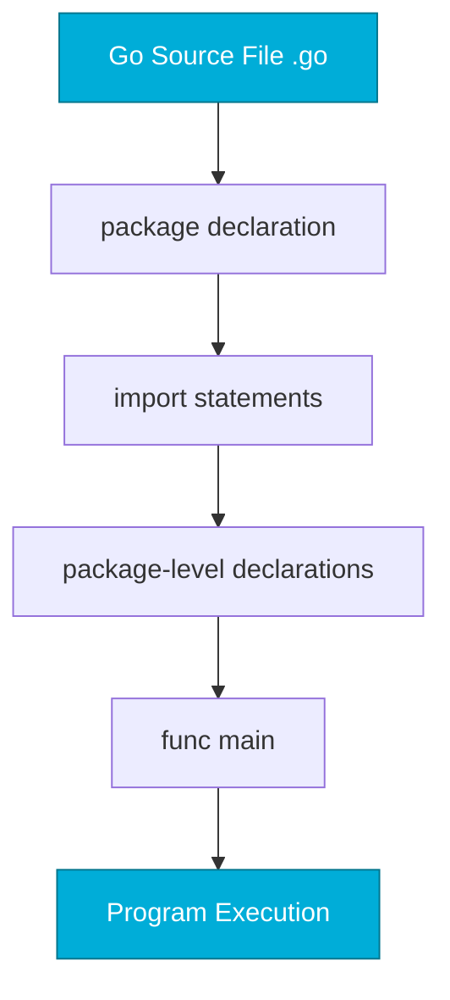

# Go Fundamentals
*Your First Steps with Go*

Go (Golang) was created at Google to solve real problems: slow build times, complex dependencies, and poor concurrency support. Its simplicity and power make it perfect for DevOps automation.

---

## 🎯 Learning Objectives

- Set up the Go development environment
- Understand packages and modules
- Write and run your first Go program
- Apply Go formatting conventions

---

## 📊 Go Program Structure



---

## 📚 Core Concepts

### 1. Hello, DevOps!

```go
// main.go
package main

import "fmt"

func main() {
    fmt.Println("Hello, DevOps!")
}
```

```bash
# Run directly
go run main.go

# Build and execute
go build -o hello
./hello
```

### 2. Packages and Imports

```go
package main

import (
    "fmt"      // Standard library
    "os"       // Operating system functions
    "strings"  // String manipulation
)

func main() {
    hostname, _ := os.Hostname()
    fmt.Printf("Running on: %s\n", strings.ToUpper(hostname))
}
```

### 3. Go Modules

```bash
# Initialize a new module
go mod init github.com/username/myproject

# Download dependencies
go mod tidy

# View dependency graph
go mod graph
```

```go
// go.mod
module github.com/username/devops-tool

go 1.21

require (
    github.com/spf13/cobra v1.8.0
    k8s.io/client-go v0.29.0
)
```

### 4. Code Formatting

```bash
# Format code (auto-applied by most editors)
go fmt ./...

# Stricter formatting
gofmt -s -w .

# Import organization
goimports -w .
```

---

## 🛠️ Hands-On Exercises

### Exercise 1: System Info Tool
```go
// Create a program that prints system info
package main

import (
    "fmt"
    "os"
    "runtime"
)

func main() {
    // TODO: Print hostname, OS, architecture, and Go version
}
```

<details>
<summary>💡 Solution</summary>

```go
package main

import (
    "fmt"
    "os"
    "runtime"
)

func main() {
    hostname, _ := os.Hostname()
    
    fmt.Println("=== System Info ===")
    fmt.Printf("Hostname: %s\n", hostname)
    fmt.Printf("OS:       %s\n", runtime.GOOS)
    fmt.Printf("Arch:     %s\n", runtime.GOARCH)
    fmt.Printf("Go:       %s\n", runtime.Version())
    fmt.Printf("CPUs:     %d\n", runtime.NumCPU())
}
```
</details>

### Exercise 2: Multi-file Project
```bash
# Create project structure
mkdir -p greet/utils
touch greet/main.go greet/utils/helper.go
```

<details>
<summary>💡 Solution</summary>

```go
// greet/utils/helper.go
package utils

import "fmt"

func FormatGreeting(name string) string {
    return fmt.Sprintf("Hello, %s! Welcome to Go.", name)
}

// greet/main.go
package main

import (
    "fmt"
    "greet/utils"
)

func main() {
    msg := utils.FormatGreeting("DevOps Engineer")
    fmt.Println(msg)
}
```
</details>

---

## 📖 Real-World Story: The Dependency Problem

**Scenario**: A team's Python automation had 50+ dependencies, causing version conflicts across machines.

**Solution**: Rewrote critical tools in Go with `go mod vendor` for self-contained builds.

**Outcome**: "Works on my machine" problems eliminated. Single binary runs anywhere.

---

## ❓ Interview Questions

1. **What is the purpose of `package main`?**
   > Declares an executable program. `main` package must have a `main()` function.

2. **How does Go handle dependencies?**
   > Go modules (`go.mod`) with semantic versioning and checksum verification.

3. **What does `go build` produce?**
   > A native executable binary for the target OS/architecture.

4. **Why doesn't Go have a package manager like pip or npm?**
   > Go modules are built into the toolchain. `go get`, `go mod` handle dependencies natively.

---

## 🧠 Quiz

1. What's the entry point of a Go program?
   - a) `init()` function
   - b) `main()` function ✅
   - c) First function in file

2. How do you format Go code?
   - a) `go style`
   - b) `go fmt` ✅
   - c) `go format`

3. What file defines Go module dependencies?
   - a) `package.json`
   - b) `requirements.txt`
   - c) `go.mod` ✅

4. Exported functions in Go start with:
   - a) Lowercase letter
   - b) Uppercase letter ✅
   - c) Underscore

---

**Next Step**: [Variables and Types →](../02-Variables-and-Types/README.md)
