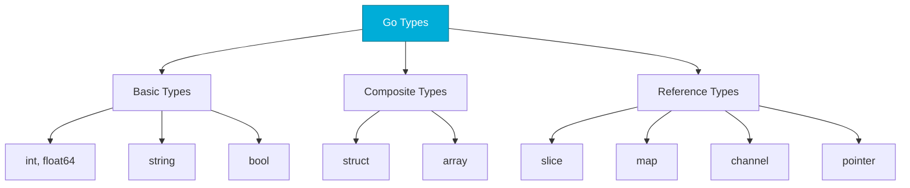

# Variables and Types
*Go's Type System for DevOps*

Go is statically typed with type inference. Understanding types is crucial for writing robust automation code that catches errors at compile time.

---

## 🎯 Learning Objectives

- Declare variables using var and short syntax
- Understand Go's basic types
- Use constants and iota
- Apply zero values effectively

---

## 📊 Go Type System



---

## 📚 Core Concepts

### 1. Variable Declaration

```go
package main

import "fmt"

func main() {
    // Explicit type
    var serverName string = "web-prod-01"
    var port int = 8080
    
    // Type inference
    var isHealthy = true
    
    // Short declaration (most common)
    cpuUsage := 75.5
    hostname := "api-server"
    
    // Multiple declaration
    var (
        maxRetries = 3
        timeout    = 30
    )
    
    fmt.Println(serverName, port, isHealthy, cpuUsage)
}
```

### 2. Basic Types

| Type | Zero Value | Example |
|------|------------|---------|
| `int` | 0 | `var count int` |
| `float64` | 0.0 | `var cpu float64` |
| `string` | "" | `var name string` |
| `bool` | false | `var ready bool` |

```go
// Numeric types
var (
    count    int     = 100
    memory   int64   = 17179869184  // 16GB
    cpu      float64 = 85.5
    ratio    float32 = 0.75
)

// Strings (immutable)
hostname := "web-01"
message := `Multi-line
string with backticks`

// Booleans
isReady := true
hasError := false
```

### 3. Constants and Iota

```go
// Constants
const MaxRetries = 3
const APIEndpoint = "https://api.example.com"

// Grouped constants
const (
    StatusHealthy    = "healthy"
    StatusDegraded   = "degraded"
    StatusUnhealthy  = "unhealthy"
)

// Iota for enumeration
const (
    SeverityInfo = iota  // 0
    SeverityWarn         // 1
    SeverityError        // 2
    SeverityCritical     // 3
)

// Iota with expressions
const (
    KB = 1 << (10 * (iota + 1))  // 1024
    MB                            // 1048576
    GB                            // 1073741824
)
```

### 4. Zero Values

```go
// All variables have zero values - no "undefined"!
var (
    count   int     // 0
    name    string  // ""
    active  bool    // false
    pointer *int    // nil
)

// Use this for safe defaults
func getPort() int {
    var port int  // zero value is safe
    // ... configure port or leave as 0
    return port
}
```

---

## 🛠️ Hands-On Exercises

### Exercise 1: Server Config
```go
// Define variables for a server configuration
package main

func main() {
    // TODO: Create variables for:
    // - hostname (string)
    // - port (int) 
    // - maxConnections (int)
    // - isSSL (bool)
    // - memoryGB (float64)
    // Print all values
}
```

<details>
<summary>💡 Solution</summary>

```go
package main

import "fmt"

func main() {
    hostname := "api-prod-01"
    port := 443
    maxConnections := 10000
    isSSL := true
    memoryGB := 16.0
    
    fmt.Printf("Server: %s:%d\n", hostname, port)
    fmt.Printf("Max Connections: %d\n", maxConnections)
    fmt.Printf("SSL: %t\n", isSSL)
    fmt.Printf("Memory: %.1f GB\n", memoryGB)
}
```
</details>

### Exercise 2: Log Level Enum
```go
// Create log level constants using iota
// TODO: Define LogDebug=0, LogInfo=1, LogWarn=2, LogError=3
```

<details>
<summary>💡 Solution</summary>

```go
package main

import "fmt"

const (
    LogDebug = iota
    LogInfo
    LogWarn
    LogError
)

func main() {
    currentLevel := LogInfo
    
    fmt.Printf("Debug: %d\n", LogDebug)
    fmt.Printf("Info: %d\n", LogInfo)
    fmt.Printf("Warn: %d\n", LogWarn)
    fmt.Printf("Error: %d\n", LogError)
    fmt.Printf("Current Level: %d\n", currentLevel)
}
```
</details>

---

## ❓ Interview Questions

1. **What's the difference between `var` and `:=`?**
   > `var` can be used anywhere; `:=` only inside functions. `:=` infers type.

2. **What is a zero value?**
   > Default value for uninitialized variables. int=0, string="", bool=false, pointer=nil.

3. **Why doesn't Go have classes?**
   > Go uses structs with methods. Composition over inheritance.

4. **What is `iota`?**
   > Auto-incrementing identifier for constants, resets to 0 in each const block.

---

## 🧠 Quiz

1. What's the zero value of `string`?
   - a) `nil`
   - b) `""` (empty string) ✅
   - c) `undefined`

2. Short declaration syntax is:
   - a) `var x = 5`
   - b) `x := 5` ✅
   - c) `let x = 5`

3. Can `:=` be used at package level?
   - a) Yes
   - b) No ✅

4. What does `iota` represent?
   - a) Infinity
   - b) Auto-incrementing integer ✅
   - c) Type flag

---

**Next Step**: [Control Flow →](../03-Control-Flow/README.md)
