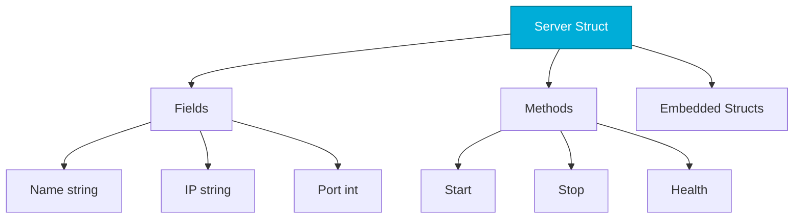

# Structs and Methods
*Go's Approach to Object-Oriented Programming*

Go doesn't have classes, but structs with methods provide similar capabilities. Composition replaces inheritance.

---

## 🎯 Learning Objectives

- Define and work with structs
- Add methods to types
- Use struct embedding for composition
- Apply tags for serialization

---

## 📊 Struct Composition



---

## 📚 Core Concepts

### 1. Defining Structs

```go
type Server struct {
    Name     string
    IP       string
    Port     int
    IsActive bool
}

// Create instances
server := Server{
    Name:     "web-01",
    IP:       "10.0.1.50",
    Port:     8080,
    IsActive: true,
}

// Partial initialization (zero values for rest)
server2 := Server{Name: "api-01"}

// Access fields
fmt.Println(server.Name)
server.Port = 443
```

### 2. Methods

```go
// Value receiver (copy)
func (s Server) DisplayName() string {
    return fmt.Sprintf("%s (%s:%d)", s.Name, s.IP, s.Port)
}

// Pointer receiver (can modify)
func (s *Server) Start() {
    s.IsActive = true
    fmt.Printf("Starting %s\n", s.Name)
}

func (s *Server) Stop() {
    s.IsActive = false
}

// Usage
server.Start()
fmt.Println(server.DisplayName())
```

### 3. Struct Embedding (Composition)

```go
type HealthChecker struct {
    LastCheck time.Time
    Status    string
}

type MonitoredServer struct {
    Server        // Embedded struct
    HealthChecker // Another embedded
    AlertEmail string
}

// MonitoredServer "inherits" all fields and methods
ms := MonitoredServer{}
ms.Name = "prod-01"  // From Server
ms.Status = "healthy" // From HealthChecker
```

### 4. Struct Tags

```go
type Config struct {
    Host     string `json:"host" yaml:"host"`
    Port     int    `json:"port" yaml:"port"`
    Password string `json:"-"` // Excluded from JSON
}
```

---

## 🛠️ Hands-On Challenge

```go
// Create a Deployment struct with methods
type Deployment struct {
    Name      string
    Replicas  int
    Image     string
    Status    string
}

// TODO: Add methods:
// - Scale(n int) - set replicas
// - Deploy() - set status to "running"
// - Summary() string - return formatted summary
```

<details>
<summary>💡 Solution</summary>

```go
func (d *Deployment) Scale(n int) {
    d.Replicas = n
    fmt.Printf("Scaling %s to %d replicas\n", d.Name, n)
}

func (d *Deployment) Deploy() {
    d.Status = "running"
    fmt.Printf("Deploying %s with image %s\n", d.Name, d.Image)
}

func (d Deployment) Summary() string {
    return fmt.Sprintf("%s: %d replicas, status=%s", d.Name, d.Replicas, d.Status)
}
```
</details>

---

## ❓ Interview Questions

1. **When to use pointer vs value receiver?**
   > Pointer: modify struct or large structs. Value: read-only or small structs.

2. **How does Go achieve polymorphism without inheritance?**
   > Interfaces! Any type implementing the methods satisfies the interface.

---

## 🧠 Quiz

1. Go uses what instead of classes?
   - a) Objects
   - b) Structs with methods ✅

2. Embedded struct fields are accessed:
   - a) Via explicit path only
   - b) Directly (promoted) ✅

---

**Next Step**: [Interfaces →](../06-Interfaces/README.md)
