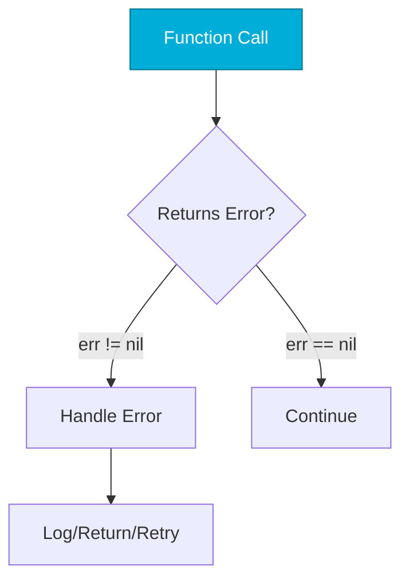

# Error Handling
*Go's Explicit Error Philosophy*

Go doesn't have exceptions. Errors are values that must be explicitly checked. This makes error handling visible and intentional.

---

## 🎯 Learning Objectives

- Handle errors idiomatically
- Create custom error types
- Wrap errors with context
- Use sentinel errors

---

## 📊 Error Handling Flow



---

## 📚 Core Concepts

### 1. Basic Error Handling

```go
file, err := os.Open("config.yaml")
if err != nil {
    log.Fatalf("Failed to open config: %v", err)
}
defer file.Close()

// Multiple return values
func divide(a, b float64) (float64, error) {
    if b == 0 {
        return 0, errors.New("division by zero")
    }
    return a / b, nil
}
```

### 2. Error Wrapping (Go 1.13+)

```go
import "fmt"

func loadConfig(path string) error {
    data, err := os.ReadFile(path)
    if err != nil {
        return fmt.Errorf("loading config %s: %w", path, err)
    }
    // ...
    return nil
}

// Unwrap to check original error
if errors.Is(err, os.ErrNotExist) {
    fmt.Println("File not found")
}
```

### 3. Custom Errors

```go
type NotFoundError struct {
    Resource string
    ID       string
}

func (e *NotFoundError) Error() string {
    return fmt.Sprintf("%s not found: %s", e.Resource, e.ID)
}

func getServer(id string) (*Server, error) {
    // ...
    return nil, &NotFoundError{Resource: "server", ID: id}
}

// Type assertion
var nfErr *NotFoundError
if errors.As(err, &nfErr) {
    fmt.Printf("Missing: %s\n", nfErr.ID)
}
```

### 4. Sentinel Errors

```go
var (
    ErrNotFound     = errors.New("resource not found")
    ErrUnauthorized = errors.New("unauthorized")
    ErrTimeout      = errors.New("operation timed out")
)

func getResource(id string) (*Resource, error) {
    if !exists(id) {
        return nil, ErrNotFound
    }
    // ...
}

if errors.Is(err, ErrNotFound) {
    // Handle not found
}
```

---

## 🛠️ Hands-On Exercise

```go
// Implement retry with error wrapping
func fetchWithRetry(url string, maxRetries int) ([]byte, error) {
    // TODO: Retry up to maxRetries
    // Wrap errors with attempt info
    // Return data or final error
}
```

<details>
<summary>💡 Solution</summary>

```go
func fetchWithRetry(url string, maxRetries int) ([]byte, error) {
    var lastErr error
    
    for attempt := 1; attempt <= maxRetries; attempt++ {
        resp, err := http.Get(url)
        if err != nil {
            lastErr = fmt.Errorf("attempt %d: %w", attempt, err)
            continue
        }
        defer resp.Body.Close()
        
        if resp.StatusCode != 200 {
            lastErr = fmt.Errorf("attempt %d: status %d", attempt, resp.StatusCode)
            continue
        }
        
        return io.ReadAll(resp.Body)
    }
    
    return nil, fmt.Errorf("all %d attempts failed: %w", maxRetries, lastErr)
}
```
</details>

---

## ❓ Interview Questions

1. **Why doesn't Go have exceptions?**
   > Explicit error handling prevents silent failures and makes control flow clear.

2. **What's the difference between `errors.Is` and `errors.As`?**
   > `Is` checks error identity, `As` extracts a specific error type.

---

## 🧠 Quiz

1. Go's error handling uses:
   - a) Exceptions
   - b) Return values ✅

2. `errors.Is` checks for:
   - a) Error type
   - b) Error identity/equality ✅

---

**Next Step**: [File Operations →](../08-File-Operations/README.md)
