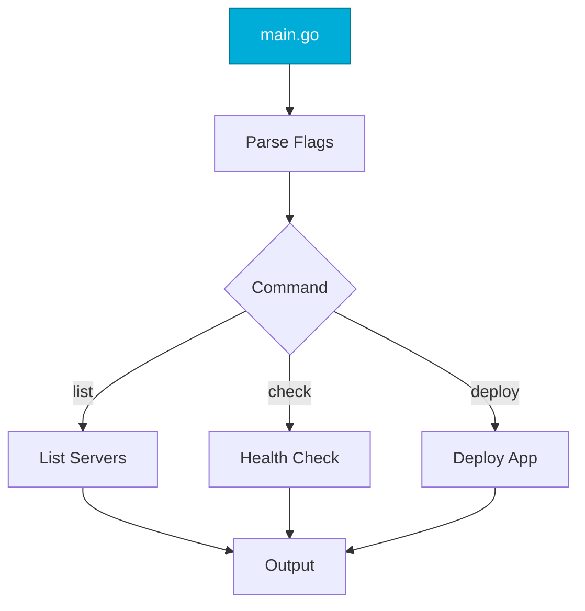

# First CLI Tool
*Building a Complete DevOps Automation Tool*

This capstone project brings together all Go concepts to build a real-world CLI tool.

---

## 🎯 Learning Objectives

- Build a professional CLI with flag parsing
- Apply all Go fundamentals learned
- Create a deployable binary

---

## 📊 Tool Architecture



---

## 📚 Complete Example

### Server Manager CLI

```go
// main.go
package main

import (
    "encoding/json"
    "flag"
    "fmt"
    "os"
    "time"
)

type Server struct {
    Name   string `json:"name"`
    IP     string `json:"ip"`
    Status string `json:"status"`
}

func main() {
    // Subcommands
    listCmd := flag.NewFlagSet("list", flag.ExitOnError)
    listFormat := listCmd.String("format", "text", "Output format (text|json)")
    
    checkCmd := flag.NewFlagSet("check", flag.ExitOnError)
    checkServer := checkCmd.String("server", "", "Server to check")
    
    if len(os.Args) < 2 {
        fmt.Println("Usage: srvmgr <command> [options]")
        fmt.Println("Commands: list, check")
        os.Exit(1)
    }
    
    switch os.Args[1] {
    case "list":
        listCmd.Parse(os.Args[2:])
        listServers(*listFormat)
    case "check":
        checkCmd.Parse(os.Args[2:])
        if *checkServer == "" {
            fmt.Println("-server required")
            os.Exit(1)
        }
        checkHealth(*checkServer)
    default:
        fmt.Printf("Unknown command: %s\n", os.Args[1])
        os.Exit(1)
    }
}

func listServers(format string) {
    servers := []Server{
        {Name: "web-01", IP: "10.0.1.10", Status: "healthy"},
        {Name: "api-01", IP: "10.0.1.20", Status: "healthy"},
        {Name: "db-01", IP: "10.0.2.10", Status: "warning"},
    }
    
    switch format {
    case "json":
        data, _ := json.MarshalIndent(servers, "", "  ")
        fmt.Println(string(data))
    default:
        fmt.Println("NAME\t\tIP\t\tSTATUS")
        for _, s := range servers {
            fmt.Printf("%s\t%s\t%s\n", s.Name, s.IP, s.Status)
        }
    }
}

func checkHealth(server string) {
    fmt.Printf("Checking %s...\n", server)
    // Simulate check
    time.Sleep(500 * time.Millisecond)
    fmt.Printf("✓ %s is healthy\n", server)
}
```

### Build and Run

```bash
# Build
go build -o srvmgr

# Usage
./srvmgr list
./srvmgr list -format=json
./srvmgr check -server=web-01

# Cross-compile
GOOS=linux GOARCH=amd64 go build -o srvmgr-linux
GOOS=darwin GOARCH=arm64 go build -o srvmgr-mac
```

---

## 🛠️ Extension Challenges

1. Add `deploy` command with app name and version flags
2. Implement actual HTTP health checks
3. Add `-output` flag to save results to file
4. Add timeout handling for commands

---

## 🎓 Skills Applied

| Module | Application |
|--------|-------------|
| Go Fundamentals | Program structure |
| Variables | Config types |
| Control Flow | Switch for commands |
| Functions | Command handlers |
| Structs | Data models |
| JSON | Output formatting |
| Flags | CLI parsing |
| Error Handling | Input validation |

---

## 🧠 Quiz

1. `go build -o name` does what?
   - a) Runs without building
   - b) Builds to specified output name ✅

2. Cross-compilation uses:
   - a) Virtual machines
   - b) GOOS/GOARCH env vars ✅

---

**🎉 Congratulations!** You've completed Go Basics for DevOps!

**Next Steps**: Explore [Intermediate Go](../../README.md) for Goroutines, Kubernetes client-go, and more!
