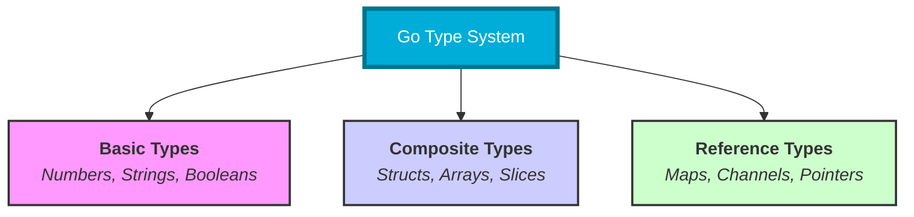

# 📦 Variables and Data Types in Go

> **"Explicit is better than implicit. In DevOps, knowing exactly what your data is—an IP address, a port number, or a boolean flag—prevents catastrophic configuration errors before they reach production."**

Variables and types are the building blocks of any automation project. In Go, the strict type system ensures that your infrastructure code is predictable, readable, and less prone to the runtime bugs common in shell scripts.


## 📊 Visualizing the Go Type System



## Table of Contents

* [Understanding Variables in DevOps](#understanding-variables-in-devops)
* [Practical Variable Usage for Automation](#practical-variable-usage-for-automation)
* [Data Types: The Infrastructure Blueprint](#data-types-the-infrastructure-blueprint)
* [Constants and Enums for Configs](#constants-and-enums-for-configs)
* [Zero Values and Type Safety](#zero-values-and-type-safety)
* [Knowledge Vault (Scenarios, Interview, Quiz)](#knowledge-vault)

---

## Understanding Variables in DevOps

In automation, variables represent your infrastructure's state. Whether it's a `server_id`, an `api_key`, or the `is_production` flag, Go gives you several ways to declare these pointers to data.

### 1. The `var` Keyword

Used for package-level variables or when you want to declare a variable without immediately assigning it a value.

```go
var region string = "us-east-1"
var clusterSize int // Defaults to 0
```

### 2. Short Declaration (`:=`)

The most common way to declare variables inside functions. Go infers the type automatically.

```go
instanceType := "t3.medium" // Inferred as string
maxNodes := 10             // Inferred as int
```

### 3. Multiple Declarations

Perfect for grouping related configuration settings.

```go
var (
    apiEndpoint = "https://api.cloud.com"
    timeout     = 30
    retryCount  = 3
)
```

---

## Practical Variable Usage for Automation

DevOps scripts often deal with environment variables and system inputs. Here is how you handle them safely in Go.

### Example: Loading Environment Config

```go
package main

import (
    "fmt"
    "os"
)

func main() {
    // Reading from Environment
    dbHost := os.Getenv("DB_HOST") // Returns "" if not set
    
    // Using short declaration for logic
    isProd := false
    if dbHost == "prod-db.example.com" {
        isProd = true
    }
    
    fmt.Printf("Deploying to Prod: %t\n", isProd)
}
```

---

## Data Types: The Infrastructure Blueprint

Choosing the right type prevents data corruption in your automation pipelines.

| Category | Type | DevOps Use Case |
| :--- | :--- | :--- |
| **Integers** | `int`, `int64` | Ports, retry counts, process IDs. |
| **Floats** | `float64` | CPU usage %, memory utilization, latency. |
| **Strings** | `string` | Hostnames, API keys, JSON payloads. |
| **Booleans** | `bool` | Health checks, feature flags, "dry-run" modes. |

### String Manipulation (Backticks vs Quotes)

```go
// Normal string
path := "/var/log/app.log"

// Multi-line string (Backticks) - Great for YAML/JSON templates!
template := `
apiVersion: v1
kind: Pod
metadata:
  name: my-app
`
```

---

## Constants and Enums for Configs

Constants are variables that cannot change after they are defined. They are essential for protecting critical configuration values.

### The `iota` Keyword

Use `iota` to create auto-incrementing enumerations, perfect for log levels or deployment statuses.

```go
const (
    StatusPending = iota // 0
    StatusRunning        // 1
    StatusFailed         // 2
    StatusSuccess        // 3
)
```

---

## Zero Values and Type Safety

In Go, variables are never "undefined" or "null" by default (except for pointers and reference types). They always have a **Zero Value**.

* **`int`**: `0`
* **`string`**: `""`
* **`bool`**: `false`

**Why this matters for DevOps:** If your script fails to fetch a port number from an API and you haven't handled the error, Go will use `0`. While safer than a crash, you must always validate that your infrastructure variables aren't stuck at their zero values.

---

## 🧠 Knowledge Vault

### Real-World Scenarios

#### Scenario 1: The Floating Point Trap

An engineer wrote a script to monitor disk usage. They used `int` for the percentage. When the disk was 99.9% full, the script truncated the value to `99`. The alert threshold was set at `100`, so the alert never fired.
**Go Solution**: By using `float64` for metrics, Go maintains the precision required for mission-critical monitoring systems.

#### Scenario 2: Protecting the API Key

A junior developer accidentally overwrote an `API_KEY` variable mid-script, causing all subsequent cloud calls to fail.
**Go Solution**: By declaring the `API_KEY` as a `const`, the Go compiler would have blocked the code from being built, preventing a runtime failure in the CI/CD pipeline.

### Interview Preparation

1. **What is "type inference" in Go, and how does it help automation?**
   > Type inference (`:=`) allows Go to determine the variable type based on the value assigned. This makes automation scripts cleaner and more "Python-like" while retaining the speed and safety of a compiled language.

2. **When should you use `var` instead of `:=`?**
   > Use `var` for package-level variables, when you need to declare a variable but assign it later (like in an `if` block), or when you want to explicitly state a secondary type (e.g., `var x int64 = 10`).

3. **What is the `iota` keyword, and why is it useful for DevOps tools?**
   > `iota` is a counter that starts at 0 and increments for each constant in a block. It is useful for creating "Enums" like `LogLevels` (Debug, Info, Error) or `DeploymentStates`, making the code more readable and less error-prone.

4. **Why are "Zero Values" important for script reliability?**
   > They prevent "garbage data" bugs found in languages like C. In Go, an uninitialized boolean is always `false`, preventing scripts from accidentally assuming a state is `true` or "active".

### Knowledge Check (Quiz)

1. **What is the zero value of a `bool` in Go?**
   * a) `nil`
   * b) `true`
   * c) `false` ✅

2. **Which operator is used for a "short declaration"?**
   * a) `=`
   * b) `:=` ✅
   * c) `==`

3. **Type inference works in which of these scenarios?**
   * a) `const x = 5` ✅
   * b) `var x int`
   * c) `func(x string)`

4. **Which numeric type should you use to represent a CPU percentage like 14.5%?**
   * a) `int`
   * b) `float64` ✅
   * c) `int64`

5. **In a `const` block, what is the value of the second item if the first is `iota`?**
   * a) 0
   * b) 1 ✅
   * c) 2

---

## Next Steps

Now that you can store and represent your data, let's learn how to control the flow of your logic.

Proceed to: **[Control Flow →](../03-Control-Flow/README.md)**
