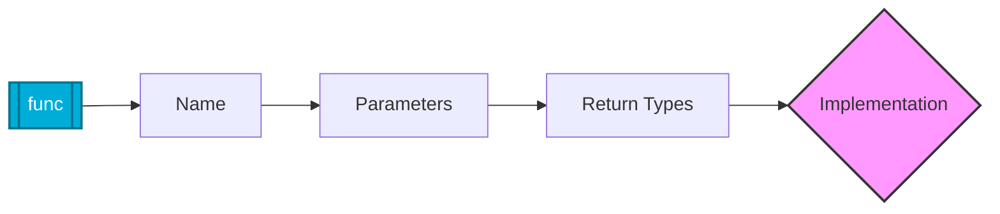

# 🛠️ Functions: The Building Blocks of Go Automation

> **"In the world of DevOps, functions are your reusable tools. By wrapping complex logic—like cloud API calls or log parsing—into modular functions, you create a codebase that is scalable, testable, and maintainable."**

Functions are the core units of execution in Go. They allow you to break down massive automation scripts into small, "single-responsibility" components. In Go, functions are "first-class citizens," meaning they can be passed around as variables, enabling powerful patterns like custom middleware or retry wrappers.


## Anatomy of a Go Function



## Table of Contents

* [Defining Reusable Automation Logic](#defining-reusable-automation-logic)
* [Multiple Return Values: The (Value, Error) Pattern](#multiple-return-values-the-value-error-pattern)
* [Named Returns and Clean Logic](#named-returns-and-clean-logic)
* [Advanced Functions: Variadic and Closures](#advanced-functions-variadic-and-closures)
* [The defer Keyword: Protecting Infrastructure](#the-defer-keyword-protecting-infrastructure)
* [Knowledge Vault (Scenarios, Interview, Quiz)](#knowledge-vault)

---

## 💼 The Automation Why: The Reusable Toolkit

**The Beginner's Question**: "I can just copy and paste my logic. Why wrap it in a function?"

**The Answer**: **Copies are unpaid debt.**
If you copy a 10-line "Delete S3 Bucket" logic to 5 different places, and then AWS changes their API, you have to find and fix all 5 locations. If you miss one, your automation becomes a liability. Functions allow you to fix the bug once and update the world instantly.

### The Multitool Analogy 🛠️

- **Ad-hoc Scripts (Copy-Paste)** = **Single-Use Plywood Tools**: You cut a piece of wood into a specific shape for one job. When you need it again, you cut a new one. Before long, your workshop is full of scrap wood and mess.
- **Modular Functions** = **The Professional Multitool**: You build a high-quality "Hex Driver" (The Function). Every time you need to turn a hexagonal screw (The Problem), you pull out that exact tool. If the hex size changes, you only update the driver head once. Your code stays clean, and your tools stay sharp.

---

## Defining Reusable Automation Logic

Go functions are designed for clarity. Unlike Python, you must define the types of your parameters and return values, preventing "type-surprise" errors in your production pipelines.

### Structure of a Function

```go
func deployResource(name string, replicas int) bool {
    fmt.Printf("Deploying %d instances of %s...\n", replicas, name)
    // Logic here
    return true
}
```

---

## Multiple Return Values: The (Value, Error) Pattern

Go's most iconic feature is the ability to return multiple values. In DevOps, we use this primarily for the `(result, error)` pattern, forcing you to handle failures explicitly.

```go
func getPodIP(podName string) (string, error) {
    if podName == "" {
        return "", fmt.Errorf("podName cannot be empty")
    }
    // Logic to fetch IP...
    return "10.0.0.45", nil
}

func main() {
    ip, err := getPodIP("web-server")
    if err != nil {
        log.Fatalf("Critical Failure: %v", err)
    }
    fmt.Println("Pod IP:", ip)
}
```

---

## Named Returns and Clean Logic

Named return values allow you to document what a function returns directly in the signature. They are particularly useful for complex functions with multiple possible exit points.

```go
func calculateResourceScore(cpu, mem float64) (score float64, status string) {
    score = (cpu + mem) / 2
    if score > 80 {
        status = "CRITICAL"
    } else {
        status = "HEALTHY"
    }
    return // "Naked" return uses current values of 'score' and 'status'
}
```

---

## Advanced Functions: Variadic and Closures

### Variadic Functions

Functions that accept a variable number of arguments. Perfect for logging or processing lists of servers.

```go
func logAlerts(alerts ...string) {
    for _, msg := range alerts {
        fmt.Println("[ALERT]:", msg)
    }
}
```

### Closures (Anonymous Functions)

Functions that "capture" variables from their environment. These are essential for creating specialized automation handlers.

```go
func retryCounter() func() int {
    count := 0
    return func() int {
        count++
        return count
    }
}
```

---

## The defer Keyword: Protecting Infrastructure

The `defer` keyword ensures that a function call is executed **just before the surrounding function returns**. This is vital for closing files, network sockets, or database connections, regardless of whether an error occurred.

```go
func processConfigFile(path string) error {
    file, err := os.Open(path)
    if err != nil {
        return err
    }
    // Ensure the file is closed no matter what!
    defer file.Close() 

    // Logic to parse file...
    return nil
}
```

---

## Knowledge Vault

### Real-World Scenarios

#### Scenario 1: The "Unclosed Socket" Disaster

An engineer wrote a script to check the status of 1,000 servers. They opened a network connection to each but forgot to close them. After 200 servers, the script crashed with "too many open files."
**Go Solution**: By using `defer conn.Close()` immediately after opening the connection, the engineer ensured that every socket was closed as soon as that server's health check was finished, allowing the script to scale to thousands of servers effortlessly.

#### Scenario 2: Standardizing Cloud Responses

A team was building a tool to interact with AWS, Azure, and GCP. Each API returned errors in different formats.
**Go Solution**: They created a "Wrapper Function" that accepted cloud-specific logic as a parameter (a function type) and returned a standardized `(Response, error)` tuple. This allowed them to use the same error-handling logic for all three clouds.

### Interview Preparation

1. **Why does Go use multiple return values for errors instead of exceptions?**
   > To make error handling an explicit part of the control flow. Exceptions allow errors to bubble up and crash the program silently; Go's pattern forces the engineer to decide exactly how to handle a failure at the point it occurs.

2. **What happens if you have multiple `defer` statements in one function?**
   > They are executed in **LIFO (Last-In, First-Out)** order. The last `defer` defined is the first one executed when the function returns.

3. **What is a "variadic" function and when would you use it in DevOps?**
   > A function that takes a variable number of arguments (using `...`). It's commonly used for logging functions, running a list of commands, or joining multiple paths into a single string.

4. **Can a function be passed as an argument to another function?**
   > Yes. In Go, functions are first-class values. This is incredibly useful for creating "middleware" or generic "worker pools" in automation tools.

### Knowledge Check (Quiz)

1. **What is the correct syntax for a variadic integer parameter?**
   * a) `int...`
   * b) `...int` ✅
   * c) `*int`

2. **When exactly does a `defer` statement execute?**
   * a) Immediately when called
   * b) When the variable is garbage collected
   * c) Just before the surrounding function returns ✅

3. **What is a "naked return"?**
   * a) A return statement that returns nothing
   * b) A return statement in a function with named return values that doesn't explicitly list them ✅
   * c) A return statement that bypasses `defer`

4. **What is the standard Go pattern for return values?**
   * a) `(value, error)` ✅
   * b) `(error, value)`
   * c) `(status, data)`

5. **In a LIFO queue of `defer` statements, which one runs first?**
   * a) The one defined first
   * b) The one defined last ✅
   * c) It's random

---

## Next Steps

Now that you can modularize your logic, let's learn how to group related data and behavior into custom structures.

Proceed to: **[Structs and Methods →](../05-Structs-and-Methods/README.md)**
