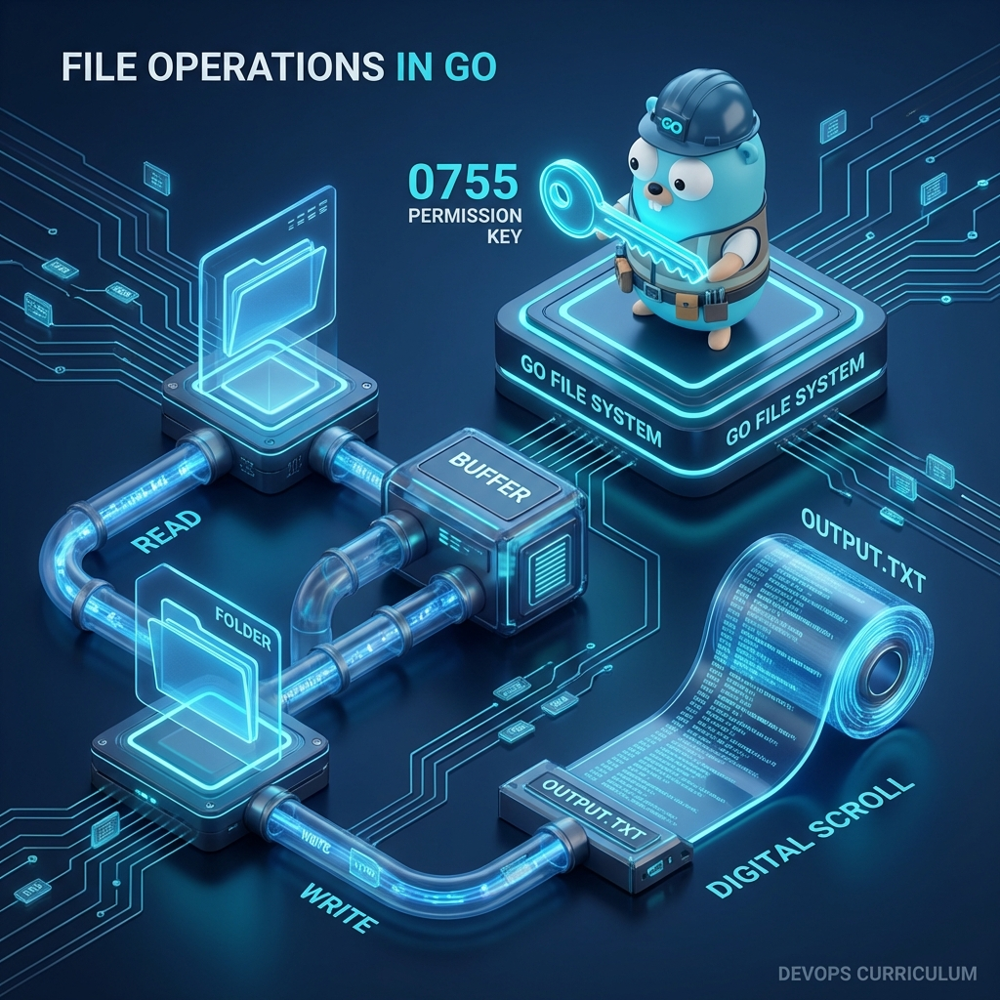

# 📂 File Operations in Go

> **"In the world of DevOps, every script interacts with the filesystem—whether it's parsing YAML configs, rotating application logs, or auditing security permissions. Go's `os` and `io` packages provide a surgical approach to file handling, combining performance with safety."**

Go's file handling philosophy is built on two pillars: **Explicit Control** and **Efficient Streaming**. Unlike languages that hide buffered I/O, Go makes it easy to choose between reading a small config file in one shot or streaming a 50GB audit log without crashing your system.



## Table of Contents

* [Reading Files: Small vs. Massive Data](#reading-files-small-vs-massive-data)
* [Writing Files and Managing Permissions](#writing-files-and-managing-permissions)
* [Directory Management and System Auditing](#directory-management-and-system-auditing)
* [Buffered I/O: The Performance Secret](#buffered-io-the-performance-secret)
* [Hands-On Challenge: The Log Rotator](#hands-on-challenge-the-log-rotator)
* [Knowledge Vault (Scenarios, Interview, Quiz)](#knowledge-vault)
* [Additional Resources](#additional-resources)

---

## Reading Files: Small vs. Massive Data

### Strategy 1: The "One-Shot" Read
Perfect for configuration files like YAML or JSON that fit easily into memory.
```go
data, err := os.ReadFile("config.yaml")
if err != nil {
    log.Fatal("Critical: Missing config file")
}
fmt.Println(string(data))
```

### Strategy 2: The "Line-by-Line" Stream
Essential for parsing large log files where you only care about specific patterns (e.g., finding "ERROR" lines).
```go
file, err := os.Open("app.log")
if err != nil {
    log.Fatal(err)
}
defer file.Close()

scanner := bufio.NewScanner(file)
for scanner.Scan() {
    line := scanner.Text()
    if strings.Contains(line, "ERROR") {
        fmt.Println("Alert:", line)
    }
}
```

---

## Writing Files and Managing Permissions

When creating files in production, permissions are critical. In Go, you specify these using Unix-style octal notation (e.g., `0644`).

### Basic Write
```go
content := []byte("Environment=Production\nVersion=1.4.2")
err := os.WriteFile(".env", content, 0600) // Restricted to owner
```

### Appending to Logs
Most automation tasks involve appending to an existing file rather than overwriting it.
```go
file, err := os.OpenFile("audit.log", os.O_APPEND|os.O_CREATE|os.O_WRONLY, 0644)
if err != nil {
    log.Fatal(err)
}
defer file.Close()

file.WriteString("User 'admin' modified firewall rules\n")
```

---

## Directory Management and System Auditing

### Navigating the Filesystem
```go
// List files in a directory
entries, _ := os.ReadDir("/var/logs")
for _, entry := range entries {
    info, _ := entry.Info()
    fmt.Printf("%s - %d bytes\n", entry.Name(), info.Size())
}

// Create deep directory paths
os.MkdirAll("path/to/my/app/data", 0755)
```

---

## Buffered I/O: The Performance Secret

When writing thousands of small lines to a file, calling the OS for every single line is slow. Go's `bufio` package batches these writes into a buffer in memory and writes them to disk in one large chunk.

```go
file, _ := os.Create("report.txt")
defer file.Close()

writer := bufio.NewWriter(file)
for i := 0; i < 1000; i++ {
    writer.WriteString("Status: OK\n")
}
// CRITICAL: Flush ensures any leftovers in the buffer reach the disk
writer.Flush() 
```

---

## Hands-On Challenge: The Log Rotator

**Goal**: Build a simple tool that checks a log file's size. If it exceeds a limit, it renames it with a timestamp (rotation).

```go
func rotateLog(path string, maxSize int64) error {
    info, err := os.Stat(path)
    if err != nil {
        return err // File probably doesn't exist
    }
    
    if info.Size() > maxSize {
        newName := fmt.Sprintf("%s.%d", path, time.Now().Unix())
        fmt.Printf("Rotating %s to %s\n", path, newName)
        return os.Rename(path, newName)
    }
    return nil
}
```

---

## Knowledge Vault

### Real-World Scenarios

#### Scenario 1: The "Disk Space" Emergency
An automation engineer wrote a script to backup a database. It used `os.ReadFile` to load the 20GB database into memory before writing it to S3. The 16GB server crashed with an Out-of-Memory (OOM) error instantly.
**Go Solution**: They rewrote the tool using `io.Copy(writer, reader)`, which streams the data in small 32KB chunks. The script now backups 500GB files using only 4MB of RAM.

#### Scenario 2: Restricting Access to Secrets
A script was generating SSH keys but saving them with the default `0644` permissions. This allowed every user on the shared build server to read the private keys.
**Go Solution**: By switching to `os.OpenFile(path, flags, 0600)`, the developer ensured that only the script's user could read the generated keys, automatically passing the security team's audit.

### Interview Preparation

1. **What is the difference between `os.Open` and `os.OpenFile`?**
   > `os.Open` is a convenience function that opens a file for reading only. `os.OpenFile` gives you full control over flags (Append, Create, Truncate, Read/Write) and file permissions.

2. **Why is `defer file.Close()` considered a best practice?**
   > It prevents "Too Many Open Files" errors. In long-running processes, if you forget to close files, you will hit the OS limit for open file descriptors, causing your application to crash when it tries to open another one.

3. **When would you use `bufio.Scanner` vs `os.ReadFile`?**
   > Use `os.ReadFile` for small configuration files that you need all at once. Use `bufio.Scanner` for logs or any file that could be larger than the server's available RAM to avoid OOM crashes.

4. **What does the `0755` permission mean?**
   > It's an octal representation of Unix permissions: User: Read/Write/Execute (7), Group: Read/Execute (5), Others: Read/Execute (5).

### Knowledge Check (Quiz)

1. **Which package is primarily used for buffered I/O?**
   - a) `os`
   - b) `bufio` ✅
   - c) `io/util`

2. **What does `os.O_APPEND` do in `os.OpenFile`?**
   - a) Overwrites the file
   - b) Deletes the file
   - c) Adds new data to the end of the file ✅

3. **What is the result of calling `writer.Flush()`?**
   - a) It deletes the file
   - b) It forces all buffered data to be written to the underlying storage ✅
   - c) It clears the computer's RAM

4. **Which function allows you to create a nested directory structure in one go?**
   - a) `os.Mkdir`
   - b) `os.CreateDir`
   - c) `os.MkdirAll` ✅

5. **Why should you avoid `os.ReadFile` for large production logs?**
   - a) It's too slow
   - b) It loads the entire file into RAM, risking OOM crashes ✅
   - c) It doesn't support emojis

---

## Additional Resources

* **Official Go Documentation (os)**: [https://pkg.go.dev/os](https://pkg.go.dev/os)
* **Go by Example: Reading Files**: [https://gobyexample.com/reading-files](https://gobyexample.com/reading-files)
* **Effective Go: Defer**: [https://golang.org/doc/effective_go#defer](https://golang.org/doc/effective_go#defer)

---

**Next Step**: [Working with JSON →](../09-Working-with-JSON/README.md)
