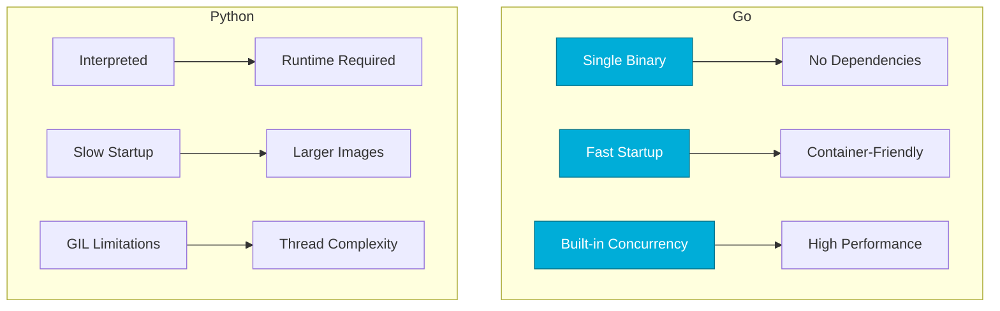

# Module 3: Go for DevOps Automation
*Building Cloud-Native Tools with Go*

Go (Golang) is the language of cloud-native infrastructure. Kubernetes, Docker, Terraform, and Prometheus are all written in Go. Its compiled binaries, built-in concurrency, and excellent tooling make it ideal for high-performance DevOps automation.

---

## 🗺️ Learning Path

```mermaid
flowchart LR
    subgraph Beginner
        A[Go Fundamentals] --> B[Variables & Types]
        B --> C[Control Flow]
        C --> D[Functions]
        D --> E[Structs & Methods]
        E --> F[Interfaces]
    end
    
    subgraph Intermediate
        F --> G[Error Handling]
        G --> H[File Operations]
        H --> I[JSON/YAML]
        I --> J[CLI Flags]
        J --> K[Testing]
    end
    
    subgraph Advanced
        K --> L[First CLI Tool]
    end
    
    style A fill:#00ADD8,stroke:#00758D,color:#fff
    style L fill:#00ADD8,stroke:#00758D,color:#fff
```

---

## 🌐 Go Concurrency Model

---

## 🎯 Learning Objectives

- Master Go syntax, types, and idiomatic patterns
- Build professional CLI tools with Cobra and Viper
- Understand goroutines and channels for concurrent operations
- Create testable, production-ready automation code
- Deploy single-binary tools across platforms

---

## 📂 Curriculum Topics

### 🟢 Beginner Fundamentals (Modules 1-17)

| # | Module | Description |
|---|--------|-------------|
| 01 | [Go Fundamentals](./01-Go-Fundamentals/README.md) | Syntax, packages, go modules |
| 02 | [Variables and Types](./02-Variables-and-Types/README.md) | Types, constants, zero values |
| 03 | [Control Flow](./03-Control-Flow/README.md) | if/else, switch, loops |
| 04 | [Functions](./04-Functions/README.md) | Functions, closures, defer |
| 05 | [Structs and Methods](./05-Structs-and-Methods/README.md) | Structs, methods, embedding |
| 06 | [Interfaces](./06-Interfaces/README.md) | Interface design, polymorphism |
| 07 | [Error Handling](./07-Error-Handling/README.md) | Error patterns, wrapping |
| 08 | [File Operations](./08-File-Operations/README.md) | os package, file I/O |
| 09 | [Working with JSON](./09-Working-with-JSON/README.md) | encoding/json, struct tags |
| 10 | [Working with YAML](./10-Working-with-YAML/README.md) | YAML parsing, configs |
| 11 | [Command Line Flags](./11-Command-Line-Flags/README.md) | flag package, CLI args |
| 12 | [Environment Variables](./12-Environment-Variables/README.md) | os.Getenv, configuration |
| 13 | [String Manipulation](./13-String-Manipulation/README.md) | strings, bytes packages |
| 14 | [Time and Date](./14-Time-and-Date/README.md) | time package, durations |
| 15 | [Regular Expressions](./15-Regular-Expressions/README.md) | regexp package |
| 16 | [Testing Basics](./16-Testing-Basics/README.md) | testing package, table tests |
| 17 | [First CLI Tool](./17-First-CLI-Tool/README.md) | Complete capstone project |

---

## 🏛️ Go vs Python for DevOps

| Feature | Go | Python |
|---------|-----|--------|
| **Binary Size** | 10-50 MB | N/A (needs runtime) |
| **Startup Time** | < 10ms | 100-500ms |
| **Concurrency** | Native goroutines | Threading/asyncio |
| **Type Safety** | Compile-time | Runtime |
| **Cross-compile** | Built-in | Complex |

---

## 🛠️ Essential Go DevOps Libraries

| Package | Category | Use Case |
|---------|----------|----------|
| `os` | System | File/env operations |
| `net/http` | Network | HTTP client/server |
| `encoding/json` | Data | JSON parsing |
| `flag` | CLI | Command-line args |
| `cobra` | CLI | Complex CLI apps |
| `client-go` | K8s | Kubernetes automation |
| `docker/client` | Containers | Docker automation |

---

## 📖 Real-World Story: The 100x Speedup

**Scenario**: A Python deployment script took 45 seconds to start and process 1000 servers.

**Solution**: Rewrote in Go with goroutines for parallel processing.

**Outcome**: 
- Startup: 45s → 10ms
- Processing: 45s → 2s (parallel)
- Container image: 300MB → 15MB

---

## ❓ Interview Questions

1. **Why is Go popular for DevOps tools like Kubernetes and Terraform?**
2. **Explain goroutines vs threads.**
3. **What's the difference between Go's error handling and exceptions?**
4. **How does Go's single binary deployment simplify operations?**
5. **When would you choose Go over Python for automation?**

---

## 🧠 Quiz

1. What makes Go binaries "self-contained"?
   - a) They include the runtime ✅
   - b) They require a VM
   - c) They need a package manager

2. What is a goroutine?
   - a) A heavy thread
   - b) A lightweight concurrent function ✅
   - c) A process

3. Go is:
   - a) Interpreted
   - b) Compiled ✅
   - c) JIT-compiled

4. Which tool is NOT written in Go?
   - a) Kubernetes
   - b) Ansible ✅ (Python)
   - c) Terraform

5. The `go build` command produces:
   - a) Bytecode
   - b) Native binary ✅
   - c) Source distribution

---

**Next Step**: Start with **[Go Fundamentals →](./01-Go-Fundamentals/README.md)**
