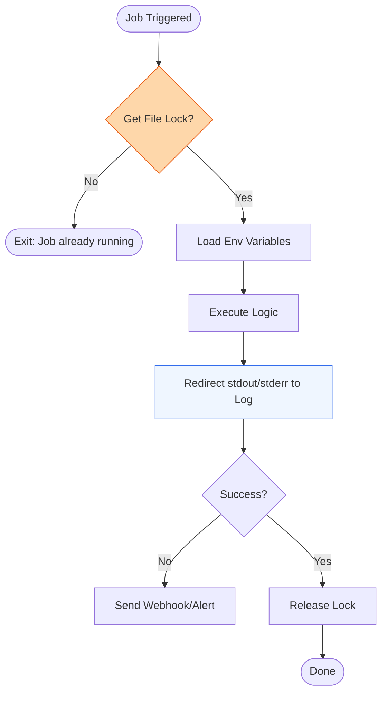

# 🏗️ Level 02: Intermediate Automation Scheduling

> **"A job that fails silently is worse than no job at all. At the intermediate level, we shift from 'just running it' to 'ensuring it runs correctly, safely, and visibly'."**



## 📚 Overview
Intermediate scheduling moves beyond simple syntax into **Reliability Engineering**. Cron is notorious for having a "Bare Bones" environment—it doesn't inherit your `PATH`, your aliases, or your environment variables. Furthermore, a cron job has no concept of "Self-Awareness"; if a job scheduled for every minute takes 5 minutes to run, cron will happily start 5 overlapping instances, potentially corrupting your database or exhausting your RAM.

## 🎓 Learning Objectives

- ✅ Implement **Overlap Prevention** using the `flock` utility.
- ✅ Handle **Environment Variables** within crontab.
- ✅ Configure robust **Logging** for forensic analysis.
- ✅ Use **Python** libraries to manage crontabs programmatically.
- ✅ Implement **Success/Failure notifications** via webhooks.

---

## 🛠️ The "Robust" Crontab Pattern

Instead of:
`* * * * * /opt/scripts/sync.sh`

Use this:
`* * * * * flock -n /tmp/sync.lock /opt/scripts/sync.sh >> /var/log/jobs/sync.log 2>&1`

### Why?
1. **flock -n**: Tries to get a lock on a file. If it's already locked (job still running), it exits immediately.
2. **>> ... 2>&1**: Captures both standard output and errors into a single timestamp-friendly log.

---

## 🏗️ Boilerplate: Python Crontab Manager

Managing cron jobs via the command line can be error-prone. This Python script uses the `python-crontab` library to add, remove, and list jobs programmatically.

**Filename**: `cron_manager.py`
```python
from crontab import CronTab

# Initialize for the current user
cron = CronTab(user=True)

# Create a new job
job = cron.new(command='python3 /path/to/script.py', comment='Log-Rotation')

# Set schedule
job.minute.every(15)

# Write to crontab
cron.write()
print("Job 'Log-Rotation' added to crontab.")
```

---

## ❓ Interview Preparation (Intermediate)

1. **Q: How do you pass an environment variable like 'DB_SECRET' to a cron job?**
   *A: You can define it directly in the crontab file above the job definitions (e.g., `DB_SECRET=xyz`), or source an environmental file within the shell command: `* * * * * . /etc/environment; /my/script.sh`.*

2. **Q: What is 'Race Condition' in scheduling?**
   *A: It's when two instances of the same job run at once and fight over the same resource (like a database row or a file). This is solved using a 'Lock' (Mutually Exclusive).*

3. **Q: Why are absolute paths (/usr/bin/python3 instead of python3) recommended in cron?**
   *A: Because cron's `PATH` variable is very limited. If your script relies on a custom `PATH` set in your `.bashrc`, cron will not see it.*

---

## 📝 Practice Challenge
Create a Python script that searches the crontab and removes any job that has the word "Legacy" in the comment.

---

Proceed to: **[03. Advanced Distributed Job Orchestration](../03-Advanced-Distributed-Job-Orchestration/README.md)** →
Node: Moving to cloud-native and high-precision orchestration.
