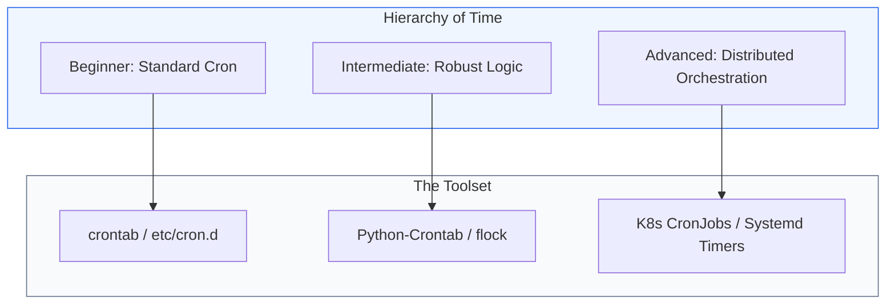

# 🕒 Module 04: Job Scheduling & Cron

> **"Infrastructure never sleeps—but it does have a schedule. Whether it's a midnight backup, an hourly cleanup, or a sub-second API poll, mastering time-based automation is the heartbeat of DevOps."**

## 📚 Overview

Job scheduling is the art of performing tasks at precise intervals without human intervention. This module explores the evolution of scheduling, from the 50-year-old `cron` utility to modern, distributed orchestration in Kubernetes. You will learn not just the syntax, but the "Professional Patterns" required to prevent jobs from overlapping, missing logs, or failing silently across a fleet of servers.

## 🎓 Learning Objectives

By the end of this module, you will:
- ✅ Master the **Crontab Syntax** for precise time targeting.
- ✅ Implement **Overlap Prevention** using file locks (`flock`).
- ✅ Build programmatic schedulers in **Python** and **Go**.
- ✅ Orchestrate **Kubernetes CronJobs** for cloud-native workloads.
- ✅ Migrate legacy cron jobs to modern **Systemd Timers**.

---

## 📂 Module Structure

| Level                                                        | Topic                | Description                                                          |
| :----------------------------------------------------------- | :------------------- | :------------------------------------------------------------------- |
| [01. Beginner](./01-Beginner-Cron-Basics/)                   | **Cron Foundations** | The crontab syntax, basic backups, and local scheduling.             |
| [02. Intermediate](./02-Intermediate-Automation-Scheduling/) | **Robust Execution** | Logging, Environment variables, and Locking mechanisms.              |
| [03. Advanced](./03-Advanced-Distributed-Job-Orchestration/) | **Enterprise Jobs**  | Distributed Workers, K8s CronJobs, and High-Precision Go schedulers. |

---

## 🔍 Discovery Report: Real-World Examples in this Repo

During our system scan, we identified several instances where scheduling logic is already being applied. Use these as reference implementations:

1.  **Shell Crontab Manager**: `Boilerplate/1-Beginner/Shell/Shell-Vim-Crash-Course-boilerplate_crontab_manager.sh`
2.  **K8s CronJob Deep Dive**: `2-Intermediate/03-Phase-3/01-Container-Orchestration/Intermediate/CronJobs/`
3.  **Systemd Timer Specs**: `2-Intermediate/01-Phase-1/02-Linux/System-Administration/01-Systemd-and-Services/01-Unit-File-Fundamentals/README.md`
4.  **Interval Polling (Sleep Loops)**: `Labs/Play_Ground/Shell-Scripting/02-API-Polling.md`
5.  **Log Rotation Timers**: `2-Intermediate/01-Phase-1/02-Linux/System-Administration/05-Log-Management/README.md`

---

## 🚀 The "DevOps Schedule" Professional Pattern

Senior engineers don't just "Add to crontab." They use a wrapper pattern to ensure visibility.

**The Pro Standard**:
1. **Redirect**: Always redirect `stdout` and `stderr` to a dated log file.
2. **Lock**: Use `flock` to ensure if a 1-hour job takes 2 hours, a second instance doesn't start and corrupt the data.
3. **Notify**: Add a `trap` or a webhook call at the end of the script to notify Slack/Teams if the exit status is non-zero.

---

## 📝 Common Visuals Reference
*For the internal workshop, refer to the following screenshots in the `/images` folder:*
- `crontab_edit_view.png`: Interpreting the `crontab -e` interactive shell.
- `k8s_dashboard_cron.png`: Monitoring Job success/failure in the Kubernetes UI.

---

Proceed to: **[01. Beginner Cron Basics](./01-Beginner-Cron-Basics/README.md)** →
Node: This link points to the foundational level.
