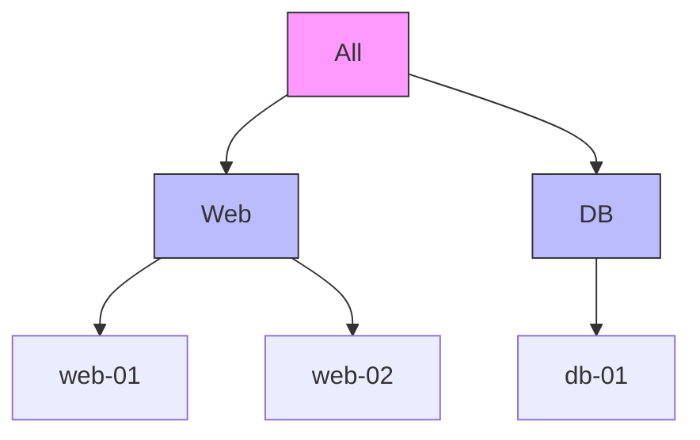

# 🟢 Level 1: Static vs. Dynamic Basics

## 📖 Introduction

Every Ansible journey starts with a static inventory, typically a file named `hosts` or `hosts.ini`. While simple, this approach fails as soon as your server count grows or your IPs change.

### 1. The Static Approach (`hosts.ini`)
In this model, you manually list your servers.

```ini
[webservers]
web-01 ansible_host=192.168.1.10
web-02 ansible_host=192.168.1.11

[dbservers]
db-01 ansible_host=192.168.1.20
```

**Pros**: Simple, no dependencies.
**Cons**: Manual, error-prone, doesn't scale.

### 2. The Dynamic Format (JSON)
Ansible can read inventory from any executable that returns data in a specific JSON format. This is the foundation of dynamic management.

```json
{
    "webservers": {
        "hosts": ["web-01", "web-02"],
        "vars": {
            "http_port": 80
        }
    },
    "_meta": {
        "hostvars": {
            "web-01": {"ansible_host": "10.0.0.1"},
            "web-02": {"ansible_host": "10.0.0.2"}
        }
    }
}
```

## 🛠️ Essential Commands

| Command | Purpose |
|---------|---------|
| `ansible-inventory --list` | View the entire inventory in JSON format |
| `ansible-inventory --graph` | View a visual tree of groups and hosts |
| `ansible all -m ping -i hosts.ini` | Test connectivity using a specific inventory file |

## 📐 Inventory Hierarchy Diagram



---

## 🚀 Hands-on Lab: From Static to Graph

1. Create a `hosts.ini` file (see boilerplate).
2. Run `ansible-inventory -i hosts.ini --graph`.
3. Try adding a child group:
   ```ini
   [production:children]
   webservers
   dbservers
   ```
4. Run the graph command again to see the hierarchy change.

---

## ❓ Knowledge Check
1. Why is `_meta` used in JSON inventory?
2. How do you tell Ansible to use a specific inventory file in a playbook?

---
**Next Step**: [Level 2: Plugin-Based Inventory Management](../02-Plugin-Based-Inventory-Management/) 🟡
