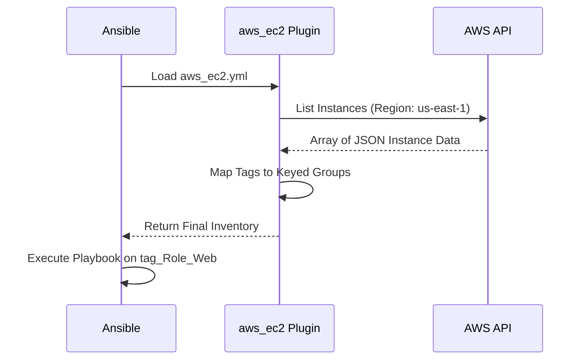

# 🟡 Level 2: Plugin-Based Inventory Management

## 📖 Overview

Inventory Plugins are the modern successor to "inventory scripts." They are more secure, faster, and integrated directly into Ansible's core. In this level, we focus on the **AWS EC2** plugin, though the concepts apply to Azure, GCP, and VMware.

## 🛠️ The `aws_ec2` Plugin

To use a plugin, you create a YAML file that ends with `aws_ec2.yaml` or `aws_ec2.yml`. Ansible detects this suffix and uses the correct plugin.

### Key Configuration Sections:

1.  **Plugin Declaration**: `plugin: aws_ec2`
2.  **Regions**: Which AWS regions to scan.
3.  **Filters**: Only include instances that match specific criteria (e.g., `instance-state-name: running`).
4.  **Keyed Groups**: Automatically create groups based on tags.

### Example: The "keyed_groups" Power
Instead of manually creating a `[web]` group, you can tell Ansible: "Every instance with a tag `Role: Web` belongs in a group called `tag_Role_Web`."

## 📐 Dynamic Discovery Workflow



---

## 🚀 Boilerplate: `aws_ec2.yml`

```yaml
plugin: aws_ec2
regions:
  - us-east-1
  - us-west-2

# Only find running instances
filters:
  instance-state-name: : running

# Group hosts by their tags
keyed_groups:
  - prefix: tag
    key: tags

# Set the inventory hostname to the Private IP (typical for internal management)
hostnames:
  - private-ip-address

# Set common variables for all discovered hosts
compose:
  ansible_user: ec2-user
```

---

## 🛠️ Setup & Execution

1.  **Dependencies**: Install the required Python library:
    ```bash
    pip install boto3 botocore
    ```
2.  **Authentication**: Ensure your AWS CLI is configured or environment variables (`AWS_ACCESS_KEY_ID`, etc.) are set.
3.  **Validation**:
    ```bash
    ansible-inventory -i aws_ec2.yml --graph
    ```

## 🏆 Professional Tip: Environment Variables
Never hardcode AWS credentials in your inventory file. Use `~/.aws/credentials` or an IAM Instance Role if running Ansible from an EC2 management node.

---
**Next Step**: [Level 3: Custom Inventory Scripts & Caching](../03-Custom-Inventory-Scripts-and-Caching/) 🔴
