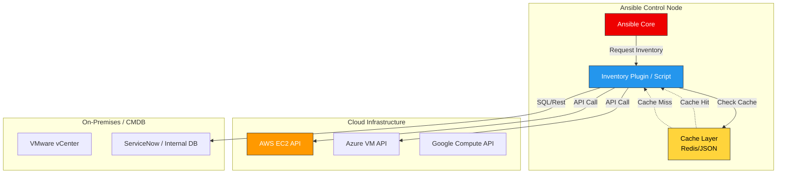

# 🗃️ Ansible Dynamic Inventory Deep Dive

> **"Stop hardcoding IPs. In a cloud-native world, your inventory should be as fluid as your infrastructure. Treat your servers like cattle, not pets."**

## 📚 Overview

Modern infrastructure is ephemeral. Servers are created and destroyed by Auto Scaling Groups, Kubernetes clusters, and CI/CD pipelines. Maintaining a static `hosts.ini` file in such an environment is not just difficult—it's impossible.

**Dynamic Inventory** is the Ansible mechanism that allows your automation to query an external "Source of Truth" (like AWS, Azure, GCP, or a CMDB) to discover your infrastructure in real-time.

### The Evolution of Inventory Management

1. **Static (`hosts`)**: Manual lists of IPs. Great for homelabs, bad for production.
2. **Scripts (`.py`)**: Legacy method. Executable scripts that output JSON. Flexible but hard to maintain.
3. **Plugins (`.yml`)**: The modern standard. YAML configuration files that leverage Ansible's core code for high performance and easier setup.

---

## 🏗️ High-Level Architecture

How does Ansible know where your servers are?

---

## 🎯 Learning Objectives

By the end of this deep dive, you will be able to:

- ✅ **Architect** a dynamic inventory strategy for multi-cloud environments.
- ✅ **Implement** the `aws_ec2` plugin with advanced filters and keyed groups.
- ✅ **Develop** custom python inventory scripts for legacy systems.
- ✅ **Optimize** playbook execution time using inventory caching.
- ✅ **Debug** inventory issues using `ansible-inventory` graph tools.

---

## 🗺️ Module Structure

| Level | Topic | Description |
| :--- | :--- | :--- |
| **[🟢 Level 1](./Part-01-Inventory-Foundations/01-Static-vs-Dynamic-Basics/)** | **Basics & JSON Protocol** | Understanding the internal data structure (`hostvars`, `_meta`) that drives dynamic inventory. |
| **[🟡 Level 2](./Part-02-Dynamic-Plugins/01-Plugin-Based-Inventory-Management/)** | **Plugins & Cloud** | The modern way. Using AWS/Azure plugins, grouping by tags, and filtering instances. |
| **[🔴 Level 3](./Part-03-Advanced-Strategies/01-Custom-Inventory-Scripts-and-Caching/)** | **Custom Scripts & Performance** | Writing Python scripts for custom CMDBs and tuning cache for speed. |

---

## ⚖️ Comparison: When to use what?

| Feature | Static (`hosts.ini`) | Dynamic Script (`.py`) | Inventory Plugin (`.yml`) |
| :--- | :--- | :--- | :--- |
| **Complexity** | Low | High | Medium |
| **Performance** | Instant | Variable (Script dependent) | High (Optimized Caching) |
| **Flexibility** | Low | Infinite (Wait, Python?) | High (Configurable) |
| **Maintenance** | High (Manual Updates) | High (Code Maintenance) | Low (Just Config) |
| **Use Case** | Homelab, Fixed IPs | Legacy CMDBs, Strange APIs | AWS, Azure, GCP, VMware |

---

## 🛠️ Prerequisites

To fully participate in the hands-on labs, you will need:

1. **Python 3.8+** installed on your control node.
2. **Boto3** (`pip install boto3 botocore`) for AWS interaction.
3. **Ansible 2.9+** (preferably ansible-core 2.11+).
4. Access to a Cloud Provider (AWS Free Tier works great) **OR** a willingness to mock the data with the provided scripts.

---

## 🎓 Career Readiness

**Interview Question:** "We have 5,000 servers in AWS that autoscale daily. How do you ensure Ansible always targets the correct active servers?"

**Strong Answer:** "I would implement the `aws_ec2` dynamic inventory plugin. I'd configure `keyed_groups` to organizing hosts by tags (e.g., `tag_Role_Web`), ensuring that even as IPs change, the group membership remains accurate. To prevent API throttling and improve speed, I would enable caching with a Redis or JSON backend in `ansible.cfg`."

---

## 🏢 Reference Library
*Deep-dive documentation for at-a-glance problem solving.*

*   **[Inventory Architecture](./REFERENCE/Ansible-Inventory-Core-Ref.md)**: Static vs Dynamic comparison and JSON protocol details.
*   **[Cloud Plugins Reference](./REFERENCE/Ansible-Cloud-Resource-Ref.md)**: AWS, Azure, and GCP plugin manual with keyed group standards.
*   **[Security & RBAC](./REFERENCE/Ansible-Security-RBAC-Ref.md)**: Vault encryption, environment secrets, and tag-based access control.

---

**Next Step**: Start with **[Level 1: Static vs. Dynamic Basics](./Part-01-Inventory-Foundations/01-Static-vs-Dynamic-Basics/)** 🚀
