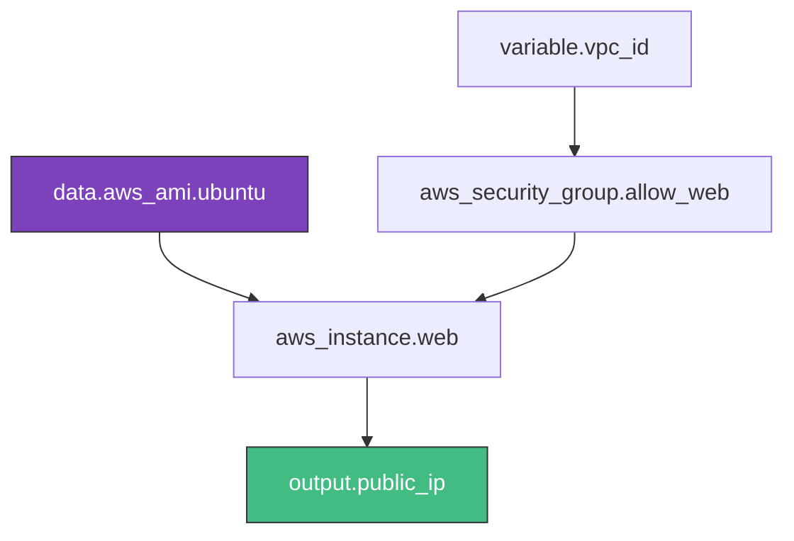

# 🟢 Level 1: Foundations & Variables

## 📖 Overview

At the foundation of Terraform logic are **Variables** (inputs), **Outputs** (exports), and **Data Sources** (read-only queries). Mastering these is the prerequisite for building reusable infrastructure.

## 🧱 The Three Pillars of HCL Logic

### 1. Input Variables (`variables.tf`)
Variables allow you to parameterize your code. Instead of hardcoding an instance type, you define it as a variable.

```hcl
variable "instance_type" {
  description = "EC2 instance size"
  type        = string
  default     = "t3.micro"
}
```

### 2. Output Values (`outputs.tf`)
Outputs provide information about your infrastructure. They are essential for sharing data between modules or for end-user visibility.

```hcl
output "lb_dns_name" {
  value = aws_lb.main.dns_name
}
```

### 3. Data Sources
Data sources allow Terraform to use information defined outside of Terraform, or defined by another separate Terraform configuration.

```hcl
data "aws_ami" "ubuntu" {
  most_recent = true
  owners      = ["099720109477"] # Canonical
  
  filter {
    name   = "name"
    values = ["ubuntu/images/hvm-ssd/ubuntu-focal-20.04-amd64-server-*"]
  }
}
```

## 📐 The Resource Dependency Graph

Terraform automatically builds a graph of your infrastructure to determine the order of creation.



---

## 🚀 Hands-on Lab: Variables & Data Sources

1. **Setup**: Create a directory with a `variables.tf` and `main.tf`.
2. **Define**: Add a variable for `region`.
3. **Query**: Use a data source to find the latest Amazon Linux 2 AMI.
4. **Link**: Create an `aws_instance` that uses the AMI from the data source and the region from the variable.
5. **Observe**: Run `terraform plan` and see how Terraform resolves the data source before showing the plan.

---

## 🛠️ Best Practices
- **Descriptions**: Always provide a `description` for your variables.
- **Type Constraints**: Use `type = list(string)` or `type = map(any)` to enforce data integrity.
- **Sensitive**: Mark credentials as `sensitive = true` to hide them from terminal output.

---
**Next Step**: [Level 2: Modules & Environment Isolation](../02-Modules-and-Environment-Isolation/) 🟡
