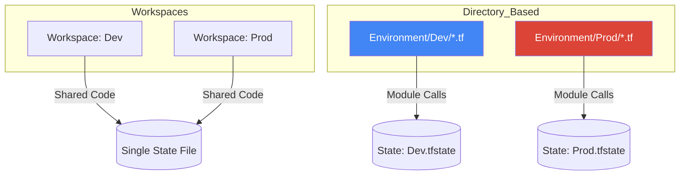

# 🟡 Level 2: Modules & Environment Isolation

## 📖 Overview

As your infrastructure grows, you will find yourself repeating the same code for VPCs, S3 buckets, or EC2 clusters. **Modules** allow you to bundle these resources into a single package. Additionally, we'll explore how to handle multiple environments (Dev, Staging, Prod) without duplicating code.

## 📦 What is a Module?

A module is just a directory containing `.tf` files. The "Root Module" is where you run `terraform apply`. "Child Modules" are called from the root to perform specific tasks.

### The Module Calling Pattern:
```hcl
module "network" {
  source = "./modules/vpc"
  
  region     = "us-east-1"
  cidr_block = "10.0.0.0/16"
}
```

## ⚖️ `count` vs. `for_each`

When you need multiple instances of a resource, you have two choices:

| Feature | `count` | `for_each` |
|---------|---------|------------|
| **Logic** | Integer-based (0, 1, 2) | Map or Set-based |
| **Best For** | Identical resources | Differentiated resources |
| **Risk** | Deleting item 0 shifts the index for all others. | No index shift; items are identified by key. |

**Pro Tip**: Default to `for_each` for anything that might change or grow.

## 📐 Environment Isolation Strategies



### Recommendation:
- Use **Workspaces** for quick experiments or small teams.
- Use **Separate Directories** (with shared modules) for production-grade enterprise projects.

---

## 🚀 Hands-on Lab: The Reusable Module

1. Create a `modules/ec2_cluster` folder.
2. Put a simple `aws_instance` resource inside it.
3. In your root `main.tf`, call the module twice: once for `web` and once for `app`.
4. Use `for_each` to pass different tags to each call of the module.

---

## ❓ Knowledge Check
1. How do you pass an output from Module A to an input of Module B?
2. What happens to the state when you rename a module in your code?

---
**Next Step**: [Level 3: Advanced State & DRY Patterns](../03-Advanced-State-and-DRY-Patterns/) 🔴
