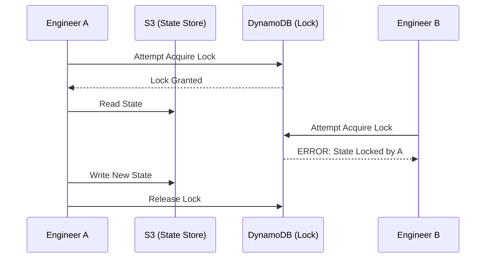

# 🔴 Level 3: Advanced State & DRY Patterns

## 📖 Overview

In large organizations, Terraform manages business-critical assets. A corrupt state file or a race condition (two people running `apply` at once) can be catastrophic. This level covers **State Resilience**, **State Manipulation**, and the **DRY (Don't Repeat Yourself)** paradigm.

## 🔒 Remote State Locking

Storing state locally (`terraform.tfstate`) is a security risk and prevents collaboration. The standard pattern for AWS is **S3 for Storage** and **DynamoDB for Locking**.



---

## 🚀 Boilerplate: `backend_locking.tf`

```hcl
terraform {
  backend "s3" {
    bucket         = "my-company-tf-state"
    key            = "prod/network/terraform.tfstate"
    region         = "us-east-1"
    
    # DynamoDB table must have a Primary Key named 'LockID'
    dynamodb_table = "terraform-state-locking"
    encrypt        = true
  }
}
```

---

## 🏗️ The `moved` Block (Refactoring Without Pain)

Previously, renaming a resource in code meant Terraform would delete the old one and create a new one. The `moved` block tells Terraform: "The resource that was `aws_instance.old_name` is now `aws_instance.new_name`. Just update the state; don't touch the real infrastructure."

```hcl
moved {
  from = aws_instance.web_server
  to   = aws_instance.frontend_cluster["web"]
}
```

---

## 🌵 DRY with Terragrunt

As you scale to 50+ modules across 10 AWS accounts, managing `backend` and `provider` blocks becomes tedious. **Terragrunt** is a thin wrapper that allows you to:
1.  Define your backend/provider **once** in a root file.
2.  Inherit it in all sub-directories.
3.  Execute `run-all plan` across multiple directories.

### Conceptual `terragrunt.hcl`:
```hcl
# Root terragrunt configuration
remote_state {
  backend = "s3"
  config = {
    bucket = "my-tf-state-${get_aws_account_id()}"
    # ... other config
  }
}
```

## 🛠️ State Disaster Recovery
If someone manually deletes a resource in the AWS Console, your state becomes "out of sync." 
- `terraform plan`: Shows the discrepancy.
- `terraform refresh`: Updates the state file with the current reality.
- `terraform import`: Brings an existing unmanaged resource into Terraform control.

---
## 🎓 Interview Preparation
- **Q**: "What do you do if your Terraform lock gets stuck?"
- **A**: "I check who has the lock via the error message, verify their process isn't running, and then use `terraform force-unlock <LOCK_ID>` as a last resort."

---
**Congratulations!** You are now equipped for enterprise-grade Infrastructure as Code. 🏗️
