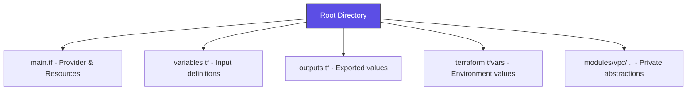

# 🏗️ Infrastructure as Code (Terraform) Patterns

> **"Code is your source of truth. Patterns are your defense against technical debt."**

## 📚 Overview

Terraform is more than just "writing resources." In a professional setting, how you structure your code determines whether your infrastructure is manageable or a "monolith of spaghetti." This module moves beyond `main.tf` and into the world of **scalable, reusable, and secure IaC patterns**.

## 🎯 Learning Objectives

By the end of this module, you will:
- ✅ Design robust variable and output structures.
- ✅ Build **Reusable Modules** to abstract complex infrastructure.
- ✅ Implement **Workspace** or **Directory-based** environment isolation.
- ✅ Master **Advanced State Management** (imports, moves, and remote backends).
- ✅ Understand **DRY (Don't Repeat Yourself)** principles using Terragrunt or Native HCL.

## 🗺️ Module Structure

1.  **[🟢 Level 1: Foundations & Variables](./01-Foundations-and-Variables/)**
    - Input vs. Output variables.
    - Local values (DRY inside a module).
    - Data sources: Reading from existing infra.
2.  **[🟡 Level 2: Modules & Environment Isolation](./02-Modules-and-Environment-Isolation/)**
    - Creating and calling local/remote modules.
    - `count` vs. `for_each` (The "Scaling" logic).
    - Isolation strategies: Workspaces vs. Separate State files.
3.  **[🔴 Level 3: Advanced State & DRY Patterns](./03-Advanced-State-and-DRY-Patterns/)**
    - Remote State Locking (S3 + DynamoDB).
    - State manipulation: `terraform state mv`, `import`.
    - Introduction to **Terragrunt** for multi-account management.

---

## 🏗️ Professional Pattern: The "Standard Layout"

A professional Terraform project almost never fits in one file.

## 🔍 Real-World DevOps Story: "The Accidental Deletion"
*A developer once ran `terraform destroy` in what they thought was 'Staging', but was actually 'Production' because they were using a single state file. We now follow the **Strict Isolation Pattern**, ensuring Production state is physically separate from Staging.*

---

## 📋 References to Existing Implementations
Check these files in your repository for context:
- **Terraform Fundamentals**: `Boilerplate/2-Intermediate/Terraform/Terraform-Fundamentals-main.tf`
- **Module Usage**: `Boilerplate/2-Intermediate/Terraform/Terraform-Modules-module_usage.tf`
- **State Management**: `Boilerplate/2-Intermediate/Terraform/Terraform-State-Management-backend.tf`
- **Project Structure**: `Labs/Play_Ground/Terraform/06-Day-Project_Structure/README.md`

---

## 🎓 Career Readiness
- **Interview Question**: "Explain the difference between `count` and `for_each` and why you would prefer one over the other."
- **Certification Tip**: The Terraform Associate exam focuses heavily on State management and the order of operations (`init` -> `plan` -> `apply`).

---
**Next Step**: Start with [Level 1: Foundations & Variables](./01-Foundations-and-Variables/) 🚀
