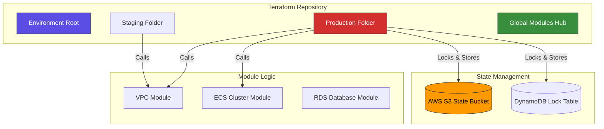

# 🏗️ Terraform Design Patterns & Modular Architecture

> **"Infrastructure as Code is not just about writing resources; it's about software engineering applied to hardware. Patterns are your defense against technical debt and the 'Monolith of Spaghetti'."**

## 📚 Overview

In an enterprise environment, a single `main.tf` file is a liability. As you scale from 10 to 10,000 resources, you need a strategy for **reuse**, **isolation**, and **state resilience**.
This module covers the professional design patterns used by SRE and DevOps teams to build maintainable, "vibrant" infrastructure.

### The IaC Maturity Model

1. **Level 1: The Monolith**: Everything in one directory. Hard to test, easy to break.
2. **Level 2: The Modularization**: Infrastructure abstracted into reusable components.
3. **Level 3: The Architecture**: Strictly isolated environments, remote state locking, and DRY (Don't Repeat Yourself) workflows.

---

## 🏗️ High-Level Architecture

How a professional Terraform project is organized to ensure stability and security.

---

## 🎯 Learning Objectives

By the end of this deep dive, you will be able to:

- ✅ **Architect** a multi-environment infrastructure using directory-based isolation.
- ✅ **Build** high-quality modules with strict input validation and meaningful outputs.
- ✅ **Manage** complex resource scaling using `for_each` and dynamic blocks.
- ✅ **Secure** infrastructure state with remote locking and encryption.
- ✅ **Refactor** infrastructure safely using `moved` blocks without resource recreation.

---

## 🗺️ Module Structure

| Part | Topic | Description |
| :--- | :--- | :--- |
| **[🟢 Part 1](./Part-01-Core-Fundamentals/01-Foundations-and-Variables/)** | **Core Fundamentals** | Beyond basics: Variable validation, data source chaining, and dependency graphs. |
| **[🟡 Part 2](./Part-02-Modular-Architecture/01-Modules-and-Environment-Isolation/)** | **Modular Architecture** | Building the "LEGO blocks" of infra. Modules, scaling logic, and environment splitting. |
| **[🔴 Part 3](./Part-03-Advanced-Workflows/01-Advanced-State-and-DRY-Patterns/)** | **Advanced Workflows** | Enterprise patterns: State Locking, Terragrunt, and refactoring techniques. |

---

## ⚖️ Comparison: Scaling Strategies

| Strategy | Count (Integer) | For_Each (Map) | Dynamic Blocks |
| :--- | :--- | :--- | :--- |
| **Use Case** | 10 identical instances | Servers named web, app, db | Nested config (Security Rules) |
| **Brittleness** | High (Index shifts delete resources) | Low (Key-based identity) | Moderate (Complexity) |
| **Readability** | High | High | Low |
| **Recommendation** | Avoid for active resources | **Industry Standard** | Use for sub-resources |

---

## 🛠️ Prerequisites

To participate in the advanced labs:

1. **Terraform CLI 1.3+** (Required for `moved` blocks).
2. **AWS Account** (Free tier) with CLI configured.
3. **Basic HCL Knowledge** (Understanding resources and providers).

---

## 🎓 Career Readiness

**Interview Question:** "What is the danger of using `count` to create a list of users or instances in Terraform?"

**Strong Answer:** "`count` is index-based. If you have a list of three users and you remove the first one, Terraform sees that the index has shifted. It will attempt to delete and recreate the remaining two users because their indices no longer match. This is why we prefer `for_each` with a map; it uses unique keys to identify resources, preventing accidental destruction during list modifications."

---

**Next Step**: Start with **[Part 1: Core Fundamentals](./Part-01-Core-Fundamentals/01-Foundations-and-Variables/)** 🚀
