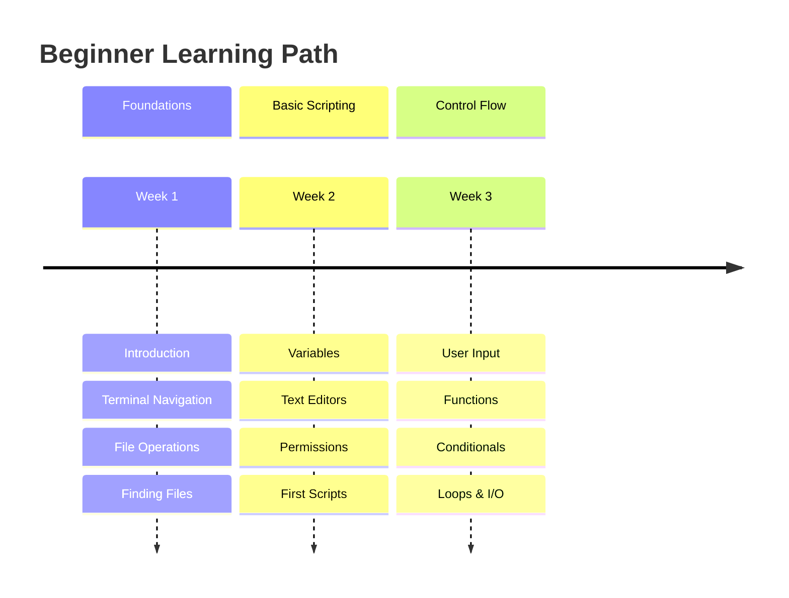
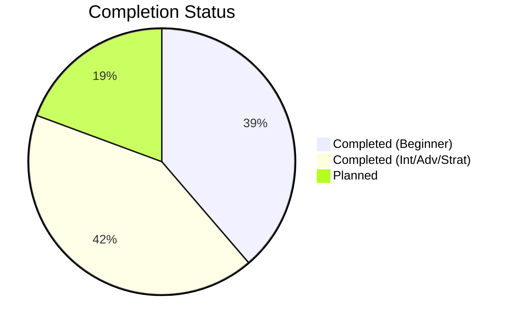

# 🎯 Complete Automation Curriculum Index

> **"From zero to automation hero - Your complete journey through shell scripting mastery"**

## 📖 Navigation Guide

This document serves as the master index for all 62 automation topics organized across three progressive learning levels. Each section includes topic descriptions, key learnings, and direct navigation links.

---

## 🟢 LEVEL 1: BEGINNER (24 Topics)

**Target Audience**: New to shell scripting, DevOps beginners  
**Duration**: 3-4 weeks  
**Prerequisites**: Basic computer literacy  

### Module Structure

### Topics Overview

#### 01. Introduction
**📂 Path**: `1-Beginner/02-Phase-2/01-Automation/01-Shell-Scripting/01-Introduction/`  
**🎯 Learning Goals**:
- Understand shell scripting fundamentals
- Learn about different shell types (Bash, Zsh, Sh)
- Write your first "Hello World" script
- Understand shebang (`#!/bin/bash`)
- Execute scripts using bash vs. ./

**🔑 Key Concepts**: Shebang, shell types, execution methods, POSIX compliance  
**⏱️ Time**: 2-3 hours  
**✅ Status**: Complete

---

#### 02. Terminal and Finder
**📂 Path**: `1-Beginner/02-Phase-2/01-Automation/01-Shell-Scripting/02-Terminal-and-Finder/`  
**🎯 Learning Goals**:
- Master terminal navigation (cd, ls, pwd)
- Understand Unix filesystem hierarchy
- Differentiate absolute vs. relative paths
- Use keyboard shortcuts efficiently
- Customize terminal prompt

**🔑 Key Concepts**: Filesystem hierarchy, paths, navigation, tab completion  
**⏱️ Time**: 3-4 hours  
**✅ Status**: Complete

---

#### 03. Basic File Manipulation
**📂 Path**: `1-Beginner/02-Phase-2/01-Automation/01-Shell-Scripting/03-Basic-File-Manipulation/`  
**🎯 Learning Goals**:
- Create files and directories (touch, mkdir)
- Copy files safely (cp with flags)
- Move and rename (mv operations)
- Delete responsibly (rm safety practices)
- Understand file operation flags

**🔑 Key Concepts**: touch, mkdir, cp, mv, rm, safety practices  
**⏱️ Time**: 4-5 hours  
**✅ Status**: Complete

---

#### 04. Job Scheduling and Cron
**📂 Path**: `1-Beginner/02-Phase-2/01-Automation/04-Job-Scheduling-and-Cron/`  
**🎯 Learning Goals**:
- Master the `* * * * *` crontab syntax
- Implement overlap prevention using `flock`
- Manage jobs programmatically in Python
- Orchestrate Kubernetes CronJobs

**🔑 Key Concepts**: Crontab, flock, Kubernetes CronJob, robfig/cron  
**⏱️ Time**: 6-8 hours  
**✅ Status**: Complete

---

#### 05. Event-Driven Webhooks
**📂 Path**: `1-Beginner/02-Phase-2/01-Automation/05-Event-Driven-Webhooks/`  
**🎯 Learning Goals**:
- Design synchronous vs. asynchronous event handlers
- Implement HMAC-SHA256 signature verification
- Build distributed event pipelines with task queues
- Manage idempotency and retry logic

**🔑 Key Concepts**: Webhooks, HMAC, Event-Driven, Async processing, Redis  
**⏱️ Time**: 8-10 hours  
**✅ Status**: Complete

---

#### 06. Ansible Dynamic Inventory
**📂 Path**: `1-Beginner/02-Phase-2/01-Automation/06-Ansible-Dynamic-Inventory/`  
**🎯 Learning Goals**:
- Efficiently manage dynamic cloud fleets
- Implement Inventory Plugins for AWS/Azure/GCP
- Organize hosts using Keyed Groups and Tags
- Build custom high-performance Python inventory scripts

**🔑 Key Concepts**: Dynamic Inventory, Inventory Plugins, Keyed Groups, Caching  
**⏱️ Time**: 8-10 hours  
**✅ Status**: Complete

---

#### 07. Terraform Patterns
**📂 Path**: `1-Beginner/02-Phase-2/01-Automation/07-Terraform-Patterns/`  
**🎯 Learning Goals**:
- Master Terraform Module architecture
- Implement secure Remote State Locking
- Use `for_each` and `count` for dynamic scaling
- Build DRY (Don't Repeat Yourself) infrastructure with Terragrunt

**🔑 Key Concepts**: Modules, State Locking, DRY, Terragrunt, Workspaces  
**⏱️ Time**: 10-12 hours  
**✅ Status**: Complete

---

#### 08. Observability Fundamentals
**📂 Path**: `1-Beginner/02-Phase-2/07-Observability-Fundamentals/`  
**🎯 Learning Goals**:
- Understand MELT (Metrics, Events, Logs, Traces)
- Implement manual system health checks
- Master basic log analysis and resource monitoring

**🔑 Key Concepts**: MELT, Health Checks, curl, tail/grep  
**⏱️ Time**: 4-6 hours  
**✅ Status**: Complete

---

#### 09. GitOps Fundamentals
**📂 Path**: `1-Beginner/02-Phase-2/08-GitOps-Fundamentals/`  
**🎯 Learning Goals**:
- Master "Git as Source of Truth" concept
- Differentiate between Push-based and Pull-based CI/CD
- Understand Declarative configuration management

**🔑 Key Concepts**: GitOps, Push vs Pull, Declarative  
**⏱️ Time**: 4-6 hours  
**✅ Status**: Complete

---

#### 10. Compliance as Code Foundations
**📂 Path**: `1-Beginner/02-Phase-2/09-Compliance-as-Code-Foundations/`  
**🎯 Learning Goals**:
- Understand Security vs. Compliance
- Master CIS Benchmarks and checklists
- Introduction to Policy as Code concepts

**🔑 Key Concepts**: CaC, CIS Benchmarks, Audit Checklists  
**⏱️ Time**: 4-6 hours  
**✅ Status**: Complete

---

#### 11. Container Security Basics
**📂 Path**: `1-Beginner/02-Phase-2/10-Container-Security-Basics/`  
**🎯 Learning Goals**:
- Understand Container Supply Chain security
- Perform manual Dockerfile audits
- Master basic image vulnerability scanning

**🔑 Key Concepts**: CVEs, Image Scanning, Least Privilege  
**⏱️ Time**: 4-6 hours  
**✅ Status**: Complete

---

#### 12. Searching in Files
**📂 Path**: `1-Beginner/02-Phase-2/01-Automation/01-Shell-Scripting/05-Searching-in-Files/`  
**🎯 Learning Goals**:
- Use grep for pattern matching
- Search files with find command basics
- Use locate for fast file finding
- Understand basic regular expressions
- Combine search commands

**🔑 Key Concepts**: grep, find basics, locate, pattern matching  
**⏱️ Time**: 3-4 hours  
**✅ Status**: Complete

---

#### 13. Paging Files
**📂 Path**: `1-Beginner/02-Phase-2/01-Automation/01-Shell-Scripting/06-Paging-Files/`  
**🎯 Learning Goals**:
- View large files with less and more
- Use head and tail for file excerpts
- Follow log files in real-time (tail -f)
- Navigate pager interfaces
- Extract specific lines

**🔑 Key Concepts**: less, more, head, tail, log monitoring  
**⏱️ Time**: 2-3 hours  
**✅ Status**: Complete

---

#### 14. Man Pages
**📂 Path**: `1-Beginner/02-Phase-2/01-Automation/01-Shell-Scripting/07-Man-Pages/`  
**🎯 Learning Goals**:
- Read and navigate manual pages
- Understand man page sections (1-9)
- Search within man pages
- Use --help flags effectively
- Find documentation alternatives (info, tldr)

**🔑 Key Concepts**: man command, documentation, help flags, info pages  
**⏱️ Time**: 2 hours  
**✅ Status**: Complete

---

#### 15. Programs and Commands
**📂 Path**: `1-Beginner/02-Phase-2/01-Automation/01-Shell-Scripting/08-Programs-and-Commands/`  
**🎯 Learning Goals**:
- Understand command types (built-in, external, alias)
- Use which, type, whereis commands
- Understand PATH variable
- Install and locate programs
- Differentiate shell built-ins vs. executables

**🔑 Key Concepts**: which, type, whereis, PATH, built-ins  
**⏱️ Time**: 3 hours  
**✅ Status**: Complete

---

#### 16. Basic Variables
**📂 Path**: `1-Beginner/02-Phase-2/01-Automation/01-Shell-Scripting/09-Basic-Variables/`  
**🎯 Learning Goals**:
- Declare and use variables
- Understand variable scope (local vs. global)
- Use special variables ($?, $@, $#, $*)
- Environment variables (export)
- Variable naming conventions

**🔑 Key Concepts**: Variable declaration, scope, special variables, environment  
**⏱️ Time**: 4 hours  
**✅ Status**: Complete

---

#### 17. Vim Crash Course
**📂 Path**: `1-Beginner/02-Phase-2/01-Automation/01-Shell-Scripting/10-Vim-Crash-Course/`  
**🎯 Learning Goals**:
- Basic vim modes (normal, insert, visual)
- Essential navigation (h,j,k,l)
- File operations (open, save, quit)
- Basic editing (delete, yank, put)
- Survive vim emergencies (:q!)

**🔑 Key Concepts**: Vim modes, navigation, editing, survival commands  
**⏱️ Time**: 3-4 hours  
**✅ Status**: Complete

---

#### 18. File Permissions
**📂 Path**: `1-Beginner/02-Phase-2/01-Automation/01-Shell-Scripting/11-File-Permissions/`  
**🎯 Learning Goals**:
- Understand rwxrwxrwx permission structure
- Use chmod (symbolic and octal notation)
- Change ownership with chown
- Understand umask
- Apply special permissions (setuid, setgid, sticky bit)

**🔑 Key Concepts**: chmod, chown, umask, permissions, ownership  
**⏱️ Time**: 4-5 hours  
**✅ Status**: Complete

---

#### 19. Finally Scripting
**📂 Path**: `1-Beginner/02-Phase-2/01-Automation/01-Shell-Scripting/12-Finally-Scripting/`  
**🎯 Learning Goals**:
- Write your first real automation script
- Implement error handling basics
- Use exit codes properly
- Create reusable script templates
- Follow scripting best practices

**🔑 Key Concepts**: Script structure, error handling, exit codes, best practices  
**⏱️ Time**: 5-6 hours  
**✅ Status**: Complete

---

#### 20. User Input
**📂 Path**: `1-Beginner/02-Phase-2/01-Automation/01-Shell-Scripting/13-User-Input/`  
**🎯 Learning Goals**:
- Read user input with read command
- Handle interactive prompts
- Validate user input
- Use timeout for inputs
- Create menu-driven scripts

**🔑 Key Concepts**: read command, input validation, interactive scripts  
**⏱️ Time**: 3-4 hours  
**✅ Status**: Complete

---

#### 21. Functions
**📂 Path**: `1-Beginner/02-Phase-2/01-Automation/01-Shell-Scripting/14-Functions/`  
**🎯 Learning Goals**:
- Define and call functions
- Pass parameters to functions
- Return values from functions
- Understand function scope
- Create reusable function libraries

**🔑 Key Concepts**: Function definition, parameters, return values, scope  
**⏱️ Time**: 4-5 hours  
**✅ Status**: Complete

---

#### 22. Conditionals
**📂 Path**: `1-Beginner/02-Phase-2/01-Automation/01-Shell-Scripting/15-Conditionals/`  
**🎯 Learning Goals**:
- Master if/elif/else statements
- Use test conditions ([ ], [[ ]])
- Compare strings and numbers
- Check file existence and properties
- Combine conditions (&&, ||)

**🔑 Key Concepts**: if/else, test conditions, comparisons, logical operators  
**⏱️ Time**: 5 hours  
**✅ Status**: Complete

---

#### 23. For Loops
**📂 Path**: `1-Beginner/02-Phase-2/01-Automation/01-Shell-Scripting/16-For-Loops/`  
**🎯 Learning Goals**:
- Iterate over lists with for loops
- Loop through files and directories
- Use C-style for loops
- Implement while and until loops
- Control loop flow (break, continue)

**🔑 Key Concepts**: for loops, while loops, iteration, loop control  
**⏱️ Time**: 4-5 hours  
**✅ Status**: Complete

---

#### 24. Input/Output
**📂 Path**: `1-Beginner/02-Phase-2/01-Automation/01-Shell-Scripting/17-Input-Output/`  
**🎯 Learning Goals**:
- Understand standard streams (stdin, stdout, stderr)
- Redirect output (>, >>)
- Redirect input (<)
- Pipe commands (|)
- Redirect stderr (2>, &>)

**🔑 Key Concepts**: Streams, redirection, pipes, file descriptors  
**⏱️ Time**: 4-5 hours  
**✅ Status**: Complete

---

## 🟡 LEVEL 2 & 3: INTERMEDIATE & ADVANCED (26 Topics)

**Target Audience**: DevOps Engineers, SREs  
**Duration**: 8-10 weeks  
**Prerequisites**: Completed Beginner level

### Topics Overview

#### 25. Multi-Cluster Kubernetes Management
**📂 Path**: `3-Advanced/02-Phase-2/07-Multi-Cluster-Kubernetes/`  
**🎯 Learning Goals**:
- Master ClusterAPI (CAPI) for declarative provisioning
- Implement unified management with Rancher/Anthos/Arc
- Enforce global policies across fleets using OPA Gatekeeper
- Understand multi-cluster networking (Submariner)

**🔑 Key Concepts**: ClusterAPI, Rancher, Fleet Management, OPA, Submariner  
**⏱️ Time**: 12-15 hours  
**✅ Status**: Complete

---

#### 26. AI-Driven Operations (AIOps)
**📂 Path**: `3-Advanced/02-Phase-2/10-AI-Driven-Operations-AIOps/`  
**🎯 Learning Goals**:
- Implement Anomaly Detection with Prometheus/Python
- Leverage LLMs for automated Root Cause Analysis (RCA)
- Build Closed-Loop Remediation pipelines
- Understand Predictive Scaling models

**🔑 Key Concepts**: AIOps, ML, LLM, Anomaly Detection, Remediation  
**⏱️ Time**: 10-12 hours  
**✅ Status**: Complete

---

#### 27. Edge Computing with K3s
**📂 Path**: `2-Intermediate/02-Phase-2/11-Edge-Computing-K3s/`  
**🎯 Learning Goals**:
- Understand K3s architecture for Edge/IoT
- Manage compute/RAM constraints in remote locations
- Implement local storage and network optimization
- Deploy workloads to remote Edge nodes

**🔑 Key Concepts**: K3s, Edge Computing, IoT, Resource Constraints  
**⏱️ Time**: 6-8 hours  
**✅ Status**: Complete

---

#### 28. Serverless Infrastructure as Code
**📂 Path**: `2-Intermediate/02-Phase-2/12-Serverless-IaC/`  
**🎯 Learning Goals**:
- Master AWS CDK (Cloud Development Kit) Constructs
- Implement Infrastructure as Software (TypeScript/Python)
- Master Pulumi state management and secrets
- Build Serverless pipelines (Lambda/S3/API Gateway)

**🔑 Key Concepts**: AWS CDK, Pulumi, Serverless, Infrastructure as Code  
**⏱️ Time**: 10-12 hours  
**✅ Status**: Complete

---

#### 29. Platform Engineering with Backstage
**📂 Path**: `3-Advanced/02-Phase-2/13-Platform-Engineering-Backstage/`  
**🎯 Learning Goals**:
- Master Backstage Software Catalog & Scaffolder
- Reduce cognitive load via Internal Developer Portals (IDP)
- Implement "Golden Paths" using Software Templates
- Centralize documentation with TechDocs

**🔑 Key Concepts**: Internal Developer Portal, Software Templates, Backstage, Platform Engineering  
**⏱️ Time**: 12-15 hours  
**✅ Status**: Complete

---

#### 30. Database Reliability Engineering (DBRE)
**📂 Path**: `3-Advanced/02-Phase-2/14-Database-Reliability-DBRE/`  
**🎯 Learning Goals**:
- Master Database Operators in Kubernetes (CloudNativePG)
- Implement Automated Failover and HA topologies
- Perform Zero-Downtime Schema Migrations
- Optimize database performance and scalability patterns

**🔑 Key Concepts**: DBRE, Database Operators, High Availability, Schema Migrations  
**⏱️ Time**: 12-15 hours  
**✅ Status**: Complete

---

#### 31. Supply Chain Security (SLSA & SBOM)
**📂 Path**: `3-Advanced/02-Phase-2/15-Supply-Chain-Security/`  
**🎯 Learning Goals**:
- Generate and manage Software Bill of Materials (SBOM)
- Implement Attestations and Keyless Signing with Cosign
- Integrate dependency scanning (Grype) into pipelines
- Achieve compliance with SLSA Levels 1-4

**🔑 Key Concepts**: SBOM, SLSA, Cosign, Attestations, Supply Chain Security  
**⏱️ Time**: 10-12 hours  
**✅ Status**: Complete

---

#### 32. Bare Metal Automation (PXE & MaaS)
**📂 Path**: `3-Advanced/02-Phase-2/16-Bare-Metal-Automation/`  
**🎯 Learning Goals**:
- Master network-based provisioning (PXE/iPXE)
- Implement Metal-as-a-Service (MaaS) for remote fleets
- Automate hardware management via Redfish and IPMI
- Optimize BIOS/Firmware updates at scale

**🔑 Key Concepts**: PXE, MaaS, Redfish, iPXE, DHCP/TFTP  
**⏱️ Time**: 12-15 hours  
**✅ Status**: Complete

---

#### 33. Serverless Incident Management
**📂 Path**: `3-Advanced/02-Phase-2/17-Serverless-Incident-Management/`  
**🎯 Learning Goals**:
- Automate PagerDuty lifecycle via Events API v2
- Implement auto-remediation loops with AWS Lambda
- Build dynamic incident management rooms in Slack
- Master event-driven triage and escalation logic

**🔑 Key Concepts**: PagerDuty, Lambda, Slack Automation, Auto-Remediation, Event-Driven  
**⏱️ Time**: 8-10 hours  
**✅ Status**: Complete

---

#### 34. FinOps: Kubernetes Resource Optimization
**📂 Path**: `3-Advanced/02-Phase-2/18-FinOps-K8s-Optimization/`  
**🎯 Learning Goals**:
- Master Vertical Pod Autoscaler (VPA) for right-sizing
- Use Goldilocks to visualize and enact resource recommendations
- Differentiate between Resource Requests, Limits, and Quotas
- Implement cost-visibility feedback loops for developers

**🔑 Key Concepts**: VPA, Goldilocks, FinOps, Resource Management, K8s Optimization  
**⏱️ Time**: 8-10 hours  
**✅ Status**: Complete

---

#### 35. Chaos Engineering with Chaos Mesh
**📂 Path**: `3-Advanced/02-Phase-2/19-Chaos-Engineering-Chaos-Mesh/`  
**🎯 Learning Goals**:
- Master Principles of Chaos Engineering (Steady State, Hypothesis)
- Inject and orchestrate Pod, Network, and I/O chaos
- Use Chaos Mesh for automated resilience testing
- Integrate Chaos experiments into CI/CD pipelines

**🔑 Key Concepts**: Chaos Mesh, Resilience, Fault Injection, Blast Radius  
**⏱️ Time**: 10-12 hours  
**✅ Status**: Complete

---

#### 36. Advanced Identity Federation (OIDC & SAML)
**📂 Path**: `3-Advanced/02-Phase-2/20-Advanced-Identity-Federation/`  
**🎯 Learning Goals**:
- Master OIDC and SAML 2.0 federation flows
- Implement Dex as an Identity Proxy for Kubernetes
- Federate external IdPs (Auth0, Okta, GitHub) with RBAC
- Configure Group-based access control across multiple clusters

**🔑 Key Concepts**: OIDC, SAML, Dex, Federation, SSO, RBAC  
**⏱️ Time**: 12-15 hours  
**✅ Status**: Complete

---

#### 37. Service Mesh Security (mTLS & SPIFFE)
**📂 Path**: `3-Advanced/02-Phase-2/21-Service-Mesh-Security-mTLS-SPIFFE/`  
**🎯 Learning Goals**:
- Master mTLS handshake and certificate management
- Implement workload identity using SPIFFE and SPIRE
- Enforce strict communication policies in Istio
- Audit service-to-service transit security

**🔑 Key Concepts**: mTLS, SPIFFE, SPIRE, Workload Identity, Istio Security  
**⏱️ Time**: 12-15 hours  
**✅ Status**: Complete

---

#### 38. Automated Compliance Auditing (Cloud Custodian)
**📂 Path**: `3-Advanced/02-Phase-2/22-Automated-Compliance-Auditing-Cloud-Custodian/`  
**🎯 Learning Goals**:
- Master Cloud Custodian YAML policy syntax
- Implement event-driven remediation via Lambda/EventBridge
- Enforce tagging, encryption, and resource state policies
- Build automated compliance reports across multi-cloud

**🔑 Key Concepts**: Cloud Custodian, Governance, Policy as Code, Auto-Remediation  
**⏱️ Time**: 10-12 hours  
**✅ Status**: Complete

---

#### 39. Advanced Secret Management (HashiCorp Vault)
**📂 Path**: `3-Advanced/02-Phase-2/23-Advanced-Secret-Management-Vault/`  
**🎯 Learning Goals**:
- Master the lifecycle of Dynamic Secrets (DB, AWS, SSH)
- Implement Vault Agent for Auto-Auth and Sidecar injection
- Configure AppRole methods for machine-to-machine trust
- Automate rotation and revocation of leaked credentials

**🔑 Key Concepts**: Dynamic Secrets, Vault Agent, AppRole, TTL, Secret Rotation  
**⏱️ Time**: 12-15 hours  
**✅ Status**: Complete

---

#### 40. Fleet Management (ArgoCD ApplicationSets)
**📂 Path**: `3-Advanced/02-Phase-2/24-Fleet-Management-ArgoCD-ApplicationSets/`  
**🎯 Learning Goals**:
- Master the ApplicationSet controller for scale
- Use Matrix and Git generators for automatic discovery
- Implement cluster-wide deployment patterns via labels
- Orchestrate progressive rollouts across large fleets

**🔑 Key Concepts**: ApplicationSets, GitOps at Scale, Fleet Factory, Discovery  
**⏱️ Time**: 10-12 hours  
**✅ Status**: Complete

---

#### 41. Kubernetes Admission Controllers (OPA/Gatekeeper)
**📂 Path**: `3-Advanced/02-Phase-2/25-K8s-Admission-Controllers-OPA/`  
**🎯 Learning Goals**:
- Master Validating and Mutating Admission Webhooks
- Implement Policy as Code using OPA Gatekeeper
- Write Rego policies for cluster governance and security
- Automate policy auditing and enforcement across namespaces

**🔑 Key Concepts**: Admission Controllers, OPA, Gatekeeper, Rego, Policy as Code  
**⏱️ Time**: 12-15 hours  
**✅ Status**: Complete

---

#### 42. Advanced CI/CD Patterns (GitHub Actions)
**📂 Path**: `3-Advanced/02-Phase-2/26-Advanced-CICD-Patterns-GH-Actions/`  
**🎯 Learning Goals**:
- Master Reusable Workflows and Composite Actions
- Implement Keyless Auth using OIDCs with AWS/GCP
- Build centralized "Pipeline Factories" for organizations
- Orchestrate complex cross-platform matrix strategies

**🔑 Key Concepts**: Reusable Workflows, OIDC, Composite Actions, GitHub Actions  
**⏱️ Time**: 10-12 hours  
**✅ Status**: Complete

---

#### 43. Service Mesh Observability (Kiali & Jaeger)
**📂 Path**: `3-Advanced/02-Phase-2/27-Service-Mesh-Observability-Kiali-Jaeger/`  
**🎯 Learning Goals**:
- Implement distributed tracing with Jaeger collectors
- Visualize service topology and dependencies with Kiali
- Identify performance bottlenecks and p99 outliers
- Analyze traffic flow and service health in real-time

**🔑 Key Concepts**: Jaeger, Kiali, Distributed Tracing, Observability, Service Graph  
**⏱️ Time**: 10-12 hours  
**✅ Status**: Complete

---

#### 44. Cloud-Native Backup & Restore (Velero)
**📂 Path**: `3-Advanced/02-Phase-2/28-Cloud-Native-Backup-Velero/`  
**🎯 Learning Goals**:
- Orchestrate cluster-wide backups of resources and volumes
- Perform cross-region and cross-cloud disaster recovery
- Manage persistent volume snapshots and Restic integration
- Automate restore drills and data integrity verification

**🔑 Key Concepts**: Velero, Disaster Recovery, Restic, CSI Snapshots, BSL/VSL  
**⏱️ Time**: 12-15 hours  
**✅ Status**: Complete

---

#### 45. Automated Security Scanning (Trivy & Gitleaks)
**📂 Path**: `3-Advanced/02-Phase-2/29-Automated-Security-Scanning/`  
**🎯 Learning Goals**:
- Integrate image vulnerability scanning in CI/CD pipelines
- Implement secret leakage prevention with Gitleaks
- Perform Software Bill of Materials (SBOM) audits
- Automate security gating and MTTR tracking

**🔑 Key Concepts**: Trivy, Gitleaks, CVE, SAST, CI/CD Security, SBOM  
**⏱️ Time**: 10-12 hours  
**✅ Status**: Complete

---

#### 46. Advanced Terraform Workflows
**📂 Path**: `3-Advanced/02-Phase-2/30-Advanced-Terraform-Workflows/`  
**🎯 Learning Goals**:
- Master iterative resource creation with `for_each` and `flatten`
- Architect dynamic blocks for flexible resource configuration
- Build data-driven "Factory Modules" for massive scale
- Implement custom logic via external data sources and scripts

**🔑 Key Concepts**: Advanced HCL, Iteration, Dynamic Blocks, Factory Pattern  
**⏱️ Time**: 12-15 hours  
**✅ Status**: Complete

---

#### 47. Automated Performance Testing (Locust & k6)
**📂 Path**: `3-Advanced/02-Phase-2/31-Automated-Performance-Testing-Locust-k6/`  
**🎯 Learning Goals**:
- Design Load, Stress, and Soak testing scenarios
- Master k6 script development with thresholds and checks
- Orchestrate distributed load generation with Locust
- Implement automated performance gates in CI/CD

**🔑 Key Concepts**: Performance Testing, k6, Locust, Load Generation, SLIs  
**⏱️ Time**: 12-15 hours  
**✅ Status**: Complete

---

#### 48. Cloud-Native Logging (Loki & FluentBit)
**📂 Path**: `3-Advanced/02-Phase-2/32-Cloud-Native-Logging-Loki-FluentBit/`  
**🎯 Learning Goals**:
- Build high-performance logging pipelines with FluentBit
- Master Loki architecture and LogQL query language
- Implement log-based alerting and Grafana visualization
- Optimize storage costs with object storage backends

**🔑 Key Concepts**: Loki, FluentBit, LogQL, Aggregation, Observability  
**⏱️ Time**: 10-12 hours  
**✅ Status**: Complete

---

#### 49. Infrastructure Cost Governance (Infracost)
**📂 Path**: `3-Advanced/02-Phase-2/33-Infrastructure-Cost-Governance-Infracost/`  
**🎯 Learning Goals**:
- Implement Cost-as-Code with Infracost CLI
- Master OIDC-based cloud pricing automation
- Enforce infrastructure cost guardrails in Pull Requests
- Build organizational FinOps reporting and visibility

**🔑 Key Concepts**: Infracost, FinOps, Cost Governance, OIDC, Pull Requests  
**⏱️ Time**: 10-12 hours  
**✅ Status**: Complete

---

#### 50. Advanced K8s Networking (Cilium & eBPF)
**📂 Path**: `3-Advanced/02-Phase-2/34-Advanced-K8s-Networking-Cilium/`  
**🎯 Learning Goals**:
- Replace traditional CNIs with high-performance eBPF data planes
- Master Hubble observability for service-level visibility
- Create L7-aware network policies for granular security
- Implement transparent WireGuard/IPsec node-to-node encryption

**🔑 Key Concepts**: Cilium, eBPF, Hubble, Network Policy, Transparent Encryption  
**⏱️ Time**: 12-15 hours  
**✅ Status**: Complete

---

## 🔵 LEVEL 4: PLANNED TOPICS (12 Topics)

**Target Audience**: Specialized Engineers, Future Mastery  

### Topics Overview

#### 51. ANSI-C Quoting
- Use $'...' ANSI-C quoting
- Implement escape sequences
- Handle special characters
- Create portable strings
- Advanced string literals

**🔑 Key Concepts**: $'...', ANSI-C quoting, escape sequences  
**⏱️ Time**: 3-4 hours  
**📝 Status**: Planned

---

#### 52. Trap Signals
**📂 Path**: `3-Advanced/02-Phase-2/02-Automation/01-Shell-Scripting/13-Trap-Signals/`  
**🎯 Learning Goals**:
- Understand Unix signals
- Use trap for signal handling
- Implement cleanup functions
- Handle script interruptions
- Create robust scripts

**🔑 Key Concepts**: trap, signals, SIGINT, SIGTERM, cleanup  
**⏱️ Time**: 5-6 hours  
**📝 Status**: Planned

---

#### 53. Named Pipes
**📂 Path**: `3-Advanced/02-Phase-2/02-Automation/01-Shell-Scripting/14-Named-Pipes/`  
**🎯 Learning Goals**:
- Create FIFOs with mkfifo
- Implement inter-process communication
- Use named pipes for data flow
- Handle pipe synchronization
- Advanced IPC patterns

**🔑 Key Concepts**: mkfifo, FIFO, IPC, named pipes  
**⏱️ Time**: 5-6 hours  
**📝 Status**: Planned

---

#### 54. Color Output
**📂 Path**: `3-Advanced/02-Phase-2/02-Automation/01-Shell-Scripting/15-Color-Output/`  
**🎯 Learning Goals**:
- Use ANSI color codes
- Implement tput commands
- Create colorized output
- Detect color support
- Build professional CLI tools

**🔑 Key Concepts**: ANSI codes, tput, colored output, terminal capabilities  
**⏱️ Time**: 4 hours  
**📝 Status**: Planned

---

#### 55. Cursor Commands
**📂 Path**: `3-Advanced/02-Phase-2/02-Automation/01-Shell-Scripting/16-Cursor-Commands/`  
**🎯 Learning Goals**:
- Control cursor position
- Clear screen programmatically
- Create progress bars
- Implement dynamic interfaces
- Terminal manipulation

**🔑 Key Concepts**: Cursor control, tput, escape sequences, dynamic UI  
**⏱️ Time**: 4-5 hours  
**📝 Status**: Planned

---

#### 56. Is a TTY
**📂 Path**: `3-Advanced/02-Phase-2/02-Automation/01-Shell-Scripting/17-Is-a-TTY/`  
**🎯 Learning Goals**:
- Detect interactive terminals with [ -t ]
- Handle pipe vs. terminal differences
- Adapt script behavior
- Implement conditional formatting
- Build flexible scripts

**🔑 Key Concepts**: [ -t ], TTY detection, stdin/stdout testing  
**⏱️ Time**: 3 hours  
**📝 Status**: Planned

---

#### 57. PS1 Variable
**📂 Path**: `3-Advanced/02-Phase-2/02-Automation/01-Shell-Scripting/18-PS1-Variable/`  
**🎯 Learning Goals**:
- Customize shell prompt
- Use PS1 escape sequences
- Add git branch to prompt
- Implement dynamic prompts
- Create professional prompts

**🔑 Key Concepts**: PS1, prompt customization, escape sequences  
**⏱️ Time**: 4 hours  
**📝 Status**: Planned

---

#### 58. Customizing Bash
**📂 Path**: `3-Advanced/02-Phase-2/02-Automation/01-Shell-Scripting/19-Customizing-Bash/`  
**🎯 Learning Goals**:
- Configure .bashrc and .bash_profile
- Set up aliases and functions
- Customize environment
- Implement startup scripts
- Create efficient workflow

**🔑 Key Concepts**: .bashrc, .bash_profile, aliases, environment  
**⏱️ Time**: 5 hours  
**📝 Status**: Planned

---

#### 59. Readline Shortcuts
**📂 Path**: `3-Advanced/02-Phase-2/02-Automation/01-Shell-Scripting/20-Readline-Shortcuts/`  
**🎯 Learning Goals**:
- Master Ctrl+A, Ctrl+E, Ctrl+R, etc
- Configure .inputrc
- Create custom key bindings
- Implement vi/emacs mode
- Optimize terminal efficiency

**🔑 Key Concepts**: Readline, keyboard shortcuts, .inputrc  
**⏱️ Time**: 3-4 hours  
**📝 Status**: Planned

---

#### 60. Pitfall: LS
**📂 Path**: `3-Advanced/02-Phase-2/02-Automation/01-Shell-Scripting/21-Pitfall-LS/`  
**🎯 Learning Goals**:
- Understand why parsing ls is dangerous
- Use proper alternatives (find, globbing)
- Avoid filename injection
- Implement safe file iteration
- Learn common mistakes

**🔑 Key Concepts**: ls parsing dangers, safe alternatives, filename handling  
**⏱️ Time**: 3 hours  
**📝 Status**: Planned

---

#### 61. Aliases with Arguments
**📂 Path**: `3-Advanced/02-Phase-2/02-Automation/01-Shell-Scripting/22-Aliases-with-Arguments/`  
**🎯 Learning Goals**:
- Understand alias limitations
- Create function-based aliases
- Pass arguments correctly
- Implement smart aliases
- Optimize command shortcuts

**🔑 Key Concepts**: Aliases vs. functions, argument handling  
**⏱️ Time**: 3 hours  
**📝 Status**: Planned

---

#### 62. Pitfall: String Length
**📂 Path**: `3-Advanced/02-Phase-2/02-Automation/01-Shell-Scripting/23-Pitfall-String-Length/`  
**🎯 Learning Goals**:
- Understand why ${#var} is preferred over expr length
- Handle multi-byte characters correctly
- Implement robust string length checks
- Avoid shell performance bottlenecks
- Master string manipulation pitfalls

**🔑 Key Concepts**: String Length, ${#var}, UTF-8, Performance  
**⏱️ Time**: 2-3 hours  
**📝 Status**: Planned

---

## 🎓 Complete Learning Statistics

### Overall Statistics

### Level Breakdown

| Level | Topics/Modules | Completed | In Progress | Planned |
|-------|----------------|-----------|-------------|---------|
| 🟢 Beginner | 24 | 24 | 0 | 0 |
| 🟡 Intermediate/Adv | 26 | 26 | 0 | 0 |
| 🔵 Planned Topics | 12 | 0 | 0 | 12 |
| **TOTAL** | **62** | **50** | **0** | **12** |

### Estimated Time to Completion

- **Beginner**: 80-100 hours
- **Intermediate/Adv/Strat**: 120-150 hours
- **Total**: **200-250 hours** (approx. 6-8 weeks full-time)

## 🎯 Learning Paths

### Path 1: DevOps Engineer Track
**Focus**: Automation, CI/CD, infrastructure management

**Recommended Sequence**:
1. Complete all Beginner topics
2. Master **Intermediate Shell Scripting** & **Advanced Bash Automation**
3. Learn **Python for DevOps**
4. Implement **Automation Best Practices**

### Path 2: Platform Engineer Track
**Focus**: Developer portals, fleet management, governance

**Recommended Sequence**:
1. Complete all Beginner topics
2. Master **Platform Engineering with Backstage**
3. Implement **Fleet Management (ArgoCD)**
4. Enforce **Infrastructure Cost Governance**

## 📚 Additional Resources

### Books
- "Learning the bash Shell" - O'Reilly
- "Bash Cookbook" - O'Reilly
- "Python for DevOps" - O'Reilly

### Online Resources
- [GNU Bash Manual](https://www.gnu.org/software/bash/manual/)
- [ShellCheck](https://www.shellcheck.net/)
- [Python 3 Documentation](https://docs.python.org/3/)
- [Ansible Documentation](https://docs.ansible.com/)

## 🎓 Certification Path

After completing this curriculum, you'll be prepared for:
- Linux Foundation Certified System Administrator (LFCS)
- Red Hat Certified System Administrator (RHCSA)
- AWS DevOps Engineer Professional (scripting portion)

## 🤝 Contributing

Found an error or want to improve content? Contributions welcome!

---

**Last Updated**: 2026-01-18  
**Version**: 3.0.0  
**Maintained by**: DevOps Learning Team  
**Status**: 80% Complete (50/62 modules) ✅

**📌 Remember**: Automation is a journey. Start simple, scale fast! 🚀
