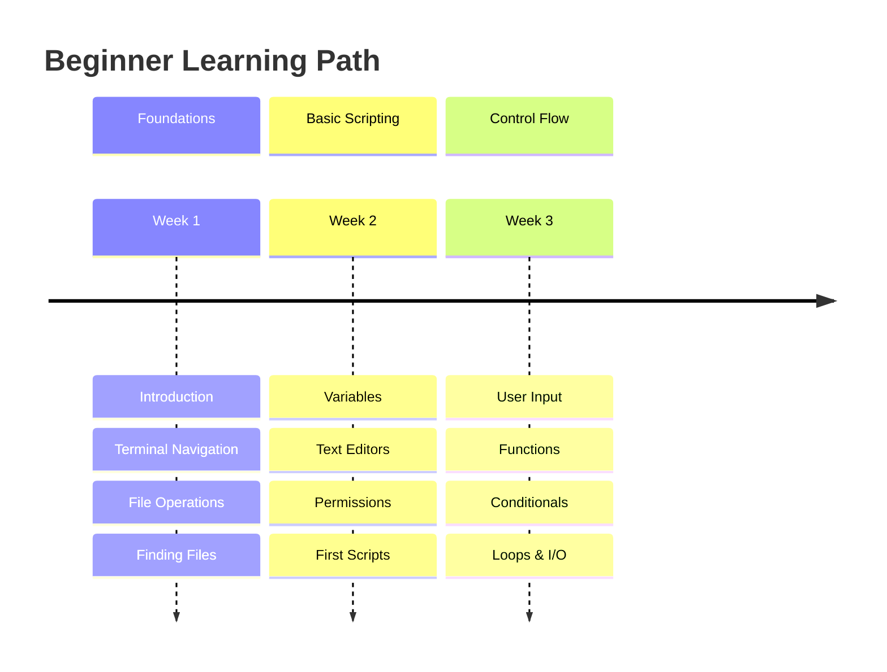
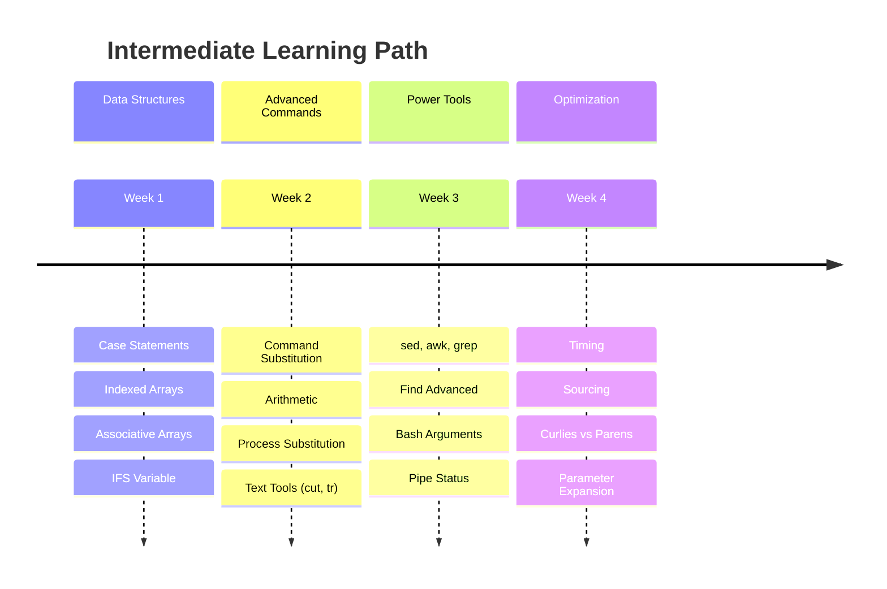
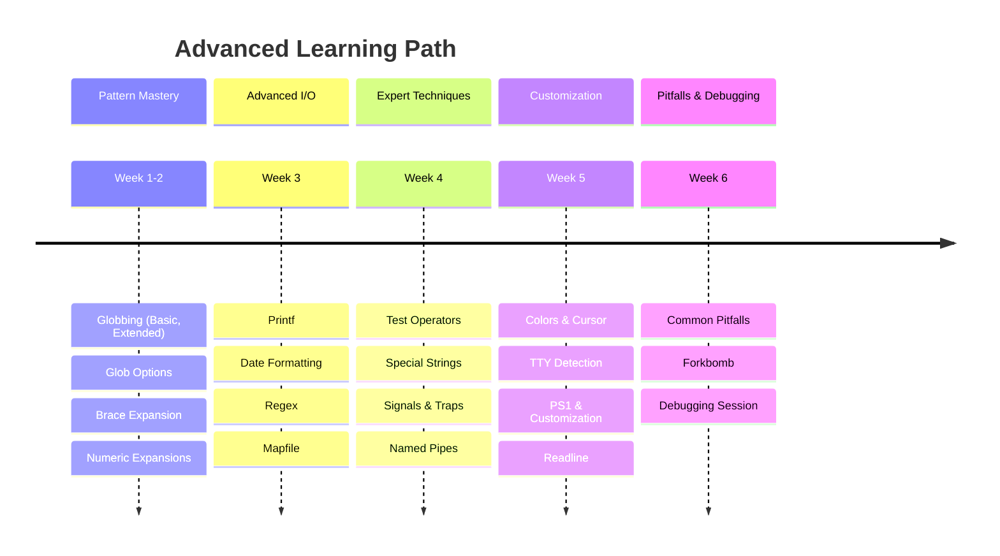
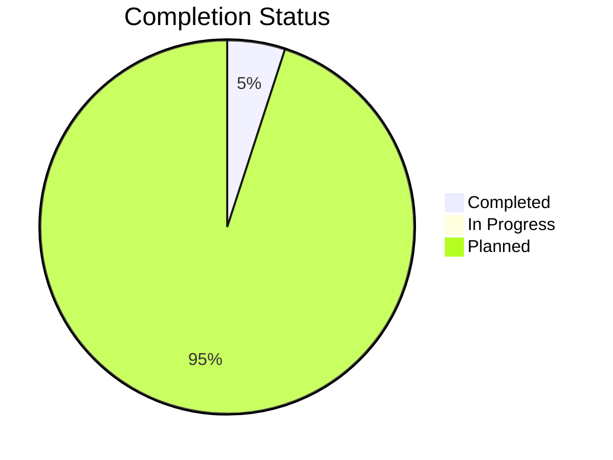

# 🎯 Complete Automation Curriculum Index

> **"From zero to automation hero - Your complete journey through shell scripting mastery"**

## 📖 Navigation Guide

This document serves as the master index for all 60 automation topics organized across three progressive learning levels. Each section includes topic descriptions, key learnings, and direct navigation links.

---

## 🟢 LEVEL 1: BEGINNER (17 Topics)
**Target Audience**: New to shell scripting, DevOps beginners  
**Duration**: 2-3 weeks  
**Prerequisites**: Basic computer literacy  

### Module Structure

### Topics Overview

#### 01. Introduction
**📂 Path**: `1-Beginner/02-Phase-2/02-Automation/01-Shell-Scripting/01-Introduction/`  
**🎯 Learning Goals**:
- Understand shell scripting fundamentals
- Learn about different shell types (Bash, Zsh, Sh)
- Write your first "Hello World" script
- Understand shebang (`#!/bin/bash`)
- Execute scripts using bash vs. ./

**🔑 Key Concepts**: Shebang, shell types, execution methods, POSIX compliance  
**⏱️ Time**: 2-3 hours  
**✅ Status**: Complete

---

#### 02. Terminal and Finder
**📂 Path**: `1-Beginner/02-Phase-2/02-Automation/01-Shell-Scripting/02-Terminal-and-Finder/`  
**🎯 Learning Goals**:
- Master terminal navigation (cd, ls, pwd)
- Understand Unix filesystem hierarchy
- Differentiate absolute vs. relative paths
- Use keyboard shortcuts efficiently
- Customize terminal prompt

**🔑 Key Concepts**: Filesystem hierarchy, paths, navigation, tab completion  
**⏱️ Time**: 3-4 hours  
**✅ Status**: Complete

---

#### 03. Basic File Manipulation
**📂 Path**: `1-Beginner/02-Phase-2/02-Automation/01-Shell-Scripting/03-Basic-File-Manipulation/`  
**🎯 Learning Goals**:
- Create files and directories (touch, mkdir)
- Copy files safely (cp with flags)
- Move and rename (mv operations)
- Delete responsibly (rm safety practices)
- Understand file operation flags

**🔑 Key Concepts**: touch, mkdir, cp, mv, rm, safety practices  
**⏱️ Time**: 4-5 hours  
**✅ Status**: Complete

---

#### 04. Hidden Files
**📂 Path**: `1-Beginner/02-Phase-2/02-Automation/01-Shell-Scripting/04-Hidden-Files/`  
**🎯 Learning Goals**:
- Understand dotfiles (.bashrc, .profile, .gitignore)
- View hidden files (ls -a)
- Create and modify configuration files
- Understand dotfile purposes
- Manage environment configurations

**🔑 Key Concepts**: Dotfiles, hidden files, configuration, .bashrc, .profile  
**⏱️ Time**: 2-3 hours  
**✅ Status**: Complete

---

#### 05. Searching in Files
**📂 Path**: `1-Beginner/02-Phase-2/02-Automation/01-Shell-Scripting/05-Searching-in-Files/`  
**🎯 Learning Goals**:
- Use grep for pattern matching
- Search files with find command basics
- Use locate for fast file finding
- Understand basic regular expressions
- Combine search commands

**🔑 Key Concepts**: grep, find basics, locate, pattern matching  
**⏱️ Time**: 3-4 hours  
**✅ Status**: Complete

---

#### 06. Paging Files
**📂 Path**: `1-Beginner/02-Phase-2/02-Automation/01-Shell-Scripting/06-Paging-Files/`  
**🎯 Learning Goals**:
- View large files with less and more
- Use head and tail for file excerpts
- Follow log files in real-time (tail -f)
- Navigate pager interfaces
- Extract specific lines

**🔑 Key Concepts**: less, more, head, tail, log monitoring  
**⏱️ Time**: 2-3 hours  
**✅ Status**: Complete

---

#### 07. Man Pages
**📂 Path**: `1-Beginner/02-Phase-2/02-Automation/01-Shell-Scripting/07-Man-Pages/`  
**🎯 Learning Goals**:
- Read and navigate manual pages
- Understand man page sections (1-9)
- Search within man pages
- Use --help flags effectively
- Find documentation alternatives (info, tldr)

**🔑 Key Concepts**: man command, documentation, help flags, info pages  
**⏱️ Time**: 2 hours  
**✅ Status**: Complete

---

#### 08. Programs and Commands
**📂 Path**: `1-Beginner/02-Phase-2/02-Automation/01-Shell-Scripting/08-Programs-and-Commands/`  
**🎯 Learning Goals**:
- Understand command types (built-in, external, alias)
- Use which, type, whereis commands
- Understand PATH variable
- Install and locate programs
- Differentiate shell built-ins vs. executables

**🔑 Key Concepts**: which, type, whereis, PATH, built-ins  
**⏱️ Time**: 3 hours  
**✅ Status**: Complete

---

#### 09. Basic Variables
**📂 Path**: `1-Beginner/02-Phase-2/02-Automation/01-Shell-Scripting/09-Basic-Variables/`  
**🎯 Learning Goals**:
- Declare and use variables
- Understand variable scope (local vs. global)
- Use special variables ($?, $@, $#, $$)
- Environment variables (export)
- Variable naming conventions

**🔑 Key Concepts**: Variable declaration, scope, special variables, environment  
**⏱️ Time**: 4 hours  
**✅ Status**: Complete

---

#### 10. Vim Crash Course
**📂 Path**: `1-Beginner/02-Phase-2/02-Automation/01-Shell-Scripting/10-Vim-Crash-Course/`  
**🎯 Learning Goals**:
- Basic vim modes (normal, insert, visual)
- Essential navigation (h,j,k,l)
- File operations (open, save, quit)
- Basic editing (delete, yank, put)
- Survive vim emergencies (:q!)

**🔑 Key Concepts**: Vim modes, navigation, editing, survival commands  
**⏱️ Time**: 3-4 hours  
**✅ Status**: Complete

---

#### 11. File Permissions
**📂 Path**: `1-Beginner/02-Phase-2/02-Automation/01-Shell-Scripting/11-File-Permissions/`  
**🎯 Learning Goals**:
- Understand rwxrwxrwx permission structure
- Use chmod (symbolic and octal notation)
- Change ownership with chown
- Understand umask
- Apply special permissions (setuid, setgid, sticky bit)

**🔑 Key Concepts**: chmod, chown, umask, permissions, ownership  
**⏱️ Time**: 4-5 hours  
**✅ Status**: Complete

---

#### 12. Finally Scripting
**📂 Path**: `1-Beginner/02-Phase-2/02-Automation/01-Shell-Scripting/12-Finally-Scripting/`  
**🎯 Learning Goals**:
- Write your first real automation script
- Implement error handling basics
- Use exit codes properly
- Create reusable script templates
- Follow scripting best practices

**🔑 Key Concepts**: Script structure, error handling, exit codes, best practices  
**⏱️ Time**: 5-6 hours  
**✅ Status**: Complete

---

#### 13. User Input
**📂 Path**: `1-Beginner/02-Phase-2/02-Automation/01-Shell-Scripting/13-User-Input/`  
**🎯 Learning Goals**:
- Read user input with read command
- Handle interactive prompts
- Validate user input
- Use timeout for inputs
- Create menu-driven scripts

**🔑 Key Concepts**: read command, input validation, interactive scripts  
**⏱️ Time**: 3-4 hours  
**✅ Status**: Complete

---

#### 14. Functions
**📂 Path**: `1-Beginner/02-Phase-2/02-Automation/01-Shell-Scripting/14-Functions/`  
**🎯 Learning Goals**:
- Define and call functions
- Pass parameters to functions
- Return values from functions
- Understand function scope
- Create reusable function libraries

**🔑 Key Concepts**: Function definition, parameters, return values, scope  
**⏱️ Time**: 4-5 hours  
**✅ Status**: Complete

---

#### 15. Conditionals
**📂 Path**: `1-Beginner/02-Phase-2/02-Automation/01-Shell-Scripting/15-Conditionals/`  
**🎯 Learning Goals**:
- Master if/elif/else statements
- Use test conditions ([ ], [[ ]])
- Compare strings and numbers
- Check file existence and properties
- Combine conditions (&&, ||)

**🔑 Key Concepts**: if/else, test conditions, comparisons, logical operators  
**⏱️ Time**: 5 hours  
**✅ Status**: Complete

---

#### 16. For Loops
**📂 Path**: `1-Beginner/02-Phase-2/02-Automation/01-Shell-Scripting/16-For-Loops/`  
**🎯 Learning Goals**:
- Iterate over lists with for loops
- Loop through files and directories
- Use C-style for loops
- Implement while and until loops
- Control loop flow (break, continue)

**🔑 Key Concepts**: for loops, while loops, iteration, loop control  
**⏱️ Time**: 4-5 hours  
**✅ Status**: Complete

---

#### 17. Input/Output
**📂 Path**: `1-Beginner/02-Phase-2/02-Automation/01-Shell-Scripting/17-Input-Output/`  
**🎯 Learning Goals**:
- Understand standard streams (stdin, stdout, stderr)
- Redirect output (>, >>)
- Redirect input (<)
- Pipe commands (|)
- Redirect stderr (2>, &>)

**🔑 Key Concepts**: Streams, redirection, pipes, file descriptors  
**⏱️ Time**: 4-5 hours  
**✅ Status**: Complete

---

## 🟡 LEVEL 2: INTERMEDIATE (18 Topics)
**Target Audience**: Comfortable with basic scripting  
**Duration**: 3-4 weeks  
**Prerequisites**: Completed Beginner level

### Module Structure

### Topics Overview

#### 01. Case Statements
**📂 Path**: `2-Intermediate/02-Phase-2/02-Automation/01-Shell-Scripting/01-Case-Statements/`  
**🎯 Learning Goals**:
- Master case/esac pattern matching
- Create menu-driven interfaces
- Use glob patterns in case
- Handle multiple conditions elegantly
- Build interactive CLI tools

**🔑 Key Concepts**: case/esac, pattern matching, menu systems  
**⏱️ Time**: 3-4 hours  
**📝 Status**: Planned

---

#### 02. Indexed Arrays
**📂 Path**: `2-Intermediate/02-Phase-2/02-Automation/01-Shell-Scripting/02-Indexed-Arrays/`  
**🎯 Learning Goals**:
- Declare and initialize arrays
- Access array elements by index
- Iterate through arrays
- Modify array contents
- Use array operations

**🔑 Key Concepts**: Array syntax, indexing, iteration, array operations  
**⏱️ Time**: 4-5 hours  
**📝 Status**: Planned

---

#### 03. Associative Arrays
**📂 Path**: `2-Intermediate/02-Phase-2/02-Automation/01-Shell-Scripting/03-Associative-Arrays/`  
**🎯 Learning Goals**:
- Create key-value pair arrays
- Access elements by key
- Iterate through keys and values
- Use associative arrays for configuration
- Implement hash map patterns

**🔑 Key Concepts**: Key-value pairs, hash maps, declare -A  
**⏱️ Time**: 4-5 hours  
**📝 Status**: Planned

---

#### 04. IFS Variable
**📂 Path**: `2-Intermediate/02-Phase-2/02-Automation/01-Shell-Scripting/04-IFS-Variable/`  
**🎯 Learning Goals**:
- Understand Internal Field Separator
- Parse CSV and delimited data
- Control word splitting
- Save and restore IFS
- Use IFS for data processing

**🔑 Key Concepts**: IFS, field separation, data parsing, word splitting  
**⏱️ Time**: 3-4 hours  
**📝 Status**: Planned

---

#### 05. Command Substitution
**📂 Path**: `2-Intermediate/02-Phase-2/02-Automation/01-Shell-Scripting/05-Command-Substitution/`  
**🎯 Learning Goals**:
- Use $() for command substitution
- Understand backticks (legacy method)
- Nest command substitutions
- Capture command output
- Use in variable assignments

**🔑 Key Concepts**: $(), backticks, output capture, nesting  
**⏱️ Time**: 3-4 hours  
**📝 Status**: Planned

---

#### 06. Arithmetic Expression
**📂 Path**: `2-Intermediate/02-Phase-2/02-Automation/01-Shell-Scripting/06-Arithmetic-Expression/`  
**🎯 Learning Goals**:
- Perform arithmetic with $(( ))
- Use let and expr commands
- Understand operator precedence
- Handle decimal arithmetic (bc, awk)
- Implement calculations in scripts

**🔑 Key Concepts**: $(( )), let, expr, bc, arithmetic operators  
**⏱️ Time**: 4 hours  
**📝 Status**: Planned

---

#### 07. Process Substitution
**📂 Path**: `2-Intermediate/02-Phase-2/02-Automation/01-Shell-Scripting/07-Process-Substitution/`  
**🎯 Learning Goals**:
- Use <() for process substitution
- Compare files with diff <()
- Create temporary FIFOs
- Feed process output as files
- Advanced piping techniques

**🔑 Key Concepts**: <(), >(), process substitution, FIFOs  
**⏱️ Time**: 4-5 hours  
**📝 Status**: Planned

---

#### 08. Cut and Tr
**📂 Path**: `2-Intermediate/02-Phase-2/02-Automation/01-Shell-Scripting/08-Cut-and-Tr/`  
**🎯 Learning Goals**:
- Extract columns with cut
- Transform characters with tr
- Parse structured data
- Delete and squeeze characters
- Process log files

**🔑 Key Concepts**: cut, tr, column extraction, character transformation  
**⏱️ Time**: 3-4 hours  
**📝 Status**: Planned

---

#### 09. Sed, Awk, Grep
**📂 Path**: `2-Intermediate/02-Phase-2/02-Automation/01-Shell-Scripting/09-Sed-Awk-Grep/`  
**🎯 Learning Goals**:
- Master grep patterns
- Edit streams with sed
- Process data with awk
- Combine all three tools
- Advanced regex patterns

**🔑 Key Concepts**: grep, sed, awk, stream editing, text processing  
**⏱️ Time**: 6-8 hours  
**📝 Status**: Planned

---

#### 10. Find Command
**📂 Path**: `2-Intermediate/02-Phase-2/02-Automation/01-Shell-Scripting/10-Find-Command/`  
**🎯 Learning Goals**:
- Advanced find operations
- Use -exec and -execdir
- Combine multiple conditions
- Find by time, size, permissions
- Optimize find performance

**🔑 Key Concepts**: find, -exec, predicates, optimization  
**⏱️ Time**: 5-6 hours  
**📝 Status**: Planned

---

#### 11. Bash Arguments
**📂 Path**: `2-Intermediate/02-Phase-2/02-Automation/01-Shell-Scripting/11-Bash-Arguments/`  
**🎯 Learning Goals**:
- Handle positional parameters
- Use $@, $*, $#, $0
- Implement shift for argument processing
- Parse options with getopts
- Create professional CLI interfaces

**🔑 Key Concepts**: Positional parameters, $@, $*, getopts, shift  
**⏱️ Time**: 5-6 hours  
**📝 Status**: Planned

---

#### 12. Pipe Status
**📂 Path**: `2-Intermediate/02-Phase-2/02-Automation/01-Shell-Scripting/12-Pipe-Status/`  
**🎯 Learning Goals**:
- Understand PIPESTATUS array
- Use set -o pipefail
- Check exit status of piped commands
- Debug pipeline failures
- Implement robust error handling

**🔑 Key Concepts**: PIPESTATUS, set -o pipefail, pipeline debugging  
**⏱️ Time**: 3-4 hours  
**📝 Status**: Planned

---

#### 13. Timing Commands
**📂 Path**: `2-Intermediate/02-Phase-2/02-Automation/01-Shell-Scripting/13-Timing-Commands/`  
**🎯 Learning Goals**:
- Measure execution time with time
- Use date for timestamps
- Calculate time differences
- Benchmark scripts
- Implement timeouts

**🔑 Key Concepts**: time command, date, benchmarking, timeouts  
**⏱️ Time**: 3 hours  
**📝 Status**: Planned

---

####  14. Sourcing Code
**📂 Path**: `2-Intermediate/02-Phase-2/02-Automation/01-Shell-Scripting/14-Sourcing-Code/`  
**🎯 Learning Goals**:
- Understand source vs. execution
- Create reusable libraries
- Use . and source commands
- Manage environment configuration
- Build modular scripts

**🔑 Key Concepts**: source, ., library creation, modular design  
**⏱️ Time**: 4 hours  
**📝 Status**: Planned

---

#### 15. Curlies vs. Parens
**📂 Path**: `2-Intermediate/02-Phase-2/02-Automation/01-Shell-Scripting/15-Curlies-vs-Parens/`  
**🎯 Learning Goals**:
- Understand { } vs. ( ) grouping
- Master subshell concepts
- Use command grouping
- Understand variable scope in subshells
- Choose appropriate grouping method

**🔑 Key Concepts**: { }, ( ), subshells, command grouping, scope  
**⏱️ Time**: 4-5 hours  
**📝 Status**: Planned

---

#### 16. Return vs. Output
**📂 Path**: `2-Intermediate/02-Phase-2/02-Automation/01-Shell-Scripting/16-Return-vs-Output/`  
**🎯 Learning Goals**:
- Understand return vs. echo
- Use exit codes effectively
- Capture function output
- Implement proper function design
- Handle function results

**🔑 Key Concepts**: return, echo, exit codes, function output  
**⏱️ Time**: 3-4 hours  
**📝 Status**: Planned

---

#### 17. Parameter Expansion
**📂 Path**: `2-Intermediate/02-Phase-2/02-Automation/01-Shell-Scripting/17-Parameter-Expansion/`  
**🎯 Learning Goals**:
- Master ${var} expansions
- Use default values (:-, :=, :?, :+)
- Perform string manipulation
- Extract substrings
- Implement pattern matching

**🔑 Key Concepts**: ${var}, default values, string manipulation, pattern matching  
**⏱️ Time**: 5-6 hours  
**📝 Status**: Planned

---

#### 18. Array Expansion
**📂 Path**: `2-Intermediate/02-Phase-2/02-Automation/01-Shell-Scripting/18-Array-Expansion/`  
**🎯 Learning Goals**:
- Use ${arr[@]} vs. ${arr[*]}
- Array slicing and extraction
- Manipulate array elements
- Implement array operations
- Advanced array techniques

**🔑 Key Concepts**: ${arr[@]}, array slicing, expansion, operations  
**⏱️ Time**: 4-5 hours  
**📝 Status**: Planned

---

## 🔴 LEVEL 3: ADVANCED (25 Topics)
**Target Audience**: Experienced scripters seeking mastery  
**Duration**: 5-6 weeks  
**Prerequisites**: Completed Intermediate level

### Module Structure

### Topics Overview

#### 01. Basic Globbing
**📂 Path**: `3-Advanced/02-Phase-2/02-Automation/01-Shell-Scripting/01-Basic-Globbing/`  
**🎯 Learning Goals**:
- Master *, ?, [ ] patterns
- Understand glob expansion
- Use character classes
- Match file patterns
- Avoid glob pitfalls

**🔑 Key Concepts**: *, ?, [ ], glob expansion, pattern matching  
**⏱️ Time**: 4 hours  
**📝 Status**: Planned

---

#### 02. Extended Globbing
**📂 Path**: `3-Advanced/02-Phase-2/02-Automation/01-Shell-Scripting/02-Extended-Globbing/`  
**🎯 Learning Goals**:
- Enable extglob option
- Use @(), +(), *(), !(), ?()
- Implement complex patterns
- Combine extended patterns
- Advanced file matching

**🔑 Key Concepts**: extglob, @(), +(), *(), !(), ?()  
**⏱️ Time**: 5-6 hours  
**📝 Status**: Planned

---

#### 03. Glob Shell Options
**📂 Path**: `3-Advanced/02-Phase-2/02-Automation/01-Shell-Scripting/03-Glob-Shell-Options/`  
**🎯 Learning Goals**:
- Master shopt globbing options
- Use nullglob, failglob, dotglob
- Implement globstar for recursive matching
- Control glob behavior
- Optimize pattern matching

**🔑 Key Concepts**: shopt, nullglob, failglob, dotglob, globstar  
**⏱️ Time**: 4-5 hours  
**📝 Status**: Planned

---

#### 04. Brace Expansion
**📂 Path**: `3-Advanced/02-Phase-2/02-Automation/01-Shell-Scripting/04-Brace-Expansion/`  
**🎯 Learning Goals**:
- Generate sequences with { }
- Create file/directory combinations
- Use nested brace expansions
- Combine with other expansions
- Optimize bulk operations

**🔑 Key Concepts**: {a,b,c}, brace expansion, sequences  
**⏱️ Time**: 3-4 hours  
**📝 Status**: Planned

---

#### 05. Braces and Globbing
**📂 Path**: `3-Advanced/02-Phase-2/02-Automation/01-Shell-Scripting/05-Braces-and-Globbing/`  
**🎯 Learning Goals**:
- Combine braces with globs
- Create complex file patterns
- Understand expansion order
- Optimize pattern combinations
- Advanced file selection

**🔑 Key Concepts**: Combined expansions, pattern optimization  
**⏱️ Time**: 4 hours  
**📝 Status**: Planned

---

#### 06. Numeric Brace Expansion
**📂 Path**: `3-Advanced/02-Phase-2/02-Automation/01-Shell-Scripting/06-Numeric-Brace-Expansion/`  
**🎯 Learning Goals**:
- Generate number sequences {1..100}
- Use step increments {0..100..5}
- Create zero-padded numbers {01..99}
- Implement reverse sequences
- Automate numbered tasks

**🔑 Key Concepts**: {1..n}, step increments, zero-padding  
**⏱️ Time**: 3 hours  
**📝 Status**: Planned

---

#### 07. Understanding Printf
**📂 Path**: `3-Advanced/02-Phase-2/02-Automation/01-Shell-Scripting/07-Understanding-Printf/`  
**🎯 Learning Goals**:
- Master printf formatting
- Use format specifiers (%s, %d, %f, %x)
- Control width and precision
- Align output
- Create formatted reports

**🔑 Key Concepts**: printf, format specifiers, width, precision  
**⏱️ Time**: 5 hours  
**📝 Status**: Planned

---

#### 08. Date Formatting
**📂 Path**: `3-Advanced/02-Phase-2/02-Automation/01-Shell-Scripting/08-Date-Formatting/`  
**🎯 Learning Goals**:
- Use date command with formats
- Parse and manipulate dates
- Calculate date differences
- Work with timestamps
- Implement date-based logic

**🔑 Key Concepts**: date, strftime, timestamps, date arithmetic  
**⏱️ Time**: 4-5 hours  
**📝 Status**: Planned

---

#### 09. Regular Expressions
**📂 Path**: `3-Advanced/02-Phase-2/02-Automation/01-Shell-Scripting/09-Regular-Expressions/`  
**🎯 Learning Goals**:
- Master POSIX regex
- Use =~ operator in [[ ]]
- Capture groups with BASH_REMATCH
- Implement validation patterns
- Advanced text matching

**🔑 Key Concepts**: Regex, =~, BASH_REMATCH, pattern validation  
**⏱️ Time**: 6-8 hours  
**📝 Status**: Planned

---

#### 10. Using Mapfile
**📂 Path**: `3-Advanced/02-Phase-2/02-Automation/01-Shell-Scripting/10-Using-Mapfile/`  
**🎯 Learning Goals**:
- Read files into arrays with mapfile
- Use readarray (alias for mapfile)
- Process files line by line efficiently
- Handle large files
- Implement safe file reading

**🔑 Key Concepts**: mapfile, readarray, efficient file processing  
**⏱️ Time**: 4 hours  
**📝 Status**: Planned

---

#### 11. Brackets vs. Test
**📂 Path**: `3-Advanced/02-Phase-2/02-Automation/01-Shell-Scripting/11-Brackets-vs-Test/`  
**🎯 Learning Goals**:
- Understand test vs. [ ] vs. [[ ]]
- Use (( )) for arithmetic tests
- Choose appropriate test syntax
- Avoid common pitfalls
- Implement portable tests

**🔑 Key Concepts**: test, [ ], [[ ]], (( )), portability  
**⏱️ Time**: 5 hours  
**📝 Status**: Planned

---

#### 12. Special Strings
**📂 Path**: `3-Advanced/02-Phase-2/02-Automation/01-Shell-Scripting/12-Special-Strings/`  
**🎯 Learning Goals**:
- Use $'...' ANSI-C quoting
- Implement escape sequences
- Handle special characters
- Create portable strings
- Advanced string literals

**🔑 Key Concepts**: $'...', ANSI-C quoting, escape sequences  
**⏱️ Time**: 3-4 hours  
**📝 Status**: Planned

---

#### 13. Trap Signals
**📂 Path**: `3-Advanced/02-Phase-2/02-Automation/01-Shell-Scripting/13-Trap-Signals/`  
**🎯 Learning Goals**:
- Understand Unix signals
- Use trap for signal handling
- Implement cleanup functions
- Handle script interruptions
- Create robust scripts

**🔑 Key Concepts**: trap, signals, SIGINT, SIGTERM, cleanup  
**⏱️ Time**: 5-6 hours  
**📝 Status**: Planned

---

#### 14. Named Pipes
**📂 Path**: `3-Advanced/02-Phase-2/02-Automation/01-Shell-Scripting/14-Named-Pipes/`  
**🎯 Learning Goals**:
- Create FIFOs with mkfifo
- Implement inter-process communication
- Use named pipes for data flow
- Handle pipe synchronization
- Advanced IPC patterns

**🔑 Key Concepts**: mkfifo, FIFO, IPC, named pipes  
**⏱️ Time**: 5-6 hours  
**📝 Status**: Planned

---

#### 15. Color Output
**📂 Path**: `3-Advanced/02-Phase-2/02-Automation/01-Shell-Scripting/15-Color-Output/`  
**🎯 Learning Goals**:
- Use ANSI color codes
- Implement tput commands
- Create colorized output
- Detect color support
- Build professional CLI tools

**🔑 Key Concepts**: ANSI codes, tput, colored output, terminal capabilities  
**⏱️ Time**: 4 hours  
**📝 Status**: Planned

---

#### 16. Cursor Commands
**📂 Path**: `3-Advanced/02-Phase-2/02-Automation/01-Shell-Scripting/16-Cursor-Commands/`  
**🎯 Learning Goals**:
- Control cursor position
- Clear screen programmatically
- Create progress bars
- Implement dynamic interfaces
- Terminal manipulation

**🔑 Key Concepts**: Cursor control, tput, escape sequences, dynamic UI  
**⏱️ Time**: 4-5 hours  
**📝 Status**: Planned

---

#### 17. Is a TTY
**📂 Path**: `3-Advanced/02-Phase-2/02-Automation/01-Shell-Scripting/17-Is-a-TTY/`  
**🎯 Learning Goals**:
- Detect interactive terminals with [ -t ]
- Handle pipe vs. terminal differences
- Adapt script behavior
- Implement conditional formatting
- Build flexible scripts

**🔑 Key Concepts**: [ -t ], TTY detection, stdin/stdout testing  
**⏱️ Time**: 3 hours  
**📝 Status**: Planned

---

#### 18. PS1 Variable
**📂 Path**: `3-Advanced/02-Phase-2/02-Automation/01-Shell-Scripting/18-PS1-Variable/`  
**🎯 Learning Goals**:
- Customize shell prompt
- Use PS1 escape sequences
- Add git branch to prompt
- Implement dynamic prompts
- Create professional prompts

**🔑 Key Concepts**: PS1, prompt customization, escape sequences  
**⏱️ Time**: 4 hours  
**📝 Status**: Planned

---

#### 19. Customizing Bash
**📂 Path**: `3-Advanced/02-Phase-2/02-Automation/01-Shell-Scripting/19-Customizing-Bash/`  
**🎯 Learning Goals**:
- Configure .bashrc and .bash_profile
- Set up aliases and functions
- Customize environment
- Implement startup scripts
- Create efficient workflow

**🔑 Key Concepts**: .bashrc, .bash_profile, aliases, environment  
**⏱️ Time**: 5 hours  
**📝 Status**: Planned

---

#### 20. Readline Shortcuts
**📂 Path**: `3-Advanced/02-Phase-2/02-Automation/01-Shell-Scripting/20-Readline-Shortcuts/`  
**🎯 Learning Goals**:
- Master Ctrl+A, Ctrl+E, Ctrl+R, etc
- Configure .inputrc
- Create custom key bindings
- Implement vi/emacs mode
- Optimize terminal efficiency

**🔑 Key Concepts**: Readline, keyboard shortcuts, .inputrc  
**⏱️ Time**: 3-4 hours  
**📝 Status**: Planned

---

#### 21. Pitfall: LS
**📂 Path**: `3-Advanced/02-Phase-2/02-Automation/01-Shell-Scripting/21-Pitfall-LS/`  
**🎯 Learning Goals**:
- Understand why parsing ls is dangerous
- Use proper alternatives (find, globbing)
- Avoid filename injection
- Implement safe file iteration
- Learn common mistakes

**🔑 Key Concepts**: ls parsing dangers, safe alternatives, filename handling  
**⏱️ Time**: 3 hours  
**📝 Status**: Planned

---

#### 22. Aliases with Arguments
**📂 Path**: `3-Advanced/02-Phase-2/02-Automation/01-Shell-Scripting/22-Aliases-with-Arguments/`  
**🎯 Learning Goals**:
- Understand alias limitations
- Create function-based aliases
- Pass arguments correctly
- Implement smart aliases
- Optimize command shortcuts

**🔑 Key Concepts**: Aliases vs. functions, argument handling  
**⏱️ Time**: 3 hours  
**📝 Status**: Planned

---

#### 23. Pitfall: String Length
**📂 Path**: `3-Advanced/02-Phase-2/02-Automation/01-Shell-Scripting/23-Pitfall-String-Length/`  
**🎯 Learning Goals**:
- Use ${#var} correctly
- Handle Unicode and multibyte characters
- Understand byte vs. character count
- Avoid length calculation errors
- Implement proper string handling

**🔑 Key Concepts**: ${#var}, string length, Unicode, multibyte  
**⏱️ Time**: 3 hours  
**📝 Status**: Planned

---

#### 24. Forkbomb
**📂 Path**: `3-Advanced/02-Phase-2/02-Automation/01-Shell-Scripting/24-Forkbomb/`  
**🎯 Learning Goals**:
- Understand :(){ :|:& };:
- Learn how forkbombs work
- Implement ulimit protection
- Recover from forkbombs
- Prevent resource exhaustion

**🔑 Key Concepts**: Forkbomb, resource limits, ulimit, protection  
**⏱️ Time**: 2-3 hours  
**📝 Status**: Planned

---

#### 25. Bonus Debugging Session
**📂 Path**: `3-Advanced/02-Phase-2/02-Automation/01-Shell-Scripting/25-Bonus-Debugging-Session/`  
**🎯 Learning Goals**:
- Debug real-world scripts
- Use set -x, set -e, set -u
- Implement comprehensive error handling
- Create debugging strategies
- Master troubleshooting techniques

**🔑 Key Concepts**: Debugging, set options, troubleshooting, error handling  
**⏱️ Time**: 6-8 hours  
**📝 Status**: Planned

---

## 📊 Progress Dashboard

### Overall Statistics

### Level Breakdown

| Level | Total Topics | Completed | In Progress | Planned | Progress % |
|-------|--------------|-----------|-------------|---------|------------|
| 🟢 Beginner | 17 | 3 | 0 | 14 | 17.6% |
| 🟡 Intermediate | 18 | 0 | 0 | 18 | 0% |
| 🔴 Advanced | 25 | 0 | 0 | 25 | 0% |
| **TOTAL** | **60** | **3** | **0** | **57** | **5%** |

### Estimated Time to Completion

- **Beginner**: 55-70 hours
- **Intermediate**: 75-90 hours
- **Advanced**: 105-130 hours
- **Total**: **235-290 hours** (approx. 6-7 weeks full-time)

## 🎯 Learning Paths

### Path 1: DevOps Engineer Track
**Focus**: Automation, CI/CD, infrastructure management

**Recommended Sequence**:
1. Complete all Beginner topics
2. Intermediate: Focus on sed/awk/grep, find, bash arguments, parameter expansion
3. Advanced: Signals/traps, regex, printf, date formatting, debugging

### Path 2: System Administrator Track
**Focus**: Server management, maintenance, monitoring

**Recommended Sequence**:
1. Complete all Beginner topics
2. Intermediate: Arrays, IFS, text processing tools
3. Advanced: Named pipes, trap signals, customization

### Path 3: Security Specialist Track
**Focus**: Security scripting, auditing, hardening

**Recommended Sequence**:
1. Complete all Beginner topics (focus on permissions)
2. Intermediate: grep/sed/awk for log analysis, find command
3. Advanced: Regex, special strings, debugging, pitfalls

## 📚 Additional Resources

### Books
- "Learning the bash Shell" - O'Reilly
- "Bash Cookbook" - O'Reilly
- "Linux Command Line and Shell Scripting Bible" - Wiley

### Online Resources
- [GNU Bash Manual](https://www.gnu.org/software/bash/manual/)
- [ShellCheck - Linting Tool](https://www.shellcheck.net/)
- [Bash Hackers Wiki](https://wiki.bash-hackers.org/)
- [Advanced Bash-Scripting Guide](https://tldp.org/LDP/abs/html/)

### Tools
- **ShellCheck**: Static analysis for shell scripts
- **explainshell.com**: Explain shell commands
- **bashdb**: Bash debugger
- **tldr**: Simplified man pages

## 🎓 Certification Path

After completing all 60 topics, you'll be prepared for:
- Linux Foundation Certified System Administrator (LFCS)
- Red Hat Certified System Administrator (RHCSA)
- AWS DevOps Engineer Professional (scripting portion)

## 🤝 Contributing

Found an error or want to improve content? Contributions welcome!

---

**Last Updated**: 2026-01-10  
**Version**: 1.0.0  
**Maintained by**: DevOps Learning Team  
**Status**: 5% Complete (3/60 topics) 🚧

**📌 Remember**: Shell scripting mastery is a journey, not a destination. Practice daily, automate everything, and never stop learning! 🚀
