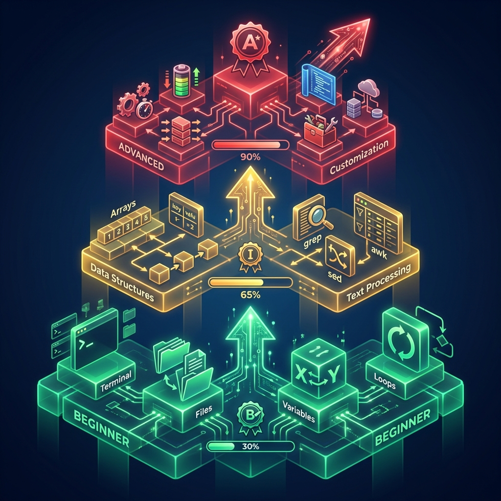
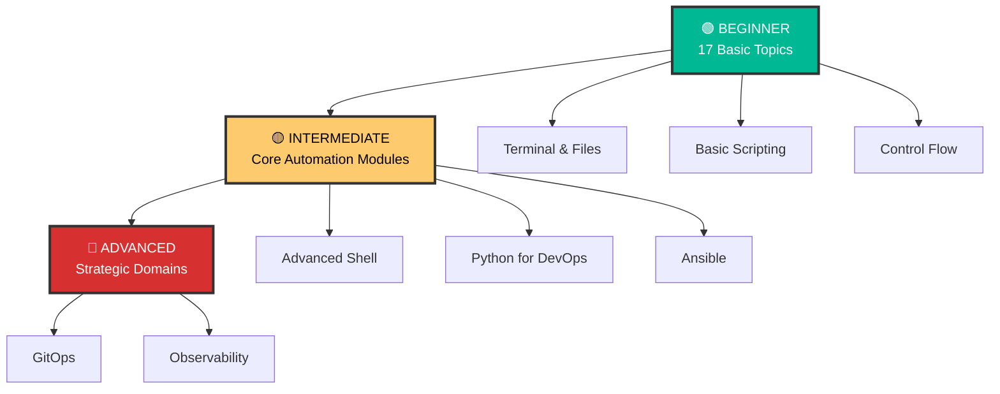

# 🤖 Automation - Shell Scripting Mastery

> **"Automation is the foundation of modern DevOps. Master shell scripting, and you master the infrastructure."**



## 📚 Overview

Welcome to the comprehensive **Automation curriculum**! This module is designed to transform you from a beginner to an expert capable of building robust, scalable automation across Shell, Python, and Ansible.

## 🎯 Learning Objectives

By completing this curriculum, you will:

- ✅ Master Bash shell scripting from fundamentals to advanced techniques
- ✅ Automate complex DevOps workflows confidently
- ✅ Write production-ready, maintainable automation scripts
- ✅ Understand Unix philosophy and best practices
- ✅ Debug and troubleshoot shell scripts effectively
- ✅ Build CI/CD pipeline components (GitHub Actions, etc.)

## 🗺️ Curriculum Structure

### Three-Tier Learning System



---

## 📖 Module Listings

### 🟢 Level 1: Beginner (Foundation Building)

Master the fundamentals of shell scripting and terminal navigation.

| # | Topic | Description | Status |
|---|-------|-------------|--------|
| 01 | [**Introduction**](./01-Shell-Scripting/01-Introduction/) | Shell types, first script | ✅ |
| 02 | [**Terminal and Finder**](./01-Shell-Scripting/02-Terminal-and-Finder/) | Navigation, paths | ✅ |
| 03 | [**Basic File Manipulation**](./01-Shell-Scripting/03-Basic-File-Manipulation/) | cp, mv, rm | ✅ |
| ... | **[View Full Beginner Index](AUTOMATION_MASTER_INDEX.md)** | Topics 04-17 (Planned) | 📝 |

---

### 🟡 Level 2: Intermediate & Advanced Automation

Functional modules for building real-world tools.

| # | Module | Description | Path |
|---|--------|-------------|------|
| 01 | **Intermediate Shell** | Functions, Loops, Strict Mode | [Link](../../../2-Intermediate/02-Phase-2/01-Automation/01-Intermediate-Shell-Scripting) |
| 02 | **Advanced Bash** | jq, sed, awk, xargs, traps | [Link](../../../2-Intermediate/02-Phase-2/01-Automation/02-Advanced-Bash-Automation) |
| 03 | **Python for DevOps** | Boto3, APIs, Web Scraping | [Link](../../../2-Intermediate/02-Phase-2/01-Automation/03-Python-for-DevOps) |
| 04 | **Best Practices** | Idempotency, Secrets | [Link](../../../2-Intermediate/02-Phase-2/01-Automation/04-Automation-Best-Practices) |
| 05 | **Ansible** | Playbooks, Roles | [Link](../../../2-Intermediate/02-Phase-2/01-Automation/05-Ansible) |
| 07 | **Real Life Scenarios** | Troubleshooting War Stories | [Link](../../2-Intermediate/02-Phase-2/01-Automation/07-Real-Life-Scenarios/) |
| 08 | **Infracost** | FinOps & Cost Estimation | [Link](../../../2-Intermediate/02-Phase-2/01-Automation/08-Infracost-Automation) |

---

### 🔴 Level 3: Strategic Domains

High-level implementation strategies.

- **[GitOps](../../../3-Advanced/02-Phase-2/05-GitOps)**
- **[Observability](../../../3-Advanced/02-Phase-2/06-Observability)**

---

## 📊 Progress Tracker

- [ ] **Beginner Level** (3/17 completed)
- [ ] **Intermediate/Advanced Level** (6/7 modules completed)
- [ ] **Strategic Level** (Planned)

**Total Completion**: 31% ⬜⬜⬛⬛⬛⬛⬛⬛⬛⬛

---

## 🚀 Quick Start

```bash
# Start with Beginner Introduction
cd 01-Shell-Scripting/01-Introduction
cat README.md
```

**Happy Automating!** 🤖
