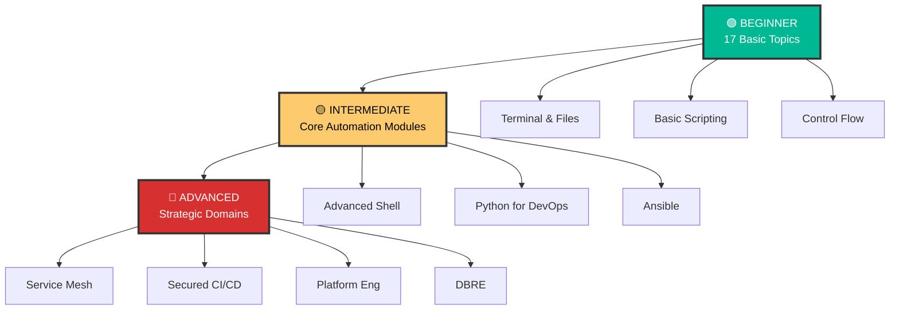

# 🤖 Automation - Shell Scripting Mastery

> **"Automation is the foundation of modern DevOps. Master shell scripting, and you master the infrastructure."**


## 📚 Overview

Welcome to the comprehensive **Automation curriculum**! This module is designed to transform you from a beginner to an expert capable of building robust, scalable automation across Shell, Python, and Ansible.

## 📋 Professional Pattern: "Configuration separation"

Don't bake your environment values into your HCL logic. Keep your Terraform code strictly for **Architectural Logic** and use **YAML/JSON files** for your **Environment Configuration**. Your module should read the YAML file, parse it into a map, and use `for_each` to create the infrastructure. This allows you to add new environments or services just by editing a simple data file—zero HCL changes required.

## 🎯 Learning Objectives

By completing this curriculum, you will:

- ✅ Master Bash shell scripting from fundamentals to advanced techniques
- ✅ Automate complex DevOps workflows confidently
- ✅ Write production-ready, maintainable automation scripts
- ✅ Understand Unix philosophy and best practices
- ✅ Debug and troubleshoot shell scripts effectively
- ✅ Build CI/CD pipeline components (GitHub Actions, etc.)


## 🗺️ Curriculum Structure

### Three-Tier Learning System



---

## 📖 Module Listings

### 🟢 Level 1: Beginner (Foundation Building)

Master the fundamentals of shell scripting and terminal navigation.

| # | Topic | Description | Status |
| --- | --- | --- | --- |
| 01 | [**Introduction**](./01-Shell-Scripting/01-Introduction/) | Shell types, first script | ✅ |
| 02 | [**Terminal and Finder**](./01-Shell-Scripting/02-Terminal-and-Finder/) | Navigation, paths | ✅ |
| 03 | [**Basic File Manipulation**](./01-Shell-Scripting/03-Basic-File-Manipulation/) | cp, mv, rm | ✅ |
| ... | [**View Full Beginner Index**](./AUTOMATION_MASTER_INDEX.md) | Topics 04-17 (Planned) | 📝 |

---

### 🟡 Level 2: Intermediate & Advanced Automation

Functional modules for building real-world tools.

| # | Module | Description | Path |
| :---: | :--- | :--- | :---: |
| 01 | **Intermediate Shell** | Functions, Loops, Strict Mode | [Explore Module](../../../2-Intermediate/02-Phase-2/01-Automation/01-Intermediate-Shell-Scripting) |
| 02 | **Advanced Bash** | jq, sed, awk, xargs, traps | [Explore Module](../../../2-Intermediate/02-Phase-2/01-Automation/02-Advanced-Bash-Automation) |
| 03 | **Python for DevOps** | Boto3, APIs, Web Scraping | [Explore Module](../../../2-Intermediate/02-Phase-2/01-Automation/03-Python-for-DevOps) |
| 04 | **Job Scheduling & Cron** | Crontab, Overlap, K8s Jobs | [Explore Module](./04-Job-Scheduling-and-Cron/) |
| 05 | **Event-Driven Webhooks** | HTTP POST, Security, Async | [Explore Module](./05-Event-Driven-Webhooks/) |
| 06 | **Ansible Dynamic Inventory** | Plugins, Keyed Groups, Caching | [Explore Module](./06-Ansible-Dynamic-Inventory/) |
| 07 | **Terraform Patterns** | Modules, State Locking, DRY | [Explore Module](./07-Terraform-Patterns/) |
| 08 | **Best Practices** | Idempotency, Secrets | [Explore Module](../../../2-Intermediate/02-Phase-2/01-Automation/04-Automation-Best-Practices) |
| 09 | **Ansible Fundamentals** | Playbooks, Roles | [Explore Module](../../../2-Intermediate/02-Phase-2/01-Automation/05-Ansible) |
| 10 | **Real Life Scenarios** | Troubleshooting War Stories | [Explore Module](../../2-Intermediate/02-Phase-2/01-Automation/07-Real-Life-Scenarios/) |
| 11 | **FinOps (Cost as Code)** | Infracost, Kubecost | [Explore Module](../../../2-Intermediate/02-Phase-2/06-FinOps-Cost-as-Code/) |

---

### 🔴 Level 3: Strategic Domains

High-level implementation strategies.

- **[GitOps](../../../3-Advanced/02-Phase-2/05-GitOps)**
- **[Service Mesh](../../../3-Advanced/02-Phase-2/05-Service-Mesh-Istio/)**
- **[Multi-Cluster K8s](../../../3-Advanced/02-Phase-2/07-Multi-Cluster-Kubernetes/)**
- **[AIOps & Incident Response](../../../3-Advanced/02-Phase-2/10-AI-Driven-Operations-AIOps/)**
- **[Platform Engineering](../../../3-Advanced/02-Phase-2/13-Platform-Engineering-Backstage/)**
- **[Supply Chain Security](../../../3-Advanced/02-Phase-2/15-Supply-Chain-Security/)**
- **[Bare Metal Automation](../../../3-Advanced/02-Phase-2/16-Bare-Metal-Automation/)**
- **[Serverless Incident Mgmt](../../../3-Advanced/02-Phase-2/17-Serverless-Incident-Management/)**
- **[FinOps K8s Optimization](../../../3-Advanced/02-Phase-2/18-FinOps-K8s-Optimization/)**
- **[Chaos Engineering](../../../3-Advanced/02-Phase-2/19-Chaos-Engineering-Chaos-Mesh/)**
- **[Advanced Identity Federation](../../../3-Advanced/02-Phase-2/20-Advanced-Identity-Federation/)**
- **[Service Mesh Security](../../../3-Advanced/02-Phase-2/21-Service-Mesh-Security-mTLS-SPIFFE/)**
- **[Automated Compliance Auditing](../../../3-Advanced/02-Phase-2/22-Automated-Compliance-Auditing-Cloud-Custodian/)**
- **[Secret Management (Vault)](../../../3-Advanced/02-Phase-2/23-Advanced-Secret-Management-Vault/)**
- **[Fleet Mgmt (ApplicationSets)](../../../3-Advanced/02-Phase-2/24-Fleet-Management-ArgoCD-ApplicationSets/)**
- **[Admission Controllers (OPA)](../../../3-Advanced/02-Phase-2/25-K8s-Admission-Controllers-OPA/)**
- **[Advanced CI/CD Patterns](../../../3-Advanced/02-Phase-2/26-Advanced-CICD-Patterns-GH-Actions/)**
- **[Service Mesh Observability](../../../3-Advanced/02-Phase-2/27-Service-Mesh-Observability-Kiali-Jaeger/)**
- **[Cloud-Native Backup (Velero)](../../../3-Advanced/02-Phase-2/28-Cloud-Native-Backup-Velero/)**
- **[Automated Security Scanning](../../../3-Advanced/02-Phase-2/29-Automated-Security-Scanning/)**
- **[Advanced Terraform Workflows](../../../3-Advanced/02-Phase-2/30-Advanced-Terraform-Workflows/)**
- **[DBRE (Database Reliability)](../../../3-Advanced/02-Phase-2/14-Database-Reliability-DBRE/)**
- **[Observability](../../../3-Advanced/02-Phase-2/06-Observability)**

---

## 📊 Progress Tracker

- [x] **Beginner Level** (11/17 completed)
- [x] **Intermediate/Advanced Level** (11/11 completed)
- [x] **Strategic Level** (18/22 completed)

**Total Completion**: 72% ⬜⬜⬜⬜⬜⬜⬜⬛⬛⬛

---

## 🚀 Quick Start

```bash
# Start with Beginner Introduction
cd 01-Shell-Scripting/01-Introduction
cat README.md
```

**Happy Automating!** 🤖
