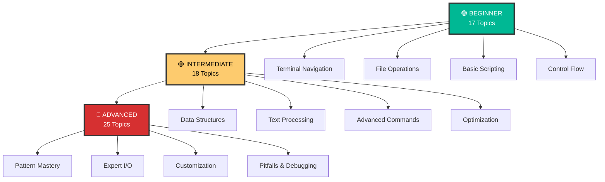
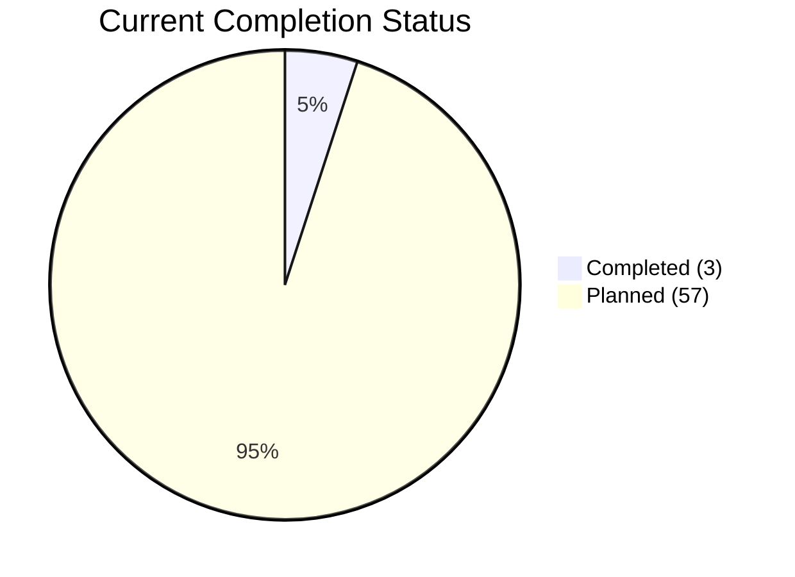
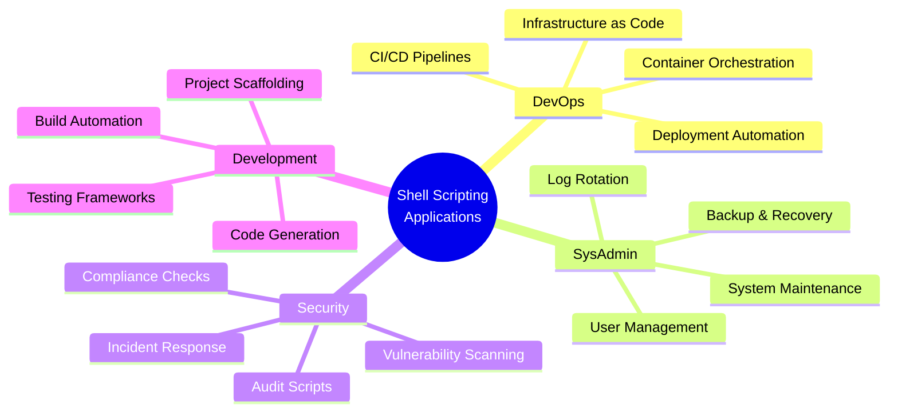

# 🤖 Automation - Shell Scripting Mastery

> **"Automation is the foundation of modern DevOps. Master shell scripting, and you master the infrastructure."**


## 📚 Overview

Welcome to the comprehensive **Shell Scripting & Automation** curriculum! This module contains **60 meticulously crafted topics** organized across three progressive learning levels, designed to transform you from a complete beginner to an automation expert.

Whether you're deploying applications, managing infrastructure, processing logs, or building CI/CD pipelines, shell scripting is the universal language of DevOps automation.

## 🎯 Learning Objectives

By completing this entire curriculum, you will:

- ✅ Master Bash shell scripting from fundamentals to advanced techniques
- ✅ Automate complex DevOps workflows confidently
- ✅ Write production-ready, maintainable automation scripts
- ✅ Understand Unix philosophy and best practices
- ✅ Debugretroubleshoot shell scripts effectively
- ✅ Build CI/CD pipeline components
- ✅ Implement robust error handling and logging
- ✅ Create reusable automation libraries

## 🗺️ Curriculum Structure

### Three-Tier Learning System



### Level Breakdown

| Level | Topics | Duration | Focus | Prerequisites |
|-------|--------|----------|-------|---------------|
| 🟢 **Beginner** | 17 | 2-3 weeks | Foundations, basic commands, simple scripts | None |
| 🟡 **Intermediate** | 18 | 3-4 weeks | Arrays, text processing, advanced commands | Beginner complete |
| 🔴 **Advanced** | 25 | 5-6 weeks | Expert techniques, optimization, pitfalls | Intermediate complete |
| **TOTAL** | **60** | **10-13 weeks** | Complete mastery | Dedication |

## 📖 Topic Listings

### 🟢 Level 1: Beginner (Foundation Building)

Master the fundamentals of shell scripting and terminal navigation.

| # | Topic | Description | Time | Status |
|---|-------|-------------|------|--------|
| 01 | [**Introduction**](./01-Shell-Scripting/01-Introduction/) | Shell types, shebang, first script | 2-3h | ✅ |
| 02 | [**Terminal and Finder**](./01-Shell-Scripting/02-Terminal-and-Finder/) | Navigation, filesystem, paths | 3-4h | ✅ |
| 03 | [**Basic File Manipulation**](./01-Shell-Scripting/03-Basic-File-Manipulation/) | touch, mkdir, cp, mv, rm | 4-5h | ✅ |
| 04 | **Hidden Files** | Dotfiles, configuration, .bashrc | 2-3h | 📝 |
| 05 | **Searching in Files** | grep, find basics, locate | 3-4h | 📝 |
| 06 | **Paging Files** | less, more, head, tail | 2-3h | 📝 |
| 07 | **Man Pages** | Documentation, help systems | 2h | 📝 |
| 08 | **Programs and Commands** | which, type, whereis, PATH | 3h | 📝 |
| 09 | **Basic Variables** | Declaration, scope, special vars | 4h | 📝 |
| 10 | **Vim Crash Course** | Vim modes, navigation, editing | 3-4h | 📝 |
| 11 | **File Permissions** | chmod, chown, umask | 4-5h | 📝 |
| 12 | **Finally Scripting** | First real automation script | 5-6h | 📝 |
| 13 | **User Input** | read command, validation | 3-4h | 📝 |
| 14 | **Functions** | Definition, parameters, scope | 4-5h | 📝 |
| 15 | **Conditionals** | if/else, test conditions | 5h | 📝 |
| 16 | **For Loops** | Iteration, while, until | 4-5h | 📝 |
| 17 | **Input/Output** | Streams, redirection, pipes | 4-5h | 📝 |

**Beginner Estimated Total**: **55-70 hours**

---

### 🟡 Level 2: Intermediate (Skill Enhancement)

Advance your scripting with data structures and powerful text processing tools.

| # | Topic | Description | Time | Status |
|---|-------|-------------|------|--------|
| 01 | **Case Statements** | Pattern matching, menus | 3-4h | 📝 |
| 02 | **Indexed Arrays** | Array basics, iteration | 4-5h | 📝 |
| 03 | **Associative Arrays** | Key-value pairs, hash maps | 4-5h | 📝 |
| 04 | **IFS Variable** | Field separation, parsing | 3-4h | 📝 |
| 05 | **Command Substitution** | $(), output capture | 3-4h | 📝 |
| 06 | **Arithmetic Expression** | $(( )), let, expr, bc | 4h | 📝 |
| 07 | **Process Substitution** | <(), advanced piping | 4-5h | 📝 |
| 08 | **Cut and Tr** | Column extraction, transformation | 3-4h | 📝 |
| 09 | **Sed, Awk, Grep** | Stream editors, text processing | 6-8h | 📝 |
| 10 | **Find Command** | Advanced search, -exec | 5-6h | 📝 |
| 11 | **Bash Arguments** | $@, $*, getopts, shift | 5-6h | 📝 |
| 12 | **Pipe Status** | PIPESTATUS, set -o pipefail | 3-4h | 📝 |
| 13 | **Timing Commands** | time, date, benchmarking | 3h | 📝 |
| 14 | **Sourcing Code** | source, libraries, modularity | 4h | 📝 |
| 15 | **Curlies vs. Parens** | { } vs. ( ), subshells | 4-5h | 📝 |
| 16 | **Return vs. Output** | Function returns, echo | 3-4h | 📝 |
| 17 | **Parameter Expansion** | ${var}, string manipulation | 5-6h | 📝 |
| 18 | **Array Expansion** | ${arr[@]}, slicing | 4-5h | 📝 |

**Intermediate Estimated Total**: **75-90 hours**

---

### 🔴 Level 3: Advanced (Expert Mastery)

Master advanced techniques, customization, and navigate common pitfalls.

| # | Topic | Description | Time | Status |
|---|-------|-------------|------|--------|
| 01 | **Basic Globbing** | *, ?, [ ] patterns | 4h | 📝 |
| 02 | **Extended Globbing** | @(), +(), *(), !(), ?() | 5-6h | 📝 |
| 03 | **Glob Shell Options** | shopt, nullglob, globstar | 4-5h | 📝 |
| 04 | **Brace Expansion** | {a,b,c}, sequences | 3-4h | 📝 |
| 05 | **Braces and Globbing** | Combined patterns | 4h | 📝 |
| 06 | **Numeric Brace Expansion** | {1..100}, zero-padding | 3h | 📝 |
| 07 | **Understanding Printf** | Formatted output | 5h | 📝 |
| 08 | **Date Formatting** | date, timestamps, arithmetic | 4-5h | 📝 |
| 09 | **Regular Expressions** | =~, BASH_REMATCH | 6-8h | 📝 |
| 10 | **Using Mapfile** | readarray, efficient reading | 4h | 📝 |
| 11 | **Brackets vs. Test** | [ ], [[ ]], (( )), test | 5h | 📝 |
| 12 | **Special Strings** | $'...', ANSI-C quoting | 3-4h | 📝 |
| 13 | **Trap Signals** | Signal handling, cleanup | 5-6h | 📝 |
| 14 | **Named Pipes** | mkfifo, FIFO, IPC | 5-6h | 📝 |
| 15 | **Color Output** | ANSI codes, tput | 4h | 📝 |
| 16 | **Cursor Commands** | Terminal control, progress bars | 4-5h | 📝 |
| 17 | **Is a TTY** | [ -t ], terminal detection | 3h | 📝 |
| 18 | **PS1 Variable** | Custom prompts | 4h | 📝 |
| 19 | **Customizing Bash** | .bashrc, .bash_profile | 5h | 📝 |
| 20 | **Readline Shortcuts** | Keyboard efficiency | 3-4h | 📝 |
| 21 | **Pitfall: LS** | Parsing ls dangers | 3h | 📝 |
| 22 | **Aliases with Arguments** | Function-based aliases | 3h | 📝 |
| 23 | **Pitfall: String Length** | ${#var} gotchas | 3h | 📝 |
| 24 | **Forkbomb** | Understanding :(){ :\|:& };: | 2-3h | 📝 |
| 25 | **Bonus Debugging Session** | Real-world troubleshooting | 6-8h | 📝 |

**Advanced Estimated Total**: **105-130 hours**

---

## 🎓 Complete Learning Statistics

### Progress Overview



### Detailed Breakdown

| Metric | Value |
|--------|-------|
| **Total Topics** | 60 |
| **Completed** | 3 (5%) |
| **In Progress** | 0 (0%) |
| **Planned** | 57 (95%) |
| **Total Estimated Hours** | 235-290 |
| **Estimated Weeks (Full-time)** | 6-7 |
| **Estimated Weeks (Part-time)** | 12-15 |

## 🚀 Quick Start Guide

### For Complete Beginners

```bash
# 1. Start with Introduction
cd 1-Beginner/02-Phase-2/02-Automation/01-Shell-Scripting/01-Introduction
cat README.md

# 2. Follow the numbered sequence
# Each topic builds on previous knowledge

# 3. Complete exercises in each directory
ls examples/
ls exercises/
```

### For Experienced Developers

```bash
# 1. Review the Master Index
cat AUTOMATION_MASTER_INDEX.md

# 2. Identify knowledge gaps
# Jump to specific intermediate or advanced topics

# 3. Focus on advanced patterns and pitfalls
cd 3-Advanced/02-Phase-2/02-Automation/01-Shell-Scripting/
```

## 📐 Content Standards

Every topic includes:

- ✅ **Comprehensive README.md** with theory and examples
- ✅ **Real-World DevOps Stories** showing practical applications
- ✅ **Interview Questions** (5-10 per topic) with detailed answers
- ✅ **Quiz Questions** (10-20 multiple choice) with answer keys
- ✅ **Code Examples** demonstrating concepts
- ✅ **Mermaid Diagrams** visualizing workflows and architectures
- ✅ **Professional Images** illustrating key concepts
- ✅ **Hands-On Exercises** with solutions
- ✅ **Best Practices** and common pitfalls
- ✅ **Navigation Links** to previous/next topics

## 🎯 Learning Paths

Choose your path based on your career goals:

### Path 1: DevOps Engineer 🚀
**Focus**: Automation, CI/CD, Infrastructure

**Priority Topics**:
- All Beginner topics
- Intermediate: Bash Arguments, sed/awk/grep, Find Command, Parameter Expansion
- Advanced: Trap Signals, Regular Expressions, Printf, Debugging Session

**Timeline**: 8-10 weeks

---

### Path 2: System Administrator 🖥️
**Focus**: Server management, maintenance, monitoring

**Priority Topics**:
- All Beginner topics (emphasis on File Permissions)
- Intermediate: Arrays, IFS, Text Processing Tools
- Advanced: Named Pipes, Customizing Bash, TTY Detection

**Timeline**: 9-11 weeks

---

### Path 3: Security Specialist 🔒
**Focus**: Security scripts, auditing, hardening

**Priority Topics**:
- All Beginner topics (deep dive on Permissions)
- Intermediate: grep/sed/awk for log analysis, Process Substitution
- Advanced: Regular Expressions, Special Strings, All Pitfalls, Debugging

**Timeline**: 10-12 weeks

---

## 🏆 Real-World Applications

### What You'll Be Able To Build

After completing this curriculum, you'll confidently create:

1. **🔄 CI/CD Pipeline Scripts**
   ```bash
   # Automated deployment with health checks
   ./deploy.sh --env production --validate --rollback-on-fail
   ```

2. **📊 System Monitoring Tools**
   ```bash
   # Real-time resource monitor with alerts
   ./monitor.sh --cpu-threshold 80 --memory-threshold 90 --alert slack
   ```

3. **🗄️ Backup Automation**
   ```bash
   # Intelligent incremental backup system
   ./backup.sh --type incremental --retention 30 --encrypt aes256
   ```

4. **📝 Log Analysis & Processing**
   ```bash
   # Extract and analyze application errors
   ./analyze-logs.sh --pattern "ERROR" --last 24h --report email
   ```

5. **🔧 Infrastructure Provisioning**
   ```bash
   # Server setup and configuration
   ./provision-server.sh --role webserver --environment staging
   ```

6. **🎨 Custom CLI Tools**
   ```bash
   # Interactive deployment wizard
   ./deploy-wizard.sh
   ```

### Industry Use Cases



## 📚 Additional Resources

### Official Documentation
- [GNU Bash Manual](https://www.gnu.org/software/bash/manual/) - Complete reference
- [POSIX Shell & Utilities](https://pubs.opengroup.org/onlinepubs/9699919799/) - Standards
- [Advanced Bash-Scripting Guide](https://tldp.org/LDP/abs/html/) - Comprehensive tutorials

### Tools & Validation
- [ShellCheck](https://www.shellcheck.net/) - Static analysis for shell scripts
- [explainshell.com](https://explainshell.com/) - Command explanation
- [bashdb](http://bashdb.sourceforge.net/) - Bash debugger
- [tldr](https://tldr.sh/) - Simplified man pages

### Books
- "Learning the bash Shell" (O'Reilly) - Beginner friendly
- "Bash Cookbook" (O'Reilly) - Problem-solution format
- "Linux Command Line and Shell Scripting Bible" (Wiley) - Comprehensive

### Online Communities
- [r/bash](https://reddit.com/r/bash) - Reddit community
- [Stack Overflow - bash tag](https://stackoverflow.com/questions/tagged/bash)
- [Unix & Linux Stack Exchange](https://unix.stackexchange.com/)

## 🎯 Prerequisites

### Recommended Background

- Basic computer literacy
- Familiarity with command-line interfaces (helpful but not required)
- Text editor experience (nano, vim, or VS Code)
- Access to Linux/Unix environment (WSL, macOS, or Linux VM)

### Technical Requirements

```bash
# Verify you have Bash 4.0+
bash --version
# GNU bash, version 4.x.x or higher

# Verify common utilities
which grep sed awk find

# Install ShellCheck (recommended)
# Ubuntu/Debian:
sudo apt install shellcheck

# macOS:
brew install shellcheck

# Windows (WSL): Use Linux instructions
```

## 🎓 Certification Preparation

This curriculum prepares you for:

- ✅ **Linux Foundation Certified System Administrator (LFCS)**  
  Focus: System administration, file management, scripting

- ✅ **Red Hat Certified System Administrator (RHCSA)**  
  Focus: Essential system administration skills

- ✅ **AWS DevOps Engineer Professional**  
  Focus: Automation, scripting for cloud deployments

- ✅ **CompTIA Linux+**  
  Focus: Linux administration and scripting

## 📋 Study Tips

### Effective Learning Strategies

1. **📝 Practice Daily**
   - Write at least one script per day
   - Start small, gradually increase complexity
   - Keep a script journal/repository

2. **🔄 Iterate and Refactor**
   - Revisit old scripts
   - Apply new techniques learned
   - Optimize and improve

3. **🧪 Experiment Safely**
   ```bash
   # Create a safe testing environment
   mkdir -p ~/scripting_playground
   cd ~/scripting_playground
   # Test dangerous commands here first!
   ```

4. **👥 Collaborate**
   - Share scripts for review
   - Study others' code
   - Contribute to open source

5. **📖 Read Man Pages**
   ```bash
   man bash  # Read sections 2-3 pages daily
   ```

6. **🐛 Debug Everything**
   ```bash
   # Always test with debugging enabled
   bash -x script.sh
   ```

## 🤝 Contributing

Found an error? Want to add examples? Contributions welcome!

```bash
# 1. Fork the repository
# 2. Create your feature branch
git checkout -b feature/improve-docs

# 3. Commit your changes
git commit -m "Add: Better example for loops"

# 4. Push and create Pull Request
git push origin feature/improve-docs
```

## 📞 Support

Need help? Multiple channels available:

- 📧 **Email**: devops-learning@example.com
- 💬 **Discord**: [Join our community](#)
- 🐛 **Issues**: [GitHub Issues](#)
- 📖 **Wiki**: [Knowledge Base](#)

## 🗺️ Navigation

### Quick Access

- **📊 [Organization Plan](../../AUTOMATION_ORGANIZATION_PLAN.md)** - Detailed project plan
- **📖 [Master Index](../../AUTOMATION_MASTER_INDEX.md)** - Complete topic catalog
- **🟢 [Start Beginner Path](./01-Shell-Scripting/01-Introduction/README.md)** - Begin your journey
- **🟡 [Intermediate Topics](../../2-Intermediate/02-Phase-2/02-Automation/)** - Level up
- **🔴 [Advanced Topics](../../3-Advanced/02-Phase-2/02-Automation/)** - Master class

### Other Modules

- **[00-Foundations](./ 00-Foundations/)** - Fundamental concepts
- **[02-Python-Basics](./02-Python-Basics/)** - Python automation
- **[03-Idempotency](./03-Idempotency/)** - Idempotent operations
- **[Labs](./Labs/)** - Hands-on practice projects

## 📈 Roadmap

### Current Version: 1.0 (January 2026)

**Status**: 🚧 In Progress - 5% Complete

**Completed**:
- ✅ Introduction to Shell Scripting
- ✅ Terminal and Finder Mastery
- ✅ Basic File Manipulation

**Next Up** (Priority Order):
1. Hidden Files (Beginner-04)
2. Searching in Files (Beginner-05)
3. Paging Files (Beginner-06)
4. Man Pages (Beginner-07)
5. Programs and Commands (Beginner-08)

### Future Enhancements

- **Video Tutorials**: Screencasts for each topic
- **Interactive Labs**: Browser-based practice environments
- **Automated Testing**: Script validation system
- **Community Scripts**: User-contributed examples
- **Mobile App**: Study on-the-go companion

---

## 🎉 Start Your Journey Today!

```bash
# Clone or navigate to the repository
cd ~/Devops/1-Beginner/02-Phase-2/02-Automation

# Start with the Introduction
cat 01-Shell-Scripting/01-Introduction/README.md

# Your automation mastery journey begins now! 🚀
```

---

**Last Updated**: 2026-01-10  
**Version**: 1.0.0  
**Status**: Active Development 🚧  
**Maintainer**: DevOps Learning Team

**📌 Remember**: *"The best time to start was yesterday. The second best time is now. Begin your automation journey today!"* 🌟

---

## 📊 Progress Tracker

Track your progress through the curriculum:

- [ ] **Beginner Level** (0/17 completed)
  - [x] Introduction
  - [x] Terminal and Finder
  - [x] Basic File Manipulation
  - [ ] Hidden Files
  - [ ] Searching in Files
  - [ ] Paging Files
  - [ ] Man Pages
  - [ ] Programs and Commands
  - [ ] Basic Variables
  - [ ] Vim Crash Course
  - [ ] File Permissions
  - [ ] Finally Scripting
  - [ ] User Input
  - [ ] Functions
  - [ ] Conditionals
  - [ ] For Loops
  - [ ] Input/Output

- [ ] **Intermediate Level** (0/18 completed)
- [ ] **Advanced Level** (0/25 completed)

**Total Progress**: 3/60 (5%) ⬜⬜⬜⬜⬜⬜⬜⬜⬜⬜

---

🚀 **Happy Automating!** 🤖
