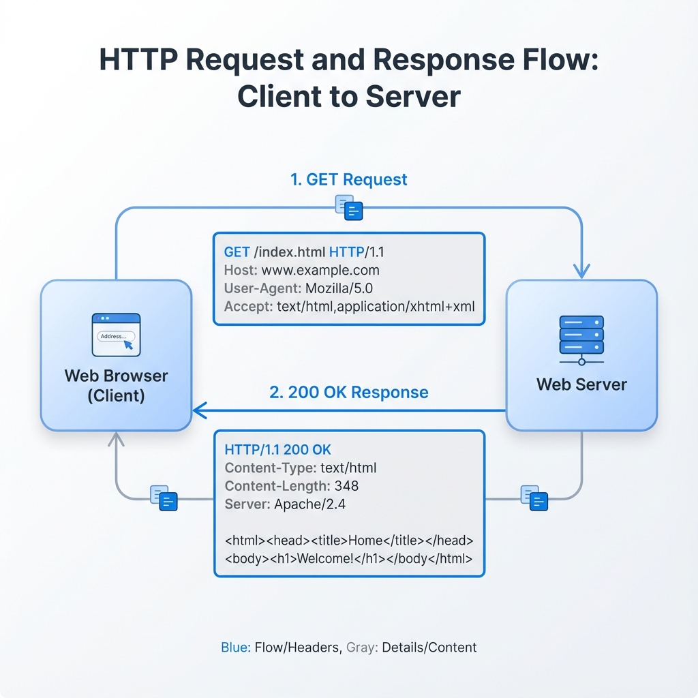
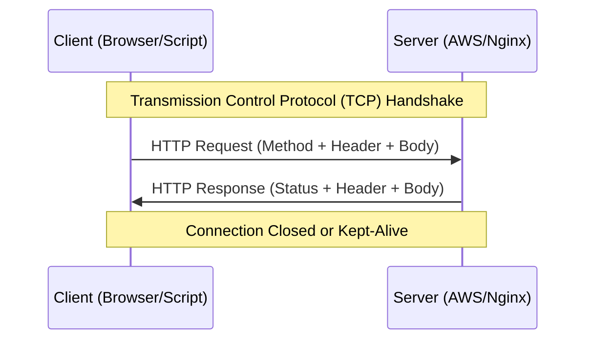

# 📡 Module 01: The HTTP Protocol

> **"HTTP is the language of the web. To control the cloud, you must speak its language fluently."**






## 📚 Overview
**HyperText Transfer Protocol (HTTP)** is the request-response protocol that serves as the foundation of data communication for the World Wide Web. In DevOps, HTTP isn't just for websites; it's how your monitoring tools scrape metrics, how your CI/CD pipelines trigger deployments, and how your infrastructure components coordinate.

## 🎓 Learning Objectives
- ✅ Decode the **HTTP Message Anatomy** (Start Line, Headers, Blank Line, Body).
- ✅ Master the **Primary Verbs**: GET, POST, PUT, DELETE, and HEAD.
- ✅ Understand the role of **Headers** in Content Negotiation and Caching.
- ✅ Differentiate between **HTTP/1.1**, **HTTP/2**, and **HTTP/3 (QUIC)**.

---

## 🏗️ The Anatomy of a Request

Every time you "call an API," you are sending a structured text block.

### 1. The Request Line
- **Method**: The action to perform (`GET`).
- **Path**: The resource location (`/v1/users`).
- **Version**: The protocol version (`HTTP/1.1`).

### 2. Headers (Metadata)
Headers are key-value pairs that provide context.
- `Host`: The domain name of the server (`api.github.com`).
- `Content-Type`: The format of the data being sent (`application/json`).
- `User-Agent`: The software making the request (`curl/7.68.0`).

### 3. The Body (Payload)
The actual data. For a **GET** request, the body is usually empty. For a **POST** or **PUT**, it contains the JSON or XML data you want the server to process.

---

## 🛠️ The HTTP Verb Taxonomy

| Verb | Property | Purpose | DevOps Use Case |
| :--- | :--- | :--- | :--- |
| **GET** | Safe/Idempotent | Retrieve data. | Checking server health status. |
| **POST** | Unsafe/Non-idempotent| Create a new resource. | Triggering a new Jenkins build. |
| **PUT** | Idempotent | Replace a resource. | Updating an entire config file. |
| **PATCH** | Unsafe | Partial update. | Changing one field in a DB record. |
| **DELETE** | Idempotent | Remove a resource. | Tearing down a test server. |
| **HEAD** | Safe | Get headers ONLY. | Checking if a 10GB log file exists. |

---

## 🚀 Professional Patterns: The "Header" Strategy

### Pattern A: Content Negotiation
Professional clients use the `Accept` header to tell the server: "I only understand JSON."
```bash
curl -H "Accept: application/json" https://api.example.com/data
```

### Pattern B: The User-Agent Guard
Many servers block "bot-like" requests. When writing automation scripts, always set a custom User-Agent to identify your script.
```bash
curl -A "MyDevOpsBot/1.4" https://api.example.com/health
```

### Pattern C: Caching with ETag
To save bandwidth, servers send an `ETag` (a hash of the data). In the next request, the client sends `If-None-Match: <hash>`. If the data hasn't changed, the server sends a **304 Not Modified**, saving execution time and money.

---

## 🏆 Real-World DevOps Story: The 10GB HEAD Check

**The Scenario**: An engineer wrote a script to download logs from an S3 bucket every hour. The script was downloading 10GB of data every time, even when no new logs were added, resulting in huge egress costs.
**The Fix**: They switched the script to use the **HEAD** method first. The script now checks the `Content-Length` and `Last-Modified` headers. If the file is the same size as the previous hour, the script skips the download.
**The Lesson**: The metadata (Headers) is often more valuable than the data (Body) for efficient automation.

---

## ❓ Interview Preparation (HTTP)

1. **Q: What is the difference between a 'Safe' and 'Idempotent' method?**
   *A: A 'Safe' method (like GET) does not change the state of the server. An 'Idempotent' method (like PUT or DELETE) can be called multiple times with the same result, but it *does* change server state the first time.*

2. **Q: Why is POST not idempotent?**
   *A: Because calling POST twice usually creates two separate resources. For example, hitting "Submit Order" twice might charge the customer twice.*

3. **Q: What happens if a request is missing the 'Host' header in HTTP/1.1?**
   *A: The server will return a **400 Bad Request**. The Host header is mandatory in HTTP/1.1 to support multiple domains on a single IP address (Virtual Hosting).*

4. **Q: What is the purpose of the 'Content-Length' header?**
   *A: It tells the receiver exactly how many bytes of data to expect in the body, allowing the connection to be kept alive for subsequent requests.*

5. **Q: What is 'Keep-Alive'?**
   *A: It is a feature that allows a single TCP connection to remain open for multiple HTTP requests/responses, reducing the "Handshake" overhead for high-performance apps.*

---

## 📝 Knowledge Check

1. **Which header is used to specify the format of the data being sent in the Body?**
   - [ ] a) Accept
   - [x] b) Content-Type
   - [ ] c) Authorization

2. **True or False: A GET request should never have a Body according to standard specs.**
   - [x] a) True (while technically possible in some tools, it is ignored by most servers)
   - [ ] b) False

3. **Which method would you use to update just the 'status' field of a server object?**
   - [ ] a) PUT
   - [x] b) PATCH
   - [ ] c) POST

4. **What is the first line of an HTTP Response called?**
   - [ ] a) The Request Line
   - [x] b) The Status Line
   - [ ] c) The Header Line

5. **Which protocol version introduced 'Multiplexing' (multiple streams over one connection)?**
   - [ ] a) HTTP/1.0
   - [ ] b) HTTP/1.1
   - [x] c) HTTP/2

---

## 🔗 Next Steps

Now that you know the language, let's learn how to design the architecture around it!

Proceed to: **[02-REST-Architecture](../02-REST-Architecture/README.md)** →
