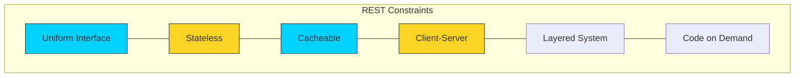

# 🏗️ Module 02: REST Architectural Style

> **"REST is not a protocol; it's a set of constraints. When followed, they turn a chaotic mess of endpoints into a predictable, scalable ecosystem."**

## 📚 Overview
**Representational State Transfer (REST)** is an architectural style designed for distributed hypermedia systems. Introduced by Roy Fielding in 2000, it focuses on **Resources** rather than actions. 

In DevOps, most of the services we interact with (AWS API, Kubernetes API, GitHub API) are "RESTful." Understanding the philosophy behind REST allows you to predict how an API works before you even read the documentation.

## 🎓 Learning Objectives
- ✅ Master the **6 REST Constraints**.
- ✅ Differentiate between **Resource-Oriented** design and RPC.
- ✅ Implement **Proper Endpoint Naming** (Plural nouns, not verbs).
- ✅ Understand the power of **HATEOAS** (Hypermedia as the Engine of Application State).
- ✅ Leverage **Statelessness** for massive horizontal scaling.

---

## 🏗️ The 6 Constraints of REST

### 1. Client-Server
Separation of concerns. The server focuses on data and security; the client focuses on user interface and state.

### 2. Statelessness (The DevOps Favorite)
The server doesn't "remember" you. Every request must be self-contained. This allows us to spin up 100 copies of a server without worrying about which copy the user talked to last.

### 3. Cacheability
Responses must define themselves as cacheable or not. This reduces latency and server load.

### 4. Layered System
A client can't tell if it's connected directly to the end server or an intermediary (like a Load Balancer or Proxy).

### 5. Uniform Interface (The "Predictability" Bit)
- **Resource Identification**: Resources are identified by URIs (`/users`).
- **Resource Manipulation**: Manipulation is done through representations (JSON/XML).
- **Self-Descriptive Messages**: Messages tell you how to process them (Content-Type).

### 6. Code on Demand (Optional)
Servers can temporarily extend client functionality by sending executable code (like JavaScript).

---

## 🚀 Professional Patterns: Resource-Oriented Design

### Pattern A: Nouns Over Verbs
Good APIs use nouns. Bad APIs use verbs.
- **❌ Bad (RPC Style)**: `GET /getUserInfo?id=123`
- **✅ Good (REST Style)**: `GET /users/123`

### Pattern B: Collection vs. Member
- `/users`: The **Collection**. `GET` lists all, `POST` creates one.
- `/users/123`: The **Member**. `GET` retrieves one, `PUT` updates it.

### Pattern C: Sub-Resources
To represent relationships, nest the resources.
- `/users/123/orders`: View all orders belonging to user 123.

---

## 🏆 Real-World DevOps Story: The Sticky Session Nightmare

**The Scenario**: A company had a legacy API that was "Stateful"—it stored user sessions in the server's local RAM. 
**The Crisis**: During a traffic spike, the DevOps team tried to scale from 2 servers to 10. Users started getting "Unauthorized" errors because their requests were hitting new servers that didn't have their session in memory.
**The Fix**: They refactored the API to be **RESTful/Stateless**. Identity was moved into a **JWT Token** sent with every request. 
**The Lesson**: Statelessness isn't just a design choice; it's a prerequisite for **Cloud Elasticity**.

---

## ❓ Interview Preparation (REST)

1. **Q: What is the single most important constraint of REST for scalability?**
   *A: Statelessness. Because the server stores no client context, we can route any request to any server node, enabling easy horizontal scaling and simpler disaster recovery.*

2. **Q: What does HATEOAS mean?**
   *A: Hypermedia as the Engine of Application State. It means an API response should contain links to other related actions. For example, a bank account response should include links to "deposit," "withdraw," and "transfer."*

3. **Q: Is REST limited to HTTP?**
   *A: Theoretically, no. REST is an architectural style that can be implemented over other protocols. However, in practice, 99% of RESTful systems use HTTP.*

4. **Q: How do you represent a "Search" or "Filter" in REST?**
   *A: Use **Query Parameters** on a collection endpoint. Example: `GET /users?role=admin&active=true`.*

5. **Q: What is a 'Resource Representation'?**
   *A: It is the format in which a resource is delivered to the client. A single "User" resource could have a JSON representation, an XML representation, or even a PDF representation.*

---

## 📝 Knowledge Check

1. **Which of the following is a CORRECT RESTful endpoint for deleting a product?**
   - [ ] a) `POST /deleteProduct/55`
   - [x] b) `DELETE /products/55`
   - [ ] c) `GET /products/55/delete`

2. **In a Stateless system, where is the 'Authentication State' stored?**
   - [ ] a) In the Server Database
   - [ ] b) In the Server Cache (Redis)
   - [x] c) On the Client (sent with every request)

3. **Which REST constraint ensures that a Load Balancer can be placed in front of a server?**
   - [ ] a) Code on Demand
   - [ ] b) Uniform Interface
   - [x] c) Layered System

4. **True or False: REST requires the use of JSON.**
   - [ ] a) True
   - [x] b) False (REST is format-agnostic, though JSON is preferred)

5. **Which constraint refers to the separation of UI concerns from Data storage concerns?**
   - [x] a) Client-Server
   - [ ] b) Statelessness
   - [ ] c) Cacheability

---

## 🔗 Next Steps

Architecture is great, but how do we handle failures?

Proceed to: **[03-Status-Codes-and-Errors](../03-Status-Codes-and-Errors/README.md)** →
