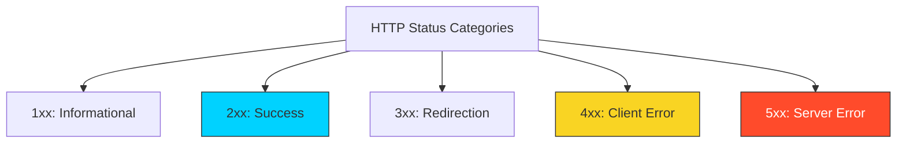

# 🛑 Module 03: Status Codes & Error Handling

> **"A good API tells you what happened. A great API tells you why it happened and how to fix it."**



## 📚 Overview
HTTP Status Codes are the "Body Language" of the web. As a DevOps engineer, these codes are your primary diagnostic tool. When a Kubernetes Pod is "CrashLoopBackOff" or a Load Balancer is returning errors, the Status Code is the first clue in the investigation.

## 🎓 Learning Objectives

- ✅ Master the **5 Categories** of HTTP codes.
- ✅ Deep dive into **Critical DevOps Codes** (503, 504, 429).
- ✅ Differentiate between **Client Errors** and **Server Errors**.
- ✅ Implement **Professional Error Payloads**.
- ✅ Understand the role of codes in **Automatic Retries**.

---

## 🏗️ The Status Code Hierarchy

### 1. 2xx: Success (Green Light)

- **200 OK**: General success.
- **201 Created**: Resource created successfully (Response should include a `Location` header).
- **204 No Content**: Success, but nothing to show (Common for `DELETE`).

### 2. 3xx: Redirection (The Hand-off)

- **301 Moved Permanently**: URL has changed forever.
- **304 Not Modified**: Use your cached copy.

### 3. 4xx: Client Error (Your Fault)

- **400 Bad Request**: Malformed JSON or missing fields.
- **401 Unauthorized**: Missing or invalid authentication (Who are you?).
- **403 Forbidden**: Valid auth, but you don't have permission for this resource (I know who you are, and the answer is NO).
- **404 Not Found**: The resource doesn't exist.
- **429 Too Many Requests**: You hit the **Rate Limit**.

### 4. 5xx: Server Error (My Fault)

- **500 Internal Server Error**: The code crashed.
- **502 Bad Gateway**: The Proxy/Load Balancer couldn't talk to the backend.
- **503 Service Unavailable**: Server is overloaded or down for maintenance.
- **504 Gateway Timeout**: The backend took too long to reply.

---

## 🚀 Professional Patterns: DevOps Diagnostics

### Pattern A: The 429 Retry-After

When an API returns a **429**, it usually includes a `Retry-After` header. Your automation scripts should parse this and wait.

```bash
# Don't just loop! Respect the server.
# Status 429 -> Parse Retry-After: 30 -> sleep 30
```

### Pattern B: Meaningful Error Bodies
Never just send a code. Send a "Helpful Payload."
```json
{
  "error": "validation_failed",
  "message": "The 'email' field is required.",
  "request_id": "req_88721",
  "docs": "https://api.example.com/docs/errors#val_fail"
}
```

### Pattern C: 502 vs 504

- **502**: Use this to diagnose a configuration error between Nginx and your App.
- **504**: Use this to diagnose a performance bottleneck (Slow database query).

---

## 🏆 Real-World DevOps Story: The 301 Loop of Doom

**The Scenario**: An SRE configured an Nginx server to redirect all HTTP traffic to HTTPS.
**The Crisis**: They accidentally created a loop where the HTTPS site also redirected to the HTTPS site. Browsers and API clients hit a "Too many redirects" error, and the server was overwhelmed with millions of useless **301** requests per minute.
**The Fix**: Examining the logs for **301** status codes revealed the pattern instantly. They corrected the Nginx `return 301` instruction.
**The Lesson**: Monitoring status codes isn't just for errors; monitoring **Redirections (30x)** can reveal major configuration flaws.

---

## ❓ Interview Preparation (Status Codes)

1. **Q: What is the difference between 401 and 403?**
   *A: 401 (Unauthorized) means the server doesn't know who you are (Authentication missing). 403 (Forbidden) means the server knows who you are, but you don't have the "clearance" to see that specific resource (Authorization failure).*

2. **Q: Which status code hints at a Load Balancer or Proxy issue?**
   *A: 502 (Bad Gateway) or 504 (Gateway Timeout) usually indicate that the communication between the "Front Door" (Proxy) and the "Kitchen" (App Server) is broken.*

3. **Q: When should a REST API return a 204 No Content?**
   *A: It is most commonly used for DELETE or PUT requests where the operation was successful, but there is no new data representation to send back to the client.*

4. **Q: What does a 429 status code imply for your automation scripts?**
   *A: It implies the client is being "Rate Limited." The script should implement an **Exponential Backoff** strategy to wait longer between subsequent retries.*

5. **Q: Why is 500 the "Enemy" of the SRE?**
   *A: Because a 500 error is generic. It indicates an unhandled exception in the code. It provides no context and requires deep log diving or APM tools to diagnose.*

---

## 📝 Knowledge Check

1. **You try to access a page and see "403 Forbidden." You check your token and it's valid. What is the likely problem?**
   - [ ] a) Wrong username
   - [ ] b) Server is down
   - [x] c) Insufficient permissions (RBAC)

2. **Which code represents a successful resource creation?**
   - [ ] a) 200
   - [x] b) 201
   - [ ] c) 204

3. **Your database query takes 60 seconds to run, and the user sees an error. Which code is most likely?**
   - [ ] a) 500
   - [ ] b) 502
   - [x] c) 504

4. **True or False: A 404 error always means the entire website is down.**
   - [ ] a) True
   - [x] b) False (It only means that specific URL/Resource was not found)

5. **Which status category represents "Success"?**
   - [ ] a) 1xx
   - [x] b) 2xx
   - [ ] c) 3xx

---

## 🔗 Next Steps

Now that we can handle errors, let's look at how we secure the access!

Proceed to: **[04-Authentication-and-Security](../04-Authentication-and-Security/README.md)** →
