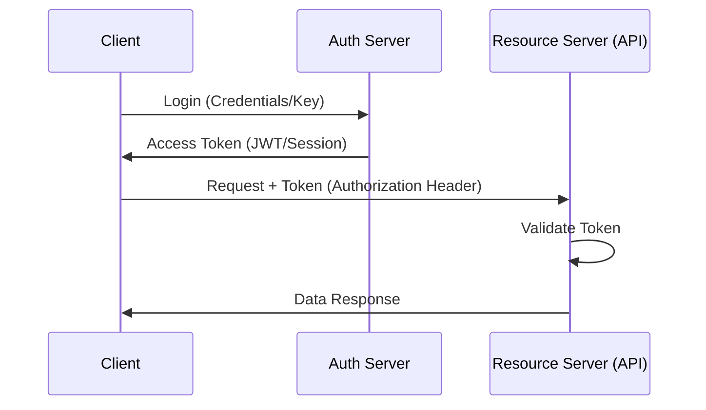

# 🔐 Module 04: Authentication & Security

> **"Identity is the perimeter. In a world of APIs, 'Who you are' and 'What you can do' are the only walls left."**

## 📚 Overview
In the DevOps world, APIs are exposed to the public internet by default. **Security** is not an afterthought; it is the core of the architecture. Understanding how systemic identity is established (Authentication) and how permissions are limited (Authorization) is critical for preventing data leaks and infrastructure hijacking.

## 🎓 Learning Objectives
- ✅ Differentiate between **Authentication** and **Authorization**.
- ✅ Master the **Header Pattern**: `Authorization: <Type> <Credentials>`.
- ✅ Understand **API Keys** vs. **Bearer Tokens**.
- ✅ Deep dive into **JWT (JSON Web Tokens)**: Header, Payload, and Signature.
- ✅ Explore the **OAuth2** flow for third-party integrations.

---

## 🏗️ The 4 Pillars of API Security

### 1. API Keys (The Identity Card)
A simple string sent in a header or query param. 
- **Use Case**: Identifying an application, not a user. 
- **Risk**: Easily leaked in logs or source code.

### 2. Basic Auth (The Old Guard)
Username and password encoded in Base64: `Authorization: Basic dXNlcjpwYXNz`.
- **Use Case**: Simple server-to-server tests.
- **Risk**: The password is sent with every single request.

### 3. Bearer Tokens & JWT (The Modern Standard)
A token is issued after a secure login. The client "bears" the token.
- **JWT Anatomy**:
    1. **Header**: Algorithm used.
    2. **Payload/Claims**: Data (User ID, Expiration).
    3. **Signature**: Cryptographic proof the token hasn't been tampered with.

### 4. OAuth2 (The Delegation Framework)
Allows an app to access resources on behalf of a user WITHOUT seeing the user's password.
- **Example**: "Log in with Google" or a GitHub Action accessing your AWS account.

---

## 🚀 Professional Patterns: Hardening the API

### Pattern A: Never in the URL
Never pass keys or tokens in query parameters (`?api_key=123`). They get saved in browser history, proxy logs, and server access logs. **Always use Headers.**

### Pattern B: Short-Lived Tokens
Professional APIs issue an **Access Token** (valid for 1 hour) and a **Refresh Token** (valid for 30 days). If an access token is stolen, the attacker only has a small window of opportunity.

### Pattern C: Least Privilege (Scopes)
Don't give your API token "Admin" access. Use **Scopes**. A token for a backup script should only have `read` permissions, not `delete` or `write`.

---

## 🏆 Real-World DevOps Story: The Public Log Leak

**The Scenario**: A developer was debugging an API using `curl -v`. They shared the terminal output in a public Slack channel to get help.
**The Crisis**: The `-v` (verbose) flag logged the `Authorization: Bearer <token>` header. A bot scraped the Slack channel and used the token to delete the company's production database within 4 minutes.
**The Fix**: The company implemented **Secret Scanning** (GitHub Secret Scanning / TruffleHog). They also enforced short-lived tokens (15-minute expiration).
**The Lesson**: In APIs, credentials are **sensitive data**. Never log them, never commit them, and always rotate them.

---

## ❓ Interview Preparation (Security)

1. **Q: What is the difference between Authentication and Authorization?**
   *A: Authentication (AuthN) is verifying **who** you are. Authorization (AuthZ) is verifying **what** you are allowed to do. You can be authenticated but not authorized to access a specific resource.*

2. **Q: Why are JWTs considered "Stateless"?**
   *A: Because they contain all the necessary information (claims) within the token itself. The server doesn't need to check its database to know who the user is; it just needs to verify the cryptographic signature.*

3. **Q: How should you store an API Key in a CI/CD pipeline like GitHub Actions?**
   *A: Store it as an **Encrypted Secret**. Never hardcode it in the YAML file. Access it via environment variables within the runner.*

4. **Q: What is a 'Replay Attack' and how do tokens prevent them?**
   *A: A replay attack is when an attacker intercepts a valid request and sends it again. Tokens prevent this through **Expiration (exp) claims** and sometimes **Nonces** (one-time use numbers).*

5. **Q: What is 'Cross-Origin Resource Sharing' (CORS)?**
   *A: CORS is a security mechanism that allows or restricts APIs from being accessed by web browsers on different domains. It is enforced by the browser, not the server directly.*

---

## 📝 Knowledge Check

1. **Where is the most secure place to put an API authentication token?**
   - [ ] a) In the URL query string
   - [x] b) In the Request Header
   - [ ] c) In the Request Body

2. **Which part of a JWT allows the server to verify the token is from a trusted source?**
   - [ ] a) Header
   - [ ] b) Payload
   - [x] c) Signature

3. **In the header `Authorization: Bearer eyJhbGci...`, what is 'Bearer'?**
   - [ ] a) The username
   - [x] b) The Authentication Type (Scheme)
   - [ ] c) The server name

4. **True or False: Base64 encoding in Basic Auth is a form of encryption.**
   - [ ] a) True
   - [x] b) False (Base64 is an encoding, it can be reversed instantly without a key)

5. **Which protocol is used for delegated authorization?**
   - [ ] a) HTTPS
   - [ ] b) JWT
   - [x] c) OAuth2

---

## 🔗 Next Steps

Security is tight. Now, let's see how these APIs function in complex DevOps environments!

Proceed to: **[04-Authentication-and-Security](../05-DevOps-Integration/README.md)** →
