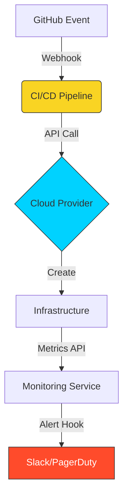

# 🚀 Module 05: APIs in the DevOps Lifecycle

> **"In DevOps, every tool is an API client, and every platform is an API provider. Automation is simply the glue that connects them."**

## 📚 Overview
This final module bridges the gap between theoretical API knowledge and practical **DevOps Engineering**. We explore how APIs power the automation loops that define our industry—from Webhooks triggering pipelines to the defensive programming required to build resilient integrations.

## 🎓 Learning Objectives
- ✅ Master **Webhooks** (The "Don't call us, we'll call you" pattern).
- ✅ Implement **Exponential Backoff** for resilient API clients.
- ✅ Understand **Rate Limiting** strategies and the `429` response.
- ✅ Leverage **Idempotency Keys** for safe retries in CI/CD.
- ✅ Use **cURL** for low-level API troubleshooting in production.

---

## 🏗️ Performance & Resilience Patterns

### 1. Webhooks (Push vs. Pull)
Instead of your script checking GitHub for changes every minute (Pulling), GitHub sends a request to your server the moment a change happens (Pushing).
- **Security**: Always verify the **Signature** of a webhook to ensure it actually came from the trusted provider.

### 2. Exponential Backoff & Jitter
When an API fails or rate-limits you, wait before retrying. 
- **Backoff**: Wait 1s, then 2s, then 4s, etc.
- **Jitter**: Add a random small amount of time to the wait to prevent "Thundering Herd" (multiple clients retrying at the exact same millisecond).

### 3. Idempotency (Safety in Retries)
An operation is idempotent if it can be performed multiple times with the same result.
- **DevOps Use**: If a server creation call times out, you want to retry safely. By sending a `X-Idempotency-Key` header, the Cloud API knows if it's a new request or a retry of the previous one.

---

## 🚀 Professional cURL Toolkit for SREs

cURL is the Swiss Army Knife of API debugging. Master these flags:
- `-v`: **Verbose**. See the headers and the handshake.
- `-I`: **Head Only**. Check the status code without downloading the body.
- `-sS`: **Silent but show Errors**. Perfect for cron jobs.
- `-L`: **Follow Redirects**. 
- `-X`: **Set Method**. Specify POST, PUT, DELETE.
- `-H`: **Add Header**. For token auth or content types.

---

## 🏆 Real-World DevOps Story: The Thundering Herd

**The Scenario**: A fleet of 5,000 servers was configured to download a security update via API every day at midnight.
**The Crisis**: At exactly 00:00:00, all 5,000 servers hit the API gateway simultaneously. The gateway crashed instantly under the load. 
**The Fix**: The SRE team implemented **Jitter** in the update script. Now, each server picks a random time between 00:00 and 00:15 to check for updates.
**The Lesson**: Unison is the enemy of stability in distributed systems. Randomness (Jitter) is a tool for resilience.

---

## ❓ Interview Preparation (Integration)

1. **Q: What is a Webhook and how does it differ from a standard API request?**
   *A: A standard API request is "Pull-based" (Client asks Server for data). A Webhook is "Push-based"—the Server makes an HTTP request to a URL provided by the client when a specific event occurs.*

2. **Q: Why is Exponential Backoff important in cloud automation?**
   *A: It prevents your automation from overwhelming a recovering service. If you retry at a fixed interval, you might keep a struggling service down (Denial of Service). Waiting longer each time gives the service "breathing room" to recover.*

3. **Q: What is the 'Thundering Herd' problem?**
   *A: It's when a large number of clients all attempt to access a resource (or retry a failure) at the exact same time, causing a spike that crashes the system.*

4. **Q: How can you verify that a Webhook actually came from GitHub and not an attacker?**
   *A: By using a shared secret. GitHub hashes the payload with the secret and sends it in a header (e.g., `X-Hub-Signature`). Your server must perform the same hash and compare the results.*

5. **Q: What is 'Rate Limiting' and how do APIs communicate it?**
   *A: Rate limiting is a cap on how many requests a client can make in a time window. APIs communicate this via the **429 Too Many Requests** status code and headers like `X-RateLimit-Remaining` and `X-RateLimit-Reset`.*

---

## 📝 Final Knowledge Check

1. **Which mechanism tells a server "Don't charge me twice if I retry this request"?**
   - [ ] a) Authentication Token
   - [ ] b) Rate Limiting
   - [x] c) Idempotency Key

2. **Which cURL flag allows you to see the full HTTP request and response headers?**
   - [ ] a) `-o`
   - [ ] b) `-d`
   - [x] c) `-v`

3. **What is added to Exponential Backoff to prevent Thundering Herds?**
   - [ ] a) More CPU
   - [x] b) Jitter (Randomness)
   - [ ] c) Authentication

4. **True or False: Webhooks are technically HTTP requests where your server acts as the API host.**
   - [x] a) True
   - [ ] b) False

5. **Which status code should you look for to know you need to slow down your API calls?**
   - [ ] a) 404
   - [x] b) 429
   - [ ] c) 500

---

## 🔗 Next Steps

Congratulations! You've mastered the basics of how software talks to software. Now, let's look at the infrastructure that serves these APIs!

Proceed to: **[Nginx Web Server](../../03-Nginx/README.md)** →
