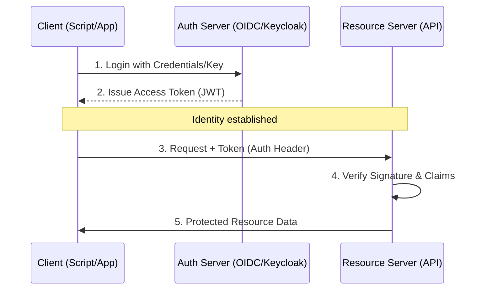

# 🔐 Part 2: API Security & Authentication

> **"Identity is the new perimeter. In a world of headless services, 'Who you are' and 'What you are allowed to do' are the only walls left standing."**

## 📖 Overview

In the DevOps world, APIs are often the "keys to the kingdom." A compromised API token can lead to a full infrastructure takeover. Understanding how to establish systemic identity (**Authentication**) and enforce restricted permissions (**Authorization**) is critical for any cloud professional.

---

## 🏗️ The Security Handshake

The flow of modern token-based authentication.

---

## 🎯 Learning Objectives

By the end of this module, you will:

- ✅ **Distinguish** between Authentication (verified identity) and Authorization (verified permissions).
- ✅ **Implement** the Bearer Token pattern using standard HTTP headers.
- ✅ **Analyze** JWT (JSON Web Tokens) anatomy and cryptographic validation.
- ✅ **Secure** CI/CD pipelines using short-lived tokens and secret rotation.
- ✅ **Leverage** Scopes to enforce the "Least Privilege" principle.

---

## 🧱 The 4 Pillars of API Identity

### 1. API Keys (The Identity Card)

A static string, usually identifying a specific application or integration.

- **Pros**: Simple to implement.
- **Cons**: High risk of leakage in logs or source code. Hard to rotate without downtime.

### 2. Basic Auth (The Old Guard)

Username and password encoded in Base64: `Authorization: Basic dXNlcjpwYXNz`.

- **Warning**: NOT encrypted. Just a text format. Must only be used over HTTPS.

### 3. JWT & Bearer Tokens (The Modern Standard)

A self-contained, cryptographically signed token.

- **Header**: Algorithm metadata.
- **Payload**: "Claims" (User ID, Role, Expiration).
- **Signature**: The digital seal that proves the token hasn't been tampered with.

### 4. OAuth2 (The Delegation Framework)

The modern way to allow "Service A" to talk to "Service B" on behalf of a user.

- **Example**: A GitHub Action using a temporary token to deploy to your AWS EKS cluster.

---

## 🚀 Professional Patterns: Hardening the API

### Pattern A: "Headers over Query"

Never pass keys in a URL (`?token=123`). URLs are recorded in browser history, server logs, and proxy logs. **Always use the Authorization Header.**

### Pattern B: Short-Lived Access

Issue an **Access Token** valid for minutes and a **Refresh Token** valid for days. Even if an access token is stolen, the attacker's window of opportunity is tiny.

---

## 🎓 Career Readiness

**Interview Question:** "What are the three parts of a JSON Web Token (JWT) and what is the purpose of the third part?"

**Strong Answer:** "A JWT is composed of a **Header**, a **Payload**, and a **Signature**. The Header defines the algorithm, the Payload contains the user data or claims, and the **Signature** is the most critical part—it is a cryptographic hash of the first two parts using a secret key. This allows the server to verify that the token was indeed issued by a trusted source and has not been modified by a man-in-the-middle attack."

---

**Next Step**: [Part 3: Advanced API Workflows](../../Part-03-Advanced-API-Workflows/01-DevOps-Integration/) 🚀
