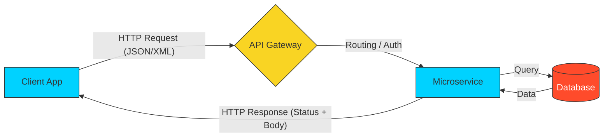

# 🌐 API Basics: The Nervous System of the Cloud

> **"If code is the soul of software, APIs are its voice. Mastering how software talks to software is the foundation of the modern distributed world."**

## 📚 Curriculum Overview
In the age of Cloud Native and Microservices, no piece of software lives in isolation. An **API (Application Programming Interface)** is the contract that allows disparate systems to exchange data reliably. This module transitions you from building "isolated code" to building "connected systems."

We will explore the mechanics of the web, the grammar of HTTP, and the architectural constraints of REST, preparing you to debug, document, and integrate with any modern cloud service.

## 🎓 Learning Objectives

### 🎯 Learning Outcomes

- ✅ Master the **HTTP Protocol** (Methods, Headers, and Body).
- ✅ Understand the **6 REST Constraints** that define modern web architecture.
- ✅ Decode the **Status Code Taxonomy** (1xx - 5xx).
- ✅ Implement **Secure Auth Patterns** (API Keys, JWT, OAuth2).
- ✅ Visualize the **Client-Server Handshake** in high-stakes environments.
- ✅ Use **cURL and Postman** for surgical API debugging.

---

## 🏗️ Curriculum Structure

| # | Module | Topic | Description |
| :--- | :--- | :--- | :--- |
| 01 | **HTTP Protocol** | The Grammar of the Web | Methods (GET/POST), Headers, and Message Anatomy. |
| 02 | **REST Architecture** | The Design Language | Resources, Endpoints, and Statelessness. |
| 03 | **Status & Error Handling** | The Feedback Loop | Communicating success and failure through codes. |
| 04 | **API Security** | The Protective Layer | Authentication vs. Authorization and Token management. |
| 05 | **DevOps Integration** | APIs in the Wild | Webhooks, Rate Limiting, and Idempotency. |

---

## 🚀 Why APIs for DevOps?

### 1. The Proliferation of Microservices

Modern applications aren't one big "block" of code; they are hundreds of small services talking over APIs. If an API breaks, the infrastructure dies.

### 2. Infrastructure as Code (IaC)

Tools like **Terraform** and **Ansible** are essentially giant API clients. They talk to the AWS or Azure APIs to spin up servers. Understanding APIs makes you a better automation engineer.

### 3. Monitoring & Observability

Most monitoring tools (Datadog, Prometheus) ingest data via APIs. As a DevOps engineer, you'll build "Plumbing" that pipes data through these interfaces.

---

## 🏆 Real-World DevOps Story: The Idempotency Incident

**The Scenario**: An automated billing script was retrying a "Charge Customer" API call because of a network timeout. 
**The Crisis**: Because the API was not **Idempotent**, every retry created a new charge. One customer was billed 15 times for the same item because the script didn't understand the API's failure logic.
**The Fix**: The team implemented **Idempotency Keys** (unqiue headers). Now, even if the script retries 100 times, the API recognizes the key and only processes the charge once.
**The Lesson**: In DevOps, knowing *how* an API behaves during failure is more important than knowing how it behaves during success.

---

## ❓ Interview Preparation (Core API Concepts)

1. **Q: What is the difference between an Endpoint and a Resource?**
   *A: A Resource is the actual data object (e.g., a "User"). An Endpoint is the URL used to access or manipulate that resource (e.g., `/api/v1/users/123`).*

2. **Q: What does it mean for an API to be "Stateless"?**
   *A: It means the server does not store any "client state" between requests. Every single request must contain all the information necessary to fulfill it (e.g., the authentication token and the data).*

3. **Q: When would you use PUT vs. PATCH?**
   *A: PUT is for a full replacement of a resource. If you miss a field, it might be deleted. PATCH is for partial updates—only the fields you send are changed.*

4. **Q: What is a "Payload" in an API context?**
   *A: The payload is the actual data sent in the body of an HTTP request or response, usually formatted as JSON or XML.*

5. **Q: What is the purpose of the 'Accept' header?**
   *A: It tells the server what format the client is capable of parsing (e.g., `application/json` or `text/html`).*

---

## 📝 Preliminary Knowledge Check

1. **Which HTTP method is considered 'Safe' (it only reads data, never changes it)?**
   - [ ] a) POST
   - [x] b) GET
   - [ ] c) DELETE

2. **What status code range represents "Client Side Errors"?**
   - [ ] a) 2xx
   - [ ] b) 5xx
   - [x] c) 4xx

3. **Which format is the modern standard for API data exchange?**
   - [ ] a) CSV
   - [x] b) JSON
   - [ ] c) TXT

4. **True or False: An API Key is a secure way to handle user-specific login in a browser.**
   - [ ] a) True
   - [x] b) False (User-specific login should use tokens like JWT/OAuth2; API keys are for app-to-app identity)

5. **What does CRUD stand for?**
   - [x] a) Create, Read, Update, Delete
   - [ ] b) Control, Read, Use, Deploy
   - [ ] c) Call, Run, Update, Disconnect

---

## 🔗 Next Steps

Ready to dive into the grammar of the internet?

Proceed to: **[01-HTTP-Protocol](./01-HTTP-Protocol/README.md)** →
