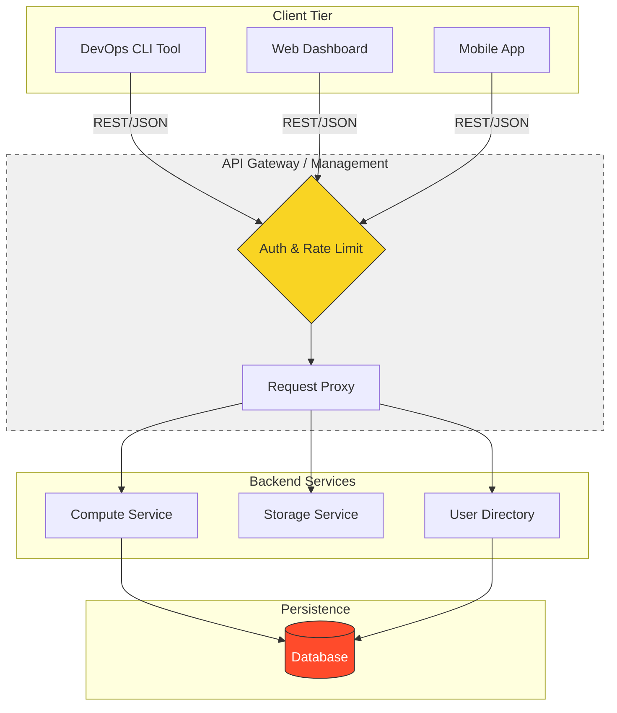

# 🌐 API Basics: The Nervous System of the Cloud

> **"If code is the soul of software, APIs are its voice. In a cloud-native world, your infrastructure is only as strong as the contracts that connect it."**

## 📚 Overview

Modern infrastructure is no longer a collection of isolated servers; it is a complex web of interconnected services. An **API (Application Programming Interface)** is the formal contract that allows these services to communicate, share data, and trigger actions across boundaries.

For a DevOps engineer, APIs are everywhere:

- **Automation**: Terraform and Ansible are essentially sophisticated API clients.
- **Monitoring**: Metrics and logs are shipped and queried via APIs.
- **Microservices**: Deeply understanding HTTP and REST is non-negotiable for debugging production traffic.

---

## 🏗️ High-Level Architecture

How disparate systems bridge the gap using APIs.

---

## 🎯 Learning Objectives

By the end of this module, you will:

- ✅ **Master** the HTTP/HTTPS protocol anatomy (Methods, Headers, Body).
- ✅ **Design** services following strict RESTful architectural constraints.
- ✅ **Debug** production failures using Status Code taxonomy (1xx - 5xx).
- ✅ **Secure** machine-to-machine communication using JWT, OAuth2, and API Keys.
- ✅ **Implement** DevOps-native API patterns like Webhooks and Idempotency.

---

## 🗺️ Curriculum Structure

| Part | Topic | Description |
| :--- | :--- | :--- |
| **[🟢 Part 1](./Part-01-Web-Foundations/)** | **Web Foundations** | The Grammar of the Internet. HTTP Protocol, REST constraints, and Status Codes. |
| **[🟡 Part 2](./Part-02-API-Security-and-Auth/01-Authentication-and-Security/)** | **Security & Auth** | The Protective Layer. Authentication vs. Authorization, Tokens, and OAuth2. |
| **[🔴 Part 3](./Part-03-Advanced-API-Workflows/01-DevOps-Integration/)** | **DevOps Workflows** | APIs in Production. Webhooks, Rate Limiting, and Resilient Retries. |

---

## 🏆 Real-World DevOps Story: The Idempotency Incident

**The Scenario**: An automated billing script was retrying a "Charge Customer" API call because of a network timeout. 

**The Crisis**: Because the API was not **Idempotent**, every retry created a new charge. One customer was billed 15 times for the same item because the script didn't understand the API's failure logic.

**The Fix**: The team implemented **Idempotency Keys** (unique headers). Now, even if the script retries 100 times, the API recognizes the key and only processes the charge once.

**The Lesson**: In DevOps, knowing *how* an API behaves during failure is more important than knowing how it behaves during success.

---

## 🎓 Career Readiness

**Interview Question:** "Explain the difference between PUT and PATCH, and why it matters for API design."

**Strong Answer:** "PUT is used for full resource replacement. If you send a PUT request to update a user profile but omit the 'email' field, a strict REST API will set that email to null or delete it. PATCH, however, is for partial updates. It only modifies the specific fields provided in the payload. In a DevOps context, PATCH is often safer for updating configuration as it reduces the risk of accidentally overwriting unrelated settings."

---

**Next Step**: Start with **[Part 1: Web Foundations](./Part-01-Web-Foundations/01-HTTP-Protocol/)** 🚀
