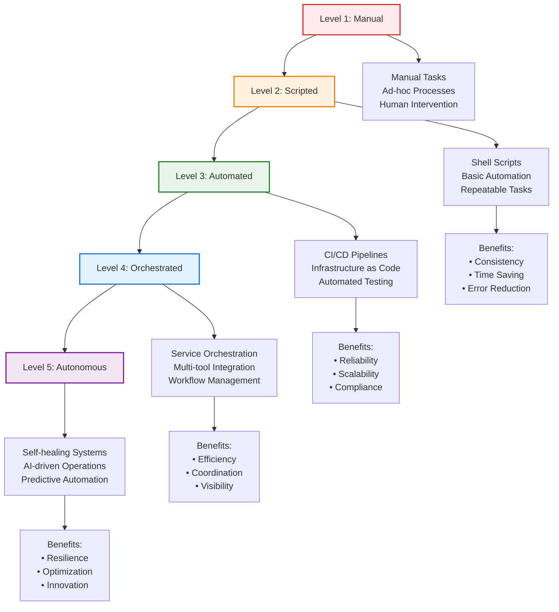

# Automation Maturity Model

```mermaid
graph TD
    A[Level 1: Manual] --> B[Level 2: Scripted]
    B --> C[Level 3: Automated]
    C --> D[Level 4: Orchestrated]
    D --> E[Level 5: Autonomous]
    
    A --> F[Manual Tasks<br/>Ad-hoc Processes<br/>Human Intervention]
    B --> G[Shell Scripts<br/>Basic Automation<br/>Repeatable Tasks]
    C --> H[CI/CD Pipelines<br/>Infrastructure as Code<br/>Automated Testing]
    D --> I[Service Orchestration<br/>Multi-tool Integration<br/>Workflow Management]
    E --> J[Self-healing Systems<br/>AI-driven Operations<br/>Predictive Automation]
    
    G --> K[Benefits:<br/>• Consistency<br/>• Time Saving<br/>• Error Reduction]
    H --> L[Benefits:<br/>• Reliability<br/>• Scalability<br/>• Compliance]
    I --> M[Benefits:<br/>• Efficiency<br/>• Coordination<br/>• Visibility]
    J --> N[Benefits:<br/>• Resilience<br/>• Optimization<br/>• Innovation]
    
    style A fill:#ffebee,stroke:#d32f2f,stroke-width:2px
    style B fill:#fff3e0,stroke:#f57c00,stroke-width:2px
    style C fill:#e8f5e8,stroke:#2e7d32,stroke-width:2px
    style D fill:#e3f2fd,stroke:#1976d2,stroke-width:2px
    style E fill:#f3e5f5,stroke:#7b1fa2,stroke-width:2px
```

This maturity model shows the progression from manual operations to fully autonomous systems, with shell scripting as a crucial foundation step.