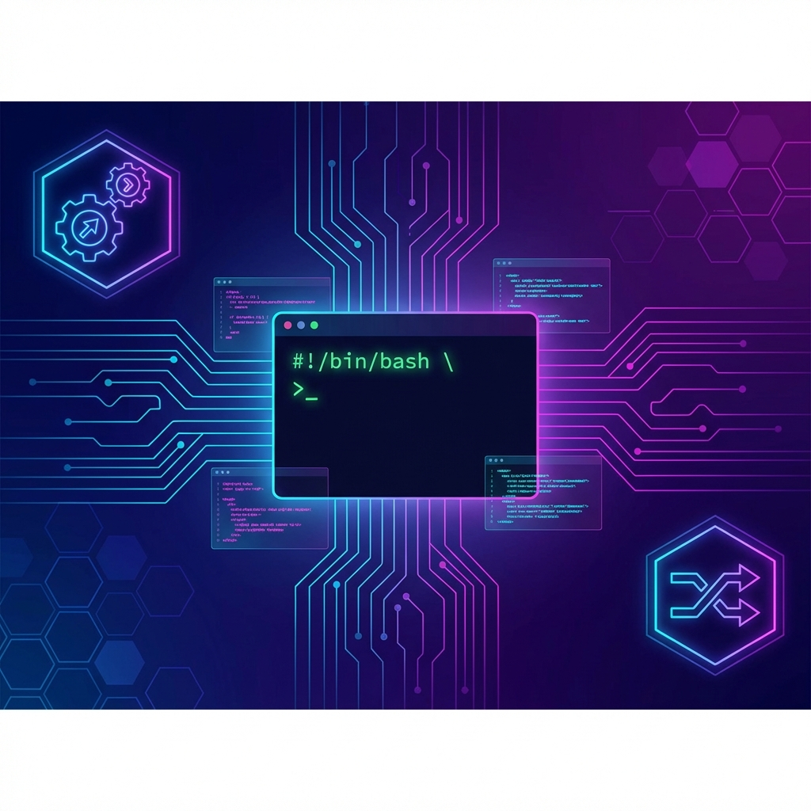
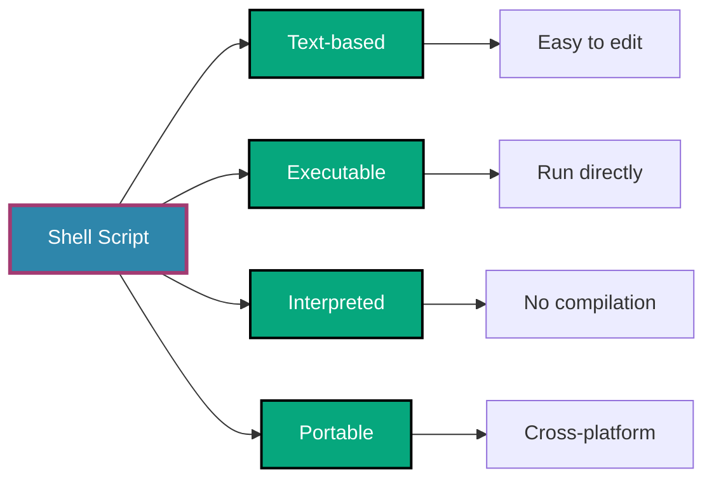
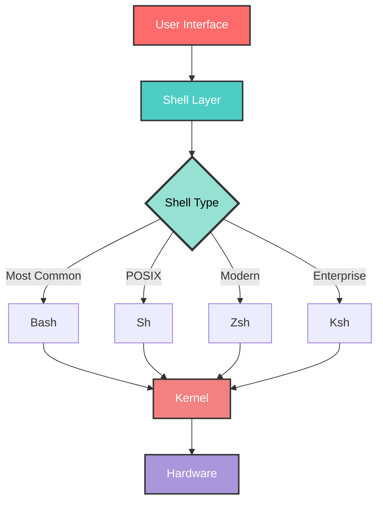
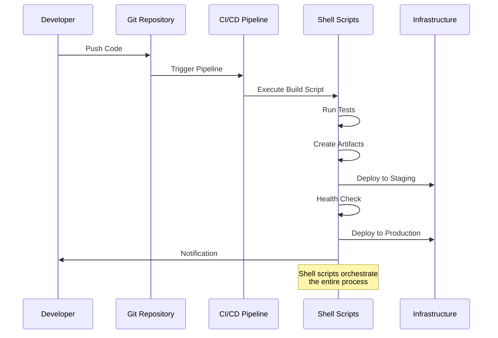
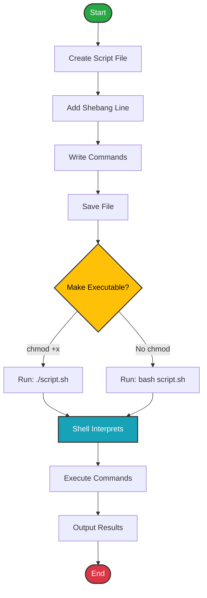
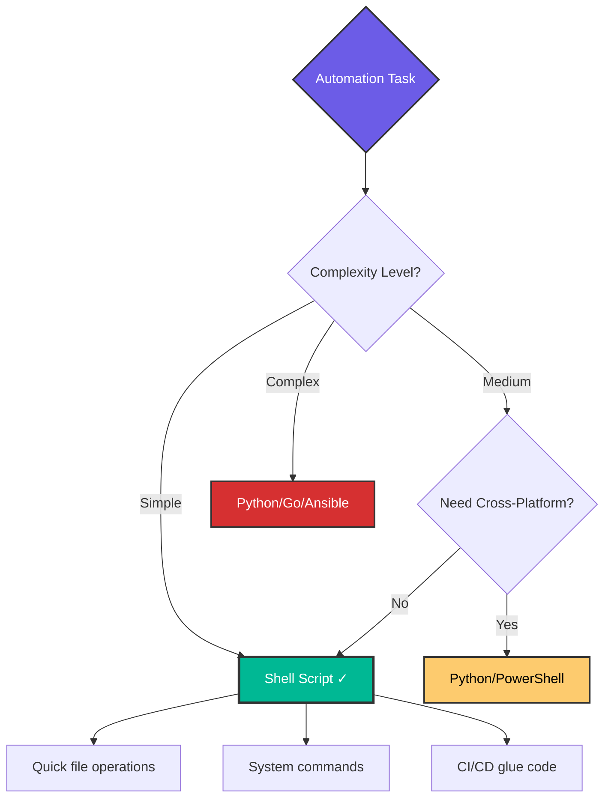

# 🎯 Introduction to Shell Scripting

> **"The shell is the command interpreter in Linux/Unix. It is the interface between the user and the operating system."**
## 📚 Overview
Shell scripting is the foundation of automation in DevOps. This introduction will guide you through the essential concepts, history, and practical applications of shell scripting in modern infrastructure management.


## 🎓 Learning Objectives
By the end of this module, you will:
- ✅ Understand what shell scripting is and why it's crucial for DevOps
- ✅ Learn about different shell types (Bash, Zsh, Sh)
- ✅ Recognize when to use shell scripts vs. other automation tools
- ✅ Set up your shell scripting environment
- ✅ Write and execute your first shell script
## 🏗️ What is Shell Scripting?
A **shell script** is a text file containing a series of commands that are executed by the shell interpreter. Think of it as a recipe where each command is a step toward achieving a specific automation goal.
### Key Characteristics



## 🌐 Types of Shells

### Comparison Table

| Shell | Description | Use Case | Default Prompt |
|-------|-------------|----------|----------------|
| **Bash** | Bourne Again Shell - Most popular | General scripting, CI/CD | `$` |
| **Sh** | Original Bourne Shell | Legacy systems, POSIX compliance | `$` |
| **Zsh** | Z Shell - Modern, feature-rich | Interactive use, macOS default | `%` |
| **Fish** | Friendly Interactive Shell | User-friendly scripting | `>` |
| **Ksh** | Korn Shell | Enterprise Unix systems | `$` |
### Architecture Diagram


## 🚀 Why Shell Scripting in DevOps?
### Real-World Applications
1. **🔄 Automation**
   - Automated deployments
   - System maintenance tasks
   - Backup and recovery procedures

2. **📊 Infrastructure Management**
   - Server provisioning
   - Configuration management
   - Health checks and monitoring

3. **🔗 CI/CD Pipelines**
   - Build automation
   - Testing workflows
   - Deployment scripts

4. **🛠️ System Administration**
   - User management
   - Log rotation
   - Resource monitoring
### DevOps Workflow Integration


## 📝 Your First Shell Script
### Hello DevOps Script
```bash
#!/bin/bash
# File: hello_devops.sh
# Description: Your first shell script

echo "🚀 Welcome to DevOps Automation!"
echo "Today is: $(date '+%A, %B %d, %Y')"
echo "Current user: $USER"
echo "Hostname: $HOSTNAME"
echo "----------------------------------------"
echo "Let's automate everything! 🎯"
```
### Execution Flow



## 🎯 When to Use Shell Scripts

### Decision Matrix


### Best Use Cases ✅
- System administration tasks
- File and directory operations
- Text processing and data extraction
- Environment setup and configuration
- CI/CD pipeline steps
- Cron job automation
- Log processing and monitoring
### Avoid Shell Scripts ❌
- Complex data structures
- Cross-platform GUI applications
- High-performance computing
- Large-scale data processing
- Web application backends

## 🏆 Real-World DevOps Story

### 💡 **The Midnight Deployment Crisis**
**Scenario**: A tech startup was manually deploying applications every Friday night. The process involved 47 manual steps, took 4 hours, and frequently resulted in errors.

**Solution**: A senior DevOps engineer created a comprehensive shell script that:
- Backed up the current application
- Ran automated tests
- Deployed new code
- Performed health checks
- Rolled back if issues detected
**Result**: 
- ⏱️ Deployment time: 4 hours → 12 minutes
- 🎯 Error rate: 23% → 0.5%
- 💰 Cost savings: $50,000/year in overtime
- 😊 Developer satisfaction: Significantly improved

```mermaid
gantt
    title Deployment Time Comparison
    dateFormat X
    axisFormat %M min
    
    section Manual Process
    Manual Steps (240 min) :0, 240
    
    section Automated Script
    Automated Process (12 min) :0, 12
```


## 📋 Environment Setup Checklist
- [ ] Verify Bash version: `bash --version` (≥ 4.0 recommended)
- [ ] Check default shell: `echo $SHELL`
- [ ] Install text editor (vim, nano, VS Code)
- [ ] Create scripts directory: `mkdir -p ~/scripts`
- [ ] Add scripts to PATH: `export PATH="$HOME/scripts:$PATH"`
- [ ] Set default permissions: `umask 022`
- [ ] Install ShellCheck: `apt install shellcheck` (linting tool)
## 🎓 Interview Questions
### Beginner Level
**Q1: What is the purpose of the shebang line `#!/bin/bash`?**
<details>
<summary>Click to reveal answer</summary>

The shebang (`#!`) tells the system which interpreter to use for executing the script. `/bin/bash` specifies the Bash shell. It must be the first line of the script.

**Example**:
```bash
#!/bin/bash
# This script will be interpreted by Bash

#!/usr/bin/env bash
# More portable - finds bash in PATH
```
</details>

**Q2: What's the difference between `bash script.sh` and `./script.sh`?**
<details>
<summary>Click to reveal answer</summary>

- `bash script.sh`: Explicitly runs the script using bash, ignores shebang, doesn't require execute permission
- `./script.sh`: Uses the shebang to determine interpreter, requires execute permission (`chmod +x script.sh`)
</details>

**Q3: How do you make a script executable?**
<details>
<summary>Click to reveal answer</summary>

```bash
chmod +x script.sh  # Add execute permission
chmod 755 script.sh # rwxr-xr-x (owner: all, group: read+execute, others: read+execute)
chmod u+x script.sh # Add execute permission for owner only
```
</details>

**Q4: What does `echo $?` display?**
<details>
<summary>Click to reveal answer</summary>

It displays the exit status of the last command executed. `0` means success, non-zero indicates an error.

```bash
ls /existing_directory
echo $?  # Output: 0 (success)

ls /non_existent_directory
echo $?  # Output: 2 (error)
```
</details>

**Q5: Name three common uses of shell scripts in DevOps.**
<details>
<summary>Click to reveal answer</summary>

1. **Automated Deployments**: Deploying applications to servers
2. **CI/CD Integration**: Running tests, building artifacts, deploying code
3. **System Monitoring**: Health checks, resource monitoring, alerting
4. **Backup and Recovery**: Automated backup procedures
5. **Configuration Management**: System setup and configuration
</details>

## 📝 Quiz

1. **Which shell is most commonly used in DevOps?**
   - [ ] a) Sh
   - [ ] b) Zsh
   - [x] c) Bash
   - [ ] d) Fish

2. **What does the `#` symbol denote in shell scripts?**
   - [ ] a) Variable
   - [x] b) Comment
   - [ ] c) Command
   - [ ] d) Function

3. **Which command checks the syntax of a shell script without executing it?**
   - [ ] a) `bash -t script.sh`
   - [x] b) `bash -n script.sh`
   - [ ] c) `bash -v script.sh`
   - [ ] d) `bash -x script.sh`

4. **What is the default exit status of a successful command?**
   - [x] a) 0
   - [ ] b) 1
   - [ ] c) True
   - [ ] d) Success

5. **Which is NOT a valid shebang line?**
   - [ ] a) `#!/bin/bash`
   - [ ] b) `#!/usr/bin/env bash`
   - [x] c) `#/bin/bash`
   - [ ] d) `#!/bin/sh`

6. **What does POSIX stand for in shell scripting context?**
   - [ ] a) Portable Operating System Interface for uniX
   - [ ] b) Powerful Operating System Interface eXtension
   - [ ] c) Protocol for Operating System Integration eXchange
   - [x] d) Portable Operating System Interface

7. **Which command shows your current shell?**
   - [ ] a) `$CURRENT_SHELL`
   - [x] b) `echo $SHELL`
   - [ ] c) `which shell`
   - [ ] d) `get-shell`

8. **In DevOps, shell scripts are primarily used for:**
   - [ ] a) Database design
   - [x] b) Automation and orchestration
   - [ ] c) Frontend development
   - [ ] d) Machine learning

9. **What permission numeric value gives read, write, and execute to owner only?**
   - [ ] a) 644
   - [ ] b) 755
   - [x] c) 700
   - [ ] d) 777

10. **Which of these is a shell scripting best practice?**
    - [ ] a) Never use comments
    - [ ] b) Use global variables for everything
    - [x] c) Always include error handling
    - [ ] d) Avoid using functions

**Answers**: 1-c, 2-b, 3-b, 4-a, 5-c, 6-a, 7-b, 8-b, 9-c, 10-c

## 🔗 Next Steps

Continue to: **[Terminal and Finder](../02-Terminal-and-Finder/README.md)** →

## 📚 Additional Resources

- [Bash Reference Manual](https://www.gnu.org/software/bash/manual/)
- [ShellCheck - Linting Tool](https://www.shellcheck.net/)
- [Bash Scripting Tutorial](https://linuxconfig.org/bash-scripting-tutorial)
- [Google Shell Style Guide](https://google.github.io/styleguide/shellguide.html)

---

**📌 Remember**: Shell scripting is a skill that improves with practice. Start small, automate one task at a time, and gradually build your automation empire! 🚀
