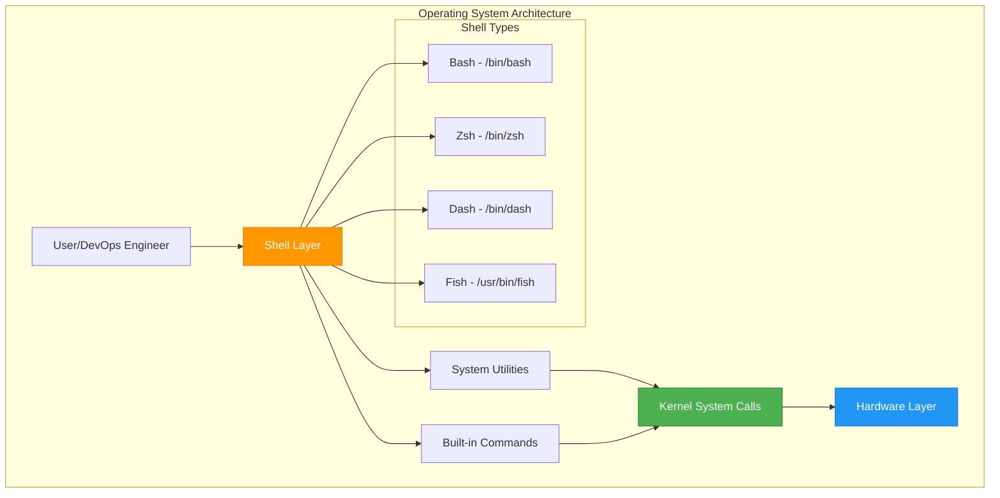
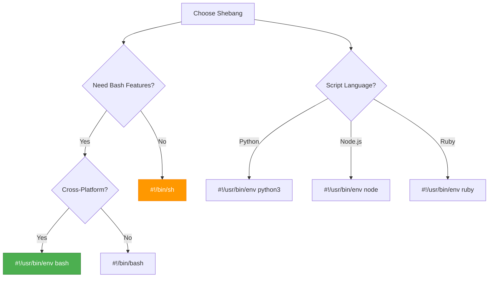
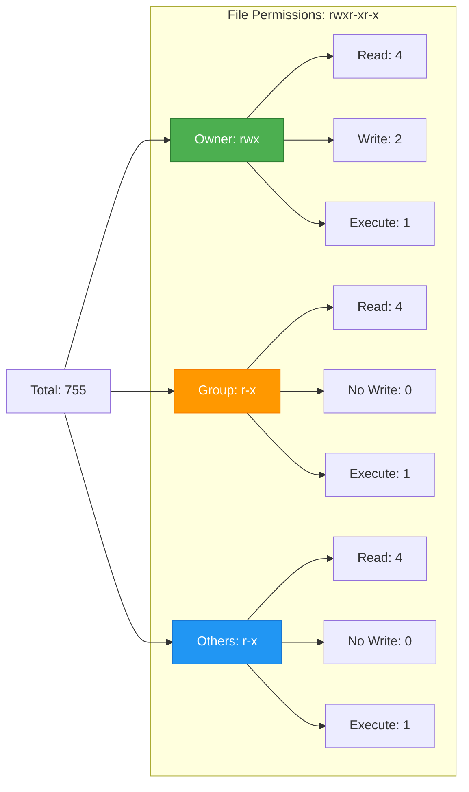
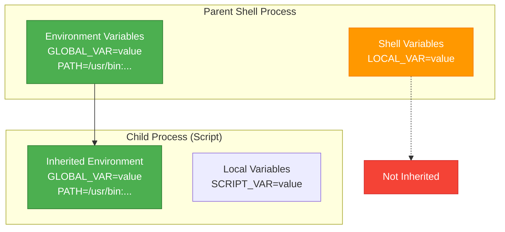
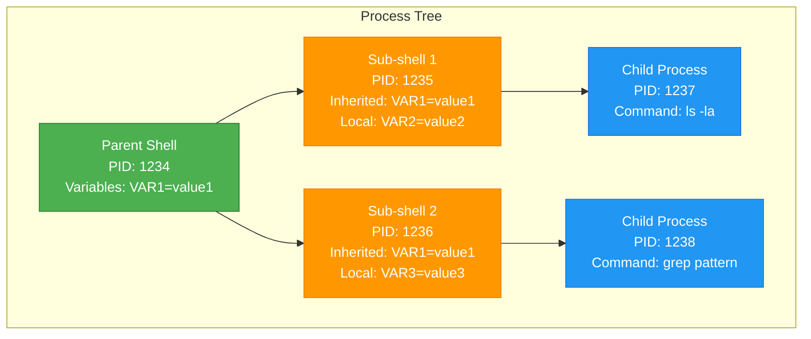

# Shell Environment and Execution
*Understanding the Foundation of Script Execution*
The shell is the command language interpreter that provides a user interface for the POSIX operating system. Understanding how it interacts with the kernel and how scripts are executed is the first step in DevOps automation.

---
## 🏛️ The OS Hierarchy
To master shell scripting, you must understand the relationship between the user, the shell, and the system hardware.

### **Key Components Explained**

| Layer | Purpose | Examples |
|-------|---------|----------|
| **User Layer** | Human interaction and script execution | DevOps engineers, automated systems |
| **Shell Layer** | Command interpretation and process management | bash, zsh, dash, fish |
| **Utilities** | System tools and commands | ls, grep, awk, sed, curl |
| **Kernel** | System calls and resource management | Process creation, file I/O, networking |
| **Hardware** | Physical resources | CPU, RAM, Storage, Network |

---
## 🏗️ The Shebang (`#!`) - Script Interpreter Declaration
The first line of a script, the shebang, tells the operating system which interpreter to use to parse the rest of the file.
### **Common Shebang Patterns**
```bash
#!/bin/bash                   # Standard Bash (fixed path)
#!/usr/bin/env bash           # Portable Bash (recommended)
#!/bin/sh                     # POSIX shell (minimal features)
#!/usr/bin/env python3        # Python 3 interpreter
#!/usr/bin/env node           # Node.js interpreter
```
### **Shebang Selection Decision Tree**



> [!IMPORTANT]
> Without a shebang, the operating system may default to `/bin/sh` (which might be `dash` on Ubuntu), leading to "Bashisms" (Bash-specific syntax) failing in your script.
### **Bashisms vs POSIX Compatibility**

| Feature | Bash | POSIX sh | Recommendation |
|---------|------|----------|----------------|
| **Arrays** | `arr=(a b c)` | ❌ Not supported | Use Bash if needed |
| **Extended Globbing** | `shopt -s extglob` | ❌ Not supported | Use Bash for complex patterns |
| **Process Substitution** | `<(command)` | ❌ Not supported | Use Bash for advanced piping |
| **String Manipulation** | `${var//old/new}` | ❌ Limited | Use Bash for string ops |
| **Arithmetic** | `$((expr))` | ✅ Supported | Safe for both |

---
## 🔑 Permissions and the `PATH`
Before a script can run, it needs **Execute** permissions and must be found by the system.
### **Permission Management**
```bash
# Grant execute permission to owner
chmod +x deploy.sh

# Grant execute to owner and group
chmod 750 deploy.sh

# Grant execute to everyone (be careful!)
chmod 755 deploy.sh

# Check current permissions
ls -la deploy.sh
# Output: -rwxr-xr-x 1 user group 1234 Jan 15 10:30 deploy.sh
```
### **Permission Bits Explained**

### **PATH Environment Variable**
```bash
# View current PATH
echo $PATH
# Output: /usr/local/bin:/usr/bin:/bin:/usr/sbin:/sbin

# Add custom script directory to PATH
export PATH=$PATH:/home/user/scripts

# Make PATH change permanent (add to ~/.bashrc)
echo 'export PATH=$PATH:/home/user/scripts' >> ~/.bashrc

# Run script from anywhere (after adding to PATH)
deploy.sh  # Instead of ./deploy.sh
```
### **Script Execution Methods**

| Method | Command | Requirements | Use Case |
|--------|---------|--------------|----------|
| **Direct Execution** | `./script.sh` | Execute permission + shebang | Standard script execution |
| **Interpreter Call** | `bash script.sh` | Readable file | When permissions are restricted |
| **Source/Dot** | `. script.sh` or `source script.sh` | Readable file | Modify current shell environment |
| **PATH Execution** | `script.sh` | In PATH + executable | System-wide script availability |

---
## 🌍 Environment Variables vs Shell Variables
### **Variable Scope and Inheritance**
```bash
# Shell variable (local to current shell)
LOCAL_VAR="local value"

# Environment variable (inherited by child processes)
export GLOBAL_VAR="global value"

# Check if variable is exported
env | grep GLOBAL_VAR  # Will show the variable
env | grep LOCAL_VAR   # Will NOT show the variable
```
### **Variable Inheritance Diagram**

### **Common Environment Variables in DevOps**

| Variable | Purpose | Example Value |
|----------|---------|---------------|
| **PATH** | Executable search paths | `/usr/local/bin:/usr/bin:/bin` |
| **HOME** | User home directory | `/home/username` |
| **USER** | Current username | `devops` |
| **SHELL** | Current shell | `/bin/bash` |
| **PWD** | Present working directory | `/opt/app` |
| **OLDPWD** | Previous working directory | `/home/user` |
| **PS1** | Primary prompt string | `\u@\h:\w\$ ` |

---
## 🔄 Sub-shells and Process Execution
### **Sub-shell Creation Methods**
```bash
# Method 1: Parentheses create sub-shell
(cd /tmp && ls -la)  # Changes directory only in sub-shell
pwd  # Still in original directory

# Method 2: Script execution creates sub-shell
./script.sh  # Runs in new process

# Method 3: Command substitution creates sub-shell
FILES=$(ls *.txt)  # Command runs in sub-shell

# Method 4: Pipe creates sub-shell for right side
echo "data" | read VAR  # VAR not available in parent shell
```
### **Process Hierarchy Visualization**

---
## 📖 Stories from the Field: The "Permission Denied" Mystery
**Scenario**: A DevOps engineer configured a Jenkins pipeline to run a cleanup script. Locally, the script ran perfectly. In Jenkins, the build failed with `sh: cleanup.sh: Permission denied`.
**Discovery**: The engineer had committed the script to Git without the `+x` bit. While their local filesystem had the permission, the Git index did not store it correctly.
**Resolution**: Used `git update-index --chmod=+x cleanup.sh` to ensure the permission was tracked by version control.
**Prevention**: Always verify execution permissions in your CI/CD environment or use `bash script.sh` instead of `./script.sh` if permissions are unreliable.

---
## ❓ Interview Questions
1.  **What is the difference between `/bin/sh` and `/bin/bash`?**
    <details>
    <summary>Show Answer</summary>
    `/bin/sh` is the POSIX standard shell (often a symbolic link to `dash` or `bash` in POSIX mode). `/bin/bash` is the Bourne Again SHell, which adds many "Bashisms" like arrays and extended globbing.
    </details>
2.  **Why use `#!/usr/bin/env bash` instead of `#!/bin/bash`?**
    <details>
    <summary>Show Answer</summary>
    Portability. `env` searches for the `bash` executable in the user's `PATH`, whereas `/bin/bash` assumes a specific absolute path that might not exist on all systems (e.g., FreeBSD or macOS).
    </details>
3.  **What does `source script.sh` (or `. script.sh`) do?**
    <details>
    <summary>Show Answer</summary>
    It executes the script in the *current* shell environment instead of spawning a new sub-shell. This allows the script to modify the current shell's variables and functions.
    </details>
4.  **How do you see all currently set environment variables?**
    <details>
    <summary>Show Answer</summary>
    Use the `env` or `printenv` commands.
    </details>
5.  **What is a sub-shell?**
    <details>
    <summary>Show Answer</summary>
    A child process started by the main shell to execute a command or script. Variables defined in a sub-shell are not visible to the parent unless exported.
    </details>
---
## 🧠 Quiz
1.  **What is the name of the first line in a bash script starting with `#!`?** `(Shebang)`
2.  **Which command changes file permissions to make a script executable?** `(chmod)`
3.  **True/False: A script without a shebang will always fail.** `(False - it might run with the default shell, but behavior is unpredictable)`
4.  **Which environment variable stores the list of directories for executable searches?** `(PATH)`
5.  **What is the kernel's primary role in this hierarchy?** `(Managing system calls and hardware resources)`