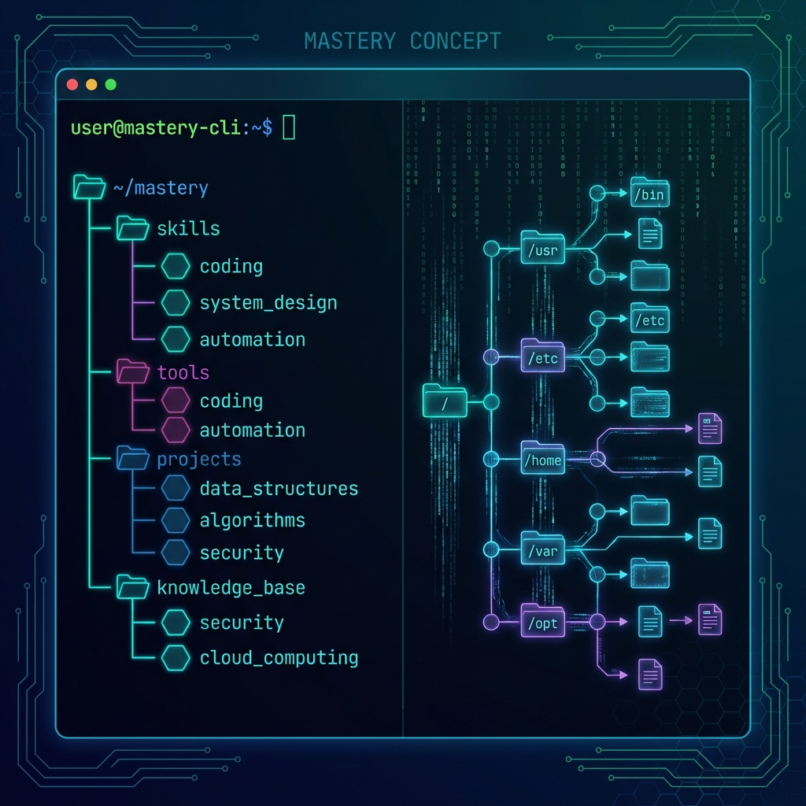
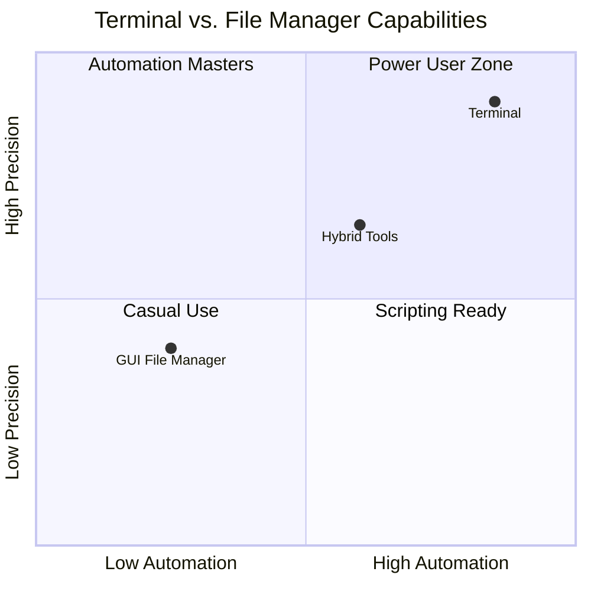
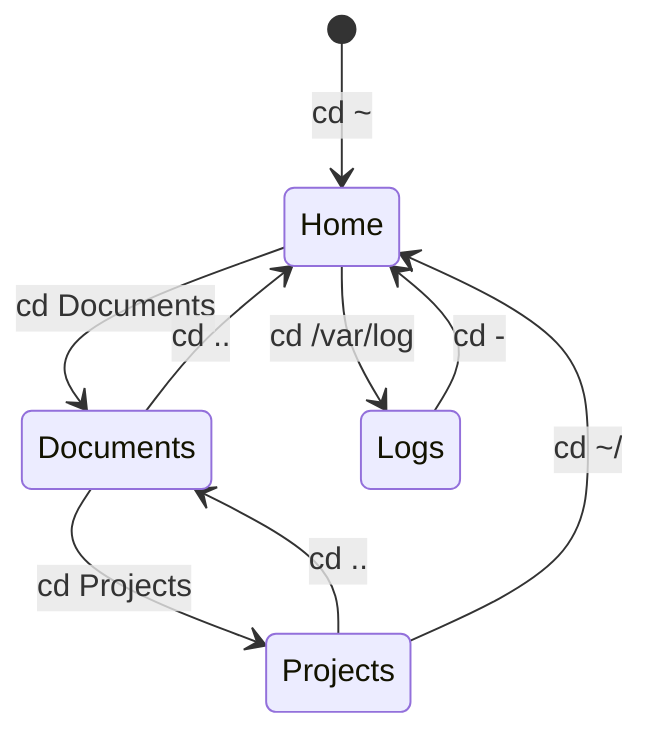
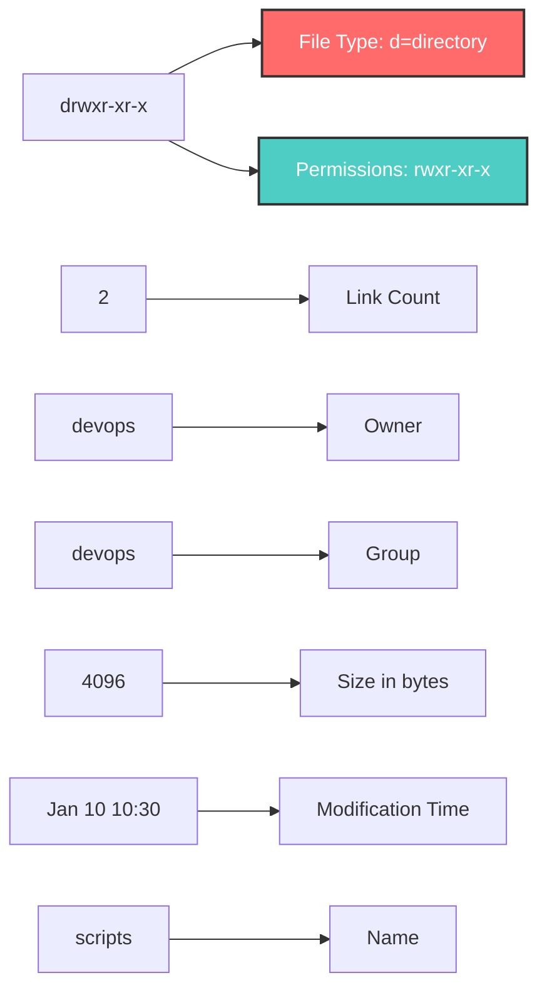
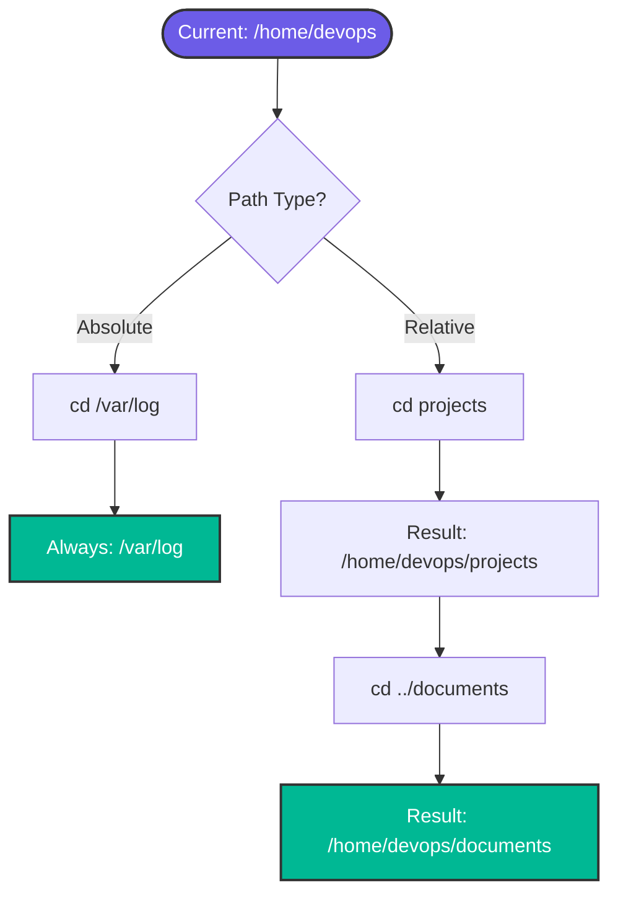

# 🖥️ Terminal and Finder Mastery

> **"The terminal is your gateway to unlimited power. Master it, and you master the system."**

## 📚 Overview

The terminal (also called shell, command-line interface, or CLI) is the fundamental interface for DevOps engineers. Unlike graphical file managers (Finder on macOS, Explorer on Windows), the terminal provides precise, scriptable, and powerful control over your system.



## 🎓 Learning Objectives

By the end of this module, you will:

- ✅ Understand what a terminal is and why it's essential
- ✅ Navigate the filesystem using command-line tools
- ✅ Master essential navigation commands (cd, ls, pwd)
- ✅ Understand absolute vs. relative paths
- ✅ Use terminal shortcuts for efficiency
- ✅ Customize your terminal experience

## 🏗️ Terminal vs. GUI File Manager

### Comparison Matrix



| Feature | GUI (Finder/Explorer) | Terminal (CLI) |
|---------|----------------------|----------------|
| **Visual Feedback** | ✅ Excellent | ⚠️ Limited |
| **Speed** | 🐢 Moderate | 🚀 Fast |
| **Automation** | ❌ Difficult | ✅ Easy |
| **Precision** | ⚠️ Click-dependent | ✅ Exact |
| **Batch Operations** | ⚠️ Manual | ✅ Scripted |
| **Remote Access** | ❌ Limited | ✅ SSH |
| **Learning Curve** | 🟢 Easy | 🟡 Moderate |
| **Power** | ⚠️ Limited | ✅ Unlimited |

## 📂 Understanding the Filesystem

### Unix Filesystem Hierarchy

```mermaid
graph TD
    A[/ - Root] --> B[/home]
    A --> C[/etc]
    A --> D[/var]
    A --> E[/usr]
    A --> F[/bin]
    A --> G[/tmp]
    
    B --> B1[/home/user]
    B1 --> B2[Documents]
    B1 --> B3[Downloads]
    B1 --> B4[.bashrc]
    
    C --> C1[Configuration Files]
    D --> D1[Logs]
    D --> D2[Databases]
    
    E --> E1[/usr/bin]
    E --> E2[/usr/local]
    
    style A fill:#FF6B6B,stroke:#333,stroke-width:4px,color:#fff
    style B fill:#4ECDC4,stroke:#333,stroke-width:2px,color:#fff
    style C fill:#95E1D3,stroke:#333,stroke-width:2px,color:#000
    style D fill:#F38181,stroke:#333,stroke-width:2px,color:#fff
    style E fill:#AA96DA,stroke:#333,stroke-width:2px,color:#fff
```

### Key Directories Explained

| Directory | Purpose | Example Contents |
|-----------|---------|------------------|
| `/` | Root directory - top of everything | All other directories |
| `/home` | User home directories | `/home/john`, `/home/jane` |
| `/root` | Root user's home | Root user files |
| `/etc` | System configuration files | `passwd`, `hosts`, `nginx.conf` |
| `/var` | Variable data (logs, caches) | `/var/log`, `/var/www` |
| `/usr` | User programs and utilities | `/usr/bin`, `/usr/local` |
| `/bin` | Essential command binaries | `ls`, `cp`, `mv`, `cat` |
| `/tmp` | Temporary files | Session data, temp files |
| `/opt` | Optional software packages | Third-party applications |

## 🧭 Essential Navigation Commands

### 1. **pwd** - Print Working Directory

Shows your current location in the filesystem.

```bash
$ pwd
/home/devops/projects
```

**Use Cases**:
- Verify current location before running commands
- Debugging script execution paths
- Confirming directory in log files

**Example**:
```bash
#!/bin/bash
echo "Starting backup from: $(pwd)"
```

### 2. **cd** - Change Directory

Navigate between directories.

```bash
# Go to home directory
cd ~
cd

# Go to specific directory
cd /var/log

# Go to parent directory
cd ..

# Go to previous directory
cd -

# Go to subdirectory
cd Documents/Projects

# Go to root
cd /
```

**Special Symbols**:
- `~` - Home directory (`/home/username`)
- `.` - Current directory
- `..` - Parent directory
- `-` - Previous directory
- `/` - Root directory

**Navigation Flow**:


### 3. **ls** - List Directory Contents

Display files and directories.

```bash
# Basic listing
ls

# Long format (details)
ls -l

# Include hidden files
ls -a

# Human-readable sizes
ls -lh

# Sort by modification time
ls -lt

# Reverse order
ls -lr

# Recursive listing
ls -R

# Combine options
ls -lah
```

**Output Explained**:
```bash
$ ls -l
drwxr-xr-x 2 devops devops 4096 Jan 10 10:30 scripts
-rw-r--r-- 1 devops devops  256 Jan 10 09:15 config.sh
```



## 🛤️ Paths: Absolute vs. Relative

### Absolute Paths
Start from root (`/`). Always works regardless of current location.

```bash
cd /home/devops/projects/webapp
cat /etc/nginx/nginx.conf
ls /var/log/apache2/
```

 **✅ Pros**: Unambiguous, reproducible
❌ **Cons**: Longer, less portable

### Relative Paths
Start from current directory. Shorter but context-dependent.

```bash
# If you're in /home/devops
cd projects/webapp
cat ../config/app.conf
ls ./logs/
```

**✅ Pros**: Shorter, flexible  
**❌ Cons**: Depends on current location

### Path Resolution Example



## ⚡ Power User Shortcuts

### Command-Line Editing

| Shortcut | Action | DevOps Use Case |
|----------|--------|-----------------|
| `Ctrl + A` | Move to line start | Edit long commands |
| `Ctrl + E` | Move to line end | Append to commands |
| `Ctrl + U` | Clear line before cursor | Fix typos quickly |
| `Ctrl + K` | Clear line after cursor | Remove old arguments |
| `Ctrl + L` | Clear screen | Clean workspace |
| `Ctrl + R` | Search command history | Find previous deploy command |
| `Ctrl + C` | Cancel current command | Stop running process |
| `Ctrl + D` | Exit shell | Logout |
| `Ctrl + Z` | Suspend process | Pause long-running task |
| `!!` | Repeat last command | `sudo !!` for permission |
| `!$` | Last argument of previous | `cat !$` after `ls /long/path` |

### Tab Completion

```bash
# Type partial name and press Tab
$ cd /var/lo<TAB>
$ cd /var/log/

# List all options with double Tab
$ ls /et<TAB><TAB>
etc/     etcd/    

# Complete filenames
$ cat scri<TAB>
$ cat script.sh
```

## 🎨 Terminal Customization

### Prompt Customization (PS1)

```bash
# See current prompt
echo $PS1

# Simple prompt
export PS1="\u@\h:\w\$ "
# Output: devops@server:~/projects$

# Colorful prompt
export PS1="\[\033[01;32m\]\u@\h\[\033[00m\]:\[\033[01;34m\]\w\[\033[00m\]\$ "

# With Git branch (advanced)
export PS1="\[\033[01;32m\]\u@\h\[\033[00m\]:\[\033[01;34m\]\w\[\033[00m\]\[\033[01;31m\]\$(__git_ps1)\[\033[00m\]\$ "
```

### Aliases for Common Operations

```bash
# Add to ~/.bashrc or ~/.bash_profile

# Navigation shortcuts
alias ..='cd ..'
alias ...='cd ../..'
alias ....='cd ../../..'

# Enhanced ls
alias ll='ls -lah'
alias la='ls -A'
alias l='ls -CF'

# Safety nets
alias rm='rm -i'
alias cp='cp -i'
alias mv='mv -i'

# DevOps specific
alias k='kubectl'
alias tf='terraform'
alias dps='docker ps'
alias dcup='docker-compose up -d'
```

## 🏆 Real-World DevOps Story

### 💡 **The Production Log Investigation**

**Scenario**: A production application was experiencing intermittent 500 errors. The team needed to investigate quickly.

**GUI Approach** (Junior Developer):
1. Connect to server via RDP/VNC
2. Open file manager
3. Navigate through folders clicking
4. Find log file
5. Double-click to open
6. Scroll through thousands of lines
7. **Time**: 10 minutes just to find the file

**Terminal Approach** (Senior DevOps Engineer):
```bash
# SSH into server (instant access)
ssh prod-web-01

# Navigate and search in one command
cd /var/log/nginx && tail -f error.log | grep "500"

# Time: 15 seconds to start monitoring
# Found issue: Database connection timeout

# Quick fix verification
cd /etc/nginx && grep -n "timeout" nginx.conf
# Increase timeout, reload: nginx -s reload

# Total time: 3 minutes from alert to fix
```

**Result**:
- ⏱️ Investigation time: 10 min → 15 sec
- 🎯 Fix time: 3 minutes total
- 💰 Prevented potential downtime cost: $50,000/hour
- 📈 Promoted to Senior DevOps Engineer

```mermaid
gantt
    title Response Time Comparison
    dateFormat X
    axisFormat %M min
    
    section GUI Approach
    Navigate to logs :0, 10
    Find error :10, 15
    Implement fix :15, 30
    
    section CLI Approach
    SSH + Navigate :<crit, 0, 0.25
    Find error :<crit, 0.25, 1
    Implement fix :<crit, 1, 3
```

## 🎓 Interview Questions

### Q1: What's the difference between absolute and relative paths?

<details>
<summary>Click to reveal answer</summary>

**Absolute Path**:
- Starts from root directory (`/`)
- Always the same regardless of current location
- Example: `/home/devops/scripts/deploy.sh`

**Relative Path**:
- Starts from current directory
- Changes based on where you are
- Examples: `./scripts/deploy.sh`, `../config/app.conf`

**DevOps Context**: In scripts, use absolute paths for critical files to avoid errors when the script is called from different directories.

```bash
# Bad (relative - might fail)
source config.sh

# Good (absolute - always works)
source /opt/app/config.sh

# Better (relative to script location)
SCRIPT_DIR="$(cd "$(dirname "${BASH_SOURCE[0]}")" && pwd)"
source "$SCRIPT_DIR/config.sh"
```
</details>

### Q2: How do you return to your home directory quickly?

<details>
<summary>Click to reveal answer</summary>

Multiple ways:

```bash
cd            # Simplest - no arguments
cd ~          # Explicit home symbol
cd $HOME      # Using HOME variable
cd /home/$(whoami)  # Explicit path (less common)
```

All are equivalent. `cd` alone is most common.
</details>

### Q3: What does `ls -lah` show?

<details>
<summary>Click to reveal answer</summary>

```bash
ls -lah
```

**Break down**:
- `-l`: Long format (permissions, owner, size, date)
- `-a`: All files including hidden (starting with `.`)
- `-h`: Human-readable sizes (KB, MB, GB)

**Example output**:
```
drwxr-xr-x 2 devops devops 4.0K Jan 10 10:30 scripts
-rw-r--r-- 1 devops devops  256 Jan 10 09:15 .bashrc
```

Shows hidden files (`.bashrc`), permissions, owner, and size in readable format (4.0K instead of 4096).
</details>

### Q4: How can you go back to your previous directory?

<details>
<summary>Click to reveal answer</summary>

```bash
cd -
```

This toggles between current and previous directory.

**Example workflow**:
```bash
$ pwd
/home/devops

$ cd /var/log
$ pwd
/var/log

$ cd -  # Returns to /home/devops
$ pwd
/home/devops

$ cd -  # Returns to /var/log
$ pwd
/var/log
```

**DevOps Use**: Quickly switch between project directory and log directory during debugging.
</details>

### Q5: What command shows your current directory?

<details>
<summary>Click to reveal answer</summary>

```bash
pwd  # Print Working Directory
```

**Example**:
```bash
$ pwd
/home/devops/projects/webapp
```

**Common uses**:
- Verify location before running destructive commands
- Debug script paths
- Log current location in scripts

```bash
#!/bin/bash
echo "Backup starting from: $(pwd)"
tar -czf backup.tar.gz .
```
</details>

### Q6: How do you list only directories (not files)?

<details>
<summary>Click to reveal answer</summary>

```bash
# Method 1: Using ls with grep
ls -l | grep ^d

# Method 2: Using ls with directory indicator
ls -d */

# Method 3: Using find
find . -maxdepth 1 -type d

# Method 4: Using ls -F (directories end with /)
ls -F | grep /$
```

**Most common in DevOps**: `ls -d */` for simplicity
</details>

### Q7: What's the purpose of the root directory `/`?

<details>
<summary>Click to reveal answer</summary>

The root directory (`/`) is:
- The top-level directory of the Unix/Linux filesystem
- Parent of all other directories
- Starting point for absolute paths
- Not the same as `/root` (root user's home directory)

**Hierarchy**:
```
/                    ← Root directory
├── home/           ← User directories
├── root/           ← Root user's home
├── etc/            ← Configuration
└── var/            ← Variable data
```

**DevOps**: Understanding this is critical for:
- Writing portable scripts
- Securely storing credentials (`/etc/secrets`)
- Managing logs (`/var/log`)
- Deploying applications (`/opt`, `/var/www`)
</details>

### Q8: How do you execute a command using its full path?

<details>
<summary>Click to reveal answer</summary>

Use the absolute path to the binary:

```bash
# Instead of:
ls -la

# Use full path:
/bin/ls -la
```

**Why use full paths?**:
- **Security**: Prevent PATH hijacking attacks
- **Precision**: Ensure exact binary is used
- **Cron jobs**: PATH might not be set

**Find full path**:
```bash
which ls
# Output: /bin/ls

type -a ls
# Output all instances in PATH
```

**DevOps Example** (Secure cron job):
```bash
# Insecure
0 2 * * * backup.sh

# Secure
0 2 * * * /usr/local/bin/backup.sh
```
</details>

## 📝 Quiz

1. **Which command shows your current directory?**
   - [ ] a) `cwd`
   - [x] b) `pwd`
   - [ ] c) `dir`
   - [ ] d) `where`

2. **What does `cd ..` do?**
   - [ ] a) Goes to home directory
   - [x] b) Goes to parent directory
   - [ ] c) Goes to root directory
   - [ ] d) Lists directories

3. **Which path is absolute?**
   - [ ] a) `../config/app.conf`
   - [x] b) `/etc/nginx/nginx.conf`
   - [ ] c) `./scripts/deploy.sh`
   - [ ] d) `~/Documents`

4. **What does `ls -a` show?**
   - [ ] a) Only files
   - [ ] b) Only directories
   - [x] c) All files including hidden
   - [ ] d) Archives only

5. **How do you go to your home directory?**
   - [ ] a) `cd /home`
   - [ ] b) `cd root`
   - [x] c) `cd` or `cd ~`
   - [ ] d) `home`

6. **What does `cd -` do?**
   - [ ] a) Goes up one directory
   - [x] b) Goes to previous directory
   - [ ] c) Goes to root
   - [ ] d) Does nothing

7. **Which shows file sizes in human-readable format?**
   - [ ] a) `ls -l`
   - [x] b) `ls -lh`
   - [ ] c) `ls -la`
   - [ ] d) `ls -lr`

8. **What is `/etc` used for?**
   - [ ] a) Temporary files
   - [ ] b) User home directories
   - [x] c) System configuration files
   - [ ] d) Binary executables

9. **Which shortcut clears the terminal screen?**
   - [ ] a) `Ctrl + C`
   - [ ] b) `Ctrl + D`
   - [x] c) `Ctrl + L`
   - [ ] d) `Ctrl + K`

10. **What does `~` represent?**
    - [ ] a) Current directory
    - [ ] b) Parent directory
    - [x] c) Home directory
    - [ ] d) Root directory

11. **How do you list all files including hidden ones?**
    - [ ] a) `ls -h`
    - [x] b) `ls -a`
    - [ ] c) `ls -l`
    - [ ] d) `ls -A`

12. **What does `.` represent in paths?**
    - [x] a) Current directory
    - [ ] b) Home directory
    - [ ] c) Parent directory
    - [ ] d) Root directory

13. **Which directory contains user home directories?**
    - [ ] a) `/root`
    - [ ] b) `/usr`
    - [x] c) `/home`
    - [ ] d) `/var`

14. **What does `Ctrl + R` do?**
    - [ ] a) Refresh screen
    - [x] b) Search command history
    - [ ] c) Run last command
    - [ ] d) Reset terminal

15. **Which is NOT a navigation command?**
    - [ ] a) `cd`
    - [ ] b) `pwd`
    - [x] c) `mv`
    - [ ] d) `ls`

16. **What does `ls -R` do?**
    - [ ] a) Reverse listing
    - [x] b) Recursive listing
    - [ ] c) Random order
    - [ ] d) Root directory listing

17. **How do you cancel a running command?**
    - [x] a) `Ctrl + C`
    - [ ] b) `Ctrl + Z`
    - [ ] c) `Ctrl + D`
    - [ ] d) `Ctrl + X`

18. **Which directory contains system logs?**
    - [ ] a) `/logs`
    - [ ] b) `/etc/logs`
    - [x] c) `/var/log`
    - [ ] d) `/home/logs`

19. **What does `!!` represent?**
    - [ ] a) Root user
    - [ ] b) Current directory
    - [x] c) Last command
    - [ ] d) All files

20. **Which command shows detailed file information?**
    - [x] a) `ls -l`
    - [ ] b) `ls -a`
    - [ ] c) `ls -d`
    - [ ] d) `ls -R`

**Answers**: 1-b, 2-b, 3-b, 4-c, 5-c, 6-b, 7-b, 8-c, 9-c, 10-c, 11-b, 12-a, 13-c, 14-b, 15-c, 16-b, 17-a, 18-c, 19-c, 20-a

## 🔗 Next Steps

Continue to: **[Basic File Manipulation](../03-Basic-File-Manipulation/README.md)** →

## 📚 Additional Resources

- [Linux Directory Structure Explained](https://www.pathname.com/fhs/)
- [Bash Keyboard Shortcuts](https://www.gnu.org/software/bash/manual/html_node/Bindable-Readline-Commands.html)
- [Terminal Emulator Comparison](https://wiki.archlinux.org/title/List_of_applications/Utilities#Terminal_emulators)

---

**📌 Pro Tip**: Create a `~/bin` directory and add it to your PATH for custom scripts. This keeps your tools organized and accessible from anywhere!

```bash
mkdir -p ~/bin
echo 'export PATH="$HOME/bin:$PATH"' >> ~/.bashrc
source ~/.bashrc
```
