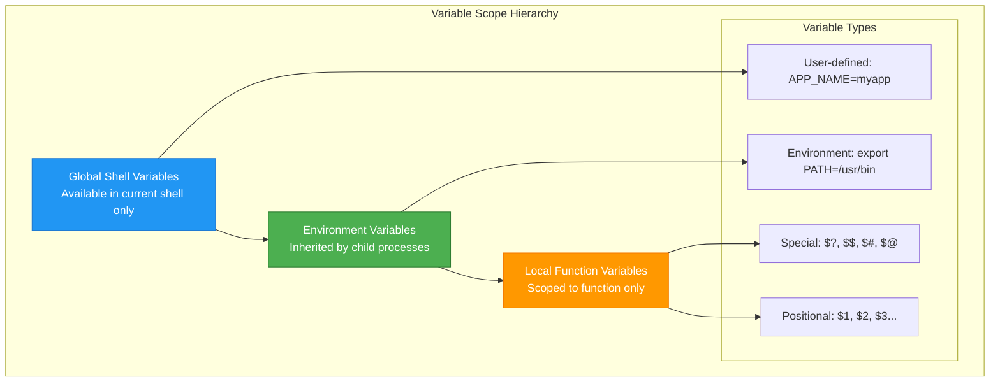
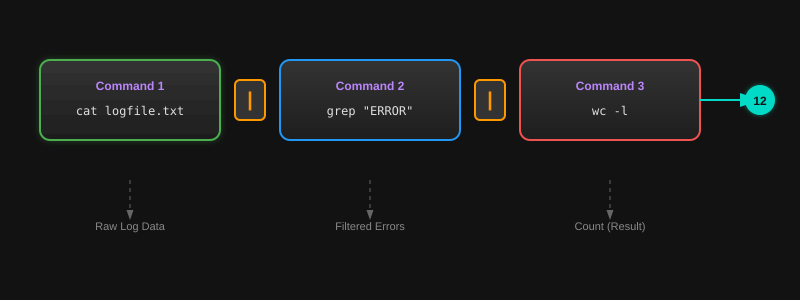

# Variables and Data Streams
*Mastering Data Flow and Variable Management in Shell Scripts*
In Bash, data is handled through variables and standard streams. Understanding how to manipulate these is crucial for building dynamic automation that can process information, handle user input, and manage system resources effectively.

---
## 📦 Variables and Scope
### Variable Definition and Access Patterns
Variables are defined without spaces around the <font color="#ff0000">=</font> sign. Use double quotes when accessing them to prevent "<font color="#ff0000">Word Splitting</font>" and "<font color="#ff0000">Globbing</font>".
```bash
# Correct variable definition
NAME="DevOps Engineer"
APP_PORT=8080
DB_HOST="localhost"

# Correct variable access (always use quotes!)
echo "Hello, $NAME"
echo "Application running on port: ${APP_PORT}"
echo "Database host: ${DB_HOST}"

# Incorrect (will cause issues)
NAME = "DevOps"  # Spaces around = are not allowed
echo $NAME       # Unquoted variables can cause word splitting
```
### **Variable Types and Scope**

### **Special Variables Reference**

| Variable | Description | Example Use Case |
|----------|-------------|------------------|
| `$?` | Exit status of last command | `if [ $? -eq 0 ]; then echo "Success"; fi` |
| `$$` | Process ID of current shell | `echo "Script PID: $$"` |
| `$!` | PID of last background process | `command & echo "Background PID: $!"` |
| `$#` | Number of arguments | `if [ $# -lt 2 ]; then echo "Need more args"; fi` |
| `$@` | All arguments as separate words | `for arg in "$@"; do echo "$arg"; done` |
| `$*` | All arguments as single word | `echo "All args: $*"` |
| `$0` | Script name | `echo "Running: $0"` |
| `$1, $2, ...` | Positional parameters | `echo "First arg: $1"` |

---
## 🌊 Standard Streams & Redirection
Bash manages three primary data streams for every process, enabling powerful data flow control.
### **Stream Architecture**

**Data Flow in Shell Processes:**
- **stdin (FD 0)**: Input from keyboard, files, pipes, or here documents
- **stdout (FD 1)**: Normal program output to terminal, files, or pipes
- **stderr (FD 2)**: Error messages and diagnostics
**Input Sources:** Keyboard → File → Pipe → Here Doc → **Process** → stdout/stderr → **Destinations:** Terminal → File → Pipe → /dev/null
### **Redirection Operators Comprehensive Guide**

| Operator | Description | Example | Use Case |
|----------|-------------|---------|----------|
| `>` | Redirect stdout (overwrite) | `ls > files.txt` | Save command output |
| `>>` | Redirect stdout (append) | `echo "log entry" >> app.log` | Append to log files |
| `2>` | Redirect stderr | `command 2> error.log` | Capture error messages |
| `2>>` | Redirect stderr (append) | `command 2>> error.log` | Append errors to log |
| `&>` | Redirect both stdout and stderr | `command &> all.log` | Capture everything |
| `2>&1` | Redirect stderr to stdout | `command > file 2>&1` | Combine streams |
| `< file` | Redirect stdin from file | `sort < unsorted.txt` | Read from file |
| `<<EOF` | Here document | `cat <<EOF\ntext\nEOF` | Multi-line input |
| `<<<` | Here string | `grep pattern <<< "$variable"` | String as input |
### **Advanced Redirection Examples**
```bash
# Separate stdout and stderr to different files
command > output.log 2> error.log

# Append both to same file
command >> combined.log 2>&1

# Discard output but keep errors visible
command > /dev/null

# Discard errors but keep output
command 2> /dev/null

# Complete silence (discard everything)
command > /dev/null 2>&1

# Tee - write to file AND display on screen
command | tee output.log

# Tee with append
command | tee -a output.log
```
---
## 🔗 Pipes and Command Substitution
### **Pipeline Architecture**

### **Pipeline Examples and Patterns**
```bash
# Basic pipeline - count error lines in log
cat /var/log/app.log | grep "ERROR" | wc -l

# Complex pipeline - analyze web server logs
cat access.log | \
  grep "$(date +'%d/%b/%Y')" | \
  awk '{print $1}' | \
  sort | \
  uniq -c | \
  sort -nr | \
  head -10

# Pipeline with error handling
if ! cat file.txt | grep pattern | sort > result.txt; then
    echo "Pipeline failed" >&2
    exit 1
fi
```
### **Command Substitution Patterns**
```bash
# Modern syntax (preferred)
CURRENT_DIR=$(pwd)
FILE_COUNT=$(ls -1 | wc -l)
TIMESTAMP=$(date +'%Y-%m-%d %H:%M:%S')

# Legacy syntax (avoid in new scripts)
CURRENT_DIR=`pwd`

# Nested command substitution
BACKUP_NAME="backup_$(basename $(pwd))_$(date +%Y%m%d).tar.gz"

# Command substitution in conditionals
if [ $(whoami) = "root" ]; then
    echo "Running as root"
fi

# Command substitution with error handling
if OUTPUT=$(command 2>&1); then
    echo "Success: $OUTPUT"
else
    echo "Failed: $OUTPUT" >&2
fi
```
---
## 📊 Data Processing Patterns
### **Common DevOps Data Processing Workflows**

### **Practical Data Processing Examples**
```bash
# Log analysis - find top IP addresses
awk '{print $1}' access.log | sort | uniq -c | sort -nr | head -10

# System monitoring - check disk usage
df -h | awk '$5 > 80 {print $6 " is " $5 " full"}'

# Configuration processing - replace variables in template
sed "s/{{APP_NAME}}/$APP_NAME/g; s/{{PORT}}/$PORT/g" template.conf > app.conf

# Data extraction - parse JSON with command line tools
echo '{"name":"app","version":"1.0"}' | \
  sed 's/.*"version":"\([^"]*\)".*/\1/'

# File processing - batch rename files
for file in *.txt; do
    mv "$file" "processed_${file}"
done
```
---
## 📖 Stories from the Field: The Silent Failure
**Scenario**: A script was designed to backup a database and then send an email. The backup command failed due to disk space, but the script still sent an "Email: Backup Successful" message.
**Discovery**: The developer used `backup_cmd > backup.log`. Since only `stdout` was redirected, the errors (which go to `stderr`) appeared on the console but weren't captured or checked. The script continued blindly.
**Resolution**: Modified the script to capture `stderr` and check the exit code:
```bash
backup_cmd > backup.log 2>&1
if [ $? -ne 0 ]; then
    echo "Backup failed!" | mail -s "Critical Failure" admin@example.com
    exit 1
fi
```
**Prevention**: Always redirect `stdout` and `stderr` appropriately in automated tasks and *always* check `$?`.

---
## ❓ Interview Questions
1.  **What is the difference between `VARIABLE="v"` and `export VARIABLE="v"`?**
    <details>
    <summary>Show Answer</summary>
    The first is a local shell variable, available only in the current process. `export` makes it an environment variable, available to any child processes or scripts started from that shell.
    </details>
2.  **How do you redirect standard error to standard output?**
    <details>
    <summary>Show Answer</summary>
    Use `2>&1`.
    </details>
3.  **What is `/dev/null`?**
    <details>
    <summary>Show Answer</summary>
    A special "null device" file that discards all data written to it (like a black hole).
    </details>
4.  **What happens if you use single quotes `'` instead of double quotes `"` for a variable?**
    <details>
    <summary>Show Answer</summary>
    Single quotes are literal; variables inside them are not expanded (e.g., `'$NAME'` prints the literal characters `$NAME`).
    </details>
5.  **How do you find the PID of the last backgrounded process?**
    <details>
    <summary>Show Answer</summary>
    Check the variable `$!`.
    </details>
---
## 🧠 Quiz
1.  **Which file descriptor represents `stderr`?** `(2)`
2.  **How do you append the output of a command to an existing file?** `(>>)`
3.  **What special variable holds the exit status of the last command?** `($?)`
4.  **True/False: Spaces are allowed around the `=` when defining a variable.** `(False)`
5.  **Which operator is used to send output from one command to another?** `(| - pipe)`